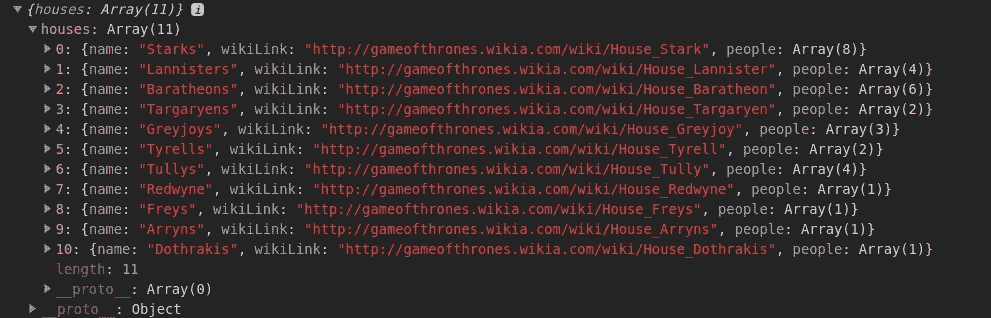
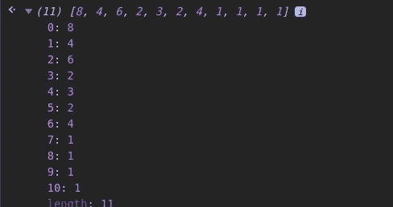
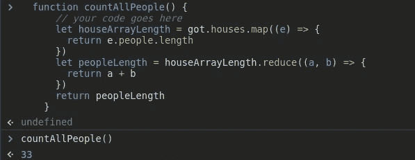
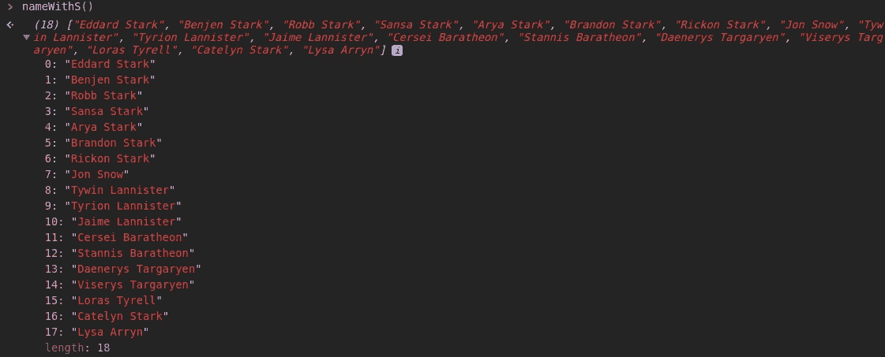
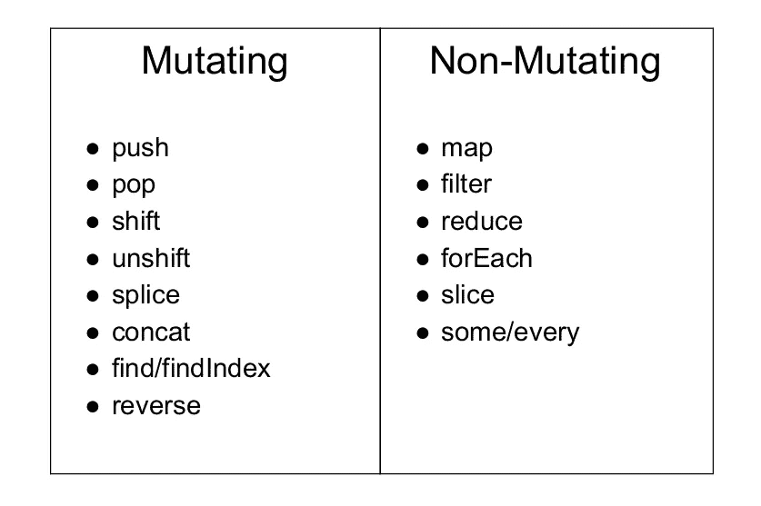

# 理解 JS 数组方法可以使编程对初学者来说不那么困难

> 原文：<https://medium.com/quick-code/understanding-js-array-methods-which-can-make-programming-not-so-overwhelming-for-beginners-7afb5b4a0967?source=collection_archive---------0----------------------->


Understanding Array Methods

> 在学习编码的时候，每个人都会经历这样一个阶段:编程中的一切都让人不知所措，人们都想放弃这个职业/习惯，数组方法是如何工作的，所有的循环一开始都让每个人抓狂...这让我确信。

这里，我将获取一个对象并应用以下数组方法:

**1。Array.map()**

**2。Array.filter()**

**3。Array.reduce()**

**4。Array.forEach()**

还有其他数组方法，如 push、pop、splice、indexOf、reverse、join 等。
我将在应用和解决与我拍摄的对象相关的问题时解释这些。
我选择了上面的方法，因为它们每个都需要一个回调函数，并且这些方法在现实场景中大多数时间都在使用。

我拿了一个名为`got`的对象，是的，这是指我们最喜欢的《权力的游戏》系列，它最终在上一季被毁了。
该对象包含所有的房屋名称，其中每个角色名称在节目中被分隔成一个对象数组，并进一步嵌套到具有数组的对象中。
获取对象点击[链接*对象*](https://drive.google.com/open?id=1HyVnNiB2mdLLc8kDcKZdXLv0uhLM7W9e) *。*



An instance of got object in the browser console

所以让我们开始数组方法的游戏，

我要写一个名为`countAllPeople()`的函数，它将计算`got` 对象中的总人数。

using map and reduce methods to find the total count the total people in the object

所以在`countAllPeople()`中，我们首先选择得到的对象，而不是房屋数组和`map()` ，它返回一个数组，该数组包含房屋数组中每个对象内每个人数组的长度。

`map()`总是返回一个数组，该数组的大小等于应用它的原始数组的大小。
它需要 3 个参数当前值、数组索引和数组本身。

在应用`map()`之后，它返回一个数组，该数组包含每个人数组的长度。

```
lethouseArrayLength= *got.houses.map*((*e*)=>{*return e.people.length*})return houseArrayLength
```



在此之后，我使用了`reduce()`方法来累计数组总长度。
`reduce()`最多可以带 4 个参数累加器，当前值，数组索引，和数组本身。
累加器可以根据需要进行初始设置，也可以取数组中的第一个元素作为其值。

它可以返回任何数据类型数字、数组、对象或字符串。
使用它的最佳方式是查看输出，例如，如果所需的输出是一个对象，我们将一个空对象作为累加器的初始值。

```
letpeopleLength= *houseArrayLength.reduce*((*acc*, *cv*)=>{*return* acc+ *cv*})*return* peopleLength
```

这里，acc 是累加器，它被初始化为数组中的第一个元素，并返回为 33 的`peopleLength`。



On calling the function it returns the total People in the object got

看过`map()`和`reduce()`之后，我们再来看看`forEach()`和`filter()`。

`Array.forEach()`类似于 for 循环，但整个过程是自动的，每次调用时都返回 undefined。
`Array.forEach()`对数组中的每个元素执行一个动作。

然而，`filter()`返回一个大小等于或小于原始大小的数组，它采用一个回调函数，每次调用`filter()`时都会调用该函数，它返回包含满足特定条件的元素的数组。

让我们通过`got`对象上的一个例子来理解这两个函数。现在我们将编写一个名为`nameWithS()`的函数，它将返回所有包含字母‘S’或‘S’的名字。
我们再次像对`countAllPeople()`一样从获取对象并定位`houses`数组开始，这里我们应用了`Array.reduce()`方法，这次我们将累加器的值初始化为一个空数组。

`cv`这里有一个包含关键人物的对象，这是一个数组，因此我们对数组人物应用`forEach()`方法，并将人物数组中的名字推送到累加器中。

现在`acc`是一个包含所有名字的数组。
我们对`acc`应用`filter()`方法，而`name`是针对`acc`中每个名字的元素，现在我们将所有名字转换成小写，并检查它是否包含字母‘s’。
现在`filter()`过滤出满足条件的`name`元素，并返回包含每个包含字母‘s’的元素的数组。



现在我们已经介绍了 4 种方法，哇，太酷了。如果不只是再看一遍并练习的话，我希望你能完全跟上。这就是你如何打好基础，并最终掌握这些方法。

> 所以练习练习练习！！！😊


# 让我们看看一些更重要的数组方法，

我会把它们都列出来，一个接一个地举例解释，最后，我会留下一张图片，列出一个方法是否改变了数组。你们检查是否使用哪种方法会很方便。

1 .推()

向数组的最后一个索引添加一个元素。

```
arr = []arr.push(2) // arr = [2]
```

**2。pop()**

`Array.pop()`删除数组的最后一个索引元素。

```
arr = [1,3]arr.pop() // arr = [1]
```

**3。shift()**

`Array.shift()`从数组的开头移除一个项目。

```
arr = [1,3]arr.shift() // arr = [3]
```

**4。unshift()**

`Array.unshift()`在数组的开头添加一个项目。

```
arr = [1,3]arr.unshift(3) // arr = [3,1,3]
```

**5。拼接()**

`Array.splice()`使数组变异，它可以替换元素添加新元素和删除它们。
拼接语法最多需要 3 个参数`Array.splice(startIndex,deleteCount,add new elements)`

```
let arr = ["I", "study", "JavaScript"];

// from index 2
// delete 0
// then insert "complex" and "language"
arr.splice(2, 0, "complex", "language");

alert( arr ); // "I", "study", "complex", "language", "JavaScript"
```

**6。slice()**

`Array.slice()` 返回一个新数组，将从索引`start`到`end`的所有项目复制到该数组中(不包括`end`)。`start`和`end`都可以是否定的
语法:
`arr.slice([start], [end])`

```
let arr = ["t", "e", "s", "t"];

alert( arr.slice(1, 3) ); // e,s (copy from 1 to 3)

alert( arr.slice(-2) ); // s,t (copy from -2 till the end)
```

**7。反向()**

方法`arr.reverse()`颠倒了`arr`中元素的顺序。

```
let arr = [1, 2, 3, 4, 5];arr.reverse();

alert( arr ); // 5,4,3,2,1
```

**8。concat()**

方法`arr.concat()`创建一个新的数组，其中包含来自其他数组的值和附加项。

```
let arr = [1, 2];

alert( arr.concat([3, 4]) ); // 1,2,3,4

alert( arr.concat([3, 4], [5, 6]) ); // 1,2,3,4,5,6

alert( arr.concat([3, 4], 5, 6) ); // 1,2,3,4,5,6
```

**9。一些()/每一个()**

如果传递的条件满足`arr`中的任何元素，则`arr.some()`将返回`true`

```
const array = [1, 2, 3, 4, 5];const even = (element) => element % 2 === 0;console.log(array.some(even));
//output: true
```

如果所有元素都满足条件，`arr.every()`将返回`true`

```
const isBelowThreshold = (currentValue) => currentValue < 40;const array1 = [1, 30, 39, 29, 10, 13];console.log(array1.every(isBelowThreshold));
//output: true
```

**10。find()/findIndex()**

`find()`方法返回所提供数组中满足回调函数中条件的第一个元素的值。

```
const array1 = [5, 12, 8, 130, 44];const found = array1.find(element => element > 10);console.log(found);
//output: 12
```

然而，如果只需要返回元素的索引，我们使用`findIndex()`方法。

方法返回数组中满足给定条件的第一个元素的索引。否则，它返回-1，表示没有元素通过给定条件。

我做了一个表，列出了我上面提到的变异和非变异方法。



Mutate vs Non-Mutate

另一件值得注意的事情是，这些方法中的许多可以链接在一起，消除了对额外变量的需要，并使您的代码更干净，更容易阅读和遵循。

通过组合方法，你可以避免混淆，这也是每个开发人员都渴望的事情，让他的代码尽可能的小。这些方法可以帮助你实现这个目标，让你成为一个高手。

就这样，谢谢大家！！！为了阅读我的文章，请让我知道你是否对我解释的文章或概念有任何疑问，请在底部写下回复。

我将会写更多关于我使用的数组方法和字符串方法的文章。

## 关注我阅读更多内容，深入 JS 的沉浸式世界

查看我的 Github 个人资料，了解我在 https://github.com/bhavishya2107
从事的现有项目

## **谢谢你！！！**

# 参考资料:

*   JavaScript info 是一个很棒的网站，它很好地解释并提供了上面提到的所有数组方法的例子:
    [https://javascript.info/array-methods](https://javascript.info/array-methods)
*   Mozilla 也有非常有用的文档(加上他们的“自己尝试”选项非常适合实验):
    [https://developer . Mozilla . org/en-US/docs/Web/JavaScript/Reference/Global _ Objects/Array](https://developer.mozilla.org/en-US/docs/Web/JavaScript/Reference/Global_Objects/Array)