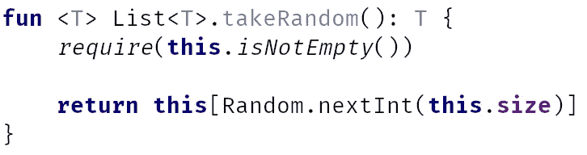
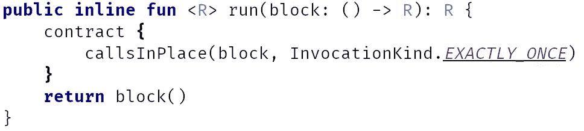

# 了解科特林合同

> 原文：<https://blog.kotlin-academy.com/understanding-kotlin-contracts-f255ded41ef2?source=collection_archive---------0----------------------->


从 Kotlin 1.3 开始，我们可以享受新的、神秘的特性——kot Lin 契约。从使用的角度来看，它们看起来就像是作为函数的第一条语句的一段代码:


尽管在编译过程中，整个块都消失了。这是因为契约构建器函数是一个具有空体的内联函数:


看起来很疯狂，但这是我们想要的行为。Kotlin 契约是与编译器通信的一种方式，否则它们只会在编译后扰乱和减慢我们的代码。它们可以包含不同种类的信息，每一种都可以改善 Kotlin 的编程体验。让我们看看怎么做。

本文基于对 [Kt 的更新。学院](http://kt.academy/)我之前介绍过的科特林工作坊。因为已经使用了 Kotlin 1.3，所以我们在教授新引入的特性时，只是给出了一个关于版本要求的警告。

[](https://www.kt.academy/workshop/refactoringToPatterns)

# 什么是合同？

传统上，契约只是要求真实的表达。像科特林`require`:



他们在那里陈述一些无法用其他方式检查的需求。例如，在 C++模板[中，类型参数](/programmer-dictionary-parameter-vs-argument-type-parameter-vs-type-argument-b965d2cc6929)可以是任何东西。这就是为什么契约说只允许具有具体方法或字段的类型。所以合同主要是开发商的信息。

这种信息在科特林我们称之为需求。Kotlin 契约是为了与编译器交流，而不是与开发人员交流。Kotlin 团队指定了两种对编译器有意义的消息:

*   我们从一个参数中调用一个函数多少次
*   函数返回某个值这一事实的含义

我们来详细看看，这些合同的后果是什么。

# 我们从一个参数中调用一个函数多少次

我们声明一个函数被`callsInPlace`块和`InvocationKind`调用了多少次:



有四种可能的调用类型:

*   最多一次
*   至少一次
*   正好 _ 一次
*   未知的

它们都允许不同类型的行为。首先，当我们知道 lambda 表达式中的代码只被调用一次时，我们知道可以在那里初始化变量:


它对任何其他类型的调用都不起作用，因为它们要么不能保证变量将被初始化(`AT_MOST_ONCE`和`UNKNOWN`)，要么可能试图重新初始化`val` ( `AT_LEAST_ONCE`)

如果我们想要初始化/设置`var`，我们可以在 lambda 初始化`EXACTLY_ONCE`和`AT_LEAST_ONCE`时都这样做:


也支持警告。块中至少被调用一次的代码可以被视为函数的一部分。


重点是，如果在块中使用 return，则在块后没有必要使用 return:

```
**fun** makeDialog(): Dialog {
    DialogBuilder().apply **{** title = **"Alert"** setPositiveButton(**"OK"**, **{** */**/* **}**)
        setNegativeButton(**"Cancel"**, **{** */**/* **}**)
        **return** create()
    **}**
**}**
```

最后，下表总结了每种调用类型的这 3 种功能:

[](https://leanpub.com/effectivekotlin/c/3YYtCtqCC6a4)

# 函数返回某个值这一事实的含义

这种功能的一个很好的例子是`Collection<T>?.isNullOrEmpty`函数。传统上，我们可以用它来检查集合是否为 null 或空，但它不能智能转换这个变量。现在是了，多亏了科特林的合同。函数声明如下所示:


合同规定，如果函数返回 false，则接收方不为 null。根据这些信息，如果编译器知道函数返回 false，它会智能转换变量:


此功能也可用于实现类型的智能转换:


现在只允许 true/false 返回值，这满足了大多数情况。虽然也许有一天我们将能够交流不同结果的含义。

# 是全部吗？

是的，暂时的。我希望 Kotlin 协程能够进步，让我们表达更多关于函数的信息。例如，如果我们可以说将调用一个或另一个函数，我们可以涵盖更多类型的回调:

```
**suspend fun** getUserId(): Int? {
    getUser(
       onSuccess = **{ return** it.*id* **}**,
       onError = **{ return null }** )
}
```

此外，更强大的效果推理可能是有用的。虽然，现在，这只是一厢情愿的想法。

[](https://blog.kotlin-academy.com/write-for-kotlin-academy-abebd70937ce)

# 摘要

Kotlin 契约引入了重要的改进，尤其是对标准库函数的改进。除了语言和编译器之间的合作，这些改进是无法通过其他方式实现的。他们给了我们更智能的编译器，所以更好的编程体验。

## 单击👏说“谢谢！”并帮助他人找到这篇文章。

你需要 Kotlin 工作室吗？访问[我们的网站](https://www.kt.academy/)，看看我们能为您做些什么。

了解卡帕头最新的重大新闻。学院，[订阅时事通讯](https://kotlin-academy.us17.list-manage.com/subscribe?u=5d3a48e1893758cb5be5c2919&id=d2ba84960a)，[观察 Twitter](https://twitter.com/ktdotacademy) 并在 medium 上关注我们。

[](https://kotlin-academy.us17.list-manage.com/subscribe?u=5d3a48e1893758cb5be5c2919&id=d2ba84960a)