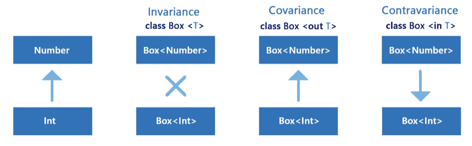
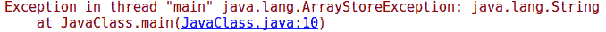
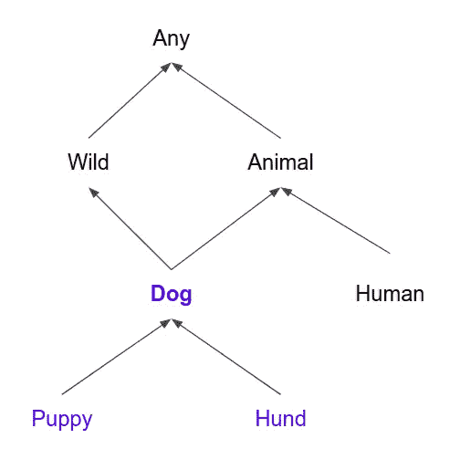
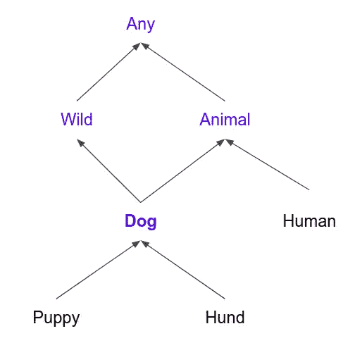

# 了解 Kotlin 对类型参数位置的限制

> 原文：<https://blog.kotlin-academy.com/understanding-kotlin-limitations-for-type-parameter-positions-15527b916034?source=collection_archive---------2----------------------->

科特林方差修改器对[类型参数](/programmer-dictionary-parameter-vs-argument-type-parameter-vs-type-argument-b965d2cc6929)的使用施加限制。协变类型参数(带有`out`修饰符)不能用于公共 in 位置，逆变类型参数(带有`in`修饰符)不能用于公共 out 位置。但是为什么要实行这种限制呢？

我们来了解一下。


# 方差修改量

我们已经发表了一篇文章，深入解释了方差修正因子。这里可以找到[这里有](/kotlin-generics-variance-modifiers-36b82c7caa39)。可以简单概括为:

当一个泛型类型是不变的，像`class Box<T>`一样，任何`Box<SomeType>`和`Box<AnotherType>`之间都没有关系。所以`Box<Number>`和`Box<Int>`没有关系。

当一个泛型类型是协变的，比如`class Box<out T>`，当`A`是`B`的子类型，那么`Box<A>`是`Box<B>`的子类型。所以`Box<Int>`是`Box<Number>`的一个子类型。

当一个泛型类型是逆变的，比如`class Box<in T>`，当`A`是`B`的子类型，那么`Box<B>`就是`Box<A>`的子类型。所以`Box<Number>`是`Box<Int>`的一个子类型。

简短摘要:



Taken from [Kt. Academy cheat sheet](/kotlin-cheat-sheet-1137588c75a).

[](https://leanpub.com/effectivekotlin/c/3YYtCtqCC6a4)

# 审查限制

尽管 Kotlin 引入了一些对使用方差修饰符的类型参数的限制。以下类别完全正确:

```
**class** SomeClass<T> {
    **var t**: T? = **null

    fun** functionReturningT(): T? = **t

    fun** functionAcceptingT(t: T) {}

    **private fun** privateFunctionReturningT(): T? = **t

    private fun** privateFunctionAcceptingT(t: T) {}
}
```

尽管如果我们引入任何方差修饰符，它将不会编译:

```
**class** SomeClass<**out** T> {
    **var t**: T? = **null** *// Error* **private var pt**: T? = **null

    fun** functionReturningT(): T? = **t

    fun** functionAcceptingT(t: T) {} *// Error* **private fun** privateFunctionReturningT(): T? = **t

    private fun** privateFunctionAcceptingT(t: T) {}
}**class** SomeClass<**in** T> {
    **var t**: T? = **null** *// Error* **private var pt**: T? = **null

    fun** functionReturningT(): T? = **t** *// Error* **fun** functionAcceptingT(t: T) {} 

    **private fun** privateFunctionReturningT(): T? = **t

    private fun** privateFunctionAcceptingT(t: T) {}
}
```

如您所见，协变类型不能作为参数类型用于公共方法，也不能用于公共读写属性。只读是可以的，因为它们只暴露我们的位置:

```
**class** SomeClass<**out** T> {
    **val t**: T? = **null

    private var pt**: T? = **null

    fun** functionReturningT(): T? = **t

    private fun** privateFunctionReturningT(): T? = **t

    private fun** privateFunctionAcceptingT(t: T) {}
}
```

Contravariance 不能用作方法的返回类型，也不能用于所有方法(getter 可见性必须与属性可见性相同)。

[](https://blog.kotlin-academy.com/write-for-kotlin-academy-abebd70937ce)

# 示例问题

要理解这些限制背后的问题，请考虑 Java 数组。它们是协变的，同时，它们允许设定值(在位置上)。因此，您可以调用下面的代码，从编译的角度来看，这些代码是完全正确的，但总是会导致运行时错误:

```
*// Java* Integer[] ints = { 1,2,3 };
Object[] objects = ints;
objects[2] = **"AAA"**;
```



那里发生了什么？我们向上铸造阵列，然后设置向下铸造类型和繁荣！我们有一个错误。它与职位有什么关系？

# 位置和类型

场内和场外都有一些默认的合约。请参见以下类型层次结构:



当我们需要将`Dog`传递到 in-position 时，每个子类型都被接受:

```
**fun** takeDog(dog: Dog) {}takeDog(Dog())
takeDog(Puppy())
takeDog(Hund())
```

当我们将`Dog`从外部位置取出时，接受的值是`Dog`和所有超类型:



```
**fun** makeDog(): Dog = Dog()**val** any: Any = makeDog()
**val** animal: Animal = makeDog()
**val** wild: Wild = makeDog()
```

请注意，一旦元素处于“内”或“外”位置，不同类型的转换是默认的，并且不能停止。

这就是在我们的数组示例中发生的情况。协方差允许向上转换，而在位置中允许向下转换。将这两种机制结合起来使用，我们可以对任何事物进行转换。与逆变和外部位置类似。一起可以帮助开发人员将任何类型转换为任何其他类型。唯一的问题是，如果一个实际的类型不能以这种方式转换，那么我们就有一个运行时错误。

防止这种情况的唯一方法是禁止公开的内部位置和矛盾，以及公开的我们的位置和矛盾。这就是为什么科特林有这个限制。科特林还通过使所有数组不变来解决数组问题。这是另一个例子，Kotlin 是比 Java 更安全的语言(见[这个演讲](/kotlin-next-level-of-android-development-95bce2f43a24))。

你需要 Kotlin 工作室吗？请访问我们的网站,看看我们能为您做些什么。

了解卡帕头最新的重大新闻。学院，[订阅时事通讯](https://kotlin-academy.us17.list-manage.com/subscribe?u=5d3a48e1893758cb5be5c2919&id=d2ba84960a)，[观察 Twitter](https://twitter.com/ktdotacademy) 并在 medium 上关注我们。

[](http://eepurl.com/diMmGv)

## 单击👏说“谢谢！”并帮助他人找到这篇文章。

请注意，如果您按住鼓掌按钮，您可以留下更多的掌声。

