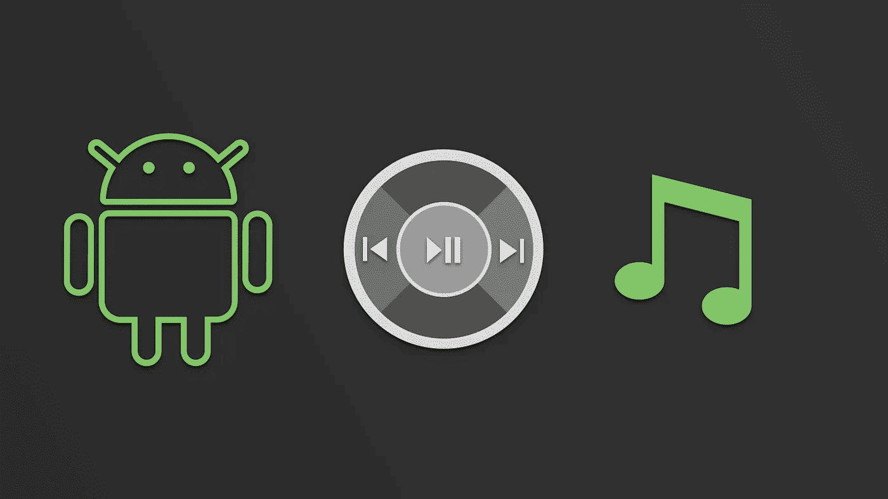
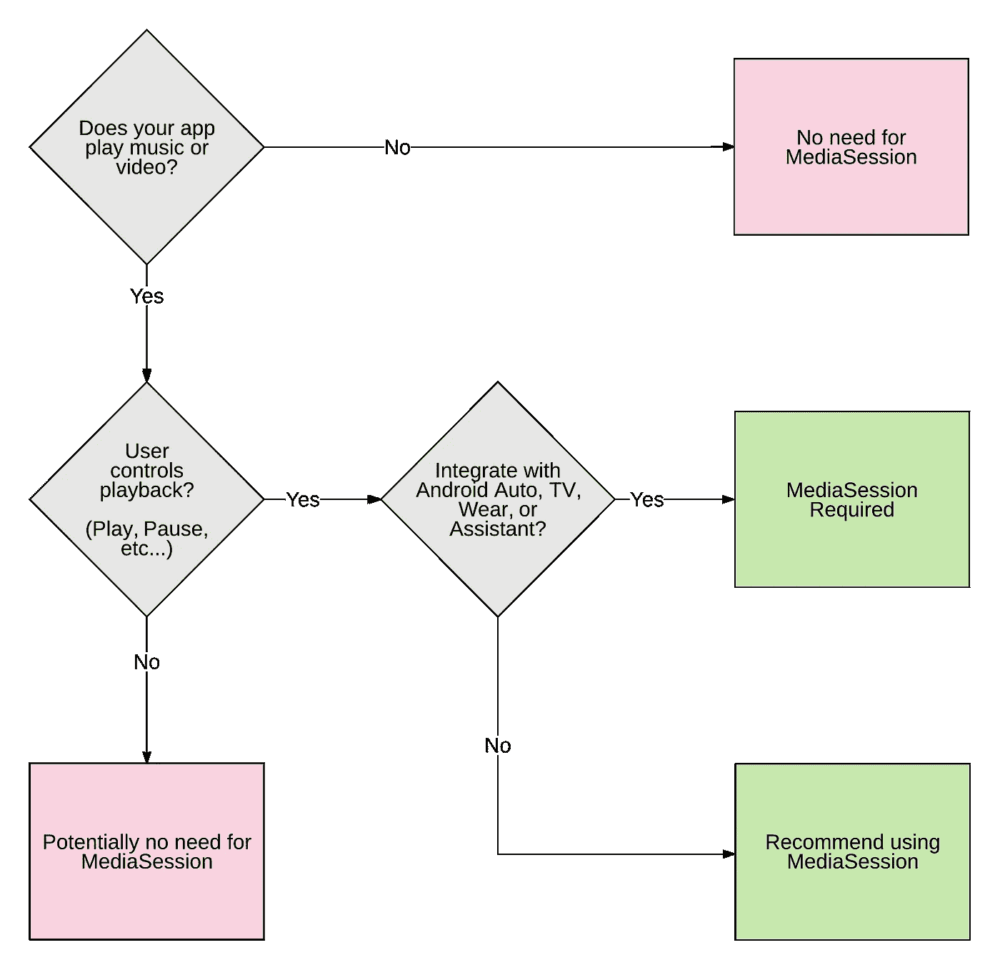

# 了解媒体会话(第 1/4 部分)

> 原文：<https://medium.com/androiddevelopers/understanding-mediasession-part-1-3-e4d2725f18e4?source=collection_archive---------5----------------------->

## MediaSession 适合我吗？

作为一名使用媒体 API 的 Android 开发者，你可能听说过`[MediaSession](https://developer.android.com/guide/topics/media-apps/working-with-a-media-session.html)`。你可能会好奇它有什么用，什么时候用，什么时候不用。

在进入细节之前，您可以使用此流程图来确定您的媒体播放应用程序是否会从中受益。

这一系列文章的目标是让你深入了解`MediaSession`，它有什么用途，什么时候用，什么时候不用。这是 4 部分系列的第一部分，包括:

1.  **media session 适合我吗？** ( *本文*)
2.  [了解复杂的媒体环境](/@nazmul/understanding-mediasession-part-2-3-ad291fd32d60)
3.  [简单用例如何使用](/@nazmul/understanding-mediasession-part-2-3-b4919583a82)
4.  [如何将它用于复杂的用例](/@nazmul/understanding-mediasession-part-4-4-dcc77c535f99)

# 媒体播放应用示例

让我们来看看你可能正在开发的几种应用，看看是否需要`MediaSession`。

## 视频游戏应用程序

视频游戏通常包括音乐和声音效果来增强用户的体验，但是，在这种情况下，用户通常不期望能够暂停音乐或跳到下一首曲目，因此这里没有必要使用`MediaSession`。

## **视频播放器应用**

视频播放器可能只能在应用程序处于前台时播放音频和视频，因此似乎没有必要与`MediaSession`集成。然而，为了让你的应用程序响应媒体按钮事件，你需要集成`MediaSession`。

## **音乐播放器应用**

一个音乐播放器 app 绝对要集成`MediaSession`。`MediaSession`通过耳机、Android Wear、Android Auto 和 Google Assistant 上的媒体按钮提供播放控制挂钩。利用`[MediaBrowserService](https://developer.android.com/guide/topics/media-apps/audio-app/building-a-mediabrowserservice.html)`也可能会有好处。通过提供一个`MediaBrowserService`，该应用程序可以允许用户使用 Android Auto、Wear、Assistant 和蓝牙设备来导航媒体内容(无需使用应用程序的 UI)。

要了解更多关于`MediaSession`是什么和不是什么，以及它在 Android 生态系统中所处的更大环境，请阅读本系列的第二篇文章[。](/@nazmul/understanding-mediasession-part-2-3-ad291fd32d60)

 [## 了解媒体会话(第 2/4 部分)- Nazmul Idris (Naz) - Medium

### 这一系列文章的目标是让您深入了解 MediaSession，它的好处是什么，何时…

medium.com](/@nazmul/understanding-mediasession-part-2-3-ad291fd32d60) 

# Android 媒体资源

*   [媒体 API 指南—媒体应用概述](https://developer.android.com/guide/topics/media-apps/media-apps-overview.html)
*   [媒体 API 指南—使用媒体会话](https://developer.android.com/guide/topics/media-apps/working-with-a-media-session.html)
*   [使用 MediaPlayer 构建一个简单的音频播放应用](/google-developers/building-a-simple-audio-app-in-android-part-1-3-c14d1a66e0f1)
*   [示例代码— MediaBrowserService](https://github.com/googlesamples/android-MediaBrowserService)
*   [示例代码—媒体会话控制器测试](https://github.com/googlesamples/android-media-controller)