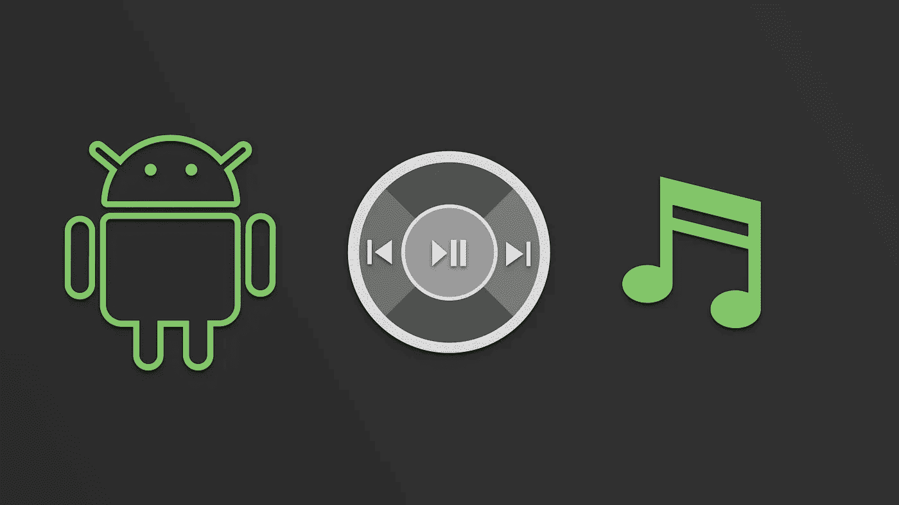
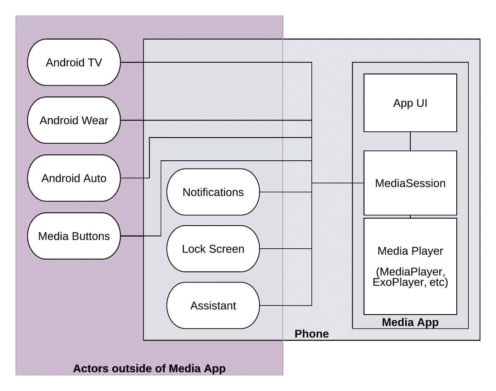

# 了解媒体会话(第 2/4 部分)

> 原文：<https://medium.com/androiddevelopers/understanding-mediasession-part-2-4-ad291fd32d60?source=collection_archive---------4----------------------->

## 理解复杂的媒体环境

# 介绍

这一系列文章的目标是让你深入了解`MediaSession`，它有什么用途，什么时候用，什么时候不用。这是 4 部分系列的第二部分，包括:

1.  [media session 适合我吗？](/@nazmul/understanding-mediasession-part-1-3-e4d2725f18e4)
2.  **理解复杂的媒体环境** *(本文)*
3.  [简单用例如何使用](/@nazmul/understanding-mediasession-part-2-3-b4919583a82)
4.  [如何将它用于复杂的用例](/@nazmul/understanding-mediasession-part-4-4-dcc77c535f99)

# 这是一个复杂的媒体环境

如果你正在开发一个媒体播放应用程序，它可能会创建一个用户界面，并管理一个媒体播放器(例如，`[MediaPlayer](https://developer.android.com/guide/topics/media/mediaplayer.html)`或`[ExoPlayer](https://google.github.io/ExoPlayer/guide.html)`)。它还可能处理浏览媒体目录、队列和播放列表等。

媒体播放应用程序的用户也希望能够在应用程序本身的用户界面之外控制它。以下是他们期望的一些例子。

> **用户希望能够通过告诉谷歌助手“** `**pause playback**` **”来暂停你的应用程序中的播放，而无需与你的应用程序的 UI 进行交互。**
> 
> 他们希望能够使用耳机上的媒体键来控制播放，而无需与用户界面交互。
> 
> 如果用户有 Android Auto，那么当他们的手机与汽车连接时，他们希望看到他们想要播放的音乐目录。

我们将把应用程序之外控制媒体的“东西”称为“外部参与者”。这些**外部参与者**包括:Android TV、Android Wear、Android Auto、你耳机上的[媒体按钮](https://developer.android.com/guide/topics/media-apps/mediabuttons.html)、谷歌助手、锁屏控件，甚至`MediaStyle`通知。

> 这些都可能导致应用程序内部的状态变化，需要有一种方法来响应这些变化。这就是 MediaSession 发挥作用的地方。

# MediaSession 是做什么的？

`MediaSession`做以下事情:

*   **播放控制—** 它提供了一个单一的界面来控制播放(例如:播放、暂停、停止、跳到下一个、播放以进行搜索)，您的应用程序的 UI 和外部参与者(例如:媒体按钮、谷歌助手)都可以使用该界面。起初这可能看起来令人困惑，但是如果你绕过`MediaSession`直接控制你的播放器，那么当外部参与者改变播放状态或加载不同的媒体时，你的应用程序的 UI 很容易与播放器和会话不同步。
*   **状态同步** —它向所有外部参与者和您的应用程序本身广播当前播放状态(播放、暂停、停止等)和媒体元数据(专辑封面、歌曲时长、歌曲标题等)。

# 什么是 MediaSession？

`MediaSession`是一个中间件，允许外部参与者控制你的应用程序中的媒体播放器(在应用程序自己的 UI 之外)。它还允许你的应用程序向应用程序内外感兴趣的各方报告播放器状态的变化(加载了什么媒体，播放器当前是否暂停，或者正在播放，等等)。

# 什么不是 MediaSession？

`MediaSession`不管理你应用的媒体播放器；你仍然需要创建一个媒体播放器，加载媒体，准备播放，实际控制播放，等等。该应用程序仍然需要处理音频焦点。它必须管理自己的用户界面，并与`MediaSession`集成。

让我们举两个例子，一个用户在你的应用程序中通过按下一个媒体按钮来调用暂停动作，或者通过让谷歌助手暂停播放。假设发生这种情况时，音频已经在你的应用程序服务的背景中播放。无论哪种情况，非常相似的事情都会发生在你的应用程序中。

1.  按下媒体暂停按钮会触发一个意图，你的应用程序会接收到这个意图。然后，`MediaSession`通过调用您提供给`MediaSession`的代码回调函数中的`onPause()`，将这个消息传输到您的应用程序。当谷歌助手被要求“暂停播放”时，也会发生非常类似的事情。两条路径都以`onPause()`方法结束，该方法由`MediaSession`调用到您的代码中。
2.  此时，您负责在您的音乐服务中实现`onPause()`,连接到您的播放器并实际暂停其播放。一旦完成，你负责报告回放状态已经改变，通过用新的状态调用`setPlaybackState()`将此通知回`MediaSession`。
3.  你的应用程序的 UI 应该连接到`MediaSession`，当这个回放状态改变时，你必须在你的 UI 代码中实现一个`onPlaybackStateChanged()`方法。在这里，您可以更新您的 UI，以显示回放状态已经更改为暂停。

这是为了使用`MediaSession`你必须采取的一些高级步骤的简要概述。本系列的下一篇文章将针对简单的用例(例如:在前台播放视频的应用程序)更详细地介绍这一点。

 [## 了解媒体会话(第 3/4 部分)- Nazmul Idris (Naz) - Medium

### 这一系列文章的目标是让您深入了解 MediaSession，它的好处是什么，何时…

medium.com](/@nazmul/understanding-mediasession-part-3-4-b4919583a82) 

# Android 媒体资源

*   [媒体 API 指南—媒体应用概述](https://developer.android.com/guide/topics/media-apps/media-apps-overview.html)
*   [媒体 API 指南—使用媒体会话](https://developer.android.com/guide/topics/media-apps/working-with-a-media-session.html)
*   [使用 MediaPlayer 构建简单的音频播放应用](/google-developers/building-a-simple-audio-app-in-android-part-1-3-c14d1a66e0f1)
*   [示例代码— MediaBrowserService](https://github.com/googlesamples/android-MediaBrowserService)
*   [样本代码—媒体会话控制器测试](https://github.com/googlesamples/android-media-controller)