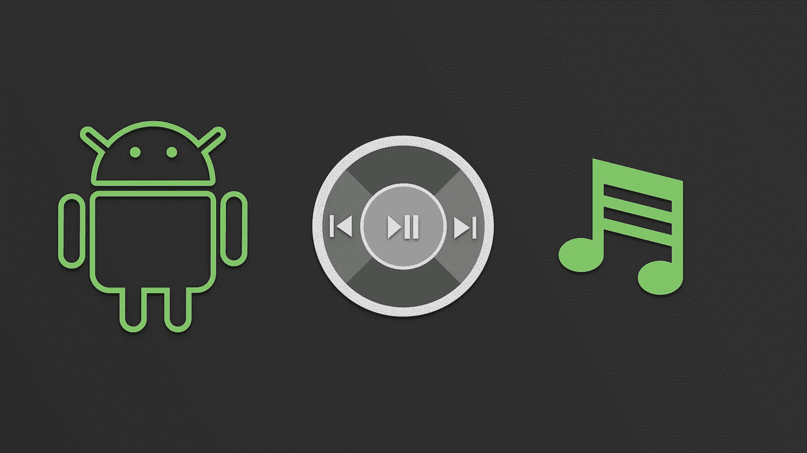
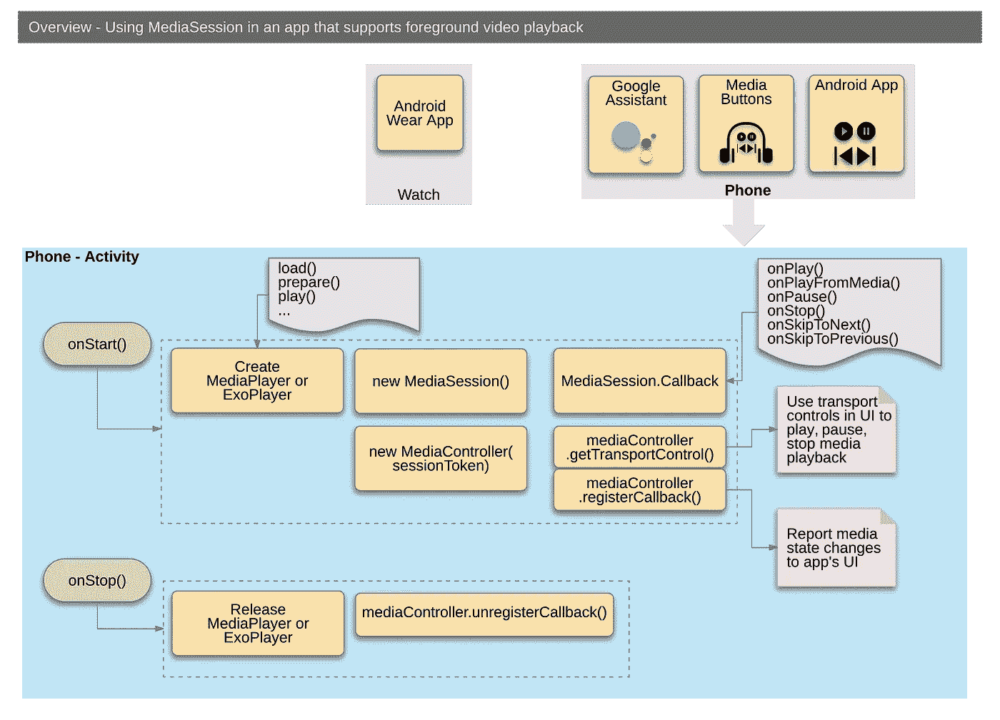

# 了解媒体会话(第 3/4 部分)

> 原文：<https://medium.com/androiddevelopers/understanding-mediasession-part-3-4-b4919583a82?source=collection_archive---------6----------------------->

## 如何将它用于简单的用例

# 介绍

这一系列文章的目标是让你深入了解`MediaSession`，它有什么用途，什么时候用，什么时候不用。这是 4 部分系列的第三部分，包括:

1.  [media session 适合我吗？](/@nazmul/understanding-mediasession-part-1-3-e4d2725f18e4)
2.  [了解复杂的媒体环境](/@nazmul/understanding-mediasession-part-2-3-ad291fd32d60)
3.  **简单用例如何使用** *(本文)*
4.  [如何将它用于复杂的用例](/@nazmul/understanding-mediasession-part-4-4-dcc77c535f99)

# 如何使用它

既然我们已经介绍了什么是`MediaSession`、为什么是它以及它如何大致适合你的应用程序的代码库的高级概念模型，下面是如何使用它的一些细节。我们将讨论媒体播放应用的两个用例:

1.  一款只支持前台播放的视频播放 app。
2.  一个音频播放应用程序，支持前台和后台播放，并允许其他应用程序浏览其媒体内容。

# 在前台播放视频的应用程序

这个应用程序有一个用户界面，允许用户控制音频播放。它可以使用一个`MediaSession`在玩家和活动之间传递信息。然而，它没有一个`Service`，也不使用`MediaBrowserService`，也不显示通知。

下图提供了创建使用`MediaSession`的音频播放应用程序所需的组件的概要。

请参考[developers.android.com](https://developer.android.com/guide/topics/media-apps/media-apps-overview.html)来获得更多关于你需要使用的每个类的细节。您必须执行以下任务:

*   创建一个`MediaPlayer`或`ExoPlayer`来实际加载、准备和播放内容。
*   创建一个`MediaSession`，您可以使用它来共享其他应用程序正在播放的内容的信息。您还可以允许从外部控制您的应用程序播放(通过谷歌助手、蓝牙耳机、媒体按钮等)。

系列文章中的[的下一篇文章将更详细地介绍在后台播放音频这一更复杂的用例。](/@nazmul/understanding-mediasession-part-4-4-dcc77c535f99)

 [## 了解媒体会话(第 4/4 部分)- Nazmul Idris (Naz) - Medium

### 这一系列文章的目标是让您深入了解 MediaSession，它的好处是什么，何时…

medium.com](/@nazmul/understanding-mediasession-part-4-4-dcc77c535f99) 

# Android 媒体资源

*   [媒体应用程序指南—媒体应用程序概述](https://developer.android.com/guide/topics/media-apps/media-apps-overview.html)
*   [媒体 API 指南—使用媒体会话](https://developer.android.com/guide/topics/media-apps/working-with-a-media-session.html)
*   [使用 MediaPlayer 构建一个简单的音频播放应用](/google-developers/building-a-simple-audio-app-in-android-part-1-3-c14d1a66e0f1)
*   [示例代码— MediaBrowserService](https://github.com/googlesamples/android-MediaBrowserService)
*   [示例代码—媒体会话控制器测试](https://github.com/googlesamples/android-media-controller)