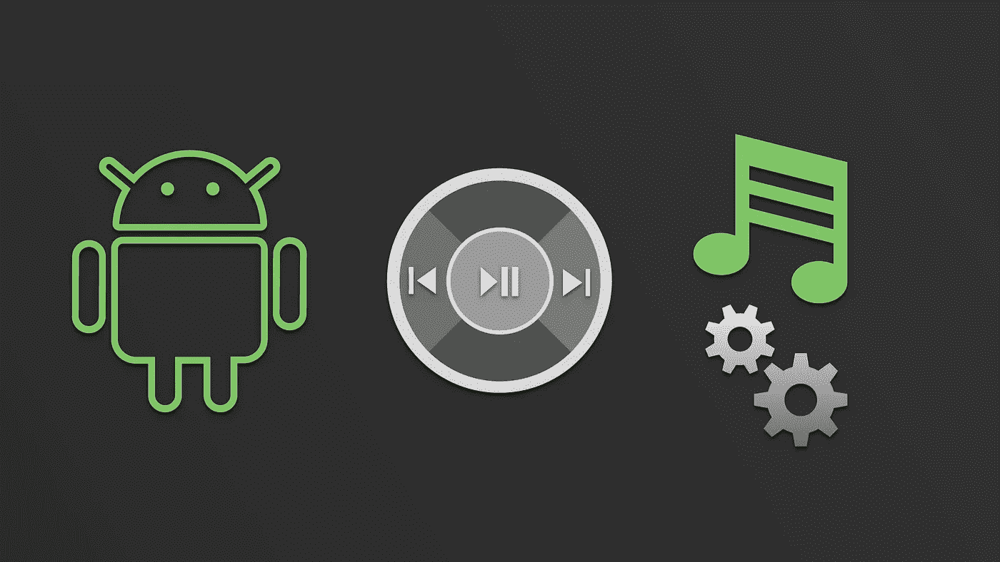
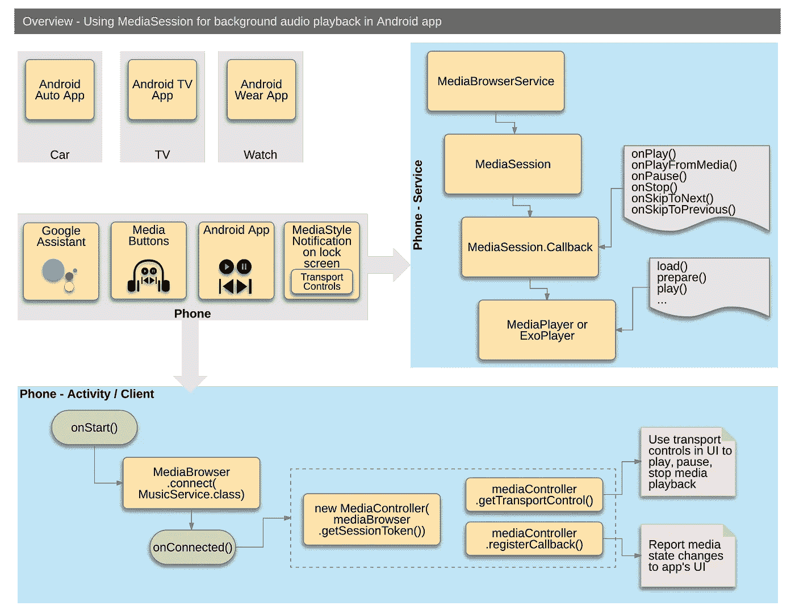
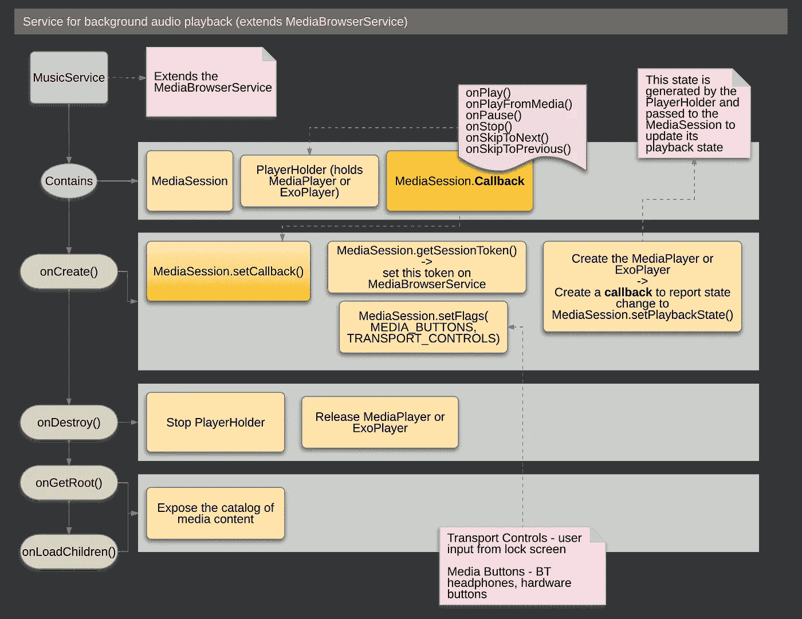
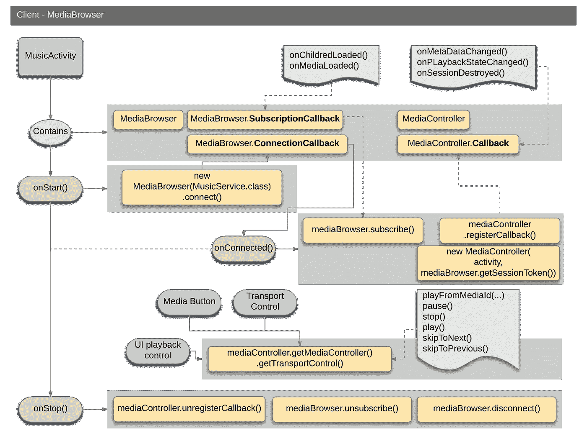

# 了解 MediaSession(第 4/4 部分)

> 原文：<https://medium.com/androiddevelopers/understanding-mediasession-part-4-4-dcc77c535f99?source=collection_archive---------3----------------------->

## 如何将它用于复杂的用例

# 介绍

这一系列文章的目标是让你深入了解`MediaSession`，它有什么用途，什么时候用，什么时候不用。这是 4 部分系列的最后一部分，包括:

1.  [media session 适合我吗？](/@nazmul/understanding-mediasession-part-1-3-e4d2725f18e4)
2.  [理解复杂的媒体环境](/@nazmul/understanding-mediasession-part-2-3-ad291fd32d60)
3.  [简单用例如何使用](/@nazmul/understanding-mediasession-part-2-3-b4919583a82)
4.  **复杂用例如何使用** *(本文)*

# 在后台播放音频的应用程序

下图提供了创建一个使用`MediaSession`和`MediaBrowserService`在后台播放音频的音频播放应用程序所必须实现的所有不同组件的高级概述。

请参考[developers.android.com](https://developer.android.com/guide/topics/media-apps/media-apps-overview.html)来获得更多关于你需要使用的每个类的细节。总体而言，您必须:

*   **服务** —创建一个`Service`来管理播放器并处理准备和播放媒体。创建与此服务相关的`MediaStyle`通知。这个服务需要扩展`MediaBrowserService`以便提供内容(例如:Android Auto 就是这样浏览 app 提供的内容的)。该服务的详细信息在下面的章节中提供。
*   **客户端** —使用`MediaBrowser`创建一个连接到该服务的`Activity`或`Fragment`。`MediaBrowser`允许访问由`Service`提供的内容，并允许使用`MediaSession`来控制回放，并获取关于加载了什么媒体以及回放状态改变的更新(这实际上发生在您的`Service`中)。客户端的详细信息在下面的章节中提供。

# 服务码

下图详细介绍了管理玩家的应用程序中需要的`Service`(`MediaPlayer`或`ExoPlayer`)，并创建`MediaSession`，使其与玩家的状态变化保持同步。总体而言，您必须:

*   在`onCreate()`中，你必须创建一个`MediaSession`并获得它的令牌。
*   通过调用`setSessionToken`将这个令牌传递给`MediaBrowserService`，这将把`MediaBrowserService`连接到`MediaSession`，并允许`MediaBrowser`(客户端与`MediaSession`一起工作)。
*   要实现的最重要的回调是`MediaSession.Callback`。这个回调函数允许传输控件在回调函数上调用播放、停止、暂停等操作，然后这些操作用于播放、停止、暂停底层播放器。
*   您必须扩展`MediaBrowserService`并实现两个方法，以便公开您正在创建的可浏览的媒体内容目录— `onGetRoot()`和`onLoadChildren()`。

**注意**:如果你不需要 Android Auto 浏览你的内容，或者你的应用程序 UI 之外的其他应用程序，那么你可以安全地移除你的`Service`中的`MediaBrowserService`(以及你的客户端代码中的`MediaBrowser`)。在这种情况下，只需使用`MediaSession`，您就可以获得允许其他应用程序控制回放和报告状态变化的所有好处，而无需从应用程序的用户界面之外浏览应用程序中的内容。

# 活动/客户端/用户界面代码

下图仔细观察了客户端代码，为了与`MediaSession`和`MediaBrowser`集成，你需要在你的应用程序中包含这些代码。总体而言，您必须:

*   在你的`Activity`的`onStart()`方法中，用一个`MediaBrowser`连接到`Service`。这将允许您获得可以在应用程序的 UI 中浏览的内容，并使用您从`MediaSession’s` `MediaController`获得的`TransportControls`进行回放。请注意，您必须从`MediaBrowser`获取`MediaSession`令牌，以便将您的`TransportControls`正确连接到`MediaSession`。
*   您必须在您的`Activity`中实现三个回调
*   `MediaController.Callback` —这用于使用当前播放状态以及当前加载的媒体来更新应用的。
*   `MediaBrowser.ConnectionCallback` —用于使用`MediaBrowser’s` `MediaSession`令牌获取`MediaController`。然后您可以使用`TransportControls`来启动回放、暂停、停止、跳过等操作。
*   `MediaBrowser.SubscriptionCallback` —这用于更新您的 UI，以便您可以显示用户内容(来自`Service`),他们可以浏览以进行回放。

# Android 媒体资源

*   [媒体应用程序指南—媒体应用程序概述](https://developer.android.com/guide/topics/media-apps/media-apps-overview.html)
*   [媒体 API 指南—使用媒体会话](https://developer.android.com/guide/topics/media-apps/working-with-a-media-session.html)
*   [使用 MediaPlayer 构建简单的音频播放应用](/google-developers/building-a-simple-audio-app-in-android-part-1-3-c14d1a66e0f1)
*   [示例代码— MediaBrowserService](https://github.com/googlesamples/android-MediaBrowserService)
*   [示例代码—媒体会话控制器测试](https://github.com/googlesamples/android-media-controller)