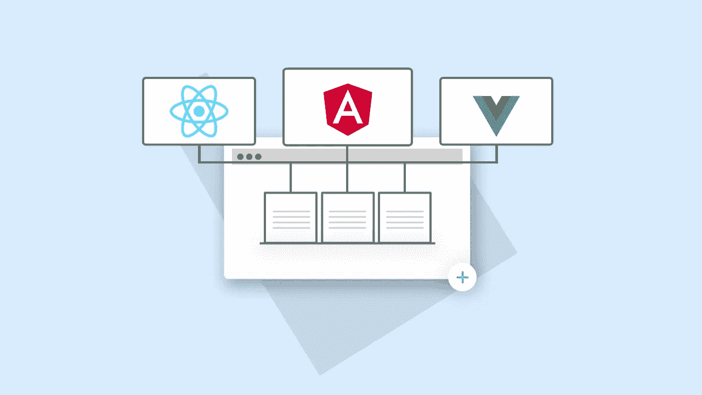
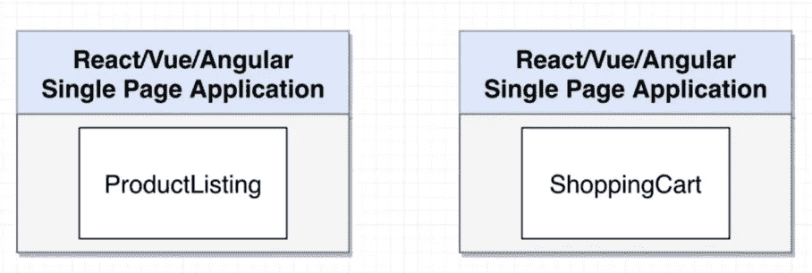
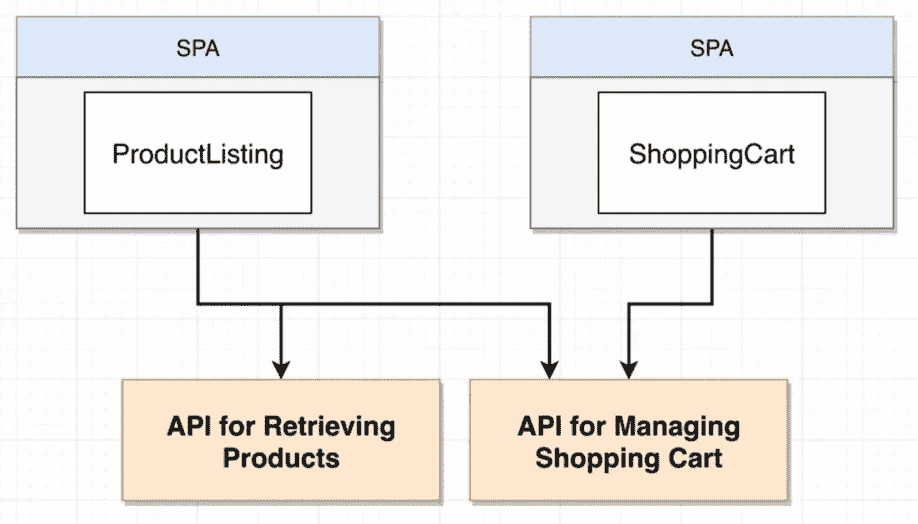
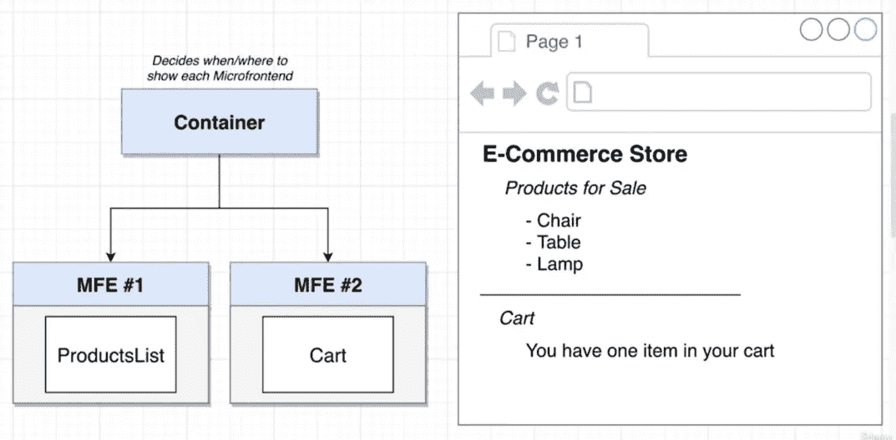
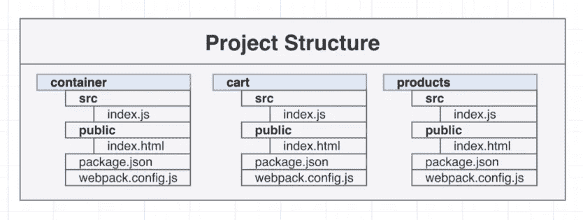
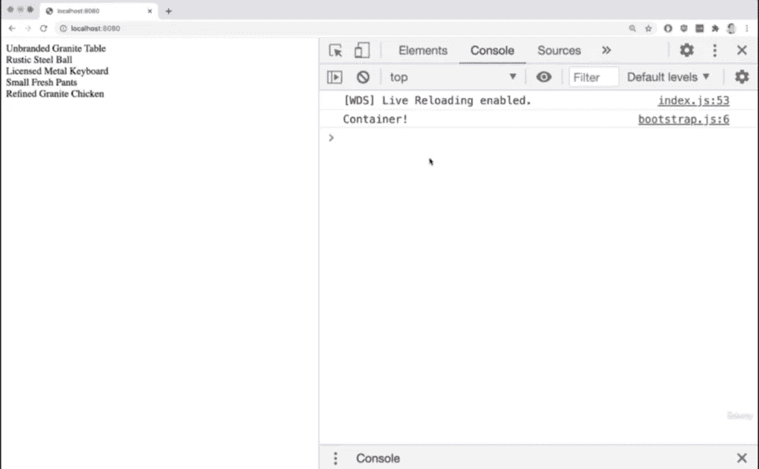
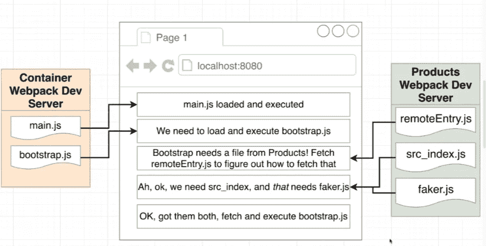
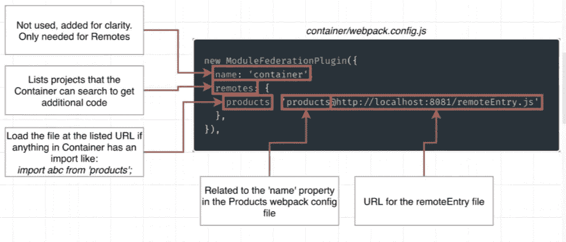
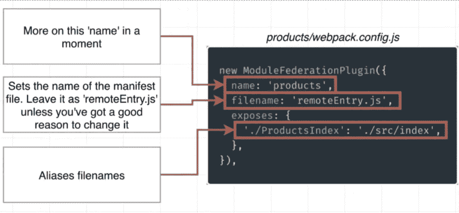

# 了解微前端

> 原文：<https://medium.com/globant/understanding-micro-frontend-8b0264e88a45?source=collection_archive---------0----------------------->

## 使用模块联合插件



**简介:**

> **“一种架构风格，将可独立交付的前端应用程序组合成一个更大的整体”。**

微前端将[单片](https://en.wikipedia.org/wiki/Monolithic_application#:~:text=In%20software%20engineering%2C%20a%20monolithic,independent%20from%20other%20computing%20applications.)应用程序分成多个更小的应用程序，每个更小的应用程序负责产品的一个独特功能。

为了理解微前端架构，让我们考虑两个不同的应用:**产品列表**和**购物车。**



每个应用程序都是一个单独的独立应用程序(这是 micro frontend 的主要优势之一)，开发这些独立应用程序的团队可以做出自己的技术决策，如选择技术(如 Angular、React 或 Vue)。

在这里，我们试图阻止这两个不同的应用程序之间的任何直接通信。

相反，我们的产品应用程序可能会发出某种 API 请求来管理购物车应用程序中的所有数据，每当我们的购物车应用程序被加载以查看添加的产品时，购物车应用程序都会发出相同的 API 请求，并获取购物车中的产品列表。因此，这两个应用程序之间没有直接通信。



因此，为了在屏幕上显示每个应用程序，我们需要创建一个**容器**微前端应用程序，并有 3 个小项目。

## **在本文中，我们将只创建一个产品和容器应用程序，同样，我们可以创建我们的购物车应用程序。**



这是我们构建每个应用程序的方式。



让我们首先创建产品应用程序。

我们可以使用下面的命令安装依赖项。

```
npm install webpack@5.68.0 webpack-cli@4.9.2 webpack-dev-server@4.7.4 faker@5.1.0 html-webpack-plugin@5.5.0
```

在产品 *index.js* 中，我们使用[faker](https://www.npmjs.com/package/faker)库为产品列表生成一些假数据。下面是示例代码。

我们将使用 Webpack 依赖来运行这段代码。

Webpack 的一点背景:

**这是一个工具，可以让你将你的 JavaScript 应用与所有的依赖项捆绑在一起。**

要运行我们的应用程序，请将脚本更改为产品应用程序中的 *package.json* 文件内的 Webpack。

然后创建一个 *webpack.config.js* 文件，并添加一个 Webpack dev 服务器，该服务器从 webpack 进程获取输出，并使其在浏览器中可用，并为其提供端口 8081。

我们使用的是[**HtmlWebpackPlugin**](https://www.npmjs.com/package/html-webpack-plugin)，它查看来自 Webpack 的不同文件，并自动更新 HTML 文档(我们在公共文件夹中有我们的 index.html 文件)。

*product/web pack . config . js*

*product/public/index . html*

现在，让我们创建容器应用程序，并弄清楚如何创建两个微前端应用程序(产品和容器)。

安装所有的依赖项，我们将为容器 *src >索引创建文件夹。js，公开>索引。HTML* 和 *webpack.config.js*

**实现模块联合:**

为了集成**产品和容器应用程序，我们需要在 webpack.config.js 中添加 [ModuleFederationPlugin](https://www.npmjs.com/package/module-federation-plugin) 。**

我们的主机(容器)需要决定我们想要从远程设备(产品)获取哪个文件，在我们的主机中唯一可以访问的文件是来自产品的 index.js 文件。为此，我们要求在我们产品的 webpack.config.js 文件中有 **ModuleFederationPlugin** 。

*product/web pack . config . js*

*container/web pack . config . js*

现在在主机(容器)内部，我们将反射入口点以异步加载 product index.js 文件，因此我们在容器 src 目录中创建一个 bootstrap.js 文件。

容器内部 *src/bootstrap.js*

```
import ‘products/ProductsIndex’;console.log(‘Container!’);
```

容器内部 *src/index.js*

我们将使用导入功能来异步加载文件。

因为我们在容器应用程序中运行产品应用程序的代码，所以我们需要在容器的 index.html 中添加“dev-products*”*id*，并尝试使用 npm run start 在 **localhost:8080** 运行我们的容器应用程序。*

*下面是我们的容器应用程序的样子:*

**

> ***了解** **模块联盟插件:***

*a)产品 *webpack.config.js* 文件内的模块联合插件:*

*模块联盟插件会给我们*

1.  **remoteEntry.js* 文件，这是一个清单文件，它列出了由模块联合插件发出的所有文件，还提供了如何使用它们的说明。*
2.  **src/index.js* 文件是 *src/index.js* 的版本，可以安全的加载到浏览器中。*
3.  **faker.js* 文件，可以安全加载到浏览器的 faker 版本。*

*b)容器 *wbpack.config.js* 文件内的模块联合插件:*

*我们在集成过程中创建了一个 *bootstrap.js* 文件和一个 *index.js* (这里我们使用了异步导入函数)文件，让 Webpack 意识到在执行 *bootstap.js* 文件(容器文件)之前，我们必须从产品应用程序中获取一些代码。*

**

> ***了解配置选项:***

*这对理解模块联合插件选项很重要。*

1.  *对于容器应用*

**

*所以，第一个选项是“名字”。当我们创建一个主机模块的时候，名字*不会被使用，但是记住我们的容器是主机，它试图从远程(产品应用)使用代码。通常的惯例是无论如何都要加上它。**

*第二个选项是远程。远程控制 Webpack 如何决定是否加载那个 *remoteEntry.js* 文件。正如我们在容器 *bootstarp.js* 中看到的，我们有 import products/ProductsIndex。*

> *因此，当我们构建我们的产品并且它被 Webpack 编译时，Webpack 将会看到我们正在尝试导入一个以单词“products”开头的模块。*

*如果 Webpack 在我们的节点模块目录中找不到产品的依赖项，它将查看 ModuleFederationPlugin，特别是 **remotes** 对象，并查看其中是否有带有单词“products”的键。因此单词“products”(表单 *bootstrap.js* )将与“products”(远程对象内的键)匹配，然后 Webpack 将加载列在 products 内的 *remoteEntry.js* 文件。*

*2.对于产品应用*

**

*这里，名称字符串必须与容器的名称字符串相同。除此之外，我们还有一个文件名来控制 *remoteEntry.js* 文件的名称。*

*最后，我们揭露了。Exposes object 控制我们的产品应用程序中的哪些模块或文件将向外界公开(在我们的例子中是容器)。这里我们公开了模块产品索引，如果有人试图导入产品索引，我们会给他们 src/index 文件。*

> ***结论:***
> 
> *微前端的基本思想是将您的前端分成一系列可独立部署和松散耦合的前端应用程序(称为微前端)。这些微[前端](https://savansharma22.medium.com/d997a5bbd410#14db)然后被合并/捆绑以创建单个前端应用。*
> 
> *Module Federation plugin 为开发人员提供了一种创建多个独立版本的方法，这些版本构成了一个应用程序。任何与 Webpack 5.0 或更高版本捆绑在一起的 JavaScript 应用程序都可以在运行时动态加载或与任何其他应用程序共享代码和依赖关系。*