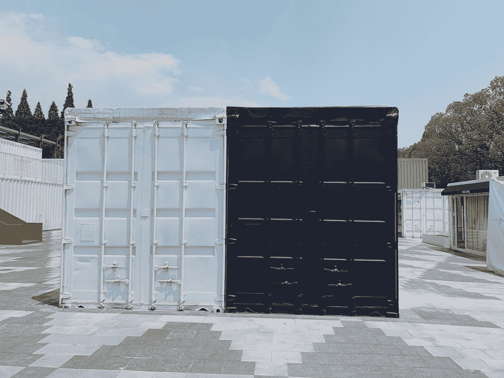

# 了解多容器容器

> 原文：<https://medium.com/bb-tutorials-and-thoughts/understanding-multi-container-pods-12f5780f3956?source=collection_archive---------0----------------------->

## 带示例项目的初学者指南

Photo by [Yue Iris](https://unsplash.com/@irisyue?utm_source=medium&utm_medium=referral) on [Unsplash](https://unsplash.com?utm_source=medium&utm_medium=referral)

多容器单元是指包含两个或更多相关容器的单元，这些容器共享网络空间、共享卷等资源，并作为一个单元一起工作。基本上，这些助手进程或容器通过提供额外的功能来增强主容器。