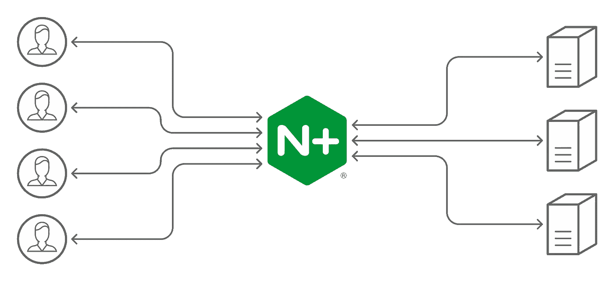

# 将 Nginx 理解为反向代理

> 原文：<https://medium.com/globant/understanding-nginx-as-a-reverse-proxy-564f76e856b2?source=collection_archive---------0----------------------->



(Image courtesy from NGINX)

ginx 是一个开源的 web 服务器，它提供了诸如反向代理、缓存、负载平衡、媒体流等功能。它最初是一个为获得最佳性能和稳定性而设计的 web 服务器。除了 HTTP 服务器功能，NGINX 还可以充当电子邮件(IMAP、POP3 和 SMTP)的代理服务器，以及 HTTP/2、TCP 和 UDP 协议的反向代理和负载平衡器。

# 高请求处理架构

Nginx 利用事件驱动的架构，异步处理请求。它被设计成使用非阻塞事件驱动的连接处理算法。因此，它的进程可以在一个处理线程内处理数千个连接(请求)。这种连接处理模块允许 Nginx 在资源有限的情况下快速、广泛地工作。此外，您可以使用 Nginx 来处理 10，000 多个并发连接，在请求负载较重的情况下，资源(CPU 和内存)很少。

# Nginx 反向代理概述

Nginx 反向代理充当中间服务器，它拦截客户端请求，并将它们转发到适当的上游后端服务器，然后将服务器的响应转发回客户端。反向代理作为上游服务器之上的抽象层提供了各种好处。

# Nginx 作为反向代理的重要优势

**负载均衡** : Nginx 将客户端请求负载均衡到多个上游服务器，这提高了性能，并在服务器出现故障时提供冗余。这有助于保持应用程序始终运行，以服务于客户端请求，并为应用程序提供更好的 SLA。

**安全性** : Nginx 服务器通过隐藏身份为私有网络中的后端服务器提供安全性。发出请求的客户端不知道后端服务器。它还提供了对多个后端服务器的单点访问，而不管后端网络拓扑如何。

**缓存** : Nginx 可以直接提供图像、视频等静态内容，提供更好的性能。它通过直接提供静态内容而不是将其转发到后端服务器进行处理来减少后端服务器的负载。

**日志** : Nginx 为通过它的后台服务器请求和响应提供了集中的日志，并为故障排除问题提供了一个单一的审计和日志位置。

**TLS/SSL 支持** : Nginx 允许客户端和服务器之间使用 TLS/SSL 连接进行安全通信。用户数据保持安全&加密，同时通过 HTTPS 连接进行传输。

**协议支持** : Nginx 支持 HTTP、HTTPS、HTTP/1.1、HTTP/2、gRPC -超文本传输协议以及 IP4 & IP6 互联网协议。

# 在 Ubuntu 上设置 Nginx 反向代理

## **先决条件**

我们假设。net core web 应用程序运行在 Ubuntu 上的一个轻量级 Kestrel web 服务器上，在端口 5001 上为请求提供服务，但不能从互联网访问。我们喜欢将这个应用程序隐藏在 Nginx 反向代理服务器后面，为来自互联网的请求提供服务。反向代理将请求转发给 ASP.NET 核心应用程序

> **Kestrel** 对于提供 ASP.NET 核心的动态内容非常重要。然而，web 服务功能并不像服务器那样功能丰富，例如 **IIS** 、 **Apache** 或 **Nginx** 。反向代理服务器可以提供额外的功能，例如从 HTTP 服务器提供静态内容、缓存请求、压缩请求和 SSL 终止。


## 配置步骤

1.  更新 apt 包并安装 Nginx webserver

```
sudo apt update
sudo apt install nginx
```

2.禁用默认预配置的虚拟主机

```
sudo unlink /etc/nginx/sites-enabled/default 
```

3.导航到目录`/etc/nginx/sites-available`并创建一个`reverse proxy`配置文件。

```
cd /etc/nginx/sites-available
nano reverse-proxy.conf
```

4.添加反向代理配置，如下所述

```
server {
        listen 80;
        server_name   example.com *.example.com;

        access_log /var/log/nginx/reverse-access.log;
        error_log /var/log/nginx/reverse-error.log;

        location / {
                    proxy_pass http://127.0.0.1:5001;
  }
}
```

使用 [**server_name**](http://nginx.org/en/docs/http/ngx_http_core_module.html#server_name) 指令定义服务器名称，并确定哪个服务器块将处理给定的用户请求。服务器名称是 DNS hosts - Nginx 将监听的内容，以及您的端口设置。假设你有一个域名，你把你的域名系统 A 记录，比如 example.com，指向你的服务器 IP。

代理服务器将所有流量所有传入流量重定向到端口 5001。运行在 Kestrel 服务器上的 net core web 应用程序。 `**proxy_pass** defines backend server address.`

5.创建一个符号链接。将配置从`/etc/nginx/sites-available`复制到`/etc/nginx/sites-enabled`

```
sudo ln -s /etc/nginx/sites-available/reverse-proxy.conf /etc/nginx/sites-enabled/reverse-proxy.conf
```

**测试并重启 Nginx**

要测试 Nginx:

```
sudo service nginx configtest
```

要重新启动 Nginx:

```
sudo service nginx restart
```

# 附加 Nginx 反向代理选项

在本节中，我们将看到一个推荐的 Nginx 代理属性和设置的例子。

```
**location/** {
    **proxy_pass** http://127.0.0.1:5001;
    **proxy_http_version**  1.1;
    **proxy_cache_bypass**  $http_upgrade;

    **proxy_set_header** Upgrade           $http_upgrade;
    **proxy_set_header** Connection        "upgrade";
    **proxy_set_header** Host              $host;
    **proxy_set_header** X-Real-IP         $remote_addr;
    **proxy_set_header** X-Forwarded-For   $proxy_add_x_forwarded_for;
    **proxy_set_header** X-Forwarded-Proto $scheme;
    **proxy_set_header** X-Forwarded-Host  $host;
    **proxy_set_header** X-Forwarded-Port  $server_port;
  }
```

*   `proxy_http_version 1.1` -定义代理的 HTTP 协议版本，默认设置为 1.0。
*   `proxy_cache_bypass $http_upgrade` -设置条件以避免缓存响应。
*   `Upgrade $http_upgrade`和`Connection "upgrade"`——如果您的应用程序使用 Websockets，这些头字段是必需的。
*   `X-Real-IP $remote_addr` -将真实的客户端远程 IP 地址转发给代理服务器。
*   `X-Forwarded-For $proxy_add_x_forwarded_for` -包含客户端代理的每个服务器的 IP 地址的列表。
*   `X-Forwarded-Proto $scheme` -对于 HTTPS 服务器块，来自代理服务器的每个 HTTP 响应都被重写到 HTTPS。
*   `X-Forwarded-Host $host` -定义客户端请求的原始主机。
*   `X-Forwarded-Port $server_port` -定义客户端请求的原始端口。

# **结论**

Nginx 是一个功能丰富的 web 服务器，可以充当高级反向代理，这很简单&易于配置和管理。