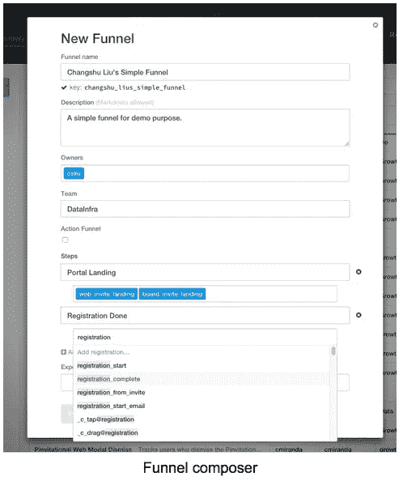
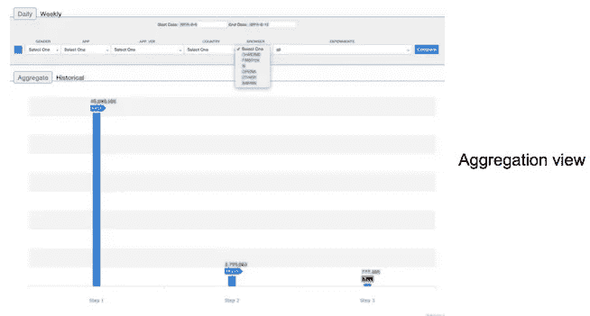
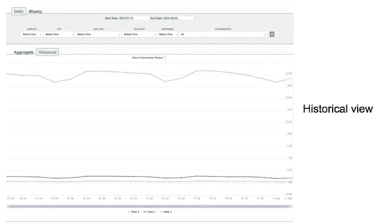
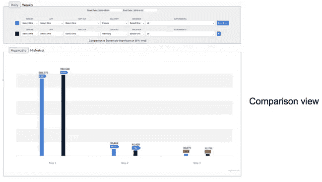
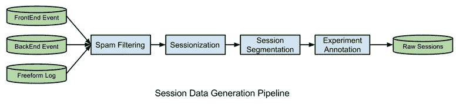
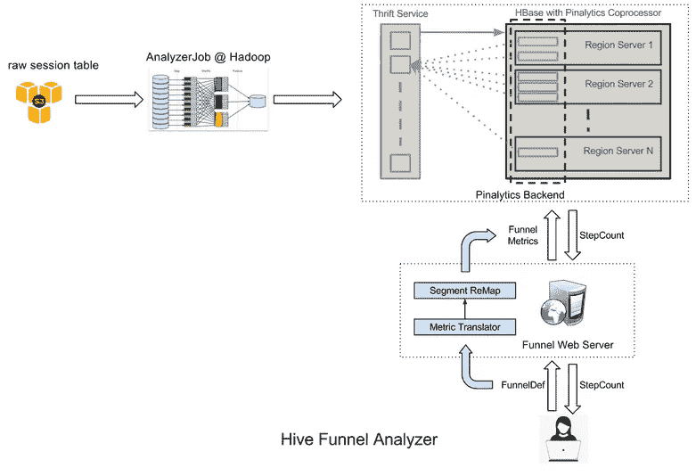
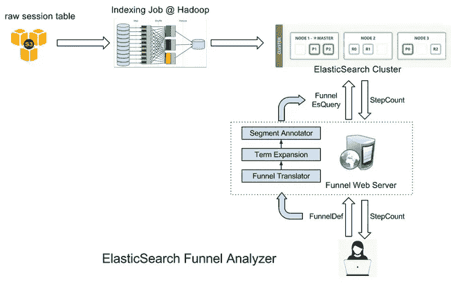
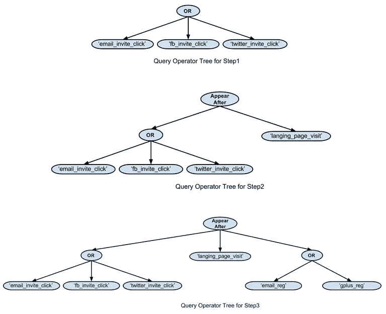

# 通过漏斗分析了解 Pinners

> 原文：<https://medium.com/pinterest-engineering/understanding-pinners-through-funnel-analysis-f759f4a77e2c?source=collection_archive---------1----------------------->

刘长书| Pinterest 工程师，数据

作为一家公司，我们的首要价值观是将 Pinners 放在第一位，通过数据将这一点付诸实践需要我们深入了解 Pinners 如何导航和使用我们的产品。Pinner 活动的一个常见分析模式是顺序分析它们从一个记录的事件到另一个记录的事件的移动，这一过程称为[漏斗分析](https://en.wikipedia.org/wiki/Funnel_analysis)。除了帮助我们更好地了解 Pinners，我们还使用漏斗分析为工程资源提供信息。在这里，我们介绍 Pinterest 漏斗，一种能够对 Pinner 活动进行交互式可视化分析的工具。

## 我们的漏斗分析平台

我们将漏斗定义为 Pinner 活动会话中的一系列有序步骤。每一步都由 Pinner 采取的至少一个动作组成，比如查看一个 Pin 或发送一条消息。

例如，可以定义如下漏斗(概念上)来理解邀请转换率:

```
{
    ‘name’: ‘invitation conversion’,
    ‘creator’: ‘Changshu Liu’
    ‘steps’: [
        ‘click invitation’: [‘email_invite_click’, ‘fb_invite_click’, ‘twitter_invite_click’],
        ‘visit landing page’: [‘langing_page_visit’],
        ‘registration’ [‘email_reg’, ‘gplus_reg’]
    ]
    ‘experiments’: [‘exp_name1’, ‘exp_name2’]
}
```

*漏斗定义示例*

为了简化创建漏斗的任务，我们提供了一个基于 web 的漏斗编辑器，它具有预定义的动作名称自动完成功能。这使得非工程师能够容易地采用漏斗系统，也减少了行动名称的打字错误，从而提高了用户的生产力。



在定义了一个漏斗之后，我们使用两个漏斗分析器中的一个(将在本文后面详述)来生成在门户网站中可视化的结果，包括:

*   有多少 pinner 到达了漏斗中定义的步骤(对于步骤 N 的 pinner，他们已经到达了步骤 1、步骤 2 …步骤 N-1)。
*   一种分段功能，允许我们将总计数分成不同的分段。(我们现在支持六个细分:性别、app、app 版本、国家、浏览器、实验组。)
*   不同细分组合的结果。
*   结果的历史记录。



## 在幕后

漏斗分析平台有三个主要的子系统:

*   **动作会话管道**，它收集原始数据源，用适当的元信息对它们进行注释，并将它们分组到每个用户的会话中，然后由下面的两个分析器使用。
*   **Hive 漏斗分析器**，使用 Hive UDF 消耗会话数据，为每个分段组合的每个漏斗步骤生成一个会话号，并将这些数据输入到我们的 Pinalytics 后端。
*   **ElasticSearch 漏斗分析器**，它将漏斗定义转换为 ElasticSearch 查询操作符树和针对索引会话数据的查询，以验证漏斗定义的正确性。它还可以为交互式特别漏斗分析请求提供服务。

## 动作会话管道

漏斗分析平台中使用的 Pinner 行动数据有三个来源。前两个来源是前端事件和后端事件，它们是具有预定义模式的日志。第三个来源是自由形式的日志，任何开发人员或团队都可以添加。每个日志条目可能包含许多字段，但这里我们主要关心谁(代表注册或未注册 Pinner 的 unique_id)在什么时间(标准时间戳)做了什么(代表 Pinner 动作的字符串)。

为了让 Pinner 动作数据更容易被漏斗平台使用，我们对原始动作名称做了一些特殊处理。

*   为避免任何冲突，每个动作都添加了一个短前缀，例如，我们可以用 _f_ 表示前端事件，用 _b_ 表示后端事件。
*   我们还跟踪前端事件的动作发生在哪里(比如视图、组件和元素信息)。这种类型的最终动作看起来像是[_ f _ action @ view](mailto:_f_action@view)@[component @ element](mailto:component@element)。

然后将这三个来源联合在一起，过滤垃圾邮件，会话成一系列 Pinner 会话，并用实验/片段信息进行注释。有多种方法可以将操作分组到会话中。在我们的案例中，我们最关心 Pinners 在一天或一周内的行为。我们按照 unique_id 对每日动作和每周动作表进行分组。最终原始会话表中的典型行如下所示:

```
(uuid_xyz, [‘action_1’, ‘action_2’, ‘action_3’ ...], [‘exp_1’,...], ‘Android’, ‘3.3’, ‘US’, ‘Chrome’, ‘Male’)
```



在生成原始会话表之后，将对其应用分析器逻辑。我们有两个针对不同场景的分析器，一个是基于 Hive 的离线分析器，另一个是基于 ElasticSearch 的在线分析器。

## 蜂巢漏斗分析仪



在 Hive 漏斗分析器中，我们构建了一个 Hive UDF 来处理会话表。对于每个 Pinner 会话(原始会话表中的一行)，UDF 将其与我们的漏斗库中定义的所有漏斗进行匹配，并生成与每个漏斗中定义的步骤操作相匹配的会话总数。

例如，假设我们有一个如下所示的 Pinner 会话:

```
(‘uuid_1234’, [‘fb_invite_click’, ‘action_1’, ‘langing_page_visit’, ‘action_2’], [‘exp_1’], ‘US’, ‘iPhone’, ‘5.0’, ‘Female’, ‘Safari’ )
```

在根据我们在开始时定义的漏斗处理该会话后，UDF 将生成以下记录:

```
(‘invitation_conversion.step_1’, ‘exp_1’, ‘US’, ‘iPhone’, ‘5.0’, ‘Female’, ‘Safari’, 1)
(‘invitation_conversion.step_2’, ‘exp_1’, ‘US’, ‘iPhone’, ‘5.0’, ‘Female’, ‘Safari’, 1)
```

如您所见，没有第三步的记录，因为给定的 Pinner 会话没有达到邀请转换漏斗的第三步中定义的任何操作。

接下来，对这些会话计数求和，我们现在就有了每个阶段组合的每个漏斗中每个步骤的总会话计数。但是最有可能的是，用户只关心总和或者一些分割的总和。例如，用户可能想知道邀请转换漏斗中第一步和第二步的会话数，仅在美国。我们使用 [Pinalytics](https://engineering.pinterest.com/blog/building-pinalytics-pinterest%E2%80%99s-data-analytics-engine) 通过 HBase 协处理器实时实施“汇总”功能。考虑到我们的段基数，这消除了预先计算汇总数字的需要，这将花费大量的空间，并使回填相对容易。

如前所述，我们在前端事件动作中包含了视图、组件和元素。有时，用户希望基于此类行为的模式构建一个漏斗。例如，用户可能想知道有多少 Pinners 在“invite_button”元素上执行了“click”操作，而不管视图或组件是什么。我们提供了一种特殊的“模式匹配”动作语法来表达这种语义:_ f _ click @ * @ * @ invite _ button。两个“*”字符表示视图和组件属性可以是任何值，而“@”字符用作字段分隔符。

## 弹性搜索漏斗分析仪



如果您熟悉搜索引擎的工作方式，您可能会注意到会话/漏斗匹配逻辑与典型搜索引擎根据查询操作符树匹配文档的方式非常相似。如果我们将 Pinner 会话建模为搜索文档，将每个操作建模为定位术语，将段建模为 ElasticSearch 中的文档字段，那么漏斗的同一步骤中的操作之间的关系可以使用 OR 运算符来表示，而连续步骤之间的关系可以使用“出现在”(在 [ElasticSearch](https://www.elastic.co/) 中，一个 in_order 属性设置为 true 的 NEAR 运算符)运算符来表示。

例如，开始示例中的漏斗定义可以转换为以下三个查询操作符树:



这些查询返回的文档数将是漏斗定义中每个步骤的会话数。

为了支持“模式匹配”操作语法，如:ElasticSearch 漏斗分析器中的 _f_click@*@*@invite_button，我们使用了来自搜索社区的名为“[查询扩展](https://en.wikipedia.org/wiki/Query_expansion)的技术我们从具体的动作字典中预先构建一个 trie，并使用它在查询时将“模式匹配”动作扩展为具体动作的列表。如果有太多扩展的具体动作，我们根据术语频率对它们进行加权，并选择前 K 个动作，其中 K 是可配置的参数。

例如，根据我们的动作字典，_f_click@*@*@invite_button 可以扩展为以下四个具体动作:


正如您所看到的，这两个分析器具有不同的特性。

*   Hive Analyzer 比 ElasticSearch Analyzer 慢。如果漏斗定义发生变化，我们需要重新运行 Hive 查询来更新结果。然而，它涵盖了更多的历史会话数据，因为不需要将它们加载到 ElasticSearch 集群中。结果更准确，因为没有近似逻辑。
*   ElasticSearch Analyzer 速度超快(亚秒级)，但它覆盖的数据较少，因为我们需要将会话表索引到容量有限的 ElasticSearch 集群中。在某些情况下，它不太准确，因为如果有太多的候选动作，我们会忽略一些扩展动作。

在实践中，我们使用 ElasticSearch 进行漏斗预览，这有助于在将定义具体化为漏斗 repo 之前验证漏斗定义是否是我们想要的。我们还使用它进行临时漏斗分析，这是一种对 ElasticSearch 中最近的会议进行的交互式按需漏斗分析。

## 后续步骤

上述过程使我们的团队能够在预定义的路径上查看导航。我们目前正在考虑如何在多个渠道之间进行简单的比较。为了扩展上面的例子，我们可以比较通过不同类型的邀请电子邮件注册的 Pinners 之间的数据。其次，由于数据量的原因，我们不得不在弹性搜索指数中做出权衡。最理想的情况是，我们将为用户提供更大的灵活性来导航实时漏斗，而不是等待 MapReduce 漏斗分析器作业来填充他们的数据。

鸣谢:漏斗分析项目是数据团队和增长团队之间的合作。感谢成长团队的 Ludo Antonov 和 Dannie Chu 提供的功能建议和实施讨论，以及漏斗分析的初步工作，并感谢数据团队的苏曼·詹迪亚拉、硕翔和杰夫·费里斯。