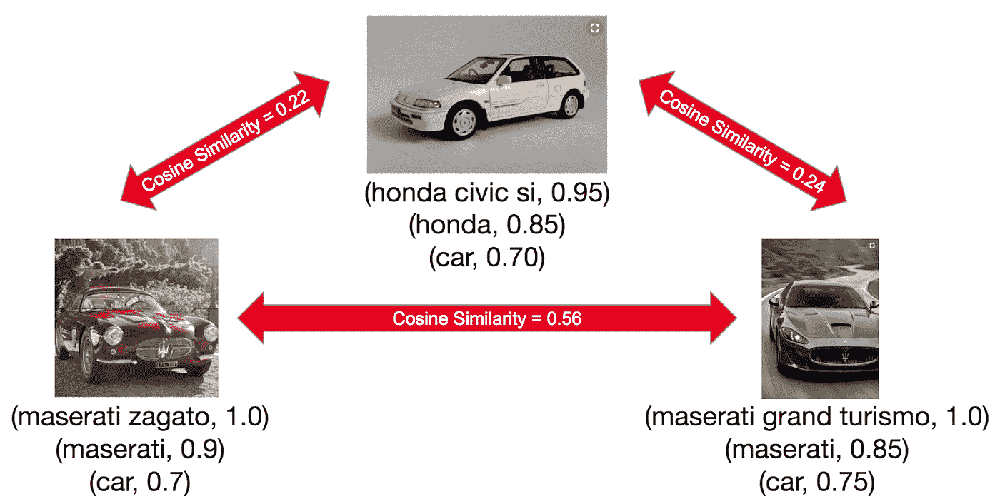

# 通过关键词提取了解 pin

> 原文：<https://medium.com/pinterest-engineering/understanding-pins-through-keyword-extraction-40cf94214c18?source=collection_archive---------2----------------------->

Heath Vinicombe |软件工程师，知识

Pinterest 以其视觉发现引擎而闻名，但我们的许多内容也伴随着文本。因此，能够理解文本对我们来说很重要，以确保我们向品酒师推荐相关的想法。在这篇博文中，我将谈论“注释”，这是我们在 Pinterest 理解文本的主要信号之一。

# 注释概述

注释是描述 Pin 主题的一至六个单词的简短关键字或短语。

除了文本内容之外，每个注释还有一个置信度得分和与之相关的语言。我们在总共 28 种语言中提取每个引脚的多个注释。

对于上面的 Pin 示例，我们可以提取以下注释:

*   (树懒避难所，0.99 英镑)
*   (恩，树懒，0.95)
*   (恩，哥斯达黎加，0.90)
*   (恩，加勒比，0.85)
*   (恩，动物，0.80)
*   (恩，旅行，0.80)

# 使用注释

注释是 Pinterest 各种产品表面使用的基本信号，通常作为机器学习模型中的功能。我们已经看到，通过向模型中添加新的基于注释的特性，实验度量得到了很大的提高，通常注释是最重要的特性之一。我们使用注释的例子包括:

*   广告中心预测
*   主页订阅源候选生成和排名
*   相关 pin 候选生成和排名
*   搜索检索和排名
*   董事会对新引脚的建议
*   检测不安全的内容

# 个案研究

## 搜索

注释存储在倒排索引中。当用户执行搜索时，注释用于检索带有与用户查询相匹配的注释的 pin。在倒排索引中存储注释而不是存储所有标记的优点是:

*   注释分数往往比仅 TF-IDF 更与相关性相关
*   仅存储注释比存储所有标记占用更少的空间，这在有超过 2000 亿个 pin 需要索引时非常重要

## 相关引脚

相关大头针是您在点击大头针后在“更像这样”下看到的推荐列表。注释用于生成相关销模型使用的一些特征。具体而言，可以将引脚的注释视为稀疏向量，其索引对应于注释 id，值对应于注释分数。两个图钉的注释向量之间的余弦相似性是两个图钉的相关性的良好度量。在下图中，这两款玛莎拉蒂与本田的相似度更高，这反映在余弦相似度得分上。

## 内容安全过滤器

Pinterest 努力对违反我们的[社区准则](https://policy.pinterest.com/en/community-guidelines)的内容进行分类，比如自残和色情。注释是内容安全过滤器用来检测不安全内容并防止我们的 Pinners 遇到它的信号之一。

# 系统概况

注释系统的主力是每周一次的[烫洗](https://github.com/twitter/scalding)批处理工作流程，用于计算所有引脚的注释。然而，这种批处理工作流的问题是，在为新的 pin 计算注释之前，可能会有多天的延迟。为了减轻这种情况，我们还提供了一个“即时注释器”服务，可以在新 pin 创建后的几秒钟内为其计算注释，并将注释存储在 HBase 中。如果还没有为 Pin 计算批量注释，注释消费者可以退回到这些即时注释。

下面是各种组件的概述，这些组件将在下面的章节中详细讨论。

# 注释词典

注释仅限于内部称为字典的有限词汇。这个字典和其他元数据一起存储在 MySQL 数据库中。UI 使查看字典术语、添加新术语、删除术语和查看更改日志变得容易。

使用这样的字典优于允许注释为任意语法的优点在于，它保证了注释将是有效且有用的短语，而不是拼写错误(例如，“recipies”)、停用词(例如，“The”)、片段(例如，“of liberty”)和通用短语(例如，“ideas”、“things”)。此外，字典是存储额外元数据(如翻译和知识图关系)的便利位置。这本字典被 Pinterest 的许多团队使用，而不仅仅是用于注释。

该词典最初由用户手动输入的热门话题开始，但它已经发展到包括额外的术语来源，如搜索查询、标签等。为了保证词典的质量，我们投入了大量的人力物力，并且我们定期使用启发式方法来删除不良术语，使用拼写检查器来消除拼写错误。每种语言的词典中大约有 10 万个术语。

# 候选提取

计算 p in 注释的第一步是从各种文本源中提取潜在候选项，例如:

*   Pin 标题、描述、url
*   电路板名称和描述
*   链接的页面标题和描述
*   经常导致点击 Pin 的搜索查询
*   使用视觉分类器在图像中检测到的对象的名称

以下步骤用于提取候选人:

1.  文本语言检测器确定文本的语言。
2.  根据语言使用分词器将文本分词。
3.  滑动窗口用于生成包含 1 到 6 个单词的所有 ngrams。
4.  ngrams 通过去掉重音和标点符号，然后根据语言进行词干化或词条化来规范化。
5.  Ngrams 与注释字典相匹配。
6.  提取的注释被规范化以减少重复(例如，“slots”被规范化为“slots ”,因为在一个管脚上具有这两个注释是没有用的)。规范映射存储在字典中。

# 特征

为每个注释候选提取特征，以便稍后用于评分。

销-注释特征:

*   TF-IDF
*   嵌入相似性 Pin 嵌入和注释嵌入之间的余弦相似性
*   来源-一些文本来源倾向于产生比其他来源更高质量的注释，并且从多个来源(例如，引脚标题和板标题)提取的注释倾向于比仅存在于单个来源(例如，仅板标题)的注释更好

注释功能:

*   综合资料的文件（intergrated Data File）
*   类别熵——跨多个类别流行的注释往往更普通，用处更小
*   搜索频率

我们发现，当我们归一化我们的特征时，我们的模型表现得更好，使得跨语言和 Pin 流行度(即，repins 的数量)的值分布是相似的。

# 模型

并非所有我们作为候选提取的注释都与 Pin 相关。例如，以下面的引脚描述为例:

哥斯达黎加的树懒保护区是世界上唯一的树懒保护区。点击阅读更多关于我的旅程+看到小树懒的照片！”

从该描述中，我们提取诸如“世界”、“旅程”和“阅读”的注释，这些注释与 Pin 不相关并且不是好的关键字。我们模型的目的是给注释打分，这样我们就可以过滤掉不相关的注释，只保留最有用的注释。

训练标签是通过众包获得的，在众包中，要求裁判为给定的(Pin、注释)对标注注释是否与 Pin 相关。每种语言大约使用 150，000 个标签。

最初，我们从预测注释与 Pin 相关的概率的逻辑回归模型开始。这产生了不错的结果，并且比以前版本的不使用模型的注释要好得多。后来，我们迁移到用 XGBoost 训练的 XGradient 增强决策树模型。由于我们可以移除所有单调的特征变换，并且不再需要估算缺失特征的值，因此切换到该模型后，我们的精度绝对提高了 4%,并且简化了我们的特征工程。

# 结论

可以从高质量的关键词中构建非常有用的信号，这些信号具有跨推荐、检索和排名的各种应用。Pinterest 已经通过采用这种信号获得了许多参与度和相关性。

鸣谢:感谢 Anant Subramanian、Arun Prasad、Attila Dobi、Heath Vinicombe、Jennifer Zhao、Miwa Takaki、Troy Ma 和 Guo 对本项目的贡献。