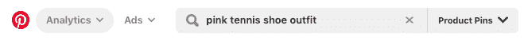
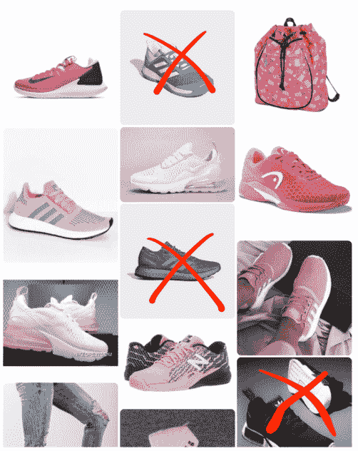
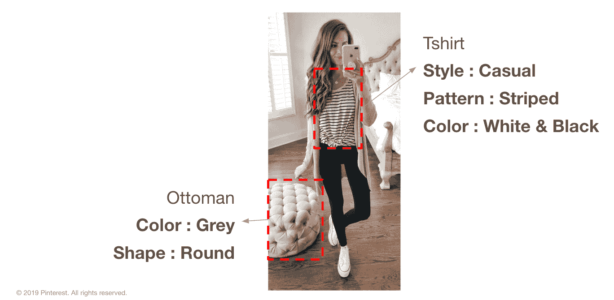
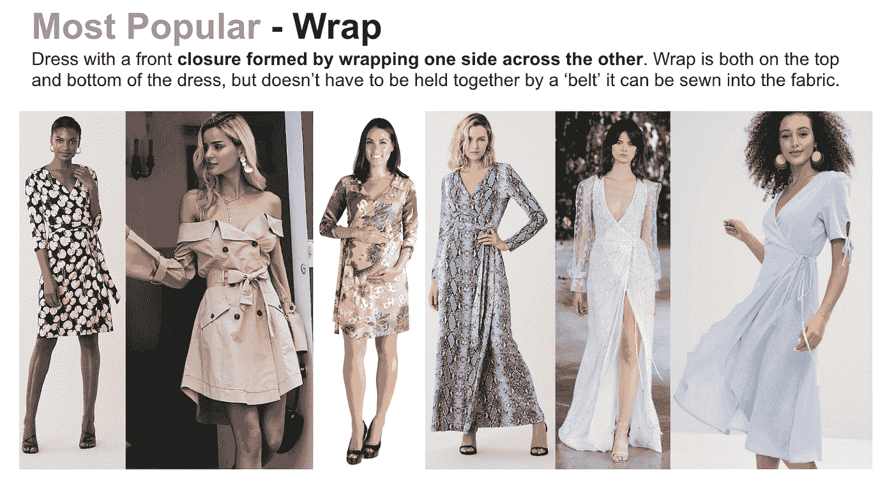
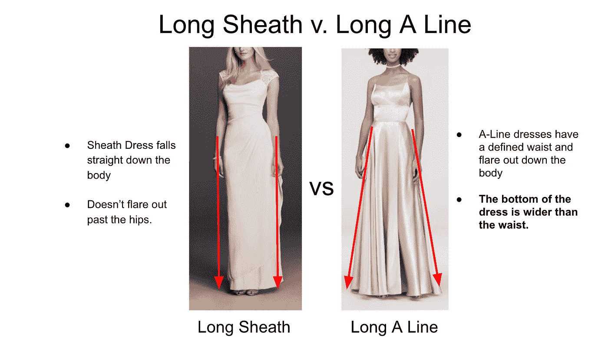
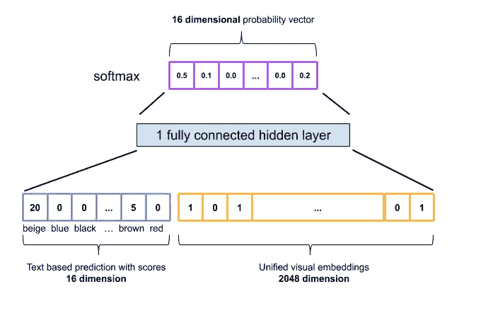
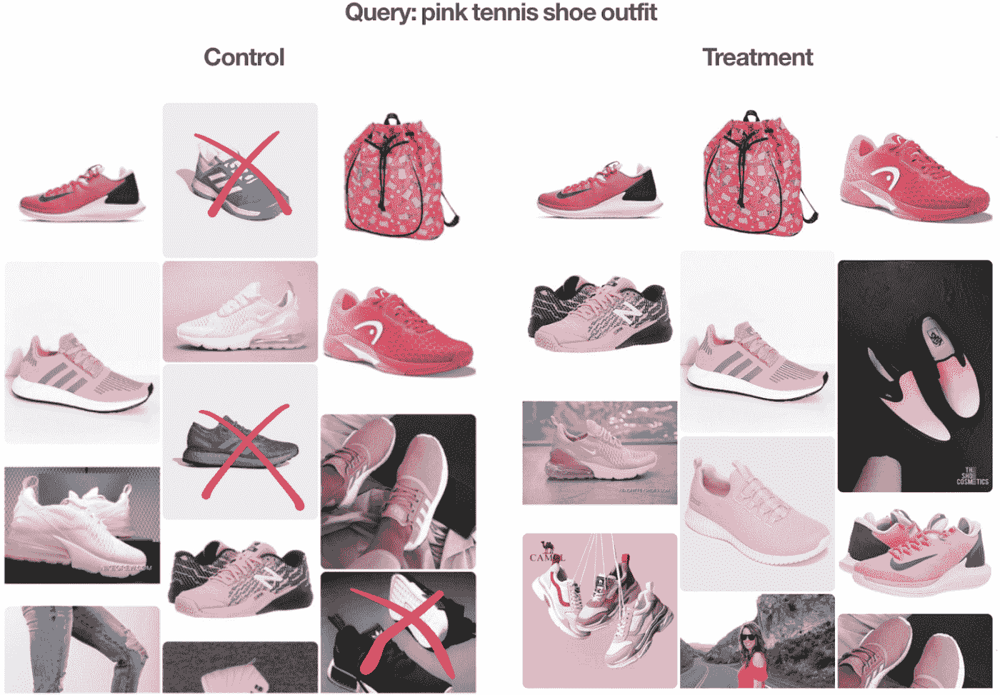
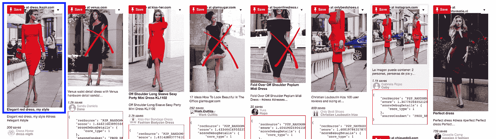
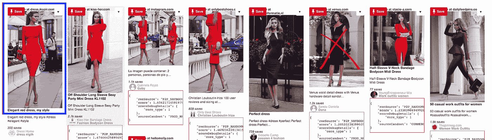

# 为购物者了解产品属性

> 原文：<https://medium.com/pinterest-engineering/understanding-product-attributes-for-shoppers-77268c746c87?source=collection_archive---------2----------------------->

Rui Li & Heath Vinicombe |工程师，内容知识

每天，人们都来 Pinterest 购物，在家居和时尚等类别中寻找创意，我们有责任向他们展示最相关、最鼓舞人心的产品。我们从几个不同的维度来衡量相关性，但最重要的是，我们需要向 Pinners 展示符合他们期望的结果。例如，当他们搜索凉鞋时，他们不想看到靴子。

我们已经通过 Pin 2 interest[概述了我们用正确的实体(凉鞋与靴子)对 pin](/pinterest-engineering/pin2interest-a-scalable-system-for-content-classification-41a586675ee7)进行分类的工作，这为符合我们丰富的兴趣分类的 pin 提供了高质量的级别。然而，我们了解到，也有购物者希望在搜索中帮助识别属性的情况(例如，她可能专门为她的舞会寻找一件“紫色帝国束腰连衣裙”)。如果我们能够通过理解每个引脚的特定属性来显示结果，我们甚至可以返回更相关的结果。

我们在时尚专家的帮助下建立了一个机器学习系统，这些专家开发了详细的时尚术语和描述指南。该系统提高了结果的准确性，并提供了更好的建议。

如果不采用属性工作，那么属性关键字与任何其他关键字没有什么不同，这使得结果有噪声。例如，在产品图钉中搜索“**粉色网球鞋套装**，会返回一些根本不是粉色的结果。

最终，这里的目标是在实体+属性级别上理解我们的 pin:

# 我们怎么做呢？

在第一阶段，我们专注于**的七个客观时尚属性，并将其应用于女性时尚的相关类别，**我们的顶级垂直产品之一:

*   颜色
*   品牌
*   模式
*   纹理
*   构造
*   够做一条连衣裙的布料
*   服饰风格

**我们已经为这七个属性分别发布了以下内容:**

*   属性值
*   标签指南和高质量的人工标签数据
*   一个名为 **Pin2Attribute** 的管脚级分类器为每个管脚标记属性

## 定义属性值:

我们与时尚专家合作来定义每个属性的属性值。他们定义了从库存角度和购物者角度都有用的属性。这些值以精细的粒度定义，例如“图案”属性的“几何”和“水彩”。平均而言，我们为每个属性(不包括品牌)定义了 15-30 个值，这使我们能够在需要时更好地理解属性。

## 高质量的标记数据收集:

像许多其他公司一样，我们广泛使用众包进行跨团队的标记数据收集。众包很适合简单的任务，例如，“*这张图片与这个查询相关吗？*”，但我们需要额外的人力投入来开发最佳结果。由于缺乏贴标员的领域知识，我们无法从众包中获得我们需要的高质量标签，因此我们与时尚专家合作来解决如此复杂的贴标任务。

为了给贴标签者提供足够的相关信息，时尚专家提供了详细的标签指南，包括文本定义和示例图像，以及更多用于混淆案例的上下文。

下面是一个典型的定义页面(针对属性**【着装风格】**):

这里有一页解释了**【鞘】**和**【一线】**的区别:

这份详细的标签指南使我们能够获得高质量的标签数据，从而使符合率达到 95%以上，标签准确率达到 95%以上。

## pin 2 属性分类器

使用名为 [annotations](/pinterest-engineering/understanding-pins-through-keyword-extraction-40cf94214c18) 的 Pin 级关键字提取系统，我们为 Pin2Attribute 分类器构建了一个原型。我们从注释结果和文本匹配开始。这个想法非常简单:如果注释包含一个关键字，它是已定义的属性值之一，例如*“red”*，我们用这个属性来标记这个管脚: *Color = red。*我们还使用了一个简单的启发式评分函数，该函数根据文本来源进行调整。

基于文本的解决方案在关键属性上产生了不错的性能，例如 **70%** 的“颜色”精度。然而，这种解决方案有一个主要问题:覆盖率低。基于文本的颜色分类器的覆盖范围仅为 **50%** ，因此如果 Pin 不包含任何属性关键字，则根本不会提取任何属性。

我们在图像理解方面投入了多年的工作，因此我们能够利用由我们的视觉搜索团队构建的[统一视觉嵌入](/pinterest-engineering/unifying-visual-embeddings-for-visual-search-at-pinterest-74ea7ea103f0)，并基于它构建一个文本+视觉融合的分类器。在这个阶段，它是一个简单的浅层模型。输入是基于文本的预测的分类特征(“颜色”的 16 个维度)和统一视觉嵌入(2048 个维度)的串联。然后是一个完全连接的隐藏层和一个输出 softmax 层，它输出每个属性值的概率(16 维“颜色”):

这个简单的浅层神经网络产生了 **100%** 的覆盖率，解决了我们的覆盖率问题。此外，它还将精度提高到了**的 79%。**我们已经将视觉分类器产品化，并且正在将图案、纹理等产品化。

以下是一个引脚的**引脚 2 属性**结果示例(分数未标准化):

# 结果

## 产品搜索

如果我们看看我们在这篇博客开始时展示的例子，25%的搜索结果在颜色方面是不相关的。在将颜色相似性和品牌相似性应用到搜索排名模型中之后，我们看到了产品相关性的提高。

下图显示了对照组(左侧)和治疗组(右侧)。您可以看到，在治疗组中，100%的大头针都是粉红色的，显示了颜色属性的贡献。使用颜色和品牌的整体相关性提高了 1.4%。通过比较给定查询集的控制和治疗搜索结果的离线人工评估来测量相关性。

## 相关产品

购物发现的另一个主要方面是通过相关产品，这些产品是出现在所选主题 Pin 下方的推荐。七个属性的采用提高了参与度，包括总体印象提高了 **1%** ，repins 提高了 **2.7%** ，总体产品 Pin 印象提高了 **0.7%** ，repins 提高了 **1.4%。**

下面是一个定性的例子:

顶行引脚是“控制”组，最左边的引脚是主题引脚，旁边的引脚是相关产品引脚。这里我们可以看到，以一件*红色连衣裙*为主题，三件“相关产品”不是红色的。然而，在采用了七个属性之后，只有一个“相关产品”不是红色的。这是由于 pin 2 属性分类器缺乏 100%的精度造成的，这表明我们还有改进的空间。

**控制:**

**治疗:**

# 下一步是什么？

虽然 Pinterest 在探索诸如*、【舞会礼服】、【工作装】、*、*、*之类的想法方面很棒，但我们正在努力让搜索结果变得更加具体。使用诸如场合、季节和风格等属性，这将超越之前的七个属性，这是可行的。

在第二阶段，我们将测试这些主观属性。对于 pin 2 属性分类，我们将使用不同于基于文本+视觉的分类器的方法。敬请关注。

# 摘要

在这篇博客中，我们展示了 Pinterest 如何在早期阶段解决产品的属性理解问题。我们已经证明，通过使用简单的文本+视觉分类器理解时尚产品的七个客观属性，而无需大量的模型调整，我们可以提高产品搜索和相关产品的相关性。

这给了我们信心，让我们将注意力转向:

*   启用更多主观属性
*   扩展到新的垂直领域，如家居装饰和食品饮料。

# 感谢

非常感谢所有为此项目做出贡献的人:我们的 EM 郭；我们的总理安吉拉·郭、美和·高木和莫哈克·那赫塔；我们的工程师鲁本·希波什、阿维纳什·纳亚克、莫纳希卡·夏尔马、奥拉维尔·古德蒙德松、顾能、埃里克·金、雷蒙萧、艾琳·李、保罗·巴尔蒂斯库、、埃马德·艾哈迈德·曼祖尔(实习生)、毛含子(实习生)、米卡拉·蒂姆(实习生)；我们的时尚专家和标签团队:Mariellen Barros，Serena Perfetto，Lauren 古德诺，Marta Scotto 和 Jade Feltwell。还要特别感谢、Tim Weingarten、Jeff Harris、Chuck Rosenberg、Kunlong Gu、Troy Ma、Edmarc Hedrick、Stephanie Rogers、Lulu Cheng、Helene Labriet-Gross 和 Kate Taylor 的支持和帮助。

> 我们正在建造世界上第一个视觉发现引擎。全世界有超过 3 亿人使用 Pinterest 来梦想、计划和准备他们在生活中想做的事情。[来加入我们吧！](https://careers.pinterest.com/careers)