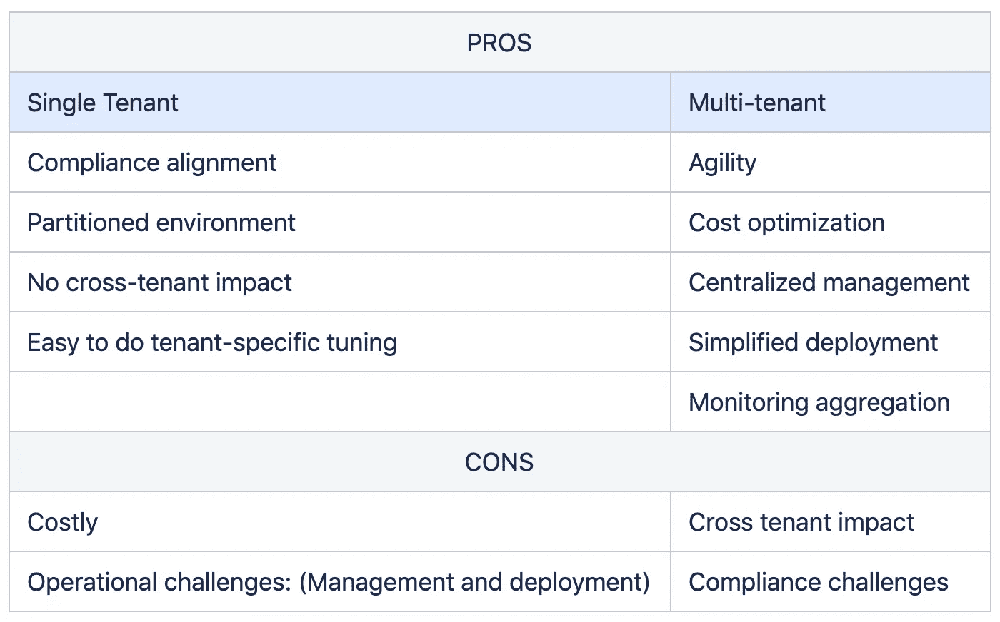

# 彻底了解 SaaS

> 原文：<https://medium.com/walmartglobaltech/understanding-saas-from-ground-up-120bf68915d0?source=collection_archive---------4----------------------->

# **简介**

云计算意味着通过互联网而不是你的电脑硬盘来存储和访问数据和程序。

美国国家标准与技术研究所(NIST)的权威定义称:

*云计算是一种支持对可配置计算资源(例如，网络、服务器、存储、应用程序和服务)的共享池进行无处不在、方便、按需的网络访问的模式，可通过最少的管理工作或服务提供商交互来快速供应和发布这些资源。*

云计算可以分为-

1.  IaaS:云提供商以按使用付费的方式提供存储和计算服务。
2.  PaaS:提供专门面向开发人员的服务和工作流集，开发人员可以使用共享工具、流程和 API 来加速应用程序的开发、测试和部署。
3.  SaaS:通过浏览器在互联网上提供应用程序

# 什么是 SaaS

软件即服务(SaaS)应用程序通过互联网提供软件即服务，消除了在客户自己的计算机上安装和运行应用程序的需要，并最大限度地减少了运营开销。它使开发人员能够以低成本和更快的上市时间构建可扩展的解决方案。

B2B SaaS 公司开发、托管和维护 SaaS 服务并提供支持，以降低其运营成本。这是下一代产品开发/使用。当 IT 专业人员购买 SaaS 应用程序时，他们认为以下标准最为重要

# SaaS 的好处

*   SAAS 软件可以从世界上任何有互联网的地方访问。
*   没有本地服务器安装或维护。
*   订阅通常是“按使用量付费”，因此比传统软件便宜。
*   成本效率
*   客户准备好使用软件，没有任何运营开销。
*   [44%](https://greenice.net/goto/https:/financesonline.com/saas-statistics/) 的 SaaS 厂商提供免费试用。

# SaaS 的劣势

*   安全问题:公司 PHI/安全数据由第三方保存和访问。
*   有时功能发布会延迟。
*   失去了对应用程序的控制。

# SaaS 市场的事实

*   从 2019 年到 2023 年，全球 SaaS 市场预计价值 603.6 亿美元，4 年内的 CAGR 为 9%。( [Technavio](https://www.technavio.com/report/software-as-a-service-saas-market-industry-analysis) )
*   2015 年至 2017 年，企业使用的 SaaS 应用平均数量增长了两倍，从 8 个增加到 16 个。( [BetterCloud](https://www.bettercloud.com/monitor/wp-content/uploads/sites/3/2017/05/2017stateofthesaaspoweredworkplace-report-1.pdf) )
*   2018 年，全球 SaaS 工作量增长至 2.06 亿，预计到 2021 年将达到 3.8 亿。([Statista/思科](https://www.statista.com/statistics/633873/worldwide-cloud-workloads-by-service-type-installed/))。
*   18%—SaaS 市场的预测复合年增长率。([市场和市场](https://www.reportlinker.com/p05749258/Cloud-Computing-Market-by-Service-Deployment-Model-Organization-Size-Workload-Vertical-And-Region-Global-Forecast-to.html)
*   零售和消费品的增长率最高。([市场与市场](https://www.reportlinker.com/p05749258/Cloud-Computing-Market-by-Service-Deployment-Model-Organization-Size-Workload-Vertical-And-Region-Global-Forecast-to.html))。
*   38%的公司说他们几乎完全在 SaaS 上运行。
*   *73%的企业计划到 2020 年将他们所有的系统都 SaaS 化。*
*   *截至 2020 年 1 月中旬，Salesforce 是美国市值最大的 SaaS 提供商*

# *SaaS 的主要特点和能力*

# *租用*

*租赁可以分为单租户、混合租户和多租户模式，每种模式都有自己的优缺点。*

**

*   ***单租户 SaaS** 是一种架构，每个团队都有专用的服务器和支持基础设施。*
*   ***混合**是单租户和多租户模式的结合。*
*   *多租户 SaaS 是一种业务结构，其中许多组织共享相同的软件来保存和存储数据。*

## *单租户与多租户模式的利弊*

**

# *元数据/配置驱动*

*一个好的 SaaS 解决方案应该是多租户高效的。使用每个租户的元数据可以实现多租户。可以为每个特定组件定义元数据。它定义了运行时应用程序数据、应用程序的基本功能以及特定于租户的数据和定制(如果有)。*

# *弹性*

*多租户 SaaS 解决方案可在不同租户之间共享。可扩展的 SaaS 架构还应该具有全无状态微服务的组件。每个组件都可以独立扩展。应用程序应该根据需要进行扩展/缩小。*

# *参考架构*

*任何 SaaS 解决方案的关键能力是基础设施、表示、安全性、应用和操作*

**

***表现**:主要关注表现层*

*   *用户控件*
*   *显示和渲染*
*   *报告*

***安全性**:安全性是 SaaS 解决方案的主要功能。该专业的应用构建考虑因素有:*

*   *身份和联盟*
*   *身份验证和单点登录*
*   *授权和基于角色的访问控制*
*   *政策*
*   *加密*

***应用视图**:主要关注构建应用。该专业的应用构建考虑因素有:*

*   *将业务需求分解为微服务。*
*   *多个微服务的隔离。*
*   *系统的身份管理*
*   *租户隔离*
*   *应用程序的部署*

***基础设施视图:**它包括在网络上存储和移动数据。*

*   *数据库ˌ资料库*
*   *计算*
*   *储存；储备*

***运营观点:**顾名思义，这是 SaaS 最重要的方面。它有助于保持客户的信任，并增加业务。主要包括*

*   *容错和可用性*
*   *监控和维护*
*   *租户入职*
*   *分析学*
*   *计费和层级管理*
*   *备份和恢复*

# *SaaS 应用程序的最佳实践*

*   ***自助服务**:应用应该是自助服务，没有工程开销。*
*   ***个性化**:消费者可以根据需要改变外观。*
*   ***多租户**:一个软件应用的单个实例是为了服务多个客户。多租户架构方法对应用程序提供商和用户都有好处。为多个企业运行一个应用程序实例会为提供商和租户带来巨大的成本效益。*
*   ***集成** : SaaS 应用程序应该很容易与其他应用程序集成。*
*   ***运行性能***
*   *安全与合规:保障数据安全至关重要。每个租户的机密数据应该是安全和隔离的。*
*   ***监控**:应该仔细监控应用程序的停机时间以及性能问题，因为缓慢的性能会导致糟糕的用户体验。开发人员需要部署监控工具和流程，以确保应用程序的高可用性。*

# *从哪里开始*

**

*   *市场调查，找出客户正在寻找的功能*
*   *创建功能和技术规格文档。*
*   *区分功能的优先级。*
*   *创造一个以客户为中心的用户故事，而不是以开发者为中心。*
*   *开发 UX 设计和线框。*
*   *开始 BE 代码的头脑风暴会议。*
*   *启动代码和测试套件。*
*   *用最少的功能启动 MVP。*
*   *测试，测试，测试*
*   *定期听取顾客的反馈。如果你的解决方案不能解决你的观众面临的主要挑战，那么它就是无用的*
*   *对任何新功能版本重复该过程*

# *沃尔玛 SaaS 模式*

*目前，沃尔玛电子商务为其 walmart.com、Jet.com、ASDA、SAMS 等子公司提供 SaaS 服务，并遵循单一/混合租赁模式。我们为多个租户提供单一代码库，所有功能都是元数据驱动的，这将有助于我们轻松迁移到多种方法。所有的微服务都是相互隔离的，并根据用例进行异步和同步通信。虽然单一租赁不是非常经济高效，但可以确保在每个租户的基础上解决运营限制。*

# *结论*

*企业可以利用 SaaS 来节省运营成本。精心设计和构建的 SaaS 应用程序可以为提供商和消费者提供双赢的解决方案。*