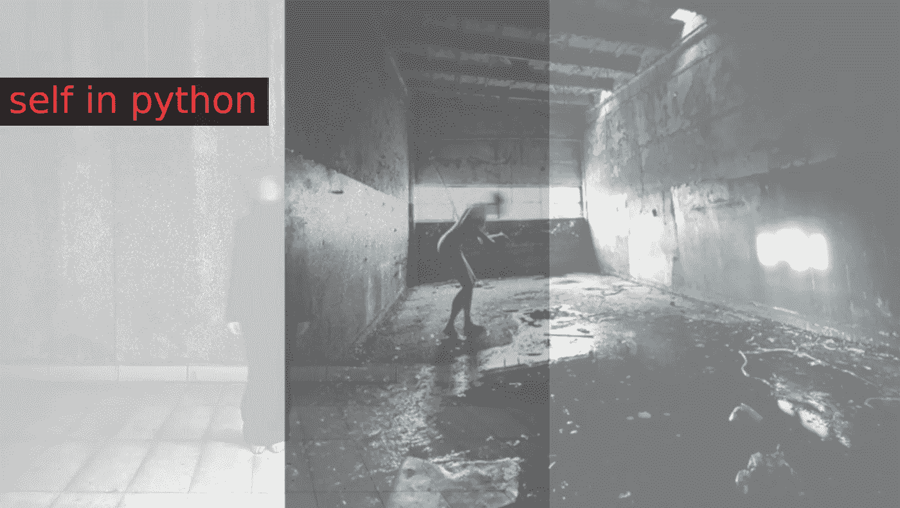

# 理解 Python 中的自我

> 原文：<https://medium.com/quick-code/understanding-self-in-python-a3704319e5f0?source=collection_archive---------0----------------------->

python self — intuition

一旦开始使用 Python，就无法逃避这个词“ *self* ”。它出现在方法定义和变量初始化中。但是要得到背后的想法似乎有些麻烦。希望在这篇文章结束时，你会对什么是“*自我*”以及你应该在哪里使用它有一个直观的想法。

但是在谈论 self 关键字(它实际上不是 python 关键字或任何特殊文字)之前…