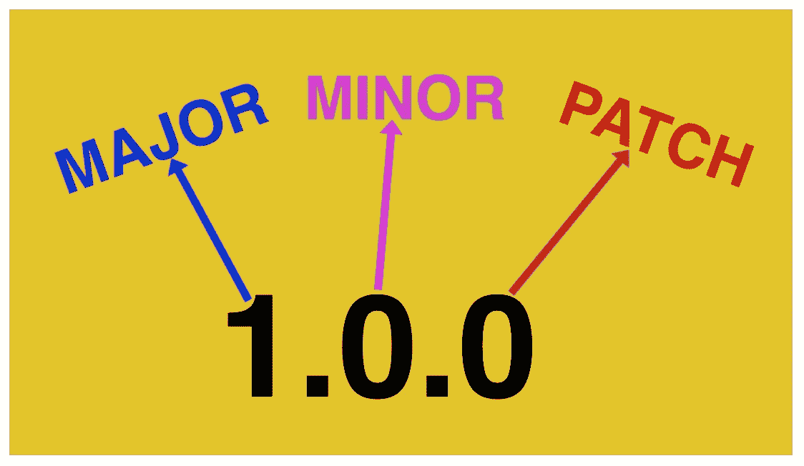

# 理解语义版本规范

> 原文：<https://medium.com/bb-tutorials-and-thoughts/understanding-semantic-versioning-spec-635b87397eec?source=collection_archive---------4----------------------->

## 带示例的初学者指南

在软件管理中，我们经常改变我们的代码，所有这些改变都需要被跟踪。随着我们项目的增长，所有项目的依赖性也在增加。如果您想对项目进行更改并继续前进，您需要确保所有的依赖项也能与您当前的更改一起工作。我们不能…