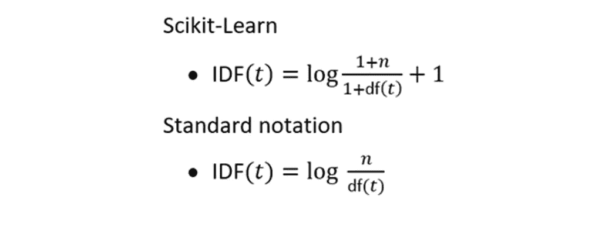
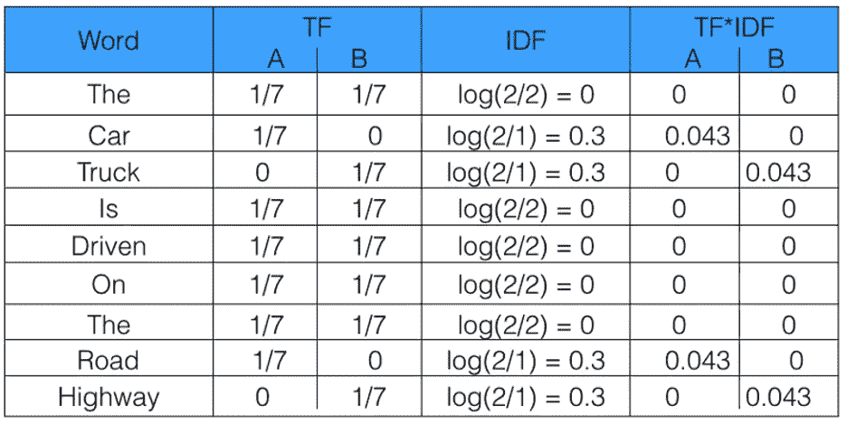

# 了解用于机器学习的 TF-IDF | Capital One

> 原文：<https://medium.com/capital-one-tech/understanding-tf-idf-for-machine-learning-capital-one-dea9ab4a586d?source=collection_archive---------6----------------------->

## 词频简介——逆文档频率

TF-IDF 代表*术语频率-逆文档频率*，它是一种在[信息检索(IR)](https://en.wikipedia.org/wiki/Information_retrieval) 和机器学习领域中使用的度量，可以量化文档集合(也称为语料库)中的文档中的字符串表示(单词、短语、词条等)的重要性或相关性。

# TF-IDF 概述

TF-IDF 可以分解为两部分 *TF(词频)*和 *IDF(逆文档频)。*

## 什么是 TF(词频)？

术语频率通过查看您所关注的特定术语*相对于文档的频率来工作。定义频率有多种方法:*

*   单词在文档中出现的次数(原始计数)。
*   根据文档长度调整的术语频率(原始出现次数除以文档中的字数)。
*   [对数标度](https://en.wikipedia.org/wiki/Logarithmic_scale)频率(如 log(1 +原始计数))。
*   [布尔频率](https://en.wikipedia.org/wiki/Boolean)(例如，在文档中，如果该术语出现，则为 1；如果该术语没有出现，则为 0)。

## 什么是 IDF(逆文档频率)？

逆文档频率查看一个单词在语料库中的常见(或不常见)程度。IDF 的计算如下，其中 ***t*** 是我们要衡量其共性的术语(单词)，而 ***N*** 是语料库(D)中文档的数量(D)。分母只是术语 ***t*** 出现的文档数。

Image Source: [https://monkeylearn.com/blog/what-is-tf-idf/](https://monkeylearn.com/blog/what-is-tf-idf/)

*注意:一个术语可能根本没有出现在语料库中，这可能导致被零除的错误。处理这种情况的一种方法是将现有计数加 1。从而使分母(1 +计数)。下面是一个流行库*[*scikit-learn*](https://scikit-learn.org/stable/modules/generated/sklearn.feature_extraction.text.TfidfTransformer.html)*如何处理这个问题的例子。*

*Image Source:* [*https://towardsdatascience.com/how-sklearns-tf-idf-is-different-from-the-standard-tf-idf-275fa582e73d*](https://towardsdatascience.com/how-sklearns-tf-idf-is-different-from-the-standard-tf-idf-275fa582e73d)

我们需要 IDF 的原因是帮助纠正诸如“of”、“as”、“The”等词语。因为它们经常出现在英语语料库中。因此，通过取逆文档频率，我们可以最小化频繁项的权重，同时使不频繁项具有更高的影响。

最后，IDF 也可以从背景语料库(用于校正采样偏差)或手头实验中使用的数据集提取。

## 综合起来:TF-IDF

总而言之，推动 TF-IDF 的关键直觉是，术语的重要性与其在文档中的出现频率成反比。TF 为我们提供了一个术语在文档中出现的频率信息，而 IDF 则为我们提供了一个术语在文档集合中相对罕见的信息。通过将这些值相乘，我们可以得到最终的 TF-IDF 值。

*Image Source:* [*https://monkeylearn.com/blog/what-is-tf-idf/*](https://monkeylearn.com/blog/what-is-tf-idf/)

TF-IDF 得分越高，术语就越重要或相关；随着一个术语变得越来越不相关，它的 TF-IDF 分数将接近 0。

# 在哪里使用 TF-IDF

正如我们所看到的，TF-IDF 是确定一个术语在文档中的重要性的一个非常方便的指标。但是 TF-IDF 是怎么用的呢？TF-IDF 主要有三种应用。这些是在*机器学习，信息检索，*和*文本摘要/关键词提取。*

## 在机器学习和自然语言处理中使用 TF-IDF

机器学习算法经常使用数字数据，因此当处理文本数据或任何[自然语言处理(NLP)](https://en.wikipedia.org/wiki/Natural_language_processing) 任务(ML/AI 处理文本的子领域)时，首先需要通过称为[矢量化](https://towardsdatascience.com/understanding-nlp-word-embeddings-text-vectorization-1a23744f7223)的过程将数据转换为数字数据的矢量。TF-IDF 矢量化包括计算语料库中与该文档相关的每个单词的 TF-IDF 得分，然后将该信息放入一个向量中(参见下图中的示例文档“A”和“B”)。因此，您的语料库中的每个文档都有自己的向量，并且该向量对整个文档集合中的每个单词都有一个 TF-IDF 得分。一旦有了这些向量，您就可以将它们应用于各种用例，例如通过使用[余弦相似度](https://en.wikipedia.org/wiki/Cosine_similarity)比较两个文档的 TF-IDF 向量来查看它们是否相似。

*A = “The car is driven on the road”; B = “The truck is driven on the highway” Image from freeCodeCamp — How to process textual data using TF-IDF in Python (https://www.freecodecamp.org/news/how-to-process-textual-data-using-tf-idf-in-python-cd2bbc0a94a3/)*

## TF-IDF 在信息检索中的应用

TF-IDF 在信息检索领域也有用例，一个常见的例子是搜索引擎。由于 TF-IDF 可以告诉您基于文档的术语的相关重要性，搜索引擎可以使用 TF-IDF 来帮助基于相关性对搜索结果进行排序，与用户更相关的结果具有更高的 TF-IDF 分数。

## TF-IDF 在文本摘要和关键词提取中的应用

因为 TF-IDF 基于相关性对单词进行加权，所以可以使用这种技术来确定具有最高相关性的单词是最重要的。这可以用来帮助更有效地总结文章，或者简单地确定文档的关键字(甚至标签)。

# 向量和单词嵌入:TF-IDF vs Word2Vec vs 单词包 vs BERT

如上所述，TF-IDF 可以用来将文本矢量化成更适合 ML & NLP 技术的格式。然而，虽然它是一种流行的 NLP 算法，但它不是唯一的一种。

## 一袋单词

[Bag of Words (BoW)](https://en.wikipedia.org/wiki/Bag-of-words_model) 简单统计文档中的词频。因此，文档的向量具有该文档的语料库中每个单词的频率。单词袋和 TF-IDF 之间的关键区别在于前者不包含任何类型的逆文档频率(IDF ),而只是一个频率计数(TF)。

## Word2Vec

[Word2Vec](https://en.wikipedia.org/wiki/Word2vec) 是一种算法，它使用浅层 2 层而非深层神经网络来摄取语料库并产生向量集。TF-IDF 和 word2vec 之间的一些关键区别在于，TF-IDF 是一种统计度量，我们可以将其应用于文档中的术语，然后使用它来形成向量，而 word2vec 将为术语生成向量，然后可能需要做更多的工作来将向量集转换为单一向量或其他格式。此外，TF-IDF 不考虑语料库中单词的上下文，而 word2vec 则考虑。

## BERT —变压器的双向编码器表示

[BERT](https://en.wikipedia.org/wiki/BERT_(language_model)) 是谷歌开发的一种 ML/NLP 技术，它使用基于 ML 模型的[转换器将短语、单词等转换成向量。TF-IDF 和 BERT 之间的主要区别如下:TF-IDF 不考虑单词的语义或上下文，而 BERT 考虑。此外，BERT 使用深度神经网络作为其架构的一部分，这意味着它的计算成本可能比没有此类要求的 TF-IDF 高得多。](https://en.wikipedia.org/wiki/Transformer_(machine_learning_model))

# 使用 TF-IDF 的利弊

## 使用 TF-IDF 的优点

TF-IDF 最大的优势来自于它有多简单好用。它计算简单，计算成本低，并且是相似性计算的简单起点(通过 TF-IDF 矢量化+余弦相似性)。

## 使用 TF-IDF 的缺点

需要注意的是，TF-IDF 不能帮助传递语义。它根据单词的权重来考虑单词的重要性，但它不一定能推导出单词的上下文并以这种方式理解重要性。

同样如上所述，像 BoW 一样，TF-IDF 忽略词序，因此像“英国女王”这样的复合名词不会被视为“单一单位”。这也延伸到否定的情况，比如“不付账”和“付账”，顺序有很大的不同。在使用 NER 工具和下划线的两种情况下，“queen_of_england”或“not_pay”都是将短语作为一个单位处理的方法。

另一个缺点是，由于 TF-IDF 会遭受维数灾难，所以它会遭受内存低效。回想一下，TF-IDF 向量的长度等于词汇表的大小。在某些分类环境中，这可能不是问题，但在其他环境中，如聚类，随着文档数量的增加，这可能会变得难以处理。因此，研究上面提到的一些替代方法(BERT，Word2Vec)可能是必要的。

# 结论

TF-IDF(Term Frequency-Inverse Document Frequency)是一种简便的算法，它使用单词的频率来确定这些单词与给定文档的相关程度。这是一种相对简单但直观的单词加权方法，允许它作为各种任务的一个很好的出发点。这包括构建搜索引擎、总结文档或信息检索和机器学习领域的其他任务。

*披露声明:2021 资本一。观点是作者个人的观点。除非本帖中另有说明，否则 Capital One 不隶属于所提及的任何公司，也不被这些公司认可。使用或展示的所有商标和其他知识产权是其各自所有者的财产。*

*最初发表于*[T5【https://www.capitalone.com】](https://www.capitalone.com/tech/machine-learning/understanding-tf-idf/)*。*