# 高级加密标准指南

> 原文：<https://medium.com/quick-code/understanding-the-advanced-encryption-standard-7d7884277e7?source=collection_archive---------1----------------------->

AES 演练:它是什么以及如何工作。

Photo by [Kristina Flour](https://unsplash.com/@tinaflour?utm_source=medium&utm_medium=referral) on [Unsplash](https://unsplash.com?utm_source=medium&utm_medium=referral)

或简称为 AES，是当今最常用的加密算法，因为它仍未被破坏。在本文中，我们将介绍 AES:它是什么以及它是如何工作的。

# 编码不是加密

如果您不熟悉这个术语，加密可以定义为将信息或数据转换为代码以隐藏其原始内容的过程。因此，解密就是将这种加密代码转换回原始状态的过程。为了将其视为加密而非编码，需要一个**密钥**。

让我们用锁来打个比方。如果你只是关闭锁，而没有用 T2 钥匙 T3 锁住，它看起来像是被锁住了，但实际上任何人都可以打开它。为了确保锁的安全，你必须用你的**钥匙**锁住它，所以没有你用来锁住它的**钥匙**它是打不开的。就像关上锁一样，编码信息给人一种被加密的感觉，但实际上任何人都可以将其转换回原始状态。对于加密来说，情况并非如此。

# 破解 AES

AES 是对称密码，这意味着，就像我们以前的锁一样，用于加密数据的相同密钥是解密数据所必需的。我们之前提到过 AES 保持不变，但这是什么意思呢？这意味着，在不知道密钥的情况下，还没有找到比通过**暴力破解其密钥更快的解密 AES 加密数据的方法:**检查所有可能的密钥，直到找到用于加密的密钥。

回到我们的类比，这就好比有一个装满钥匙的包，一个一个地检查它是否打开了锁。但是在 AES 中找到正确的密钥要稍微微妙一些。如果你用不同于加密所用的密钥解密一条加密的消息，结果将是一组随机的字符，和加密的消息一样有意义:没有。

我们知道一把锁的钥匙可能是什么样子，但是 AES 钥匙是什么样子的呢？

AES 密钥是一串位(1 和 0)，有三种不同的大小:128、192 或 256 位。所以，要想暴力破解 AES，你可能要在找到正确的密钥之前，遍历⁵⁶不同的密钥。为了以更人性化的方式设置密钥，它们可以用 Unicode 字符(字母、数字和一些符号)建立，每个字符占用 8 位。密钥越长，加密过程就越强，因此您应该始终使用 256 位密钥。

# 操作模式

AES 是一种分组密码:它将接收 128 位文本，这些文本将被转换以获得不同的 128 位加密数据。但是 128 位或 16 个字符很可能不足以容纳我们希望加密的所有数据，那么 AES 如何加密充满文本的整个文档呢？

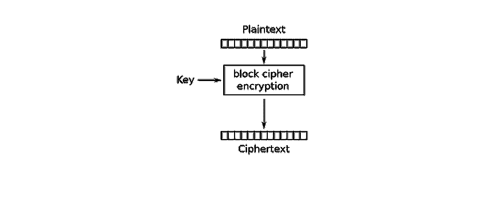

分而治之，AES 将您希望加密的数据分割成 128 位大小的块，然后对它们进行加密。如果输入数据不是 128 的倍数，我们必须延长消息的长度。这个过程被称为**填充**，最简单的形式是在消息的末尾加上 0，直到它是 128 位的倍数。

我们希望如何以及以什么样的顺序加密和进一步显示我们的数据块属于**操作模式**的范畴。操作模式并不是 AES 所独有的，事实上，本文所涉及的操作模式几乎可以应用于任何其他分组密码。

## 英国板球理事会

最简单的一个， **ECB** ，自己加密每个块，并一个接一个地显示加密后的块。

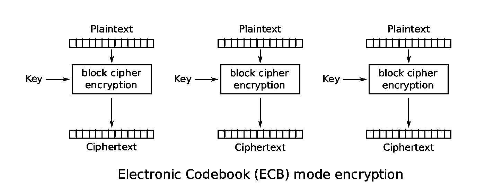

但是欧洲央行也有弱点，因为它不能恰当地隐藏重复的信息。为了演示这一点，让我们来看看 Linux 的 penguin 在 **ECB** 模式下的加密结果:

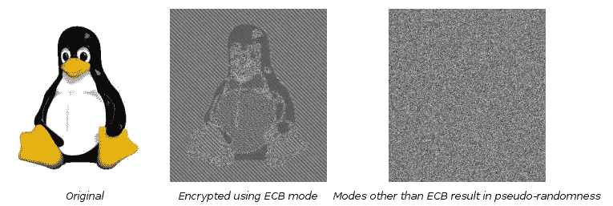

尽管丢失了一些信息，加密后的图像仍然可以辨认，而且看起来也不是随机的。为此，您应该避免使用 **ECB** 模式，而是使用更复杂的模式，例如 **CBC** 。

## 加拿大广播公司

**CBC** 输入 AES 密码，即当前纯文本块和先前加密块之间异或运算的结果。对于第一个明文块，由于没有先前的加密块，所以需要一个**初始化向量**来执行 xor 运算。这个 **IV** 将与我们的块具有相同的大小，128 位或 16 个字符。

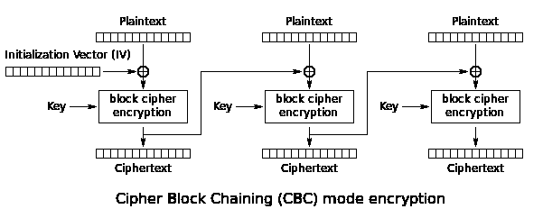

每次加密时生成一个新的 **IV** 被认为是一个很好的做法，这样可以使输出更加随机。但是为了在 **CBC** 模式下解密，我们现在还必须将 **IV** 用于加密，因此它应该放在加密块之前，并且成为加密输出的一部分。使用这种方法，当我们想要解密时，我们知道我们加密消息的第一块是 IV。

虽然还有多种加密模式，但 **ECB** 和 **CBC** 是最具启发性的，因为它们表明选择正确的操作模式与选择加密算法同样重要。其他流行的操作模式有 **OFB** 、 **CTR** 或 **CFB。这篇文章不会涉及到它们，但是如果你感到好奇的话，可以随意了解它们。**

# 加密

到目前为止，我们已经介绍了 AES 如何通过将大量输入分成 128 位的块来加密它们，但是我们还没有介绍数据实际上是如何加密的:当 AES 加密数据时，它内部发生了什么。

您可能还记得，我们之前提到过，AES 可以有三种大小的密钥，即 128、192、256 位，密钥越长，加密越强。为了理解这一点，我们必须知道，当 AES 加密时，如果在一定数量的轮次中应用相同的算法加密算法，则每轮次使用不同的子密钥，该子密钥是在称为**密钥扩展**的过程中从我们的初始密钥生成的。我们的密钥越长，AES 能够生成的子密钥就越多，因此可以对加密算法执行更多轮次，从而实现更强的加密。

该算法由 4 个操作组成:**字节 Sub、移位行、混合列**和**添加轮密钥**。对于视觉表示，我们的 128 位输入文本块将被表示在一个 4×4 矩阵上，每个位置表示来自我们的输入块的 8 位。

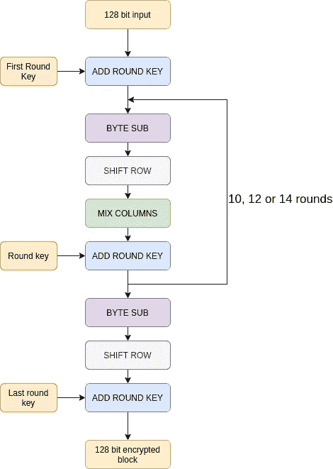

## 字节 Sub

顾名思义，Byte Sub 将每个 8 位单元替换为另外 8 位。什么 8 位？这 8 位将从预定义的查找表中选择，在整个循环中保持不变。又是怎么做到的？每个单元的前四位将决定行，后四位决定列，这是查找表的位置，在该位置我们可以找到将替换该单元的 8 位。

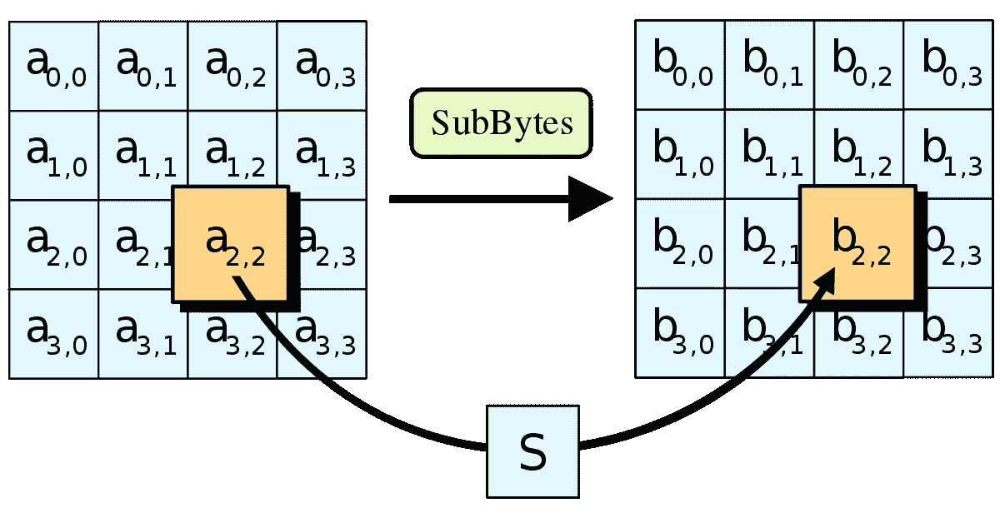

这是**字节子**查找表:

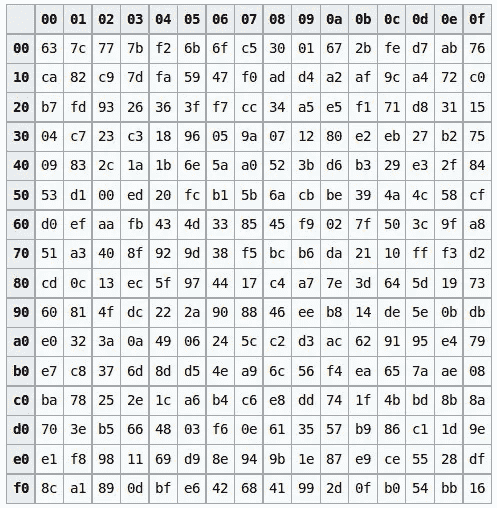

查找表的值以十六进制编码，每个数字对应 4 位。因此，如果每个单元格中有两位数，每个单元格就相当于 8 位空间，就像我们的输入矩阵一样。

让我们做一个简单的例子。假设 a 有一个值为 10100101 或 A5 的单元格。它将被查找表中的行 A 或 10 和列 10 中的单元替换为 06 或 00000110。

## 移动行

比 **Byte Sub** 简单，顾名思义，将矩阵的每一行向左移动。几个位置？第一行根本不会移动，第二行将移动一个位置，第三个移动两个位置，第四个和最后一个移动 3 个位置。

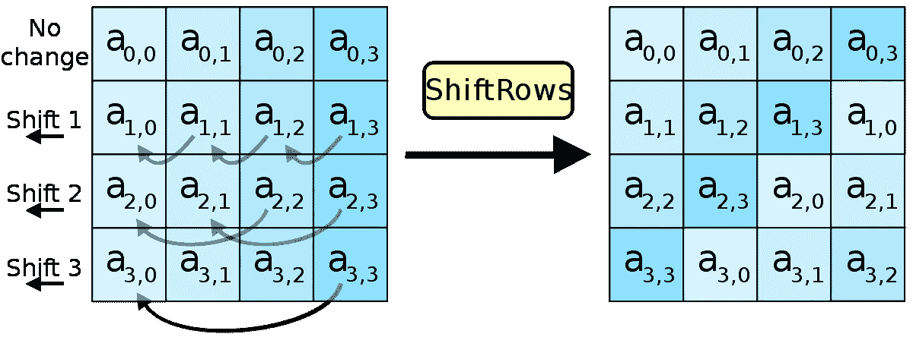

## 混合列

在 Mix 列中，我们将在当前矩阵和预定义的给定矩阵之间执行矩阵乘法，该乘法在整轮中保持不变。但是这是一个稍微复杂一点的矩阵乘法，因为求和运算被**异或**和乘法运算代替了**和。**

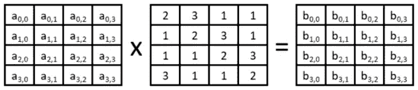

## 添加圆形密钥

到现在为止，我们根本没有加密信息。所有这些转换都可能被任何人取消，因为我们还没有将我们的关键引入等式。每个轮密钥的长度为 128 位，因此我们可以用与输入块相同的方式在矩阵中表示它。现在，我们将在我们的输入块的每个块之间执行**异或**运算，该输入块是来自密钥矩阵的相应块。

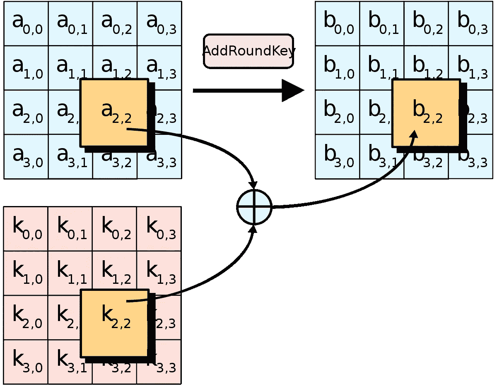

这就是 AES 加密的工作原理！既然我们能够加密，我相信我们会在某个时候恢复这些信息:让我们来谈谈**解密**。

**解密**

如果你理解了加密过程，你理解解密过程就不会有太大的困难。正如人们最初可能认为的那样，为了解除加密，我们必须逆转加密过程。我们将执行相同的操作，只是顺序相反。与加密相反，这是解密算法:

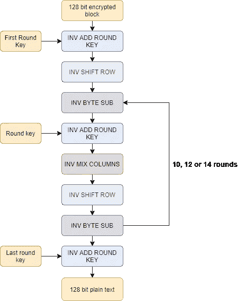

您可能已经注意到，这个图看起来与加密算法相当相似，事实上它们是相似的！但是如果你更仔细地观察，你会注意到所有的操作都以 **INV** 开始，这象征着相反的操作。例如，**逆混合列**是混合列的逆运算。这是什么意思？这意味着为了反转混合列操作，我们必须应用**反转混合列**。

## **反相加圆键**

是它自己的逆:如果你申请了两次添加轮键，你将离开你开始。由于这个属性，为了撤销添加轮密钥，我们必须再次应用它。为此，**反加圆键**和加圆键是**相同的操作**。

## 反向移位行

如果您还记得，shift rows 只是将每一行向左移动了一定数量的位置。因此，为了反转，我们必须将每行移动相同数量的位置，但要向右移动。就这么简单！

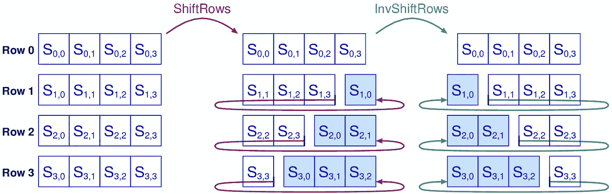

## 反向子字节

本质上是与子字节相同的操作:它将获取我们矩阵中的每个块，并与预定义矩阵中的另一个块交换。在**反向子字节**和子字节之间唯一改变的就是这个表。这是**反向子字节**的表格:

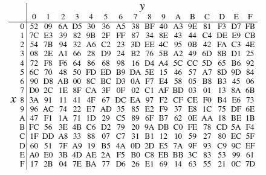

**逆混列**

如果你懂一些代数，你会记得如果我们用矩阵 c 乘以它的逆矩阵 C^-1，我们得到的结果是。如果你不熟悉代数的这些概念，可以把恒等式想成 1:如果我们把 5 和它的倒数 1/5 相乘，我们得到 1。

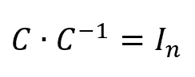

因此，让我们将数据矩阵称为 X。在混合列中，我们设置 X = X C。为了取消此乘法，我们必须乘以 C 的倒数，如下所示:

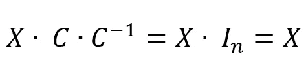

我们在 Mix 列中显示了 C 矩阵，因此这里我们将显示 C 的逆:

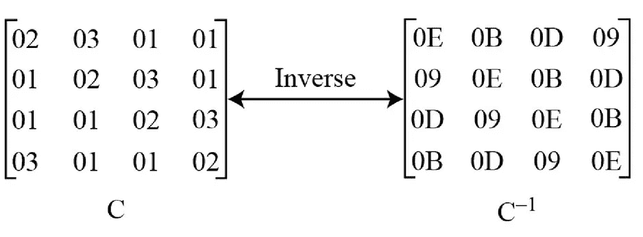

就是这样！我们已经介绍了什么是 AES，如何在不同的操作模式下使用，并希望了解如何使用它进行加密和解密。如果你想钻研 AES，我推荐这篇[文章](https://nvlpubs.nist.gov/nistpubs/FIPS/NIST.FIPS.197.pdf)。希望你喜欢这篇文章，

加密快乐！