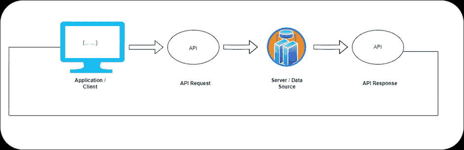
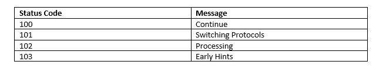
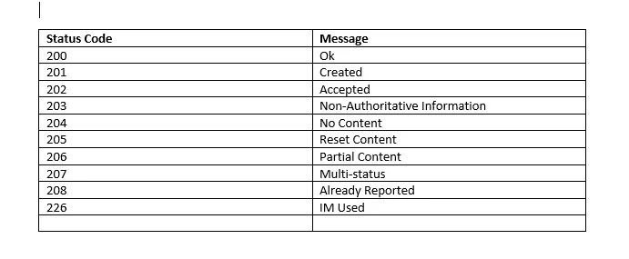
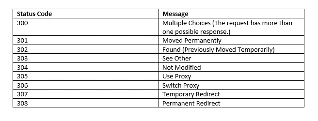
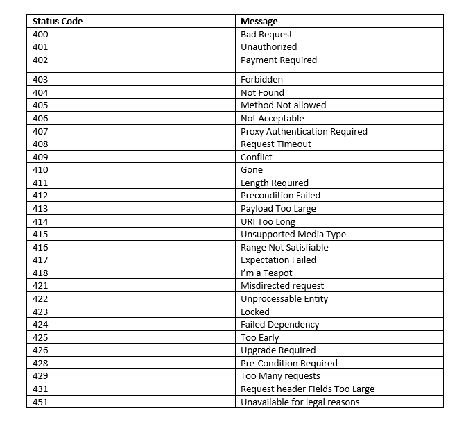
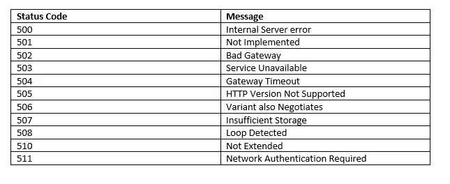

# 了解用于 API 测试的 HTTP 的基础知识。

> 原文：<https://medium.com/version-1/understanding-the-basics-of-http-for-api-testing-d857d2e97681?source=collection_archive---------1----------------------->

## 本文将提供关于 API 和 HTTP 的高级信息，这将有助于您的 API 测试。

Photo by [Douglas Lopes](https://unsplash.com/@douglasamarelo?utm_source=unsplash&utm_medium=referral&utm_content=creditCopyText) on [Unsplash](https://unsplash.com/s/photos/api?utm_source=unsplash&utm_medium=referral&utm_content=creditCopyText)

## 什么是 API？

API 代表应用程序编程接口。它是一个软件接口，允许两个应用程序在没有任何用户干扰的情况下相互通信。它是软件功能和程序的集合。API 是一种帮助两个不同软件通信和交换数据的代码。具体到本文，我们在 REST APIss 的上下文中讨论 API，REST API 允许使用标准 HTTP 协议与软件程序进行通信。REST 代表表述性状态转移，本质上意味着通过 HTTP 协议表示实体/资源以及与这些实体的交互。REST 本身就是一个完整的主题，所以如果你想了解更多的细节，我将留给你的读者做一些单独的阅读！

## REST API 是如何工作的？

API 位于应用程序和 web 服务器之间，充当处理系统间数据传输的中间层。

Working of APIs

1.  客户端应用程序启动 API 调用(也称为请求)来获取信息。这个请求通过 API 的统一资源标识符(URI)从应用程序发送到 web 服务器。这个请求包括头部和请求体。
2.  收到请求后，如果请求有效，API 将调用 web 服务器。
3.  收到请求后，web 服务器将响应和请求的信息一起发送给 API。
4.  一旦收到响应，API 会将数据传输到最初发出请求的应用程序。

显然，请求和响应的内容取决于您调用的特定 REST API！

## CRUD 操作

CRUD 代表创建、读取、更新和删除。CRUD 是这四种常见数据操作的标准 IT 行业术语。REST APIs 的部分魅力在于它们可以在现有的 HTTP 协议方法上模拟标准的 CRUD 操作:

创建— — — — →发布
阅读— — — →获取
更新— — — — — →上传/打补丁
删除————————→删除

## 创建-> HTTP POST

**POST**请求用于为服务器创建资源，例如，创建用户、上传文件等。POST 请求包含我们需要发送信息的主体。

## **阅读- > HTTP GET**

**GET** 方法用于从服务器获取特定数据。通过 GET 发出的请求只能返回/获取数据，它们不会对资源进行任何更改。

## **更新- > HTTP 上传/补丁**

**PUT 和 PATCH** 是相似的，它们都更新记录。两者之间的关键区别在于，当您想要更新整个记录时，应该使用 PUT，而当您只想更新记录中的某些字段时，应该使用 PATCH。

## **删除- > HTTP 删除**

**DELETE** 请求方法用于从服务器中删除资源。它将从目标资源中删除数据。

## **什么是 HTTP 状态码？**

HTTP 状态代码(也称为响应代码)用于向请求者指示其请求的状态。每个 HTTP 响应都包括一个响应代码。从响应代码的第一个数字可以推断出 5 类状态代码。例如，4XX 意味着请求无法到达页面或网站，而 2XX 意味着请求成功。

1.信息回复(100–199)

2.成功回答(200–299)

3.重定向消息(300–399)

4.客户端错误响应(400–499)

5.服务器错误响应(500–599)

## **状态码:**

## **1XX:信息**

1.  1XX 是一个信息状态代码，表示服务器已经收到请求并正在处理该流程。
2.  1XX 是一个临时状态代码，仅在处理请求时给出。
3.  1XX 是一个临时状态代码，我们只有在处理请求时才会得到它。

1XX Response Code

## **2XX:成功**

1.  2XX 是一个成功的状态代码，这意味着用户发送的请求是成功的，并且浏览器已经接收到继续该过程所需的预期信息。
2.  作为开发人员/测试人员，我们需要验证所有的请求(GET、PUT、POST、delete 等)。)应该会返回一个 2XX 状态代码。
3.  2XX 有助于测试人员/开发人员确保请求与浏览器和网站进行通信，并且最终用户可以不受任何干扰地使用该页面。

2XX Response Codes

## **3XX:重定向**

1.  3XX 状态代码表示您已被重定向，需要进一步操作来完成请求。
2.  重定向意味着请求被成功接收，但是资源在给定的路径上不可用。
3.  如果网页的地址被更改，并且您试图通过旧地址访问它，CMS 会将用户重定向到新地址。
4.  一般来说，2XX 意味着成功，但在发送 2XX 响应之前，它将经过重定向，即 3XX。

3XX Response Code

## **4XX:客户端错误**

1.  4XX 客户端错误状态代码意味着网站或网页找不到，页面不可用，或者请求包含一些错误的语法。
2.  此错误意味着用户无法找到他们正在寻找的页面。
3.  客户端错误状态的根本原因是页面不再被找到、暂时消失或不可访问。

4XX Response Code

## **5XX:服务器错误**

1.  5XX 服务器错误状态代码表示用户发送的请求有效，但服务器无法完成该请求。
2.  如果出现服务器错误，我们需要立即查看服务器并进行调试。

5XX Response Code

## **结论:**

在本文中，我试图对 REST APIs 以及我们在测试/开发 API 时得到的 HTTP 方法和状态代码做一个高层次的介绍。我希望这将提供一个基本的理解，以便将来您可以学习与 REST APIS 交互，并解释 HTTP 错误状态代码和错误原因，这将帮助开发人员用正确的方法调试问题。

作者简介:
Shubham Pandey 是第一版的测试工程师。