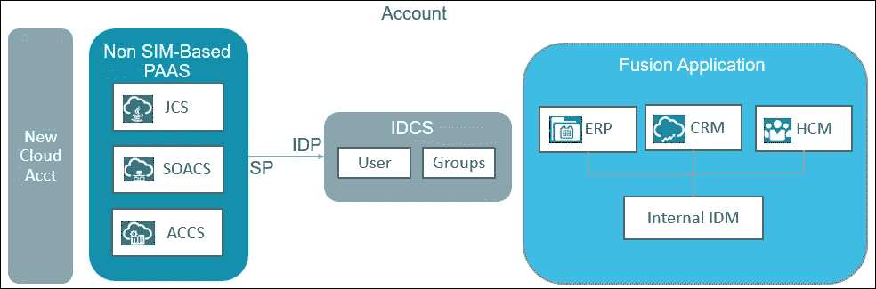

# 了解集成架构——融合应用和平台服务

> 原文：<https://medium.com/oracledevs/understanding-the-integration-architecture-fusion-application-with-platform-services-9b8297594873?source=collection_archive---------2----------------------->

这是我撰写的系列博客中的第一篇，旨在解释 Oracle 融合应用程序与 PaaS 服务的身份集成，使用身份云服务来实现服务之间的单点登录。这是这个系列的博客列表

1.  [了解集成架构——融合应用与平台服务](/@amit.gokhru/understanding-the-integration-architecture-fusion-application-with-platform-services-9b8297594873)
2.  [启用融合应用作为身份提供商的联盟](/@amit.gokhru/enable-federation-with-fusion-apps-as-identity-provider-1ca6d795659c)
3.  [启用身份云服务作为身份提供商的联盟](/@amit.gokhru/enable-federation-with-identity-cloud-service-as-identity-provider-36e80d2bc4ec)
4.  [在融合应用和身份云服务之间设置用户和角色同步](/@amit.gokhru/setting-up-users-and-roles-synchronization-between-fusion-apps-and-identity-cloud-service-70dcf2144107)
5.  [调用 Fusion Apps rest 端点的三脚 OAuth 流。](/@amit.gokhru/3-legged-oauth-flow-to-invoke-fusion-apps-rest-endpoints-5fc6b0b7b059)

# 概观

在过去十年的云之旅中，Oracle 为其客户提供了涵盖基础设施、平台和企业软件的全面云服务，并使他们以集成的方式协同工作，以解决客户的实时业务问题。这种集成的一个重要方面是跨这些服务的身份和访问管理，并将其扩展到客户自己的身份和访问管理解决方案。

随着基于云的身份和访问管理解决方案 [Oracle 身份云服务](https://cloud.oracle.com/en_US/identity)的发布，其在客户级别的可用性将有助于 Oracle 云服务的身份集成。从 2017 年 6 月开始，我们可以在[cloud.oracle.com 登录页面](https://cloud.oracle.com/en_US/sign-in)上看到新的云帐户以及传统的云帐户-

调配帐户后，客户将获得一个原始身份云服务实例，并且他的所有帐户管理员和服务管理员都将在该 IDCS 实例中创建。有关身份云服务的定价和功能集，请访问此处的。

在本文中，我将解释架构模式，它有助于平台服务和融合应用程序的身份集成，以提供单点登录和全面使用单个身份存储库。可以扩展相同的模式，以提供与利用 IDCS 的其他 SAAS 服务的集成。

以下是官方文档— [了解 Oracle PaaS 与 Oracle 销售云、HCM 云和 ERP 云的联合单点登录](https://cloud.oracle.com/developer/solutions?tab=tasks&solutionguid=OCPSI-GUID-3F8D8214-8441-439E-80C7-D0ECA666F607)

# 初速电流状态

了解融合应用程序的当前状态以及它如何与其他平台服务协同工作将非常有用，下图对此进行了解释

如上所述，融合应用程序使用自己的身份管理系统(Oracle IDM)和平台服务，如 JCS-SaaS 扩展、集成云、流程云以及其他基于 SIM 的服务，使用共享 IDM 进行身份管理。为了在融合应用和基于 SIM 的平台服务之间提供单点登录，融合应用的内部 IDM 与共享 IDM 联合，其中融合 IDM 充当身份提供者，SIM 充当服务提供者。所有在 2016 年 9 月之后提供的融合应用程序实例都会自动启用此联盟。在典型的融合应用实施中，当一名员工被雇用时，他的记录在 FA 的内部 IDM 中创建，该记录需要在共享 IDM 中同步，以便单点登录用例在融合应用和基于 SIM 的平台服务之间工作。这可以通过使用[这些步骤](https://cloud.oracle.com/developer/solutions?tab=tasks&solutionguid=OCPSI-GUID-C3F3348C-8C74-4F17-B9CE-0893CE2FA7CC)在融合应用中使用自助服务配置来完成。

这里要注意的一件重要事情是关于基于非 SIM 的平台服务，如 JCS、SOACS 和 ACCS，这些服务目前没有使用任何现成的身份管理系统，因此不能与融合应用程序联合以实现单点登录。

# 与 IDCS 的平台服务

正如我之前提到的，每个基于 IDCS 的帐户将自动获得一个 IDCS 的原始实例，这将被用作默认的身份管理系统。所有平台服务将在新的云帐户中开始预连线 IDCS 的供应，并将使用此 IDCS 来满足其身份和访问要求。这个拓扑看起来如下-

# PAAS 和 IDCS 的融合应用

虽然 PaaS 服务使用 IDCS 来满足 IAM 需求，但 Fusion Application 仍然使用其内部 IDM 来进行身份和访问管理。Fusion Application 将很快开始在基于 IDCS 的云帐户中提供其他服务，但将使用自己的内部 IDM 来满足 IAM 要求。生产中的现有 FA pods 最终将迁移到 IDCS 的新云帐户中，但仍将使用其自己的内部 IDM 进行身份和访问管理。由此类非集成和集成 FA pods 产生的拓扑如下所示

**Fusion Application in new Cloud Account with IDCS and PaaS Services**

**Existing Fusion Application in traditional Cloud Account with PaaS in new cloud account**

在平台服务使用 IDCS 而 FA 使用其内部 IDM 的情况下，通过将 FA 的内部 IDM 与 IDCS 联合，可以满足实现单点登录和单用户足迹的身份集成要求。对于传统云客户生产中的现有 FA pod 和基于 IDCS 的云客户中新调配/迁移的 FA pod，由客户决定何时将 FA 与 IDCS 联合，并根据其使用情形选择谁将成为身份提供商，谁将成为服务提供商。

FA 和 IDCS 之间可用的联盟选项

1.  **Fusion App 的内部 IDM 为 IdP，IDCS 为 SP** —适用于希望通过平台服务上的自定义应用程序扩展其 Fusion 应用程序，并需要为其用户提供单点登录的客户。这些客户对利用 IDCS 的其他功能不感兴趣，这些功能需要 IDCS 作为身份提供者。
2.  **Fusion App 的内部 IDM 为 SP，IDCS 为 IdP** —希望通过利用身份云服务的高级功能(如社交登录、多因素身份验证等)以及为用户提供其 Fusion App 和其他平台服务之间的单点登录来充分利用身份云服务的客户，将选择将 IDCS 配置为 Fusion App 联合设置中的身份提供商。

除了联盟方向，用户在这些拓扑中所处位置也很重要，因为他们需要在两个不相交的 IDM 系统(FA 的内部 IDM 和 IDCS)之间进行同步。以下是可用的选项

**当 FA 为 IDP 时**

1.  用户将首先在 FA 中创建，然后同步到 IDCS

**当 IDCS 成为国内流离失所者时-**

1.  用户可以首先在 FA 中创建，然后同步到 IDCS
2.  用户可以首先在 IDCS 中创建，然后同步到 FA 中，并与 FA 中的人员记录相关联

这是这个拓扑看起来的样子-

**FA as IDP and IDCS as SP**

**IDCS as IDP and FA as SP**

# 配置

融合应用程序和 IDCS 之间的联合配置

1.  Oracle Operations 通过服务请求支持客户手动联盟配置
2.  通过从 FA 到 IDCS 的 FA ESS 作业实现自助用户/职责同步
3.  从 IDCS 到 FA 的用户同步的自助配置

我将在这个博客系列中解释这些配置。

# 结论

融合应用程序和平台服务之间的身份集成可通过 Oracle Identity Cloud Service for Fusion Applications 扩展用例实现，平台服务提供单一用户足迹、所有服务之间的单点登录、与内部 IDM 系统的集成以及社交登录和多因素身份验证等更新功能。

*本文表达的观点是我个人的观点，不一定代表甲骨文的观点。*