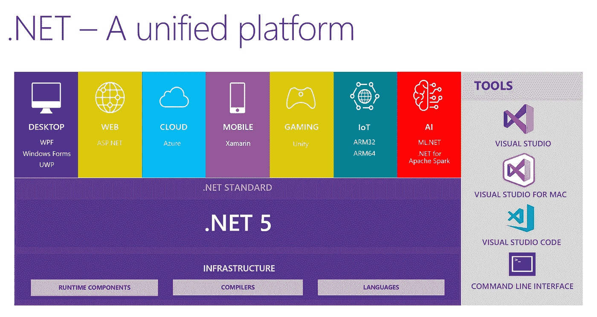
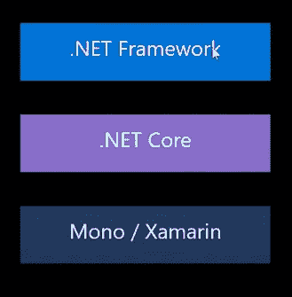
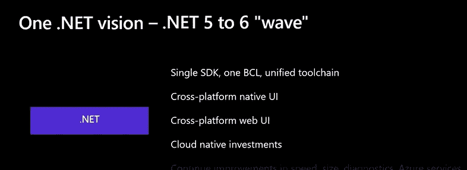
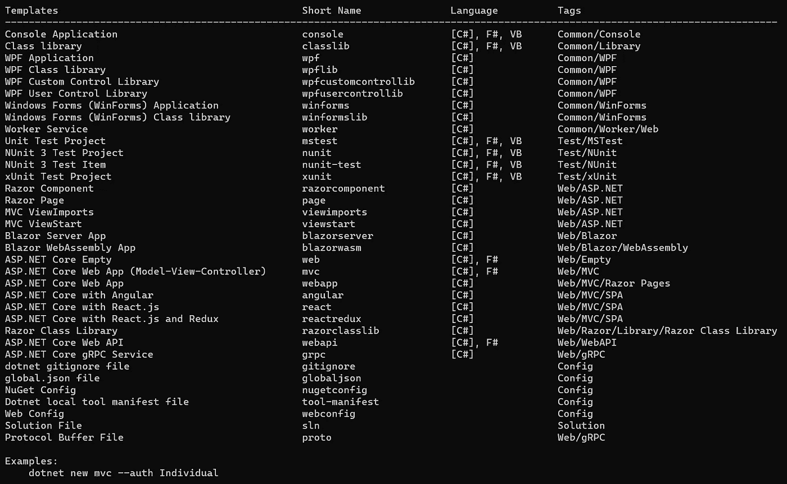

# 了解。网络生态系统

> 原文：<https://medium.com/quick-code/understanding-the-net-ecosystem-f60f571e1152?source=collection_archive---------0----------------------->

An overview of .NET 5

大家好，欢迎来到另一个信息丰富的博客！

今天我将解释。NET 是什么，我们可以用它来构建什么。因为它很容易被刚进入框架和应用程序开发领域的人混淆，有时甚至会被误解。

所以让我先给大家展示一下。NET 来帮助您开始使用它。

> 。NET 是一个几乎可以构建任何东西的平台！

这意味着它有一个运行时、库和语言，让你可以在桌面、网络、移动等任何平台上构建任何应用。

人们之所以经常感到困惑，是因为。NET 在过去的几年中经历了太多的变化，有许多新的迭代和名称。

所以有很多不同的方法。可以使用. NET:

直到现在。NET 是非常细分的。NET 框架，用于开发 windows 桌面应用程序。NET Core 是一个较新的开源实现，是跨平台的，最后，Xamarin 是一个框架，也是一个. NET 实现，但用于移动应用程序开发。

Future of .NET

现在，所有这些都被整合到一个 SDK(软件开发工具包)、一个 BCL(基础类库)和一个统一的工具中。它将于 2020 年 11 月面向所有人发布，并在 GitHub 上完全开源。

因此我们有一个基本的想法。NET 是一个大的生态系统，它有能力在任何地方构建任何东西。现在这包括:

1.  语言— C#、F#、VB
2.  运行时—公共语言运行时
3.  CLI —点网 CLI
4.  库—基本类库和第三方库可通过 Nuget 获得

所以我们用 C#或 F#语言编写代码。这段代码需要在运行时编译(类似于 Java 虚拟机)，我们有 CLR 来运行代码。然后要构建我们需要一个命令行界面(CLI)，使用的是 dotnet CLI。最后，为了缩短代码，我们有数百万个可以从 Nuget 包管理器中找到的库，就像我们分别用于 Javascript 和 Java 的 npm 或 maven 一样。

现在你对学习的可能性有了一个基本的概念。NET 平台，想入门？

只需打开[https://dotnet.microsoft.com/](https://dotnet.microsoft.com/)并点击下载。

您需要为您使用的操作系统安装 SDK(软件开发工具包)。之后，只需打开命令行(对于 windows 为 cmd，对于 MacOS 或 Linux 为 terminal)并键入 dotnet new

你会得到一个长长的选项列表，这是样板文件，以了解如何。NET 可以用来启动特定的应用程序。

Templates available in dotNET

有了这个，我希望你可能已经有了一个基本的想法。net 可以根据你的需求帮你创建一个 app 或者网站。谢谢大家！！