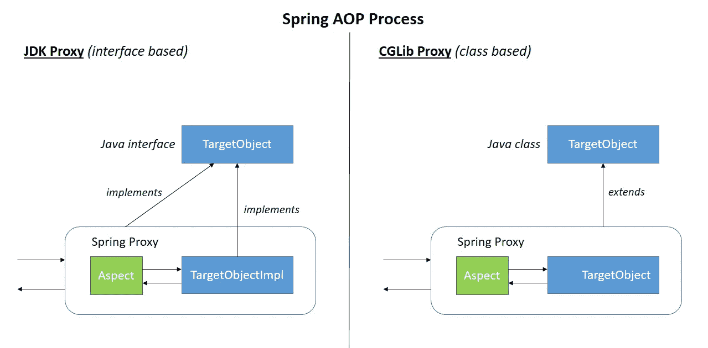
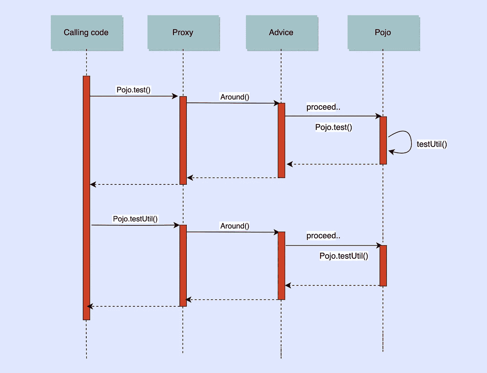

# 理解 Spring 面向方面编程的工蚁:代理

> 原文：<https://medium.com/walmartglobaltech/understanding-the-worker-ants-of-spring-aop-proxies-902208881493?source=collection_archive---------0----------------------->


Photo by [Prabir Kashyap](https://unsplash.com/@i__prabir?utm_source=unsplash&utm_medium=referral&utm_content=creditCopyText) on [Unsplash](https://unsplash.com/s/photos/ants?utm_source=unsplash&utm_medium=referral&utm_content=creditCopyText)

> ***“如果你希望你的代码易于编写，那就让它易于阅读。”—罗伯特·c·马丁，干净的代码***

在主要业务逻辑和其他横切关注点之间有一个清晰的分离对于干净和可读的代码是必不可少的。安全性和事务管理之类的问题并不是您手头的核心任务。将这些与业务代码纠缠在一起会导致与核心功能的严重耦合，如果它们失败，可能会受到影响。作为一名程序员，我坚定了袖手旁观的这一信念:

***“不要离开肮脏的代码库……快跑！!"***

**面向方面编程(AOP)** 是你工具箱中的一个很好的工具，可以满足那些与你的核心功能无关的需求。它允许您在不修改代码本身的情况下向现有代码添加行为。AOP 通过提供另一种实现模块化和减少代码混乱的方法来补充 OOP。Spring 有自己的 AOP 框架，在概念上很容易理解，是解决企业 Java 应用程序中大多数问题的优秀解决方案。

在本文中，我们将解开 AOP 黑匣子内部的秘密，以充分发挥其真正的力量，并突出其局限性。如果您不熟悉 AOP 文献，可以在这里浏览一下[。](https://docs.spring.io/spring-framework/docs/current/reference/html/core.html#aop-introduction-defn)

# 代理和运行时编织

一个**代理**是 AOP 框架为了实现方面契约而创建的一个对象。简而言之，它是一个 bean 实例的包装器，维护对象的接口，并可选地添加额外的行为。Spring 使用代理自动地添加额外的行为，而不需要修改现有的代码。这可以通过以下两种方式实现:

1.  JDK 动态代理——Spring AOP 默认使用 JDK 动态代理，它可以代理任何接口(或接口集)。只要目标对象实现了一个接口，就会使用 JDK 动态代理。
2.  CGLIB 代理—如果业务对象不实现任何接口，则默认情况下使用。

因为代理位于对象的调用者和真实对象本身之间，所以它可以在目标对象被调用之前和之后做一些事情，从而充当 Spring AOP 的工作蚂蚁。



Spring AOP Process ([Source](https://www.baeldung.com/wp-content/uploads/2017/10/springaop-process.png))

目标对象在运行时被代理有效地包装起来。当 Spring 确定一个 bean 被一个或多个方面通知时，它会为该 bean 生成一个代理来拦截方法调用，并确保通知按需运行。目标类实例在应用程序启动期间或运行时的任何其他时间，在它被使用之前，被改变成代理。这叫做**运行时编织**。任何对目标方法的调用都相应地被目标代理类截获，以执行任何合适的通知。

# 代理诉讼

考虑这个例子，对于 Logger 方面的创建，它记录了用@Loggable 注释的每个方法所花费的时间

[Source Code](https://gist.github.com/srishtikohli99/460884b5513b360f82cde5619b311895)

这会产生以下输出:

```
test method called
testUtil method called
Execution time for Test.test :: 18 ms
**Out of Test**
testUtil method called
Execution time for Test.testUtil :: 0 ms
```

当 spring 确定一个或多个方面通知了`*Test*` bean 时，它会自动生成一个代理来拦截所有方法调用，并在需要时执行任何相关的通知。但是，从输出中可以观察到，`*test*`方法中的`*pojo.testUtil()*` 调用记录了方法执行时间，而`*this.testUtil()*`调用没有记录。为什么？这是因为后者不是由代理截获的，而是由实际的目标类截获的。因此，建议永远不会被触发。让我们看看实际发生了什么，以便更好地理解。



Around advice UML call diagram

目的地为`*Pojo*` bean 的`*pojo.test()*`调用由代理接收，然后调用通知方法。然后，around 通知直接调用目标方法。一旦调用最终到达目标对象，它可能对自身(这里是`*this.testUtil()*`)进行的任何方法调用都将针对`*this*`引用而不是代理进行调用。

因此，**自调用不会导致相关的通知运行。**

**注意:**类上的 *@Aspect* 注释将其标记为一个方面，因此将其从自动代理中排除。因此，**在 Spring AOP 中，方面本身不可能成为来自其他方面的建议的目标。**

# 性能影响

因为代理是在调用代码和目标对象之间添加的中间物，所以引入一些开销就不足为奇了。值得注意的是，这个开销是**固定的**。无论普通方法的执行时间如何，代理调用都会增加固定的延迟。实际问题是，我们应该关心这种延迟吗？是也不是！

1.  如果额外的行为本身比代理机制本身具有更大的性能影响(如缓存或事务管理)，那么开销似乎可以忽略不计。然而，如果行为是细粒度的，并且需要应用于大量的对象(比如记录每个方法)，那么开销就不再是微不足道的了。
2.  另一个关注点是一个请求中涉及的代理对象的数量。如果一个请求涉及到对数百或数千个代理方法的调用，那么开销就变得很大，不能忽略。

对于这些使用基于代理的系统无法解决需求的罕见场景，最好使用**字节码编织**。字节码编织带类和方面，产生编织*。类*文件作为输出。由于方面被直接编织到代码中，这提供了更好的性能，但是与 Spring AOP 相比更难实现。

# 总结

为了充分发挥 Spring AOP 的潜力，掌握 Spring AOP 是**基于代理的**这一事实至关重要。代理包装了一个对象，并透明地添加了额外的行为来满足多种关注。它有很大的好处，如增强代码可读性，简化结构和集中管理。代理确实有性能方面的副作用，但是在大多数情况下这是无关紧要的。

# 参考

[](https://docs.spring.io/spring-framework/docs/2.5.x/reference/aop.html) [## 第六章。用 Spring 进行面向方面编程

### 面向方面编程(AOP)通过提供另一种思维方式来补充面向对象编程(OOP)

docs.spring.io](https://docs.spring.io/spring-framework/docs/2.5.x/reference/aop.html) [](https://learning.oreilly.com/library/view/pivotal-certified-professional/9781484251362/) [## pivotal Certified Professional Core Spring 5 开发者考试:使用 Spring Framework 5 的学习指南

### 通过 Core Spring 的 Pivotal 认证专家考试，基于最新的 Spring Framework 5，使用源代码…

learning.oreilly.com](https://learning.oreilly.com/library/view/pivotal-certified-professional/9781484251362/)  [## 揭穿神话:代理影响性能

### 在最近的一篇博客文章中，Marc Logemann 谈到了代理性能的主题。在他的条目中，他要求一个白色的…

spring.io](https://spring.io/blog/2007/07/19/debunking-myths-proxies-impact-performance/)