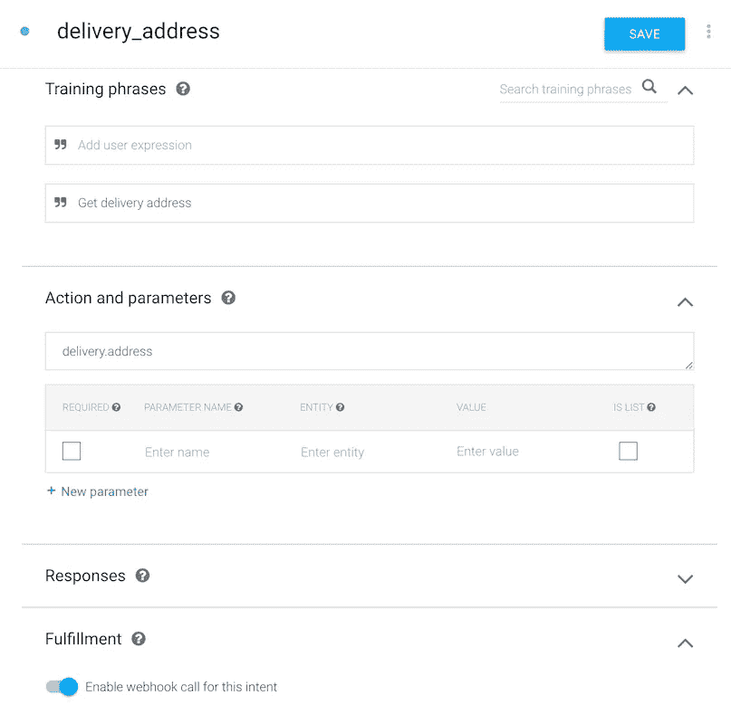
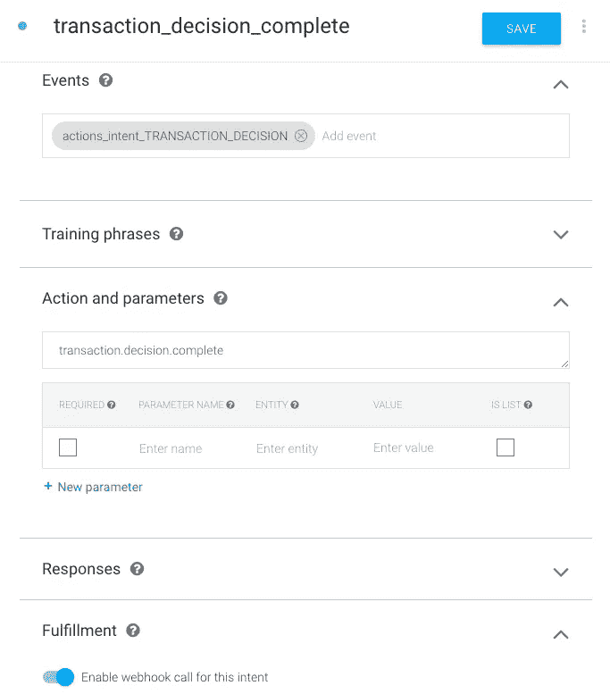

# 通过阅读示例代码了解 Google Actions 中的事务 API

> 原文：<https://medium.com/google-developer-experts/understanding-transactions-api-in-actions-on-google-by-reading-a-sample-code-1e2b63d98ac3?source=collection_archive---------3----------------------->

您可以使用交易 API 将购买和预订功能与您的 Google Assistant 应用程序集成在一起。但是，您可能不了解事务 API 的用法，因为有一些步骤、一些意图、一些事件和一些数据结构。也就是说，它很复杂。

幸运的是，有一个样例代码集可以更容易地理解事务 API。我想在这里描述一下将事务 API 与您的应用程序集成的示例代码的每个步骤。

[](https://github.com/actions-on-google/dialogflow-transactions-nodejs) [## google 上的操作/对话流事务节点

### dialog flow-Transactions-nodejs——Google Actions 中的事务 API 示例

github.com](https://github.com/actions-on-google/dialogflow-transactions-nodejs) 

# 获取示例代码集

您可以通过键入以下命令来克隆示例代码集:

```
git clone https://github.com/actions-on-google/dialogflow-transactions-nodejs
```

基本上，您可以通过`README.md`文件描述的步骤构建整个环境来尝试所有事务处理。我没有提到如何在这里建立环境。相反，我想描述事务 API 的行为。

# 工艺流程图

dialogflow-transactions-nodejs 示例具有以下流程。


实际交易由以下步骤组成:

1.  检查用户是否可以执行助理应用程序请求的新交易。
2.  如果需要，从用户处获取一个递送地址。
3.  决定用户是否真正执行事务。

让我们开始看看每个行为。

# 欢迎信息


当应用程序被调用时，应用程序会显示一条欢迎消息。该欢迎消息被设置到`Default Welcome Intent`意图中，并且欢迎消息字符串是固定的。此外，此意图不使用履行网钩。


这很简单。没有任何代码。用户阅读如下消息:


# 当用户说“不付款检查交易”时


“transaction_check_nopayment”意图有一个训练短语“检查交易而不付款”。这意味着如果用户说出这个短语，这个意图将被调用。


这一意图称之为履行网钩。处理意图的代码如下:

```
app.intent(‘transaction_check_nopayment’, (conv) => {
 conv.ask(new TransactionRequirements());
});
```

这个处理程序用参数调用`DialogflowConversation`类的`[ask()](https://actions-on-google.github.io/actions-on-google-nodejs/classes/conversation.conversation-1.html#ask)`函数。作为参数传递的`[TransactionRequirements](https://actions-on-google.github.io/actions-on-google-nodejs/classes/conversation_question.transactionrequirements.html)`类表示检查用户是否处于可处理状态的请求。也就是说，这个类表示`actions.intent.TRANSACTION_REQUIREMENTS_CHECK`内置意图。

Google 上的操作在收到包含`actions.intent.TRANSACTION_REQUIREMENTS_CHECK`意图的响应后检查用户的状态。

# 当用户说“用行动支付检查交易”时


这个用户短语“用支付动作检查交易”被注册在名为“交易 _ 检查 _ 动作”的意向中。


与先前的意图一样，实现被称为。代码如下:

```
app.intent(‘transaction_check_action’, (conv) => {
  conv.ask(new TransactionRequirements({
    orderOptions: {
      requestDeliveryAddress: false,
    },
    paymentOptions: {
      actionProvidedOptions: {
        displayName: ‘VISA-1234’,
        paymentType: ‘PAYMENT_CARD’,
      },
    },
  }));
});
```

这段代码还请求`actions.intent.TRANSACTION_REQUIREMENTS_CHECK`与`TransactionRequirements`类的内置意图。然而，在这个处理程序代码中，一些配置被设置为表明这个应用程序自己的付款。配置选项定义为`[GoogleActionsV2TransactionRequirementsCheckSpec](https://actions-on-google.github.io/actions-on-google-nodejs/interfaces/actionssdk_api_v2.googleactionsv2transactionrequirementscheckspec.html)`。例如，有两个属性:

*   `orderOptions`所代表的`[GoogleActionsV2OrdersOrderOptions](https://actions-on-google.github.io/actions-on-google-nodejs/interfaces/actionssdk_api_v2.googleactionsv2ordersorderoptions.html)`类。开发者可以指定一个客户信息和一个是否请求递送地址的标志。
*   `paymentOptions`以`[GoogleActionsV2OrdersPaymentOptions](https://actions-on-google.github.io/actions-on-google-nodejs/interfaces/actionssdk_api_v2.googleactionsv2orderspaymentoptions.html)`类为代表。

在这种情况下，指定了`actionProvidedOptions`属性，因为用户选择了一个 action payment。开发者需要提供两个值:`[GoogleActionsV2OrdersActionProvidedPaymentOptions](https://actions-on-google.github.io/actions-on-google-nodejs/interfaces/actionssdk_api_v2.googleactionsv2ordersactionprovidedpaymentoptions.html)`类定义的`displayName`和`paymentType`。

Google 上的动作根据响应检查用户的状态。

# 当用户说“使用谷歌支付检查交易”时


最后一个用户阶段是“使用谷歌支付检查交易”。这个短语被定义为“transaction_check_google”意图。


这个意图几乎和上面的其他意图一样。当然，这个意图是通过实践来实现的。所以，履行代码是…

```
app.intent('transaction_check_google', (conv) => {
  conv.ask(new TransactionRequirements({
    orderOptions: {
      requestDeliveryAddress: false,
    },
    paymentOptions: {
      googleProvidedOptions: {
        prepaidCardDisallowed: false,
        supportedCardNetworks: ['VISA', 'AMEX'],
        // These will be provided by payment processor,
        // like Stripe, Braintree, or Vantiv.
        tokenizationParameters: {},
      },
    },
  }));
});
```

正如代码中的注释，这个处理程序代码是不完整的。要使用 Google 提供的支付方式，您需要指定由`[GoogleActionsV2OrdersGoogleProvidedPaymentOptions](https://actions-on-google.github.io/actions-on-google-nodejs/interfaces/actionssdk_api_v2.googleactionsv2ordersgoogleprovidedpaymentoptions.html)`类定义的`googleProvidedOptions`属性。在上面的代码中，`tokenizationParameters`值为空。实际上，您需要为该属性指定一些值。实际上，文档对该属性的描述如下:

> 这些令牌化参数将用于生成交易中使用的支付令牌。该应用程序应该从他们的支付网关获得这些参数。

这意味着您需要从 Stripe、Braintree 或 Vantiv 等支付网关发出并获取支付令牌。此时，您可以检索两个令牌:生产令牌和测试令牌。如果您尝试在沙箱中完成交易，您需要指定用于测试的支付令牌。

当`tokenizationParameters`值为空，用户尝试使用谷歌支付时，谷歌助手将返回成功响应。但是，交易将在交易确认时失败。

# 在检查用户的状态后


Google 上的操作检查用户是否可以完成交易。检查之后，Google 上的 Actions 向 Dialogflow 发送一个`actions.intent.TRANSACTION_REQUIREMENTS_CHECK`事件。在此示例中，此事件由“transaction_check_complete”意图接收。


这个意图没有任何训练短语。相反，事件名称`actions.intent.TRANSACTION_REQUIREMENTS_CHECK`被设置。

在之前的意向调用中，Dialogflow 返回包含`actions.intent.TRANSACTION_REQUIREMENTS_CHECK`的响应。在收到 Google 上的 Actions 的响应后，Google 上的 Actions 检查用户的状态，然后将`actions.intent.TRANSACTION_REQUIREMENTS_CHECK`事件从 Google 上的 Actions 发送到 Dialogflow。这意味着在流程中没有用户交互。这被称为“沉默的意图”。

在发送事件时，请求具有事务检查的结果。在 fulfillment 中的处理程序代码中，您可以知道如下结果:

```
app.intent('transaction_check_complete', (conv) => {
  const arg = conv.arguments.get('TRANSACTION_REQUIREMENTS_CHECK_RESULT');
  if (arg && arg.resultType ==='OK') {
    // Normally take the user through cart building flow
    conv.ask(`Looks like you're good to go! ` +
      `Try saying "Get Delivery Address".`);
  } else {
    conv.close('Transaction failed.');
  }
});
```

如果`TRANSACTION_REQUIREMENTS_CHECK_RESULT`参数的值为`OK`，则用户的状态为 ok。否则，用户无法完成交易。在上面的例子中，当用户的状态不是 ok 时，对话用`conv.close()`关闭。

用户将看到来自应用程序的响应消息，如下所示:


# 当用户说“获取交货地址”时


在前面的消息中，用户导航到 say 来确定交易的交货地址。当用户说出这个短语时，名为“delivery_address”的意图被调用。



基本上，这个意图很简单，只要求实现。在这个例子中，实现的处理函数如下:

```
app.intent('delivery_address', (conv) => {
  conv.ask(new DeliveryAddress({
    addressOptions: {
      reason: 'To know where to send the order',
    },
  }));
});
```

这个处理函数不发送任何响应文本。相反，`[DeliveryAddress](https://actions-on-google.github.io/actions-on-google-nodejs/classes/conversation_question.deliveryaddress.html)`类的实例被传递给`conv.ask()`函数。为了传递实例，Dialogflow 返回响应，其中包括对 Google 上的动作的内置意图`actions.intent.DELIVERY_ADDRESS`。

收到`actions.intent.DELIVERY_ADDRESS`意图后，Google 上的 Actions 会询问用户想要将订单送达的地址。也就是说，用户收到来自 Google Assistant 的响应消息，如下所示:


在 Android 设备上的谷歌助手中，用户注册的地址显示为富卡消息。用户可以点击想要递送的地址的卡片。

# 当用户轻敲卡片时


通过点击卡片，可以确定送货地址。然后，Google 上的 Actions 将名为`actions.intent.DELIVERY_ADDRESS`的事件发送到 Dialogflow，以便用户确定交付地址。当然，这个示例提供了接收事件的意图。名称为“交货地址完成”。


这个意图的任务只是像其他意图一样召唤实现。此示例的处理函数是:

```
app.intent('delivery_address_complete', (conv) => {
  const arg = conv.arguments.get('DELIVERY_ADDRESS_VALUE');
  if (arg.userDecision ==='ACCEPTED') {
    console.log('DELIVERY ADDRESS: ' +
    arg.location.postalAddress.addressLines[0]);
    conv.data.deliveryAddress = arg.location;
    conv.ask('Great, got your address! Now say "confirm transaction".');
  } else {
    conv.close('I failed to get your delivery address.');
  }
});
```

事件`actions.intent.DELIVERY_ADDRESS`的请求具有用户确定的递送地址信息。您可以从`DELIVERY_ADDRESS_VALUE`参数中获得信息。如果用户不接受将送货地址传递给应用程序，则`arg.userDecision`的值不是`ACCEPTED`，并且该应用程序使用本示例中的`conv.close()`函数结束对话。

如果用户接受，检索到的交货地址将存储在`conv.data``中，以便在创建订单时使用。最后，这个应用程序通过响应消息导航到下一步。


# 当用户说“确认交易”时


得到用户的送货地址后，当用户说“确认交易”时，名为“transaction_decision”的意向被调用。


这里重要的不是意图，而是实现代码。处理意向的函数有责任向用户显示目标订单的摘要，并要求确认用户是否希望完成交易。为了创建订单信息，代码长度往往会变长。

让我们看看履行代码。首先，下面的代码创建订单信息。请注意，它经过编辑，省略了一些部分。

```
app.intent('transaction_decision_action', (conv) => {
  const order = {
    id: UNIQUE_ORDER_ID,
    cart: {
      merchant: {
        id: 'book_store_1',
        name: 'Book Store',
      },
      lineItems: [
        {
          name: 'My Memoirs',
          id: 'memoirs_1',
          price: {
            amount: {
              currencyCode: 'USD',
              nanos: 990000000,
              units: 3,
            },
            type: 'ACTUAL',
          },
          quantity: 1,
          subLines: [
            {
              note: 'Note from the author',
            },
          ],
          type: 'REGULAR',
        },
        ...
      ],
      notes: 'The Memoir collection',
      otherItems: [
        {
          name: 'Subtotal',
          id: 'subtotal',
          price: {
            amount: {
              currencyCode: 'USD',
              nanos: 220000000,
              units: 32,
            },
            type: 'ESTIMATE',
          },
          type: 'SUBTOTAL',
        },
        {
          name: 'Tax',
          id: 'tax',
          price: {
            amount: {
              currencyCode: 'USD',
              nanos: 780000000,
              units: 2,
            },
            type: 'ESTIMATE',
          },
          type: 'TAX',
        },
      ],
    },
    otherItems: [],
    totalPrice: {
      amount: {
        currencyCode: 'USD',
        nanos: 0,
        units: 35,
      },
      type: 'ESTIMATE',
    },
  };
```

订单信息由`[GoogleActionsV2OrdersProposedOrder](https://actions-on-google.github.io/actions-on-google-nodejs/interfaces/actionssdk_api_v2.googleactionsv2ordersproposedorder.html)`类表示。这由一些部分组成。例如，该示例中的对象具有如下一些属性:

*   `id`订单的唯一 ID。
*   `cart`用户的物品。
*   `totalPrice`这份订单的总价。

此外，由`[GoogleActionsV2OrdersCart](https://actions-on-google.github.io/actions-on-google-nodejs/interfaces/actionssdk_api_v2.googleactionsv2orderscart.html)`类表示的`cart`具有以下属性:

*   `merchant`此订单的商家信息。
*   `lineItems`用户订购的商品或服务。
*   `otherItems`在此示例中，该属性包含小计和税收信息。

在此示例中，用户可以确定交货地址。然而，用户也可以省略它。相反，用户可以说“确认交易”,而不用说“获取交货地址”。如果用户忽略指定递送地址，则`conv.data`会话对象没有递送地址信息。另一方面，如果信息存在于`conv.data`中，您可以将交货地址信息包括到订单信息中。以下代码的任务是:

```
 if (conv.data.deliveryAddress) {
    order.extension = {
      '[@type](http://twitter.com/type)': GENERIC_EXTENSION_TYPE,
      'locations': [
        {
          type: 'DELIVERY',
          location: {
            postalAddress: conv.data.deliveryAddress.postalAddress,
          },
        },
      ],
    };
  }
```

好了，您得到了完整的订单信息对象。现在您需要询问用户是否确认订单并完成交易。为此，您可以使用`[TransactionDecision](https://actions-on-google.github.io/actions-on-google-nodejs/classes/conversation_question.transactiondecision.html)`类。在此示例中，`TransactionDecision`实例被传递给`conv.ask()`函数，如下所示:

```
 // To test payment w/ sample,
  // uncheck the 'Testing in Sandbox Mode' box in the
  // Actions console simulator
  conv.ask(new TransactionDecision({
    orderOptions: {
      requestDeliveryAddress: true,
    },
    paymentOptions: {
      actionProvidedOptions: {
        paymentType: 'PAYMENT_CARD',
        displayName: 'VISA-1234',
      },
    },
    proposedOrder: order,
  }));
```

上面的代码是动作提供的支付方式。也就是说，指定了`actionProvidedOptions`值。如果支付是不必要的，可以省略`paymentOptions`的值。另一方面，如果应用程序使用 Google 提供的支付方式，您需要在示例代码中启用下面的代码，而不是上面的代码:

```
 // If using Google provided payment instrument instead
  conv.ask(new TransactionDecision({
    orderOptions: {
      requestDeliveryAddress: false,
    },
    paymentOptions: {
      googleProvidedOptions: {
        prepaidCardDisallowed: false,
        supportedCardNetworks: ['VISA', 'AMEX'],
        // These will be provided by payment processor,
        // like Stripe, Braintree, or Vantiv.
        tokenizationParameters: {},
      },
    },
    proposedOrder: order,
  }));
```

这段代码使用了`googleProvidedOptions`属性，而不是`actionProvidedOptions`。当然，您必须为您使用的支付处理器指定`tokenizationParameters`值。

通过传递`TransactionDesicion`实例，名为`actions.intent.TRANSACTION_DECISION`的事件被返回给 Google 上的动作。

当 Actions on Google 接收到`actions.intent.TRANSACTION_DECISION`事件时，Google Assistant 向用户显示订单摘要作为如下的响应消息:


而且，


当用户说“下单”时，Google Assistant 显示如下图的支付 UI:


用户需要输入密码并点击“批准”按钮来决定交易。此时，订单的状态为`PENDING`。


# 当用户同意支付时


如果用户同意付款，Google 上的 Actions 会将`actions.intent.TRANSACTION_DECISION`发送给 Dialogflow。在此示例中，事件由名为“transaction_decision_complete”的意图接收。



处理这种意图的处理程序代码如下。首先，您需要检查用户决策。为此，您可以检查`conv.arguments.get('TRANSACTION_DECISION_VALUE’)`参数的 userDecision 值。

```
app.intent('transaction_decision_complete', (conv) => {
  console.log('Transaction decision complete');
  const arg = conv.arguments.get('TRANSACTION_DECISION_VALUE');
  if (arg && arg.userDecision ==='ORDER_ACCEPTED') {
    ...
```

如果用户决策值为`ORDER_ACCEPTED`，这意味着用户接受支付。此时，您需要将订单的状态更新为`CREATED`。`[OrderUpdate](https://actions-on-google.github.io/actions-on-google-nodejs/classes/conversation_response.orderupdate.html)`类用于更新。

```
 ...
    const finalOrderId = arg.order.finalOrder.id; // Confirm order and make any charges in order processing backend
    // If using Google provided payment instrument:
    // const paymentDisplayName = arg.order.paymentInfo.displayName;
    conv.ask(new OrderUpdate({
      actionOrderId: finalOrderId,
      orderState: {
        label: 'Order created',
        state: 'CREATED',
      },
      lineItemUpdates: {},
      updateTime: new Date().toISOString(),
      receipt: {
        confirmedActionOrderId: UNIQUE_ORDER_ID,
      },
      // Replace the URL with your own customer service page
      orderManagementActions: [
        {
          button: {
            openUrlAction: {
              url: '[http://example.com/customer-service'](http://example.com/customer-service'),
            },
            title: 'Customer Service',
          },
          type: 'CUSTOMER_SERVICE',
        },
      ],
      userNotification: {
        text: 'Notification text.',
        title: 'Notification Title',
      },
    }));
    ...
```

在此示例的上述代码中，设置了以下属性:

*   `orderState`指定新的状态`CREATED`。
*   `receipt`指定订单 ID 以映射收据。
*   `orderManagementActions`指定客户支持信息。
*   `userNotification`通知的文本和标题。

最后，您用`conv.ask()`函数发送响应消息，让用户完成交易。

```
 ...
    conv.ask(`Transaction completed! You're all set!`);
  } else if (arg && arg.userDecision === 'DELIVERY_ADDRESS_UPDATED') {
    conv.ask(new DeliveryAddress({
      addressOptions: {
        reason: 'To know where to send the order',
      },
    }));
  } else {
    conv.close('Transaction failed.');
  }
});
```

如果`userDecision`值是`DELIVERY_ADDRESS_UPDATED`，这意味着用户想要更新送货地址。在这种情况下，您需要导航用户使用`DeliveryAddress`类来确定交付地址，正如我在上一节中描述的那样。

执行上述代码后，Google Assistant 向用户发送如下响应消息:


在谷歌助手的订单历史页面，用户可以看到最新的状态`ORDER_CREATED`。


# 结论

在这篇文章中，我描述了 Google Transactions API 上的行为。如果你能通过阅读这篇文章理解架构、流程步骤和每个代码，那就太好了。