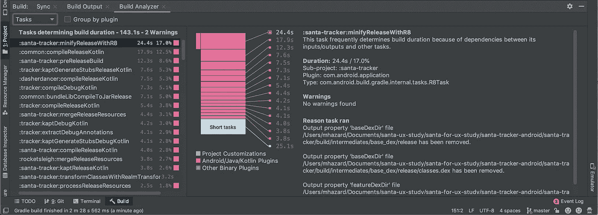
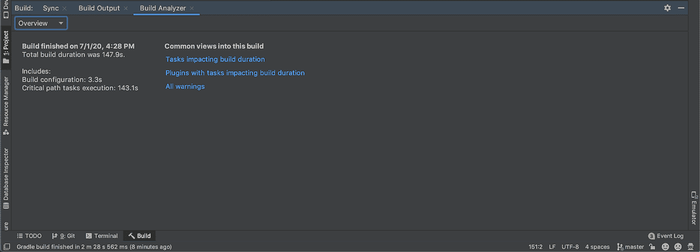
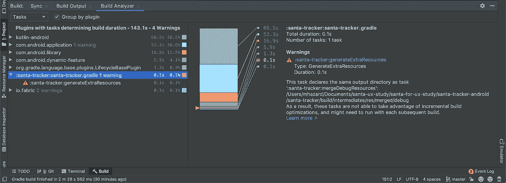
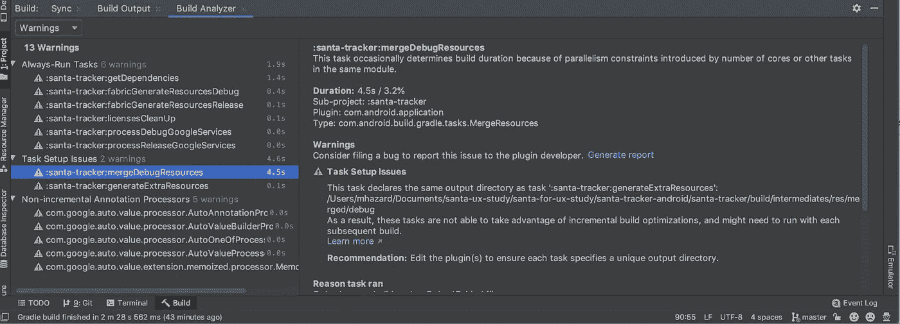
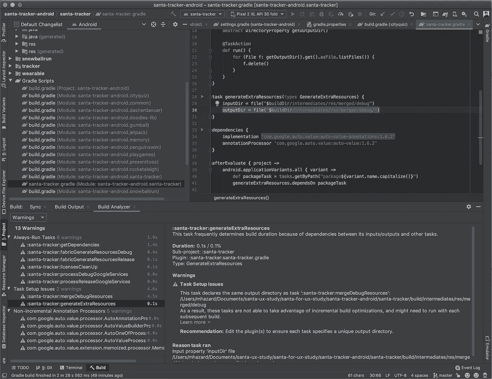

# 使用构建分析器了解您的构建

> 原文：<https://medium.com/androiddevelopers/understanding-your-build-with-the-build-analyzer-5c15688ec72e?source=collection_archive---------2----------------------->

作为 Android 开发工具团队的成员，我和我的队友每天都来开发工具，旨在使 Android 成为最好的移动开发平台。有时，这意味着构建帮助你编写应用程序的工具。在其他时候，这意味着构建工具来帮助你*回到*编写你的应用程序。

我们知道冗长的构建会浪费时间，打断开发流程，并最终产生大量的挫折。Android Studio 用户平均每周构建他们的项目 65 次，所以即使 10 秒钟的速度变慢也会花费每个开发人员一年大约 9 个小时的时间。然而，正如我们在之前的文章[中提到的，在 Android Studio](/androiddevelopers/improving-build-speed-in-android-studio-3e1425274837) 中提高构建速度，大约 60%的 Android 开发人员不分析他们的构建。再加上不断增长的项目复杂性，这已经导致所有 Android Studio 项目的构建持续时间不断增加，生产力损失巨大。

为了解决这个问题，我们创建了 Build Analyzer，这是一个工具，旨在帮助所有开发人员了解是什么决定了他们的构建持续时间，以及如何将其最小化。

# 利用构建分析器

每次您构建应用程序时，Android Studio 都会生成一个构建分析器报告。要查看报告，请确保执行以下操作:

1.  升级 Android Gradle 插件，使其版本高于或等于 4.0.0
2.  构建或重新构建您的项目
3.  通过从菜单栏中选择“视图”>“工具窗口”>“构建”,然后单击“构建分析器”选项卡，导航到构建分析器

出于本文的目的，我们将浏览一份构建分析器报告，该报告是在运行由谷歌开发的开源教育应用程序[圣诞老人追踪应用程序](https://github.com/google/santa-tracker-android)的干净构建时生成的。

打开构建分析器会将您带到*概述*页面。*概述*页面提供了一些基本信息和链接，可以跳转到详细信息。一眼就可以看出，这个构建的持续时间主要由任务执行决定，而不是由配置决定。

要了解更多信息，让我们深入研究构建分析器提供的两个数据集，*任务*和*警告*，方法是使用 *Common views 下的链接进入此构建*或左上角的组合框，当前显示为“Overview”。

**任务**

这些任务，或者由于输入/输出依赖，或者由于并行性限制，决定了观察到的构建持续时间。不包括并行运行且不影响观察到的构建持续时间的任务。当我构建应用程序时，看着这个可以让我知道哪里是最重要的。

在平面列表中查看时，任务按其来源进行颜色编码。源自*项目定制*的任务在您的项目中本地定义，并且最容易修改。标记为来自 *Android/Java/Kotlin 插件*的任务来自核心插件，由*其他二进制插件*添加的任务可能来自你团队中某人创作的二进制插件或来自第三方二进制插件。

默认情况下，任务显示在一个平面列表中，但是可以通过添加它们的插件使用*分组插件*控件*进行分组。*分组为项目中的每个插件添加一个节点，并修改可视化以显示插件，而不是单个任务。

在这里，分组允许我观察到我构建的大部分持续时间是由于核心插件的任务执行，比如 Kotlin 和 Android Gradle 插件。这并不奇怪，尤其是在执行一个像圣诞老人跟踪者这样的项目时。执行增量构建通常会导致花费在核心插件任务执行上的时间减少，并且会暴露其他插件的影响。

这个插件视图在比较添加或升级插件前后的构建时间时特别有用，这将允许您权衡任何更改对构建持续时间的影响。无论何时做出改变都要小心，这是防止不断增加的构建持续时间侵蚀您的生产力的最好方法之一。还值得注意的是，由于增量执行和其他约束，构建持续时间会有所不同，所以最好比较几个构建。

**警告**

在这里，您可以看到该版本生成的所有警告。这包括为*没有*确定该构建持续时间的任务生成的警告。

每个警告都包含生成原因的解释、解决方法的建议，以及生成该警告的任务的详细信息(如果适用)。如果警告不是由您团队中的某个人生成的，您可以使用*生成报告*功能向原始任务或插件作者解释这个问题。

如上图所示，在上面讨论的 Santa Tracker 项目上使用构建分析器时，我们生成了一个*任务设置*警告。此问题似乎是由于输出目录冲突造成的，因此我们可以通过更改 generateExtraResources 或 mergeDebugResources 任务的输出目录来解决此问题。mergeDebugResources 任务来自基础 android 插件，不能在本地编辑，而 generateExtraResources 任务是我的团队创作的*项目定制*。因此，我将编辑 generateExtraResources 任务。

再次注意，上面的报告是由一个干净的构建生成的。由增量构建生成的报告不太一致，但可能更好地代表了您通常的开发工作流程，所以请确保您将构建分析器用于干净的和增量的构建。要了解更多关于构建分析器的功能，请阅读[构建性能故障排除](https://developer.android.com/studio/build/build-analyzer)。

# 构建分析器的工作原理

每次你使用 Android Studio 构建你的项目时，构建分析器使用 [Gradle 工具 API](https://docs.gradle.org/current/userguide/third_party_integration.html#embedding) 和 [Android Gradle 插件](https://developer.android.com/studio/releases/gradle-plugin)来本地收集数据。工具 API 用于附加一个 [ProgressListener](https://docs.gradle.org/5.1/release-notes.html#tooling-api:-enhanced/additional-progress-events) ，它提供关于项目配置、任务执行、注释处理器等等的信息。Android Gradle 插件提供了任务名到任务类名的映射和任务配置等附加信息。

当您的构建完成时，构建分析器通过一套分析器运行这些信息，每个分析器寻找并报告一个特定的问题。例如，一个分析器检查被配置为在每个构建上运行的任务。这些任务妨碍了在增量构建期间节省时间，并且会严重影响构建速度。

这个分析器如何找到总是运行的任务？当自上次构建以来没有输入或输出发生变化时，Gradle 任务是最新的。当一个任务是最新的，Gradle 跳过运行任务，并重用任务的旧输出，而不是浪费时间重新创建它们。如果没有声明任务输入和输出，任务将永远不会是最新的。该分析器使用由 Gradle 工具 API 提供的任务输出信息，并识别所有未声明任何输出的任务，或者特别将最新设置覆盖为始终为假的任务。在这样做的过程中，它标识了所有永远不会更新并且将一直运行的任务。通过自动完成这项工作，我们希望帮助您快速解决这个问题，并开始充分利用增量构建。

除了识别始终运行的任务的分析器之外，目前还有两个额外的分析器。一个识别非增量的[注释处理器，另一个识别覆盖彼此输出的任务。在未来，我们计划继续发布分析器，帮助您快速找到常见问题并了解 Gradle 最佳实践。](https://docs.gradle.org/4.10.1/userguide/java_plugin.html#sec:incremental_annotation_processing)

# 后续步骤

如果构建分析器为第三方插件的一部分任务报告了一个警告，那么考虑对最初的插件作者提出一个 bug。这些问题可能不会立即得到解决，但会改善整个生态系统。如果您认为构建分析器本身有问题，请通过我们的[问题追踪器](https://issuetracker.google.com/components/192708#basic)告诉我们。

如果你有兴趣进一步调查你的建造，尝试使用[梯度扫描](https://guides.gradle.org/creating-build-scans/)获得更多信息。使用 Gradle 的[构建缓存](https://docs.gradle.org/current/userguide/build_cache.html)也可以减少你构建的持续时间。

随着这个工具的成熟，我们希望扩展我们的分析器套件，以识别更多的警告。我们也很高兴了解人们如何使用该工具，并将相应地对导航、可视化和其他组件进行改进。如果您有任何反馈，请告诉我们，尤其是关于您在自己的构建中发现的、我们的分析器没有发现的问题。