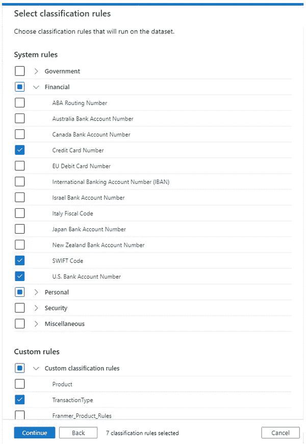

# 了解您的数据

> 原文：<https://medium.com/version-1/understanding-your-data-d9ae6d75d381?source=collection_archive---------0----------------------->

## Azure 权限中的自动分类

随着企业意识到管理数据的潜在价值，以及失败的代价，确保对组织数据进行适当治理的兴趣越来越大。应该允许谁访问什么？

> 在实施任何数据治理之前，您需要了解您的组织拥有哪些数据。

Photo by [Susan Q Yin](https://unsplash.com/@syinq?utm_source=unsplash&utm_medium=referral&utm_content=creditCopyText) on [Unsplash](https://unsplash.com/s/photos/library?utm_source=unsplash&utm_medium=referral&utm_content=creditCopyText)

当你已经收集了多年的数据时，理解你拥有的数据可能是一项棘手的任务。设计系统的人可能已经不在公司了，设计文档充其量也只是拼凑而成。这就像控制了一个图书馆，但是没有任何索引来知道里面有什么。

这时你需要一些东西来自动扫描和分类每个项目。

# 范围

微软的数据治理门户网站“权限”提供了几个组件来帮助发现和分类您的企业数据。其中有一个分类引擎，它结合使用 [RegEx](https://en.wikipedia.org/wiki/Regular_expression) 和 [Bloom Filters](https://en.wikipedia.org/wiki/Bloom_filter) 来自动检测某些类型的数据。

虽然我们可以想象电话号码必须有一个标准的模式，并且必须有一个有限的国家名称列表来核对(如果我们能记住它们就好了)。微软已经为我们做了很多艰苦的工作，它提供了一套[规则](https://docs.microsoft.com/en-us/azure/purview/supported-classifications)，我们可以用它来扫描我们的数据，包括世界各地的银行号码和护照号码格式。

## 扫描规则集

根据数据的变化率，您可能希望安排每月扫描，以检查要分类的新数据类型。在实践中，我们可以确信，这些分类中有许多极不可能出现在我们的数据中，因此我们不想浪费计算能力(和相关成本)来持续扫描所有不必要的分类。

因此，我们能够将扫描配置为仅使用我们预期可能存在于数据中的规则集，以找到存储它们的所有位置。

Configuring a scan rule set in Purview

## 兼容的数据源

像任何索引或数据目录一样，权限不存储数据的副本，只存储描述数据集及其属性的元数据。这意味着分类过程(在数据中寻找模式)必须发生在数据源。

因此，对数据进行分类的能力取决于数据源。不是每个来源都能够运行分类，有些仍然在微软的开发路线图上:[查看这里](https://docs.microsoft.com/en-us/azure/purview/microsoft-purview-connector-overview)。正如你所料，Azure 数据服务有很多支持，其他名字也在后面。

> 检查您的数据源是否支持您希望使用的功能。

## 从列表中消失

一旦你开始浏览系统分类，你会意识到具有强有力的国际公认定义的数据项(如护照和银行账户)有最大的支持。一些真正明显的缺失(缺乏英国邮政编码让我感到惊讶)，但范围仍处于起步阶段，所以期待这些在路线图上。

即使在每个国家的所有标准都有分类规则，你仍然可能需要组织标识符，而这是微软永远不会支持的。为了解决这个问题，有一个创建自定义分类的选项，我将在下一篇博客中讨论这个问题。

# 只是旅程的开始

任何自动索引系统只能为你做这么多，它会突出可能的数据分类，但没有上下文。这些邮政编码是否与客户地址或商店位置相关，前者是个人可识别的，因此是保密的，而后者应尽可能广泛地共享。

这意味着将需要人工努力来解释结果，并建立一个组织数据字典。这应该告诉用户哪些数据保存在哪里，以及谁负责维护和控制这些数据。

数据治理不是仅仅通过购买和配置软件就能实现的，它需要组织的承诺和持续的监督。就像任何没有图书管理员的图书馆一样，索引会变得陈旧，混乱会回到书架上。

**关于作者:** 卡尔跟随的是一位数据分析解决方案架构师，这里是版本 1。