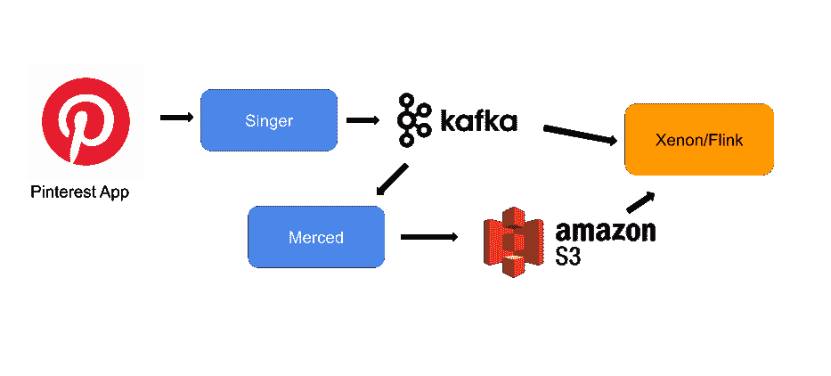
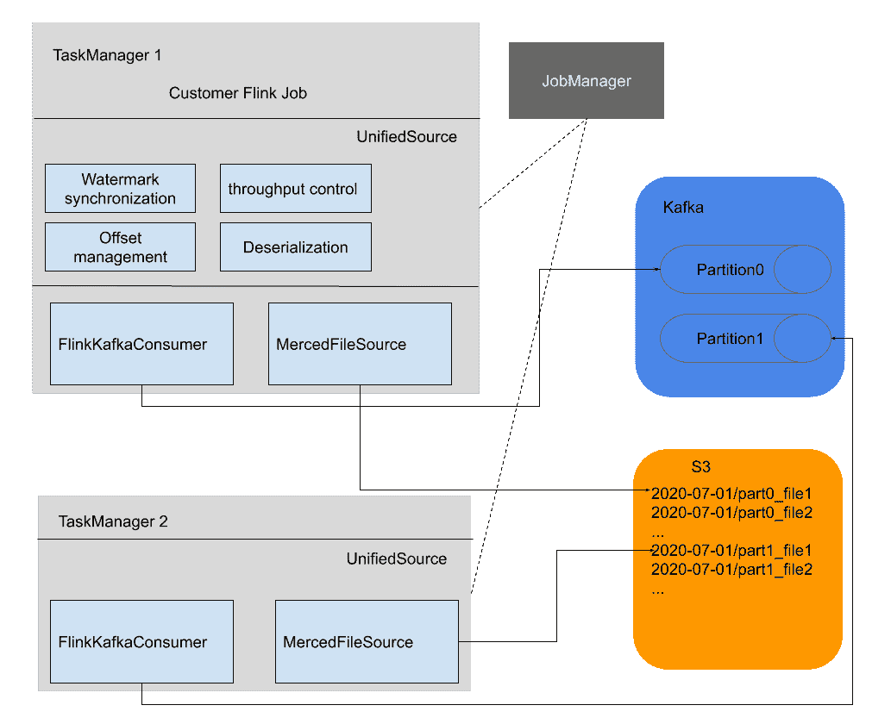
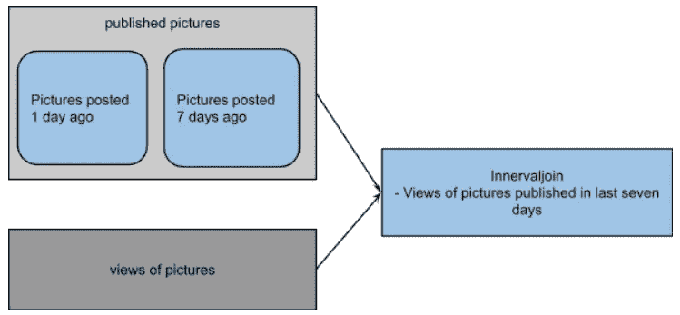
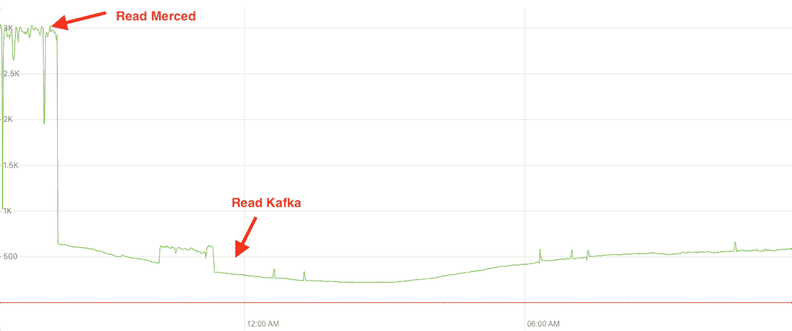
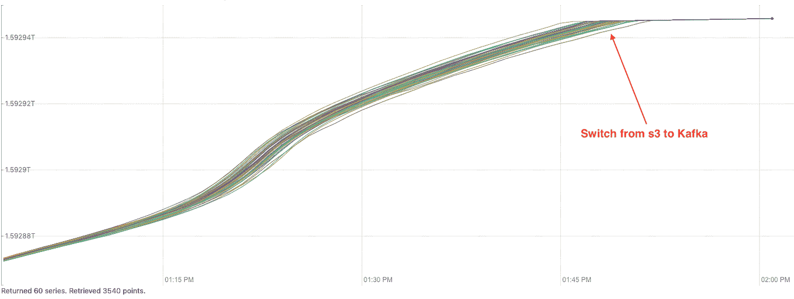

# Pinterest 的统一 Flink 源代码:流数据处理

> 原文：<https://medium.com/pinterest-engineering/unified-flink-source-at-pinterest-streaming-data-processing-c9d4e89f2ed6?source=collection_archive---------4----------------------->

鲁牛和陈琴|软件工程师，流处理平台团队

为了更好地服务于 Pinners、创作者和广告商，Pinterest 利用 Flink 作为其流处理引擎。Flink 是一个在数据流上进行状态计算的数据处理引擎。它提供了丰富的流 API、精确一次支持和状态检查点，这些对于构建稳定且可扩展的流应用程序至关重要。如今，在 Alibaba、网飞和优步等公司的任务关键型使用情形中，都广泛使用了 Flink。

Xenon 是 Pinterest 基于 Flink 的流媒体处理平台。我们的使命是构建一个可靠、可扩展、易于使用和高效的流平台，以实现数据驱动的产品和及时的决策。该系统包括:

*   可靠且最新的 Flink 计算引擎
*   改进了 Pinterest 在流应用程序开发方面的开发速度
*   平台可靠性和效率
*   安全性和合规性
*   文档、用户教育和社区

Xenon 促成了几个关键使用情形，包括:

*   广告实时摄取、支出和报告—根据预算限制实时计算支出，以快速调整预算节奏并为广告商更新更及时的报告结果。
*   快速信号—在内容创建后让内容信号快速可用，并在 ML 管道中使用这些信号以获得定制的用户体验。
*   实时信任与安全—尽可能缩短内容创建时间，从而降低不安全内容的级别。
*   内容激活—将新鲜的创建者内容和表面参与度指标分发给创建者，以便他们可以在最小的反馈延迟内优化其内容。
*   购物—通过近乎实时地更新产品元数据，提供值得信赖的购物产品体验。
*   实验—准确地向工程师交付指标，以加快实验设置、验证和评估。

# 流数据架构

Figure 1: the setup of streaming data infrastructure at Pinterest

1.  辛格是一家高性能的日志代理公司，他将服务主机的日志消息上传到卡夫卡的[。Singer 支持多种日志格式，并保证日志消息至少传递一次。](https://www.confluent.io/blog/running-kafka-at-scale-at-pinterest/)
2.  Merced 是 Secor 的一个变种，它把数据从卡夫卡移到 S3。Merced 保证从卡夫卡到 S3 只有一次的消息持久性。
3.  我们的大多数 Flink 应用程序从卡夫卡消费，并根据不同的使用情形输出到卡夫卡、Druid 或 RocksStore。

尽管我们所有的用例都使用来自卡夫卡的数据，但仅仅访问卡夫卡并不能满足所有的用户需求:

1.  一些用例需要访问历史数据；不过，卡夫卡的数据保留时间很短，从 3 天到不到 8 小时。
2.  我们要求所有用例在投入生产之前都要经过负载测试。通过倒带 Kafka 来模拟负载是不可伸缩的。
3.  通过 Kafka 重放历史数据是一种选择，但这增加了运营成本，基础设施成本增加了 20 倍。

多亏了默塞德，我们手头有了历史数据。因此，我们能够提供一个单一的 API，将历史数据和实时数据连接起来，这就是无限日志的概念。用户能够查找任何偏移量或时间戳，而不用担心哪个存储系统保存数据。

这种设计带来了几个好处:

1.  在 Merced(又名有界流)和 Kafka(又名无界流)中，主题的编码和模式是相同的。不需要额外的努力来将它们转换成一致的视图。
2.  Merced 在 S3 上存储数据，并保留原始的事件排序和分区，只需很少的基础架构成本。通过 Merced 重放数据就像从卡夫卡那里读取原始数据一样。

# 统一源中的功能

## 一个用于实时和历史数据的 API

以下是实施的简要总结:

Figure 2: Unified Source Implementation

1.  UnifiedSource 扩展了[RichParallelSourceFunction](https://ci.apache.org/projects/flink/flink-docs-master/api/java/org/apache/flink/streaming/api/functions/source/RichParallelSourceFunction.html)。每个子任务运行 UnifiedSource 的一个实例，每个实例同时启动 FlinkKafkaConsumer 和 MercedFileSource。FlinkKafkaConsumer 由 Flink 开箱提供；MercedFileSource 能够将 Merced 输出转换为流格式。
2.  在分区调度过程中，保证单个子任务中的 FlinkKafkaConsumer 和 MercedFileSource 得到属于同一个分区的数据，支持从读取文件到 Kafka 的无缝过渡。
3.  为了获取属于同一个分区的所有文件，MercedSource 监听了一个由 Merced Notification system 发布的 Kafka 主题。这样，我们能够处理迟到的事件。
4.  Merced 输出按小时分区，文件命名对 Kafka 的创建时间和分区进行编码。因此，MercedFileSource 能够读取文件并重新创建相同的事件排序和分区。
5.  UnifiedSource 遵循 Flink 最佳实践[从 Kafka](https://ci.apache.org/projects/flink/flink-docs-stable/dev/event_timestamps_watermarks.html#timestamps-per-kafka-partition) 生成水印。API 强制用户提供一个时间戳提取器，KafkaSource 使用它从源代码生成水印。通过这种方式，我们标准化了 Flink 应用中的水印生成。类似地，MercedFileSource 将多个分区的水印更新组合成一个水印流。
6.  Merced 在 Kafka 中观察迟到的事件，并写回已经被 UnifiedSource 使用的先前的数据分区。
7.  有时，跨多个 Merced 分区的事件时间偏差会导致不断增长的水印间隙，从而导致下游检查点压力。我们使用 [GlobalAggregateManager](https://issues.apache.org/jira/browse/FLINK-10887) 实现了跨子任务的水印同步，以将水印保持在全局范围内。

## 流量控制和资源同步

与处理无界流不同，处理和重新处理历史数据需要额外的功能，如流量控制和源同步，以实现稳定的操作。

这里有一个简化的用例来解释这个问题:

一个产品团队希望近乎实时地了解平台上的受众如何查看最近七天发布的 pin。因此，产品团队使用 XenonUnifiedSource 构建了一个 Flink 作业，以获取已发布的 Kafka 日志图片和 Kafka 日志视图。为了让 Flink 作业发布有意义的信息，我们使用一个统一的源来按顺序提取最近七天发布的 pin。

这里使用 filesource 或 Kafka source 有两个问题:

视图主题比发布的 pin 大得多，因此它会消耗大量带宽并减慢发布的 pin 的回填。因为管道是以事件时间的方式编写的，这导致了内部连接操作符中低水位线进程的减慢。随着时间的推移，越来越多的事件被缓冲在内部连接中，等待被清除。这会导致背压和检查点故障。

为了应对流量控制问题，我们开发了每个主题级别的速率限制。大头针的视图被限制在一个较低的比率，并为发布的图片主题快速前进腾出空间。

视图主题应该“等待”，直到整整七天的 pin 发布完成。否则，低匹配率几乎是肯定的。在 Flink 术语中，在图片主题水印视图超过“当前”之前，来自已发布 pin 的水印应该前进到“当前”(启动作业的时间)

针对同步问题，我们开发了基于 [allreduce](https://www.mpich.org/static/docs/latest/www3/MPI_Allreduce.html) 的水印同步实现，并定期更新每个主题的速率限制器阈值。当来自所有子任务的水印达到“当前”时，图片源 ratelimiter 的视图仅被授予提取 Kafka 主题的配额。

# 使用 UnifiedSource 构建可靠的 Flink 应用

UnifiedSource 的好处不仅限于轻松访问实时和历史数据。它还提供了其他好处:

1.  UnifiedSource 提供了开箱即用的功能，如反序列化器、水印生成、流量控制和损坏的消息度量。这使得 Flink 开发人员可以专注于业务逻辑实现。
2.  用户现在能够通过加载固定数据集来生成确定性结果，并根据代码更改或框架升级来验证正确性。
3.  在 Pinterest，关键的 Flink 作业在进入生产之前需要经过负载测试。通过 UnifiedSource 模拟流量负载比倒带 Kafka 偏移量更具可扩展性和成本效益。

*(simulating large load through UnifiedSource)*

*watermark change when transferring from file to Kafka*

# 我们在招人

我们一直在发展我们的流处理平台，未来会有有趣的挑战和机遇。如果您有兴趣与我们一起应对大数据挑战，[加入我们](https://www.pinterestcareers.com/#utm_source=medium&utm_medium=blog-article-link&utm_campaign=niu-qin-july-15-2021)！

# 感谢

感谢陈汉娜和张昂的评论。感谢 Divye Kapoor 和 Karthik Anantha Padmanabhan 在近实时星系框架中的集成。感谢我们的客户团队、广告测量、核心产品索引、内容质量，感谢早期采用和反馈。感谢全流处理平台团队的支持。

# 参考

[GitHub:Pinterest/歌手](https://github.com/pinterest/singer)

[LogDevice:日志的分布式数据存储](https://engineering.fb.com/core-data/logdevice-a-distributed-data-store-for-logs/)

[Keystone 实时流处理平台|网飞科技博客](https://netflixtechblog.com/keystone-real-time-stream-processing-platform-a3ee651812a)

[用于特征生成的分布式时间旅行|网飞科技博客](https://netflixtechblog.com/distributed-time-travel-for-feature-generation-389cccdd3907)

[为实时数据流处理设计生产就绪的 Kappa 架构](https://eng.uber.com/kappa-architecture-data-stream-processing/)

[使用 Apache Flink 和 Amazon Kinesis Data Analytics for Java Applications 构建和运行流媒体应用](https://aws.amazon.com/blogs/big-data/build-and-run-streaming-applications-with-apache-flink-and-amazon-kinesis-data-analytics-for-java-applications/)

[FLIP-134:数据流 API 的批处理执行](https://cwiki.apache.org/confluence/display/FLINK/FLIP-134%3A+Batch+execution+for+the+DataStream+API)