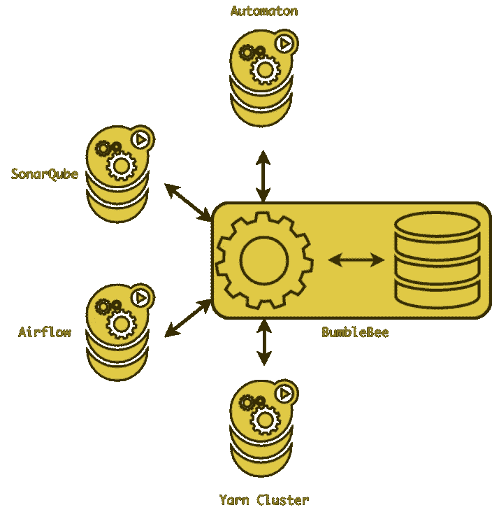
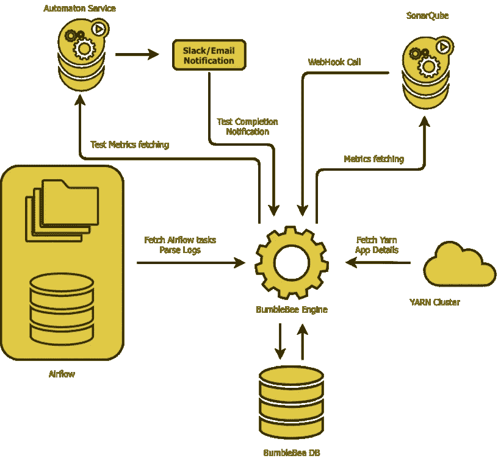

# 使用 BumbleBee 统一监控 ETL 性能

> 原文：<https://medium.com/walmartglobaltech/unified-monitoring-of-etl-performance-with-bumblebee-bc2580954584?source=collection_archive---------2----------------------->

在大数据领域，ETL 过程的性能很重要，但是对这种过程性能的监控也是一个同样重要的方面。

这里，当我们谈论监控时，不仅仅是 ETL 过程有多好或多快。我们还考虑给定工作流相对于其父和子(ren)工作流的完整性、给定工作流的代码质量等属性。

有一组工具可用于测量这些属性并将其显示在仪表板上。这种工具计算与特定属性相关联的特定指标。在单个控制面板中显示工作流的所有这些指标是一项挑战。虽然拥有一个统一的仪表板有其优势。单一仪表板将提供整个工作流程的整体绩效的整体视图。

在沃尔玛，我们有各种工具/框架来衡量代码质量、负载测试、单元测试等指标。这些框架有它们自己的计算指标，当然，这些指标是分开存储的。

由于所有这些指标的数据源各不相同，因此很难在一个地方获得所有指标的统一视图。因此，某些指标有多个控制面板，用户应该了解所有相应的控制面板，以便导航到正确的控制面板。

为了解决上述问题，我们提出了一个名为“BumbleBee”的聚合服务，旨在累积各种指标。

**为什么是大黄蜂？**

这个想法类似于大黄蜂所做的。一只大黄蜂从一朵花走到另一朵花，以采集油桃，并将油桃转化为花蜜，花蜜也可以被其他人食用。因此这个工具被命名为大黄蜂。

BumbleBee 从代码质量、纱线利用率、负载/性能测试结果等来源收集各种指标，并将它们保存在一个数据库(nectar)中，这反过来使我们能够在团队级别的一个仪表板上显示所有相关指标。

**大黄蜂生态系统:**

**大黄蜂是什么？**

BumbleBee 是一个 Scala 服务，它将来自不同来源的各种性能指标聚合到一个数据库中，这个数据库可以再次用作仪表板的真实来源。它可以部署在能够连接到 airflow DB 的任何边缘节点上。它还可以通过适当的配置与 Yarn APIs 对话。它使用各种组件，如 ServiceRunner 容器，它负责以定义的时间间隔进行轮询，以及在分析完成时从 Sonar 得到通知的 web 钩子。

BumbleBee 开始检索气流应用和与该气流应用相关的纱线资源(如果有的话)。但现在，它通过同时轮询气流和纱线，从气流和纱线中读取所有应用程序细节(即使不与任何气流应用程序相关联)。

随着集成测试(针对 ETL 工作负载)在气流上运行，BumbleeBee 服务被进一步扩展以跟踪集成测试指标。我们正在存储任务级信息，以便我们可以从纱线端获得集成测试工作流程及其资源消耗的粒度视图。除此之外，它还可以跟踪来自 Automaton(负载/性能测试工具)的性能/负载测试指标和来自 Sonar-Qube 的代码质量指标，以分别提供 API 性能和代码质量标准的趋势。

BumbleeBee 中的轮询是如何工作的？

BumbleBee 有一个非常简单的流程来持续跟踪和检索这些指标。它连续轮询(可配置)具有给定配置的相应服务，如项目详情、相应纱线簇等。检索指标，并将其存储到具有合适模式的数据库中。所有这些指标都存储在同一个数据库下的不同表中。任何 BI 工具都可以用来连接数据库，并根据编写的查询可视化聚集的指标。

**设计图:**

**深入了解大黄蜂的工作原理**

对于气流任务，BumbleBee 会检查自上次执行以来创建或完成的任务，并将它们的详细信息保存到数据库中，然后尝试从气流任务日志中检索纱线应用程序 id(如果可用)。

在检索到 yarn 应用程序 id 后，它进一步检索应用程序资源，如内存、内核、执行时间等。用于纱线组。一旦我们有了气流纱应用程序，我们需要一些机制来识别其中的集成测试工作流程。BumbleBee 在配置中有一个规定，您可以传递有效的工作流前缀，即使它们没有关联的 Yarn 应用程序 id，也会被考虑在内。随着这一改变，它开始存储父集成测试工作流及其任务。

Automaton 对 API 服务执行负载测试，并将通过电子邮件和 slack 通道发布结果，因此 BumbleBee 可以使用该 slack 通道来读取负载测试更新，它将尝试从 Automaton API 获取负载/性能测试指标，并将存储 API 和状态代码级别的指标，这些指标也可以汇总以显示项目级别的性能。

BumbleBee 使用 Web 钩子和执行器从 Sonar 获取代码质量度量。它有一个网络挂钩，可以为任何声纳项目进行配置。当给定项目的代码分析完成时，Sonar 称之为 web 钩子。在 web 钩子调用时，BumbleBee 从 Sonar 获取代码质量度量，并将它们存储在数据库中。

有了 BumbleBee，我们计划走出孤岛，将服务/ETL 性能的所有重要指标放在一个仪表板上。大黄蜂(昆虫)采集的花蜜是富含糖分的，同样，我们大黄蜂采集的花蜜(度量)是数据丰富的。这些指标不仅对可视化或仪表板有用，而且有助于确定性能改进的候选对象。