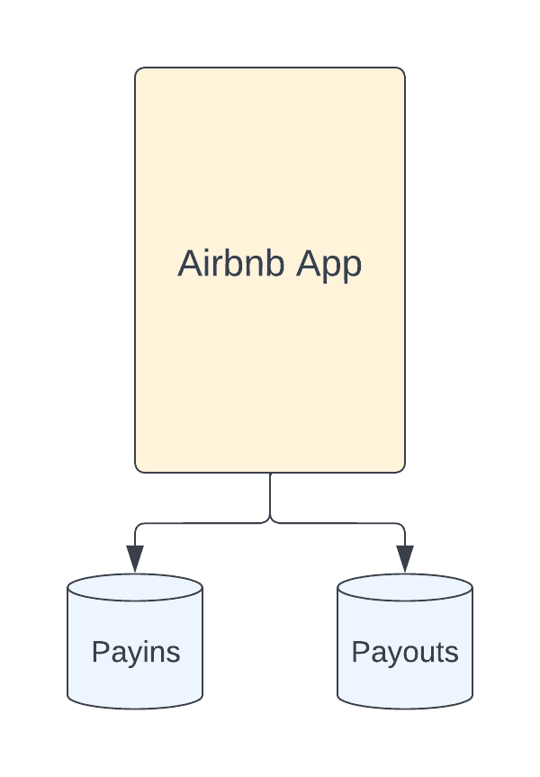

# 在 Airbnb 读取统一支付数据

> 原文：<https://medium.com/airbnb-engineering/unified-payments-data-read-at-airbnb-e613e7af1a39?source=collection_archive---------2----------------------->

我们如何重新设计支付数据读取流程以优化客户端集成，同时实现高达 150 倍的性能提升。

作者:[阿里·高克塞尔，](https://www.linkedin.com/in/ali-can-g%C3%B6ksel-7189214a)朱玲龙，[伊夏·毛](https://www.linkedin.com/in/yixiamao)

# 介绍

近年来，Airbnb 将其大部分后端服务从整体迁移到面向服务的架构(SOA)。这种行业标准架构给一个 Airbnb 这种规模的公司带来了无数的好处；然而，它并非没有挑战。由于数据分散在许多服务中，很难以简单高效的方式提供客户需要的所有信息，特别是对于支付等复杂领域。随着 Airbnb 的发展，这个问题开始出现在许多新的计划中，如主机收入、税单生成和支付通知，所有这些都需要从支付系统中读取数据。

在这篇博文中，我们介绍了 Airbnb 的统一支付数据读取层。这个读取层是为减少客户端集成的摩擦和复杂性而定制的，同时极大地提高了查询性能和可靠性。通过这种重新架构，我们能够为我们的主机和来宾社区以及信任、合规和客户支持领域的内部团队提供极大优化的体验。

# Airbnb 支付平台的演变

支付是 Airbnb 应用最早的功能之一。自从我们的联合创始人 Nate 第一次承诺以来，支付平台已经取得了巨大的发展和进步，并且随着我们全球业务的不断扩张，它还将继续以更快的速度发展。

与其他公司类似，Airbnb 以单一的应用程序架构开始了它的旅程。由于特性集最初是有限的，写和读支付流都“相对”简单。

Overly simplified diagram of Airbnb’s old monolithic architecture. Payments schemas were not very complex, and the feature set was limited.

可以预见的是，这种架构无法很好地适应我们公司的快速增长和扩张。支付，连同技术栈的大多数其他部分，开始迁移到 SOA 架构。这带来了对现有架构的重大革新，并提供了许多优势，包括:

*   我们在不同的服务之间有明确的界限，这使得更好的领域所有权和更快的迭代成为可能。
*   数据以非常规范的形式被划分到不同的域中，从而提高了正确性和一致性。

更多信息，请看我们的博客文章[详细介绍了支付 SOA 迁移。](/airbnb-engineering/rebuilding-payment-orchestration-at-airbnb-341d194a781b)

After the SOA migration, every payments subdomain has its own service(s) and tables with clear boundaries, but more features leads to more complex and normalized data.

# 新架构带来新挑战

支付 SOA 为我们提供了更具弹性、可伸缩性和可维护性的支付系统。在这个漫长而复杂的迁移过程中，系统的正确性是我们的首要任务。根据每个团队的职责，数据被标准化并分散在许多支付领域。这种分工有一个重要的副作用:表示层现在经常需要与多个支付服务集成，以获取所有需要的数据。

How payments data read flows looked after the SOA migration. Presentation services called one or more payments services and aggregated data at the application layer.

在 Airbnb，我们相信我们的主人和客人社区是透明的。我们与支付和收入相关的界面显示一系列细节，包括费用、交易日期、货币、金额和总收入。在 SOA 迁移之后，我们需要查看多个服务，并从比迁移之前更多的表中读取数据，以获得所有请求的信息。自然，当我们想要添加带有支付数据的新表面时，或者当我们想要扩展现有表面以提供更多细节时，这个基础带来了挑战。我们需要解决三个主要挑战。

第一个挑战是*客户现在需要充分了解支付领域* 以选择正确的服务和 API。对于来自其他团队的客户工程师来说，这需要大量的时间投入，并且会降低整体上市时间。在支付方面，工程师需要提供持续的咨询和指导，占据了他们工作时间的很大一部分。

第二个挑战是，在很多情况下，我们必须同时更改多个支付 API，以满足客户需求。当*有太多的接触点*时，很难对请求进行优先排序，因为许多团队都必须参与其中。这个问题也对上市时间造成了重大的负面影响。当调整和优先级会议进展不顺利时，我们不得不放慢或推迟特性发布。类似地，当支付团队必须更新他们的 API 时，他们必须确保所有的表示服务都采用这些变更，这减慢了支付系统的进度。

最后但同样重要的是，复杂读取流的技术质量没有达到我们的预期。应用级聚合对于一般的用例来说工作得很好，但是对于我们的大型主机，尤其是我们的 prohosts，我们还有改进的空间，他们可能在我们的平台上有数千个年度预订。为了对我们的系统有长期的信心，我们需要找到一种解决方案，提供内在更好的 ***性能、可靠性和可扩展性*。**

# 介绍支付统一数据读取层

为了实现我们雄心勃勃的支付目标，我们需要重新思考客户如何与我们的支付平台集成。

# 统一入口点

我们的首要任务是统一支付数据读取入口点。为了实现这一点，我们利用了 Airbnb 面向数据的服务网格[高架桥](/airbnb-engineering/taming-service-oriented-architecture-using-a-data-oriented-service-mesh-da771a841344)，在这里，客户可以查询“实体”,而无需识别数十种服务及其 API。这种新的架构要求我们的客户只需担心必要的数据实体，而不必与各个支付服务进行通信。

Instead of communicating with individual payments services, presentation services just use the read layer.

在这些入口点中，我们提供了尽可能多的过滤选项，这样每个 API 都可以对其客户端隐藏过滤和聚合的复杂性。这也大大减少了我们需要公开的 API 的数量。

# 统一的高层数据实体

有一个单一的入口点是一个好的开始，但是它不能解决所有的复杂性。在支付领域，我们有 100 多个数据模型，这需要相当多的领域知识来清楚地了解他们的职责。如果我们只是从一个单一的入口点公开所有这些模型，对于客户工程师来说仍然需要太多的上下文。

我们没有让客户处理这种复杂性，而是选择通过提出**更高级域实体**来尽可能隐藏支付内部细节。通过这一流程，我们能够将核心支付数据减少到不到十个高级别实体，这大大减少了暴露的支付内部细节的数量。这些新实体也让我们能够保护客户免受支付平台变化的影响。当我们在内部更新业务逻辑时，我们保持实体模式不变，而不需要在客户端进行任何迁移。我们对新架构的原则如下:

*   **简单**:为非支付工程师设计，使用通用术语。
*   **可扩展的**:保持与存储模式的松散耦合，封装概念以保护支付内部变化，同时允许快速迭代。
*   **丰富**:隐藏的是复杂性，而不是数据。如果客户需要获取数据，他们应该能够在实体的 ***之一*** 中找到。

Expose cleaner higher-level domain entities to hide payments internal details while guarding clients from frequent API migrations.

# 物化非规范化数据

通过统一的入口点和实体，我们极大地降低了客户端加入的复杂性。然而，获取数据的“*”以及昂贵的应用层聚合仍然是一个巨大的挑战。虽然客户能够顺利地与支付系统集成很重要，但我们尊贵的社区也应该享受我们平台上的体验。*

*我们发现的核心问题是 ***在客户端查询*** 期间对许多表和服务的依赖性。一个有希望的解决方案是反规范化——本质上，将这些昂贵的操作从查询时间转移到摄取时间。我们探索了不同的方法来预先反规范化支付数据，并以不到 10 秒的复制延迟可靠地将其具体化。幸运的是，我们在 Homes Foundation 团队中的朋友正在试验一个读取优化的商店框架，它采用事件驱动的 lambda 方法来实现二级索引。使用这个框架，团队能够通过数据库更改捕获机制获得接近实时的数据，并利用存储在 Hive 中的每日数据库转储获得历史数据。此外，与其他现有的内部解决方案相比，该框架的维护需求(例如，用 Java 编写的用于在线和离线接收的单一代码)要低得多..*

**

*A high-level look at the read-optimized store framework usage by payments. It provides ingestion flows for both offline and near real-time data with shared business logic between them.*

*综合上述所有改进后，我们新的支付读取流程如下所示:*

**

*The final shape of the payments data read architecture. Clients do not need to know any payments services or internals.*

*我们通过非规范化的读优化存储索引以可靠和高性能的方式提供数据。*

# *结果*

# *迁移和提升:事务历史记录*

*新的统一数据读取体系结构的第一个测试面是事务历史(TH)。我们平台上的主机使用[交易历史页面](https://www.airbnb.com/users/transaction_history)查看他们过去和未来的支出以及顶级收入指标(例如，总支出金额)。*

*在技术方面，这是我们遇到的最复杂的支付流程之一。需要许多不同的细节，数据来自 **10+** 支付表。这在过去造成了一些问题，包括超时、加载时间慢、硬依赖导致的停机，以及复杂实现导致的迭代速度慢。在为从 Airbnb monolith 到 SOA 的迁移做最初的技术设计时，我们选择了重新构建这个流程的艰难道路，而不是应用创可贴。这有助于确保长期成功，并为我们的东道社区提供最佳体验。*

****

*Transaction History page and simplified high level architecture. Airbnb monolith app behaves like a presentation service and fetches data from multiple payment services and also from legacy databases.*

*这个用例非常适合我们的统一读取层。使用 TH 使用的数据作为起点，我们提出了一个新的 API 和高级实体，以服务于来自类似领域的所有数据读取用例。*

*锁定实体及其模式后，我们开始对数据进行反规范化。多亏了 read-optimized store framework，我们能够将 10 多个表中的所有数据反规范化到几个弹性搜索索引中。我们不仅大大减少了查询的接触点，而且通过利用存储层而不是在应用程序层执行相同的操作，我们还能够更高效地进行分页和聚合。经过近两年的工作，我们迁移了 100%的流量，并实现了高达*150 倍的延迟改善，同时将流量的可靠性从约 96%提高到 ***99.9+%*** *。***

****

**After the re-architecture, payments data needed by Transaction History is provided by payments read-optimized store and accessed by clients using a well-defined and extensible payout schema over the unified data read layer.**

# **开启新体验:客人付款历史**

**我们的下一个用例叫做客人支付历史，来自 Airbnb 的年度全公司黑客马拉松。这个黑客马拉松项目旨在为我们的访客社区提供一个详细而简单的方法来跟踪他们的付款和退款。与交易历史类似，这个场景也需要来自多个支付服务和数据库的信息，包括许多遗留数据库。**

**客人支付历史(GPH)也有助于展示统一读取层带来的许多好处:一个新的统一实体，用于 GPH 和未来类似的用例，以及支持许多不同过滤器的可扩展 API。我们使用读取优化存储框架将遗留和 SOA 支付表中的数据反规范化并存储到一个单一的弹性搜索索引中，这大大降低了查询的复杂性和成本。**

**我们在 2021 年冬季发布会上向我们的社区发布了这一新页面，并大幅减少了与客人付款相关的客户支持问题；这为 2021 年节省了近 150 万美元的成本。它还展示了我们向更强大的高可靠性和低延迟技术基础的迈进。**

****

**Guests can track their payments and refunds using Guest Payment History.**

**该架构与 TH 非常相似，在 TH 中，数据通过统一的 API 和模式提供给客户端，并由二级存储提供支持。**

**在通过 TH 和 GPH 公开这些新实体后，我们开始使用许多其他关键用例来利用相同的流程，以便高效地提供和展示支付数据。**

# **结论**

**微服务/SOA 架构极大地帮助后端团队独立地扩展和开发各种域，而彼此之间的影响最小。同样重要的是，要确保这些服务的客户端及其数据在这种新的行业标准架构下不会受到额外的挑战。**

**在这篇博客文章中，我们展示了一些潜在的解决方案，比如统一的 API 和更高级别的实体，以向调用者隐藏内部服务和架构的复杂性。我们还建议利用非规范化的辅助数据存储在摄取期间执行代价高昂的连接和转换操作，以确保客户端查询保持简单和高性能。正如我们在多项计划中展示的那样，支付等复杂领域可以从这些方法中显著受益。**

**如果你对这类工作感兴趣，可以看看以下相关职位:**

****美国**:**

**[员工软件工程师，支付](https://careers.airbnb.com/positions/3393185/)**

****印度**:**

**[班加罗尔城市高级软件工程师](https://careers.airbnb.com/positions/3153981/)**

**[大使平台产品工程经理](https://careers.airbnb.com/positions/3842855/)**

**[工程付款合规经理](https://careers.airbnb.com/positions/2768475/)**

**[员工软件工程师，支付合规](https://careers.airbnb.com/positions/2773515/)**

**[支付合规高级软件工程师](https://careers.airbnb.com/positions/2925359/)**

# **感谢**

**我们 Airbnb 的许多人都为这一大规模的重新架构做出了贡献，但还有无数人要感谢 Mini Atwal、Yong Rhyu、Musaab At-Taras、Michel Weksler、Yang、Linglong Zhu、、Huayan Sun、、、Erika、、Will Koh、Ethan Schaffer、Khurram Khan、David Monti、Colleen Graneto、Lukasz Mrowka、Bernardo Alvarez、Blazej Adamczyk、Dawid Czech、Marcin Radecki、Tomasz Laskarzewski 杰罗伊德·马克斯、何伊、袁航、·鲍、、塞丽娜·李、特里萨·约翰逊、白彦博、吕瑞泽、许德川、、焦裕团、何、高塔姆·普拉贾帕蒂、亚什·古兰尼、阿卜杜勒·沙基尔、乌帕尔·戈亚尔、·孔、克莱尔·汤普森、帕维尔·拉胡茨基、帕特里克·康纳斯、本·鲍勒、加布里埃尔·西奎拉、、马尼什·辛格哈尔、张素淑、倪京毅、莫一朗、阿比纳夫·赛尼和阿吉马尔·普拉姆比。 没有你们的宝贵贡献，我们不可能取得这样的成就。**

# ********************

***所有产品名称、标识和品牌都是其各自所有者的财产。本网站中使用的所有公司、产品和服务名称仅用于识别目的。使用这些名称、标志和品牌并不意味着认可。***