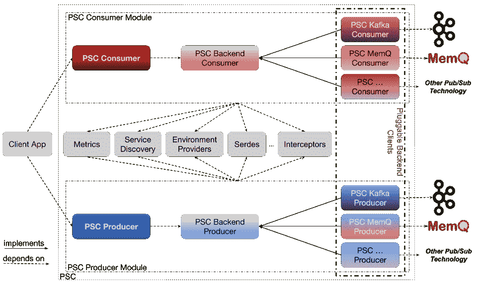

# Pinterest 的统一 PubSub 客户端

> 原文：<https://medium.com/pinterest-engineering/unified-pubsub-client-at-pinterest-397ccfaf508e?source=collection_archive---------1----------------------->

瓦希德·哈什米安|软件工程师，测井平台
杰夫祥|软件工程师，测井平台

在 Pinterest，日志平台团队管理 PubSub 层，并为与之交互的客户端提供支持。在 PubSub 层的核心，有两个主要的系统负责数据的进出:

1.  [阿帕奇卡夫卡](https://kafka.apache.org/)(以下简称卡夫卡)
2.  [MemQ](/pinterest-engineering/memq-an-efficient-scalable-cloud-native-pubsub-system-4402695dd4e7)

在过去的几年里，我们从运营经验中了解到，我们的客户和业务需要降低 KTLO 成本，他们希望平台团队不仅拥有服务器/服务，还拥有客户端/ SDK 以及与客户端-服务器连接产生的任何问题相关的随叫随到，这样他们就可以专注于应用程序逻辑。

作为一个平台团队，我们希望提高我们平台的可扩展性和效率(例如，通过改进 PubSub 系统)，这反过来可能需要对客户机/ SDK 进行快速更改。

为了实现我们提高日志平台服务质量(QoS)的目标，我们决定投资并拥有 PubSub 客户端/ SDK。使用本地客户端并在此基础上添加一些增值功能(尽管是一项艰巨的任务)，将有助于解决我们的可扩展性、稳定性和开发速度目标。这就是为什么我们决定实现一个统一的 PubSub 客户端库，称为 PubSub 客户端(PSC)。

# 为什么是另一个客户？

直到大约两年前，卡夫卡还是 Pinterest 的单一 PubSub 系统，大部分数据管道仍然运行在卡夫卡上。客户端应用程序使用卡夫卡客户端库连接到卡夫卡集群，并产生或使用数据。这种对卡夫卡客户的直接依赖带来了自身的挑战:

**1。降低开发速度** 由于客户端应用程序和卡夫卡式经纪人之间的直接依赖关系，它们没有被充分隔离。一方面，客户端应用程序(PubSub 平台的用户)很容易受到代理端变化的影响。例如，根据使用的客户端库的版本，它们可能会受到代理升级的影响。

另一方面，PubSub 平台团队也有自己的挑战。他们不能简单地升级卡夫卡经纪人，因为对客户端应用程序的潜在影响是未知的，因为不了解正在使用的客户端库版本(参见我们之前的文章[)是什么。](https://www.confluent.io/blog/running-kafka-at-scale-at-pinterest/#kafka-upgrade)

底线:在 PubSub 层和客户端应用程序之间缺乏明确的所有权界限，这是由于应用程序对 PubSub 客户端库的紧密依赖。

**2。服务的可靠性** 任何 PubSub 客户端库都带有一套全面的配置，一般的应用程序开发人员可能并不完全熟悉。如果没有适当的客户端跟踪手段，平台团队就无法了解哪个应用程序正在使用什么配置。这不仅会因为潜在的错误配置而影响应用程序的性能，还会对 PubSub 平台产生负面影响，导致依赖该平台的其他应用程序出现级联问题。

作为 PubSub 平台团队，我们面临的另一个可靠性问题是客户端应用程序对 Kafka 集群“端点”(即种子代理)的紧密依赖。尽管动态发现集群端点的方法是可用的，但我们不能简单地强制执行它们，并且我们最终会在集群维护或代理退役/替换期间中断使用硬编码端点的客户端应用程序。

**3。服务的可伸缩性** 我们的策略是让底层 PubSub 实现的细微差别对客户端应用程序透明。这种透明性意味着 PubSub 层的平台团队有更多的自由:

*   诸如代理维护、重新配置、扩大/缩小或扩大/缩小，或者将工作负载从一个 PubSub 无缝转移到另一个 pub sub(例如 Kafka 到 MemQ，Kafka 到 Pulsar，反之亦然)之类的事情可以在更少担心对客户端应用程序的负面影响的情况下完成。
*   客户端应用程序将不再严格受限于发布订阅系统或对其采取的操作。

没有这种透明性，可伸缩性就会受到严重威胁。只需要一个对某些 PubSub 维护操作敏感的应用程序，就可以严重限制平台团队完全自动化维护操作。这种敏感性的原因可能是应用程序架构/逻辑、PubSub 客户端库的特定用法或客户端库中的潜在边缘情况(例如，生产者的静态分区)。迁移到统一的客户端库将统一所有客户端应用程序的期望，并有助于减少这些不希望出现的情况。

统一的 PubSub 客户端库减少了客户端应用程序和 PubSub 层之间的相互依赖，并提供:

*   **一致的指标和警报:**指标/警报模板提供了对发布订阅层的一致视图。
*   **服务发现:**开箱即用，而不是每个客户端应用程序都必须处理它。
*   **优化配置:**某些配置(如默认值)可以自动实施，冲突的配置可以自动纠正。
*   **拦截优势:**众多功能，如计费和成本计算、审计、损坏消息检测和删除、自动错误处理等。可以添加到这个中间层。
*   **PubSub 切换的简易性:**由于客户端应用程序依赖于一组统一的 PubSub APIs，因此从一个 PubSub 切换到另一个 PubSub 就像更改主题引用一样简单。该库可以在切换前后在内部处理和同步状态(例如，消耗偏移)。

我们选择实现 100%客户端解决方案而不是代理服务有几个原因:

1.  代理服务会带来额外的基础架构开销(对我们来说是 10%-20%)，因为在创建数据副本时会有额外的一跳。
2.  代理服务将增加从发布订阅者到消费者的端到端延迟，这对于我们的一些客户端用例来说是不可接受的。
3.  由于代理服务更复杂的性质(特别是与 Pinterest 的联盟状态相比)，生产一个完全客户端的库比代理服务更快。

尽管有上述原因，但由于 PSC 的内部实现对客户端应用程序是透明的，因此在将来切换到或添加代理服务时没有障碍。

# PSC 架构

PSC 的架构如图 1 所示。



Figure 1\. PSC Architecture

主要的 PSC 接口是 PSC 生产者和 PSC 消费者。每个 PSC 生产者和消费者可以管理一个或多个后端(Kafka、MemQ 等。)生产者和消费者。图中的每个后端消费者都是一个 PSC 构造，直接使用后端 PubSub 的客户端库。例如，PSC Kafka 消费者使用 Kafka 消费者库。

PSC 生产者和消费者都利用公共功能，如指标收集和报告、服务发现、环境感知、服务/设计、拦截器等。

# 突出

我们必须做出几个设计决策来定义 PSC 应该如何工作。我们在本节中回顾其中的一些。

## 话题 URI

如前所述，我们希望用 PSC 解决的一个挑战是让应用程序开发人员不必解决集群发现和分配问题。出于这个原因，我们提出了主题 URI 的概念，作为每个 PubSub 主题的唯一标识符。它可以是 UUID 的形式或任何其他商定的格式。这是资源名称约定的一个示例:

```
protocol:/rn:service:environment:cloud_region:cluster:topic. 
```

例如:

```
plaintext:/rn:kafka:prod:aws_us-west-1:shopping:transaction
```

必要时，PSC 生产者和消费者使用 PSC 的发现模块将该主题 URI 转换为适当的 PubSub 端点。请注意，用于消息消费/生产的安全协议也包含在 URI 中—这消除了在每个应用程序的基础上重复配置特定于协议的配置(例如 SSL 配置)的需要，从而简化了客户端登录过程并防止了错误配置。

## 发布订阅覆盖范围

根据设计，PSC 生产者或消费者在创建时不会绑定到任何特定的 PubSub 实现或集群。例如，这与在创建时用引导服务器配置 Kafka 生产者或消费者的方式不同。这意味着一个 PSC 生产者或消费者可以连接到潜在不同类型的多个 PubSub 集群。

## 配置

PSC 配置涵盖了来自不同 PubSub 系统的常见配置，同时提供了一个传递选项来注入与特定 PubSub 客户端相关的配置。

PSC 自带一套专用的配置。这些配置不需要任何翻译，因为它们与任何后端 PubSub 行为无关。例如，度量报告、启用/禁用自动解析等的配置。

## 蜜蜂

由于 Kafka 是 Pinterest 的主要 PubSub 技术，并且应用程序开发人员已经熟悉了它的客户端库，我们决定尽可能接近 Kafka APIs signature。

## 可插拔性

假设 PSC 是一个通用的客户端库，那么提供可插拔性作为第一类特性是很重要的，在这里可以加载额外的 PubSub 客户端库或额外的特性。PSC 中的可插拔模块包括:

*   PubSub 生产者/ PubSub 消费者装载新的 PubSub 客户端库。
*   集群端点发现到发布订阅端点的板载自定义发现方法。
*   环境提供商到板载自定义环境规范实施(例如 AWS EC2)。这有助于自动配置客户端功能的不同方面(例如，基于位置、实例大小等)。)
*   拦截器装载定制模块，在发送/接收消息时起作用。

## 交易生产者

假设 PSC 客户端到 PubSub 集群的连接不是在创建时实现的，而是在实际需要连接到 PubSub 集群时实现的(例如，当发送消息或轮询消息时)，事务性 PSC 生产者的状态转换与诸如 Kafka 的 PubSub 系统的事务性生产者的状态转换不完全匹配，在 Kafka 中，客户端在初始化时立即连接到单个 Kafka 集群。

PSC 客户端作为 PubSub 客户端库的包装器工作(例如 Kafka 生产者/消费者)。虽然 PSC 客户端在创建时并不直接绑定到 PubSub 集群，但后端客户端是这样的。因为后端生产者是直接依赖于 PubSub 生产者的实体(例如 Kafka 生产者)，所以它的事务状态需要与 PubSub 生产者的事务状态同步。因此，当涉及事务 API 时，我们必须为 PSC 生产者和后端生产者实现状态图，以便与 PubSub 生产者(例如 Kafka 生产者)保持一致。

## Apache Flink 集成

[Apache Flink ️](https://flink.apache.org/) 是 Pinterest 的流媒体平台，支持越来越多的用例。为了确保 PSC 的广泛采用，我们实现了一个 Flink PSC 连接器(基于 Flink Kafka 连接器实现)。由于该连接器使用主题 URIs 来引用 PubSub 主题，因此我们实现了一种转换机制，以便 Flink PSC 生产者和消费者可以从 Flink Kafka 生产者和消费者生成的快照(检查点、保存点)中恢复。

# 未来的工作

随着 PSC 的采用，我们已经开始看到我们之前描述的好处。然而，我们仍然需要完成路线图中的其他几个里程碑。我们和应用程序所有者从 PSC 获得的一个主要好处是，我们可以轻松地对 PSC 的内部进行更改，以开发新功能，并使用简单的依赖关系更新来推广这些新功能。即将推出的 PSC 功能包括:

1.  自动错误处理和配置更新:PSC 可以在需要时自动更新相关配置。例如，当启用 Kafka producer 的幂等性时，需要相应地设置一些其他配置。此外，当后端客户端抛出某些错误时，PSC 会提供一个额外的层，可以在其中实现自动解决此类错误的逻辑。例如，有时客户端可能无法正确轮换其 SSL 证书(我们已经看到 Flink 客户端观察到这个问题)。在这种情况下，重置客户端是一个破坏性远远小于向应用程序冒泡异常的选项。PSC 提供了错误处理框架，将异常与适当的处理策略(跳过、抛出、重试、重置等)联系起来。).
2.  消息审计和损坏处理:使用 PSC 体系结构，可以使用生产者/消费者拦截器来跟踪数据流的沿袭和沿途损坏的位置，从而实现这一可选特性。
3.  动态客户端重新配置:可以优化某些客户端配置和设置，例如，通过分析吞吐量(例如，可以持续监控消费者的轮询超时或生产者的批处理大小或批处理持续时间，并根据流量模式的变化进行更新，以优化 PubSub 管道的健康状况)。我们还计划使用一个集中的配置模型来动态地推动全局和特定的配置变更。
4.  无缝后端切换:当一个 PubSub 主题从一种 PubSub 类型转移到另一种 PubSub 类型时，PSC 也应该能够迁移状态，比如消费者偏移量。

我们还计划用 C++、Python 和 Go 等其他语言实现 PSC。我们还开始了开源项目的进程，以吸引更广泛的社区参与。

# 确认

如果没有 Ambud Sharma 的持续和重要的设计和技术支持，PSC 的现状是不可能的。平-林敏也为项目的设计和实施做出了重大贡献。特别感谢测井平台和 Xenon 平台团队、王春燕和戴夫·伯吉斯的持续指导、反馈和支持。

**免责声明**

阿帕奇️、阿帕奇卡夫卡、卡夫卡、阿帕奇 Flink 和 Flink 是阿帕奇软件基金会的商标。

*要在 Pinterest 了解更多关于工程的知识，请查看我们的* [*工程博客*](https://medium.com/pinterest-engineering) *，并访问我们的*[*Pinterest Labs*](https://www.pinterestlabs.com/?utm_source=medium&utm_medium=blog-link&utm_campaign=hashemian-xiang-march-15-2022)*网站。要查看和申请空缺职位，请访问我们的* [*职业*](https://www.pinterestcareers.com/?utm_source=medium&utm_medium=blog-link&utm_campaign=hashemian-xiang-march-15-2022) *页面。*