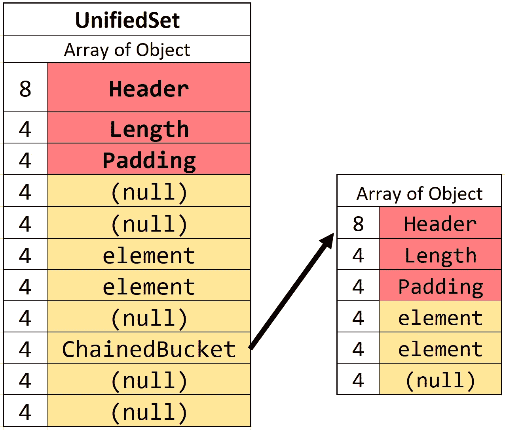
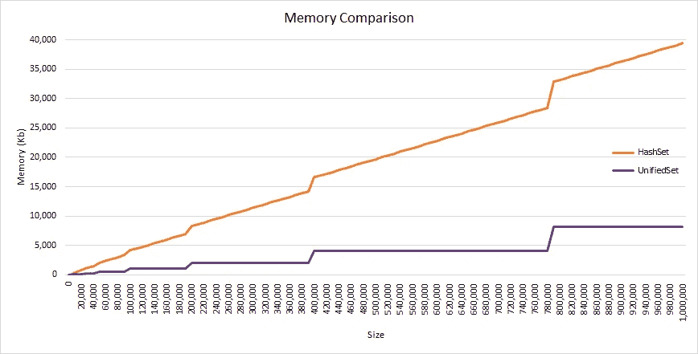
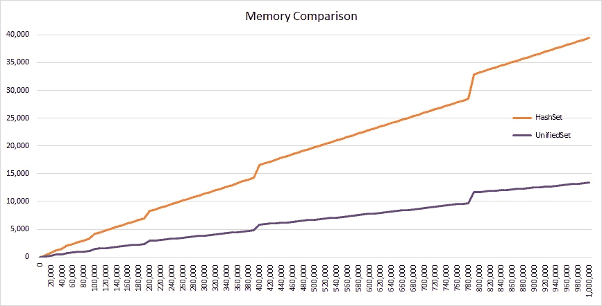
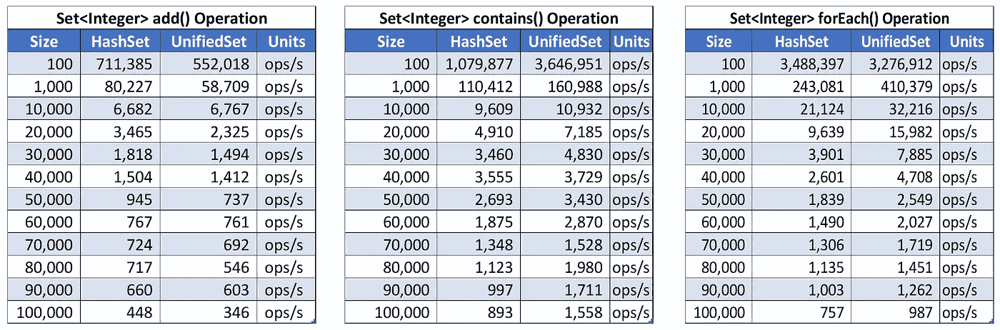
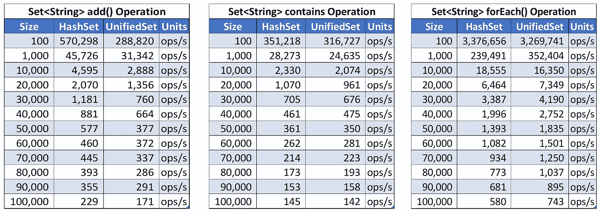
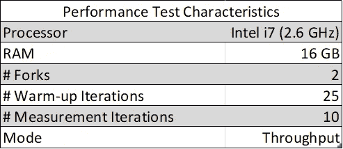

# UnifiedSet —内存节约器

> 原文：<https://medium.com/oracledevs/unifiedset-the-memory-saver-25b830745959?source=collection_archive---------1----------------------->

[https://www.eclipse.org/collections/](https://www.eclipse.org/collections/)

在我之前的博客中，我解释了 Eclipse 集合 [UnifiedMap 如何工作](/oracledevs/unifiedmap-how-it-works-48af0b80cb37)。在这篇博客中，我们将看到 [Eclipse Collections](https://github.com/eclipse/eclipse-collections) 中的 UnifiedSet 是如何工作的。

**统一设置**

UnifiedSet 是 Eclipse 集合的集合实现，它的实现与 JDK 散列集非常不同。UnifiedSet 基于类似于 UnifiedMap 的原理。

JDK java.util.HashSet 由 java.util.HashMap 支持。支持 HashMap 具有与支持映射中的对象相关联的虚拟值:`HashMap<E,Object> map`，`Object ***PRESENT*** = new Object()` 这种设计导致 HashSet 继承了 HashMap 的行为。HashMap 由一个条目对象表支持。条目实现有`hashcode, key, value, next`作为成员，HashMap 本质上缓存了键的 hashcode。此外，由于这个伪值，HashSet 最终会使用比所需更多的内存。

另一方面，UnifiedSet 是作为一个集合实现的，即它没有任何“虚拟”空值对象，它不受条目对象表的支持。
UnifiedSet 由扁平数组支持。每个对象占用后备数组中的一个槽。通过创建一个更精简的实现，扁平数组只存储所需的对象。将对象放在展平的数组中也可以提高迭代的性能。主数组中的冲突通过放置一个名为`ChainedBucket`的特殊对象来处理。`ChainedBucket`是另一个存储碰撞元素的数组。

像 UnifiedSet 中的`contains`这样的查找模式使用标准的 [hashcode 索引算法](https://github.com/eclipse/eclipse-collections/blob/master/eclipse-collections/src/main/java/org/eclipse/collections/impl/set/mutable/UnifiedSet.java#L214)来查找元素的位置。如果索引处的元素是*而不是*一个链接的 Bucket，那么简单地检查元素的存在。如果索引处的元素是 ChainedBucket，则线性评估后备数组以找到所需的元素。

因为 UnifiedSet 不缓存 hashcode，所以对于每次查找，都需要计算 hashcode。因此，UnifiedSet 的性能直接依赖于 UnifiedSet 中对象的 hashcode 实现。

下面是 JDK 1.8 HashSet 和 Eclipse 集合 9.2.0 UnifiedSet 之间的一些内存和性能比较。

**内存占用(数字越低越好)**

Memory Comparison HashSet<Integer> vs UnifiedSet<Integer>

Memory Comparison HashSet<String> vs UnifiedSet<String>

**性能测试(数字越高越好)**

内存测试和性能测试的源代码可以在 [GitHub](https://github.com/nikhilnanivadekar/MemoryPerformanceTest) 上获得。

**总结:**

1.  与 JDK 散列集相比，Eclipse 集合 UnifiedSet 的内存占用要少 75%。
2.  对于 add()操作，JDK 哈希集的性能比 Eclipse 集合 UnifiedSet 稍好。
3.  对于 contains()操作，JDK 哈希集和 Eclipse 集合 UnifiedSet 的性能是相似的。
4.  对于 forEach()操作，Eclipse 集合 UnifiedSet 比 JDK 散列集执行得更好。

**Eclipse 集合资源:**
[Eclipse 集合](https://github.com/eclipse/eclipse-collections)自带[列表](https://www.eclipse.org/collections/javadoc/9.0.0/org/eclipse/collections/impl/list/mutable/FastList.html)、[集合](https://www.eclipse.org/collections/javadoc/9.0.0/org/eclipse/collections/impl/set/mutable/UnifiedSet.html)和[映射](https://www.eclipse.org/collections/javadoc/9.0.0/org/eclipse/collections/impl/map/mutable/UnifiedMap.html)的实现。它还拥有额外的数据结构，如[多重映射](https://www.eclipse.org/collections/javadoc/9.0.0/org/eclipse/collections/api/multimap/Multimap.html)、[包](https://www.eclipse.org/collections/javadoc/9.0.0/org/eclipse/collections/api/bag/Bag.html)和一个完整的原始集合层次结构。我们的每一个集合都有一个丰富的 API 用于通常需要的迭代模式。

1.  [网站](https://www.eclipse.org/collections/)
2.  [GitHub 上的源代码](https://github.com/eclipse/eclipse-collections)
3.  [投稿指南](https://github.com/eclipse/eclipse-collections/blob/master/CONTRIBUTING.md)
4.  [参考指南](https://github.com/eclipse/eclipse-collections/blob/master/docs/guide.md#eclipse-collections-reference-guide)

*表示支持* [*星美上 GitHub*](https://github.com/eclipse/eclipse-collections/stargazers) *。*