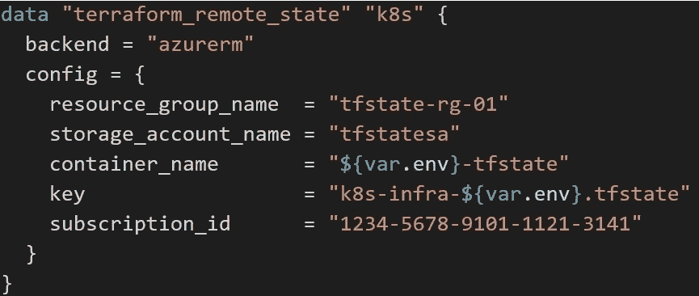
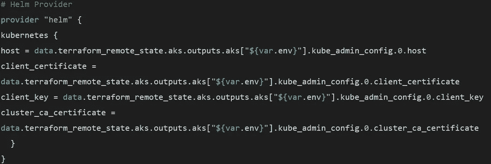
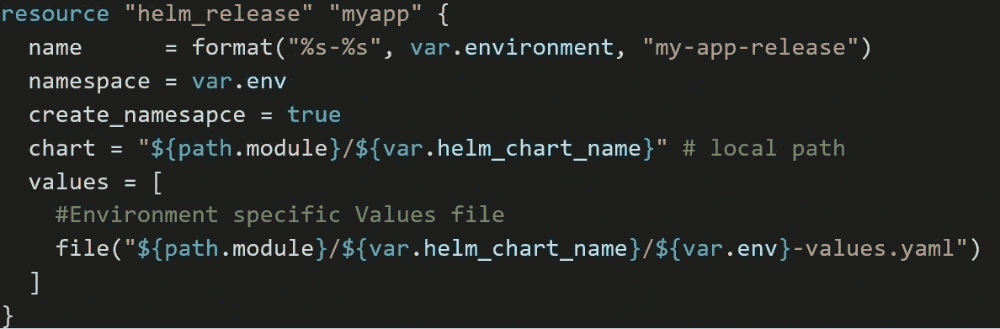

# 使用 Terraform 统一基础架构和应用部署

> 原文：<https://medium.com/version-1/unifying-infrastructure-and-application-deployments-with-terraform-9c8e251d68ea?source=collection_archive---------1----------------------->

# 选择正确的工具

有这么多 DevOps 工具争夺您的注意力，要确定最适合您需求的正确工具可能会非常困难。在过去的 4、5 年里，我一直与 Terraform 合作，在多个云提供商(主要是 AWS 和 Azure)之间部署和管理基础设施。最近，我与许多客户合作，在云中部署和成熟他们的 Kubernetes 托管的应用程序。我想探索是否有更简单的方法来管理与每个 DevOps 领域(即 IaC 部署和 k8s 应用程序版本)的发布生命周期相关的复杂性。

Terraform 通过*提供商为大多数(如果不是全部)公共云提供支持；*便于与每个公共云的 API 集成的插件。由于 Terraform 还提供了对管理 Kubernetes 和 Helm 资源的支持，因此在管理 Kubernetes 和/或 Helm Chart 版本时利用这些提供者是有意义的；同时实现在 Terraform 中采用单一统一工具的优势。从版本 1 的角度来看，Terraform 是一个很好理解的工具(特别是从云集成的角度来看)，因此当将范围扩大到 Kubernetes 或 Helm 这样的新提供商时，进入的障碍很低。同样，通过采用单一工具，我们有助于减少与管理和支持大型云资产相关的运营开销。

这篇文章的目的是展示如何利用 Terraform 和 Azure DevOps 来管理底层 Kubernetes 基础设施部署和应用程序版本的 Helm Charts 的生命周期。

# 假设

为了举例说明这种方法在现实场景中是如何实现的，我做了以下假设:

*   开发团队负责管理应用程序的源代码和每个应用程序的容器映像的生命周期。例如，当使用新功能更新源代码时，会触发构建管道，并将新图像推送到 Azure Container Registry。
*   然后这个 Azure Continuer 注册表就可以让我们的 Helm Chart 下拉图片了

# 知识库结构

为了与最佳实践保持一致，并在我们的云基础架构部署中提供可预测性和一致性，我们始终鼓励使用 Terraform 模块来提供向后兼容性和安全配置。在这个例子中，我创建了三个 Terraform *根*模块(下面将详细描述)，每个模块实例化一个或多个 Terraform *子模块*(更多关于子模块和根模块[的区别，这里是](https://www.terraform.io/language/modules/syntax))。

所有模块——无论是根模块还是子模块——都对应于一个专用的 Azure DevOps 存储库和一个专用的 Azure DevOps 管道。有许多例子表明 Terraform 模块被嵌入到存储库的本地目录中，但是这种方法不被推荐，因为它降低了可伸缩性。

Terraform 根模块及其管理的资源如下所述。为了说明每个模块的内容，我还包含了一个目录结构的*树*。

*订阅-基线-模块*

这个 Terraform 模块负责*启动/初始化*Azure 订阅。当使用新的订阅时，这是应该调用的第一个模块。至少，它应该配置为部署 Azure 策略和订阅范围的密钥库。Azure Policy service 允许我们在任何工作负载部署之前对订阅实施组织和治理控制，因此降低了影子 IT 的可能性。例如，在这里，我们将定义允许我们部署到的 Azure 区域，我们的虚拟机应该符合多大的 SKU 规模，等等。作为该模块的一部分部署的密钥库提供了一个秘密存储，后续的 Terraform 模块/管道将利用该秘密存储来创建/检索秘密、密钥等。

> *TF-az-root-su B- baseline/
> ├──az-policy . TF
> ├──config
> │├──dev . TF vars
> │├──prd . TF vars
> │└──UAT . TF vars
> ├──key-vault . TF
> └──vars . TF
> 1 个目录，6 个文件*

*k8s-基础模块*

该模块将部署托管 Azure Kubernetes 服务(AKS)集群所需的底层基础设施。作为该模块的一部分部署的资源包括虚拟网络(包括子网、路由表、网络安全组—所有这些都在虚拟网络*子*模块中抽象)、AKS 集群本身、PaaS SQL 数据库(用于持久存储数据)和跳转虚拟机(用于在部署后访问集群的 Ubuntu VM)。

可以想象，这里部署的许多资源都需要一个秘密存储来托管或检索敏感数据。例如，SQL 数据库需要用户名和密码。为此，我们将利用作为上述*订阅-基线-模块*的一部分而创建的密钥库。

> *TF-az-root-k8s-infra/
> ├──aks . TF
> ├──config
> │├──dev . TF vars
> │├──prd . TF vars
> │└──UAT . TF vars
> ├──SQL . TF
> ├──vars . TF
> └──vnet . TF
> 1 目录，7 个文件*

舵释放模块

本模块将通过掌舵图的方式部署和管理应用程序版本。请参见下面的代码片段，它展示了这个存储库的目录结构。请注意，舵图位于存储库的本地。

> *TF-az-root-helm-release/
> ├──配置
> │├──dev . TF vars
> │├──prd . TF vars
> │└──UAT . TF vars
> ├──helm-chart
> │├──dev-values . YAML
> │├──prd-values . YAML
> │├──模板
> │├──deployments . YAML
> │├──ingress-controller。*

# 部署顺序和依赖关系

对于初始部署，上述根模块应按照其布局顺序进行部署，即首先部署*订阅-基线-模块*，然后部署

*k8s-红外模块*，随后是*舵释放模块*。通常，订阅基线模块将是相对静态的，并且仅在需要新的 Azure 策略或需要新的订阅范围的资源时更新。

在向 AKS 集群部署资源之前，*舵释放模块*需要对 AKS 集群进行认证。我们不是将 Terraform 指向一个本地 *kubeconfig* 文件来针对集群进行身份验证，而是通过使用 *terraform_remote_state* 数据源来检索必要的凭证。该数据源将允许我们从作为 *k8s-infra-module* 的一部分部署的资源中检索详细信息。下面举例说明了如何使用该数据源。

在配置 Helm provider 时，我们可以安全地检索必要的凭证，而不必硬编码或手动输入任何机密。下面的片段说明了这是如何实现的。

出于这个例子的目的，我使用了一个位于 *helm-release-module* 库的本地 Helm 图表。使用这种方法，我们需要配置我们的 Terraform 代码，以指向图表的位置，即路径。类似地，我们需要配置特定于环境的值文件的路径，该文件应该根据我们要部署到的环境来调用。

# 结论

本练习的目的是验证 Terraform 头盔供应商的能力。由于只掌握了 Helm CLI 工具的补救知识，我想评估将提供者与更常见的 Terraform 提供者(即 azurerm 提供者)集成所需的工作量。这个过程非常简单。

使用 Terraform 管道以声明方式部署 Helm 图表的好处显然超过了创建单独的 Helm CLI 管道的替代选项。后者引入了一种新工具，需要进一步的培训，并增加了解决方案整体管理的复杂性。诚然，当涉及到对 *helm_resource 的问题进行故障诊断和评估时，*我建议需要具备 Helm CLI 的中级知识。

# 进一步的考虑

*   在这种情况下，正在部署的订阅将为特定产品( *myapp* )托管一个环境，因此一个产品/DevOps 团队负责部署/发布到该环境。如果这是一个共享订阅，其中多个产品由多个产品/开发运维团队部署，我们通常会将虚拟网络和 AKS 组件拆分为独立的根模块，以减少与每个应用版本相关的爆炸半径，并限制这些核心组件的暴露。
*   在版本 1 中，我们开发了成熟的持续集成和持续部署模式，以受控和治理的方式管理所有 Terraform 部署，例如通过在部署前引入各种林挺、验证、安全检查和测试。上面没有详细介绍这些内容。
*   这篇文章没有说明如何管理多个环境，以及如何以一种受治理的方式控制部署，例如，通过配置对拉请求的批准，禁止推送到主/发布分支，等等
*   为了移动到更成熟的 GitOps 模型，*舵释放模块*可以被配置为在每次新舵图表被推送到 ACR 时触发。
*   除了使用 Key Vault，创建 Azure DevOps 变量组在运行时将秘密注入管道也是一个可行的选择。然而，这意味着您现在有两个地方来管理对敏感数据的访问和权限。用于所有 Terraform 管道的单个订阅范围的密钥库极大地减少了这种管理开销。
*   最好的做法是在一个独立的人工制品中对你的舵图进行版本控制，类似于容器的版本控制，而不是将舵图存放在一个标准的 Git 存储库中。Azure Container Registry 现在支持托管头盔图表作为 OCI 人工制品，这将允许我们在运行 Terraform 时下拉特定的图表版本，并消除本地托管图表的需要。

**关于作者:** 马克·凯利是这里版本 1 的云架构师。