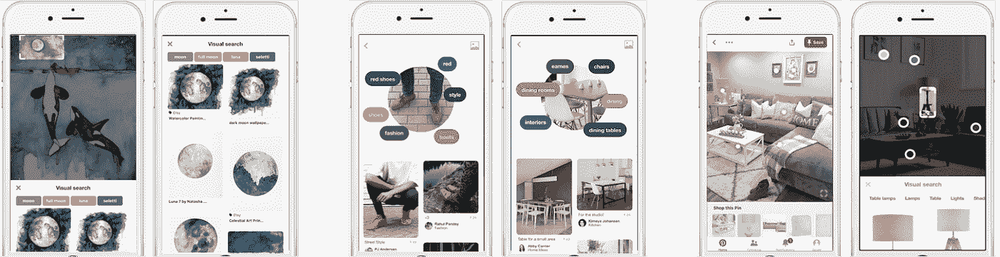
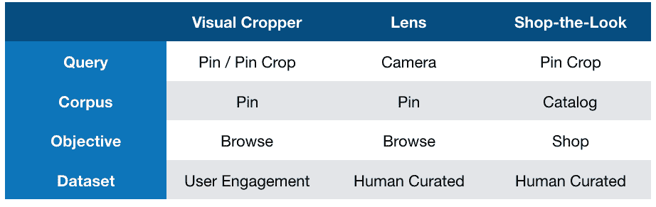
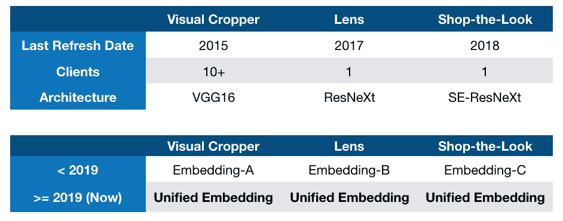
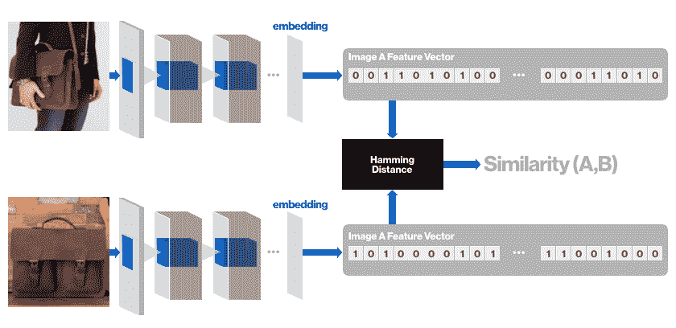
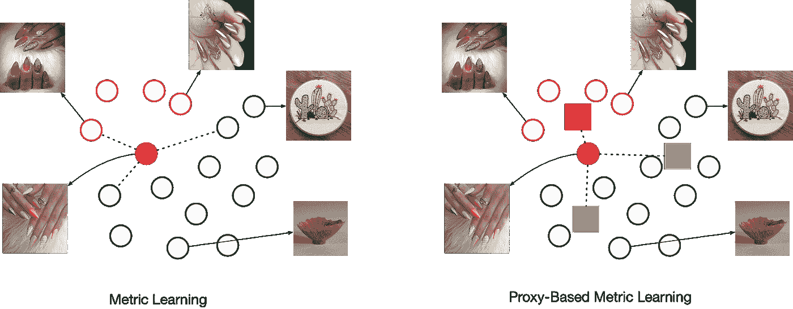
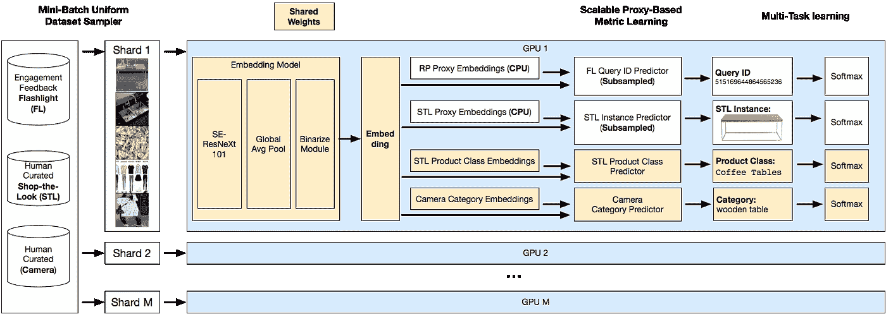
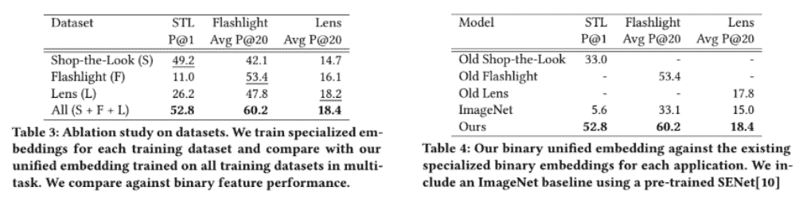
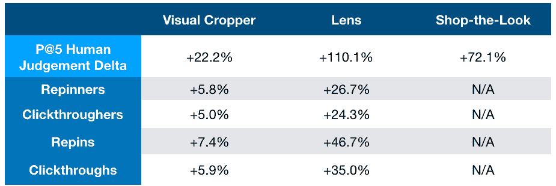
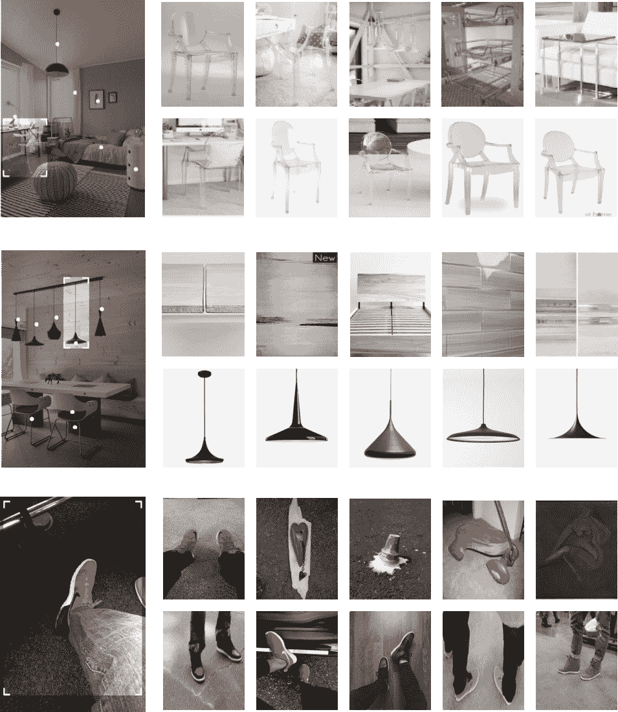

# Pinterest 视觉搜索的统一视觉嵌入

> 原文：<https://medium.com/pinterest-engineering/unifying-visual-embeddings-for-visual-search-at-pinterest-74ea7ea103f0?source=collection_archive---------3----------------------->

**Andrew Zhai | Pinterest 视觉搜索技术主管**

多年来，Pinterest 已经推出了各种由计算机视觉驱动的视觉搜索产品，以帮助人们发现新的想法和产品。我们在 2015 年开始使用我们的[视觉裁剪工具](/@Pinterest_Engineering/introducing-a-new-way-to-visually-search-on-pinterest-67c8284b3684)，允许用户在一个大头针的图像内搜索(例如一个更大的客厅场景中的一盏灯)，并在 Pinterest 上浏览视觉上相似的内容。2017 年，我们推出了[镜头相机搜索](/@Pinterest_Engineering/building-pinterest-lens-a-real-world-visual-discovery-system-59812d8cbfbc)，通过将每一个 Pinner 的手机相机变成一个强大的发现系统，将 Pinterest 的视觉搜索开放到现实世界。2019 年，我们推出了[自动化购物外观](/@Pinterest_Engineering/automating-shop-the-look-on-pinterest-a17aeff0eae2)，以便 Pinners 可以在 Pinterest 家居装饰场景中找到并购买确切的产品。视觉搜索是 Pinterest 增长最快的产品之一，每月有数亿次搜索。

这些视觉搜索技术的核心是**视觉嵌入**，它为匹配系统提供动力，使 Pinners 能够通过 Pin 或相机浏览任何图像中的 2000 多个想法，并搜索准确的产品。视觉搜索不仅将发现从在线扩展到了离线，还允许 Pinterest 上的任何 Pinterest 链接，并进一步搜索。

# 视觉嵌入的演变

这些年来，Pinterest 视觉嵌入在建模和数据方面都有所发展。

我们在 2014 年开始了视觉嵌入的工作，因为我们的目标是开发我们第一个生产化的视觉搜索产品:[视觉裁剪工具](/@Pinterest_Engineering/introducing-a-new-way-to-visually-search-on-pinterest-67c8284b3684)。我们大量利用 Pinterest 的参与度数据集，因为我们的目标是制作一个查询和语料库都是 Pin 图像的产品。当我们在 2016 年开始研究[镜头](/@Pinterest_Engineering/building-pinterest-lens-a-real-world-visual-discovery-system-59812d8cbfbc)时，我们面临的最大挑战是学习相机查询图像到大头针图像的域转换。因为相机图像通常不是我们通常在 Pinterest 上看到的高度引人入胜的视觉内容类型，所以我们收集了一个人类策划的数据集，将相机图像与 Pin 图像进行匹配。同样，当我们的目标是在 2018 年[实现外观](/@Pinterest_Engineering/automating-shop-the-look-on-pinterest-a17aeff0eae2)的自动化商店时，我们希望专门针对精确的产品匹配进行优化。使用现有的 Shop the Look 数据集作为嘈杂的候选集，我们再次利用人工监管来生成高质量的精确产品匹配训练数据集。在数据集工作的同时，我们自然地推进了 SOTA 图像分类架构，从 2014 年的 AlexNet 和 VGG16 开始，到 2016 年的 ResNet 和 ResNeXt，以及 2018 年的 SE-ResNeXt。

**Visual cropper, Lens, and Shop-the-Look optimize for different objectives. With the visual cropper, we want to optimize for general Pinterest browsing over our corpus of 200B+ ideas, with Lens we need to optimize for the domain shift of camera to Pin images, and with Shop-the-Look, we look to find exact product matches from our catalog of products.**

当用新的嵌入来改进现有的应用程序时，我们会用更新的、性能更好的嵌入来替换旧的嵌入。然而，在为新应用开发嵌入时，本着模块化设计和简单性的精神，我们将特定于应用的数据集与 SOTA 模型架构一起应用，并为新应用生成**新的独立**嵌入。然而，随着时间的推移，我们观察到每个应用(视觉裁剪器、镜头相机搜索、购物外观)都有单独的嵌入成为了一项技术债务**随着我们的重点转移到为每个新应用开发/改进现有应用的嵌入，同时底层培训基础设施也在发展。这方面的一个例子是在 2019 年之前，视觉裁剪器嵌入最后一次部署是在 2015 年，使用 Caffe 作为训练/服务框架，以 VGG16 作为主干模型。相比之下，2018 年嵌入的商店外观依赖于我们的 PyTorch 培训和以 SE-ResNeXt 为骨干的 Caffe2 服务基础设施。视觉裁剪器嵌入作为 Pinterest 内 10 多个客户的一般内容信号也非常重要，因为它是通过 Pinterest 参与培训的，而我们较新的嵌入专注于人类策划的信号，对 Pinterest 生态系统的影响较小。**

**Over the years, we developed independent embeddings for specific visual search products, making it difficult to simultaneously improve our visual search products. We look to simplify with one unified visual embedding for all visual search products.**

就我们所拥有的工程资源而言，我们显然无法继续用我们当前的嵌入式开发范例扩展到新的应用程序。由于成本和工程资源的限制以及对提高性能的兴趣，我们的目标是学习一种统一的多任务视觉嵌入，它可以在所有三种视觉搜索应用程序中运行良好。

# 度量学习背景

我们的视觉嵌入是图像的压缩矢量化表示，它是卷积神经网络的输出，该网络通过度量学习针对目标相似性进行训练。

**Visual similarity is defined by the distance between visual embeddings extracted from convolutional neural networks.**

传统上，度量学习在显式关系数据集上训练，其中一个例子是三元组数据集( **q** 、 **p** 、 **n** )，其中我们有一个 **q** 锚图像、一个已知与 **q** 相关的 **p** 正图像和一个不相关的 **n** 负图像。在训练期间，图像嵌入被明确地相互比较。度量学习的主要挑战之一是决定如何选择最有信息量的负面图像。

或者，基于代理的度量学习在分类数据集( **q、**“钉子”)、( **p** “钉子”)、( **n** “碗”)上训练，其中图像之间的关系被隐式定义；相似的图像共享相同的标签，而不同的图像具有不同的标签。在训练期间，图像嵌入与分类损失中的标签嵌入(代理)进行比较。负采样问题通过基于代理的方法得以缓解，因为我们通常具有比图像少得多的标签，这允许我们在训练的每个小批迭代期间比较大量负标签嵌入的图像嵌入(有时将所有标签嵌入放入 GPU 存储器中)。在 Pinterest，我们用**基于代理的范例**来训练我们的视觉嵌入，因为我们已经看到[至少基于代理的方法与传统度量学习方法的性能](https://arxiv.org/abs/1811.12649)相当。

**Metric Learning learns relationships between images explicitly. Proxy-Based Metric Learning learns relationships between images implicitly by clustering images to their relevant labels**

# 作为解决方案的统一视觉嵌入

扩展了我们之前的工作中[的**基于代理的方法**，我们通过将特定于应用的数据集与多个 softmax 分类损失相结合来训练我们的多任务视觉嵌入。特定于应用的数据集被均匀地混合在每个微型批次中，并且所有任务共享一个公共基础网络，直到生成嵌入，此时每个任务分裂成其各自的分支。每个任务分支只是一个完全连接的层(其中权重是代理)，后跟 softmax 交叉熵损失。我们用 PyTorch 以分布式数据并行方式训练我们的模型，用 FP16 训练，使用](https://arxiv.org/abs/1811.12649) [Apex](https://github.com/NVIDIA/apex) 库和[扩展](https://github.com/NVIDIA/apex/pull/252)来支持我们的架构。请查看我们的[KDD 19 年论文](https://arxiv.org/abs/1908.01707)了解详情，例如特定应用数据集的可视化、训练期间的子采样代理以提高训练效率，以及我们嵌入的二进制化以提高服务效率。

**Our visual embedding model architecture trained with PyTorch DistributedDataParallel with FP16 Mixed Precision training**

使用每个应用程序的离线检索指标(视觉裁剪器(图钉内的视觉搜索)、镜头相机搜索、购物外观)，我们看到:

1.  数据集上的多任务处理导致所有应用程序的性能优于在相应应用程序上使用相同架构在每个特定于应用程序的数据集上进行的训练。
2.  我们的统一嵌入优于旧部署的应用程序专用嵌入，后者的改进来自更新的数据集和更好的模型架构。有了我们的统一嵌入，我们现在有了一个既易于维护(一个模型来训练和维护)又优于现有基准的框架。

# 影响

离线指标显示，我们的统一嵌入优于现有系统。然而，为了推出我们的嵌入，真正重要的是在线 A/B 实验，我们跨应用测试了两个版本的系统，一个使用统一嵌入，另一个使用当前为相应应用部署的专用嵌入。在 Pinterest，我们衡量参与度和相关性，前者来自实时用户反馈，后者来自专门针对特定产品目标的人工判断模板(例如，浏览与购物、视觉裁剪与相机)。

**Human Judgement (first row) and A/B experiment engagement results on our visual search products. Overall our unified visual embedding led to significant gains in relevance and engagement over our existing specialized embeddings.**

总的来说，统一嵌入在参与度和相关性方面表现非常好，如上表所示。重复和点击率衡量的是参与该行为的用户百分比，而重复和点击率衡量的是行为量。自动化商店当我们评估我们的统一嵌入时，外观正在开发中，因此没有它的实时 A/B 实验结果。统一嵌入也导致了大量的成本节约，因为我们能够在一个嵌入下统一我们的视觉搜索检索基础设施。

**Visualization of the specialized embeddings (first row) vs unified visual embedding (second row) on the Visual Cropper. We can see by combining all training datasets into one model, we have a unified visual search system that is optimized for Pin engagement, can find exact products, and semantically understand camera images well.**

# 结论

我们已经在 Pinterest 的所有视觉搜索产品中推出了统一嵌入并替换了专用嵌入。嵌入式统一使我们能够简化我们的培训和服务基础设施，并在全球范围内迭代所有产品，因此我们可以更快地实现我们最重要的目标:为 Pinners 构建和改进 Pinterest。

感谢阅读！这项工作的更多细节在我们的[KDD 19 年的论文](https://arxiv.org/abs/1908.01707)中呈现。

*鸣谢:视觉嵌入是 Pinterest 的一项合作成果。特别感谢、Eric Tzeng、Dong Huk Park、Chuck Rosenberg、Raymond Shiau、Kunlong Gu、、Josh Beal、Eric Kim、Jeffrey Harris、Angela Guo、Dmitry Kislyuk 和 Michael Feng 在本项目中的合作。*