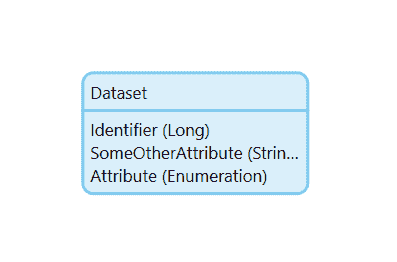
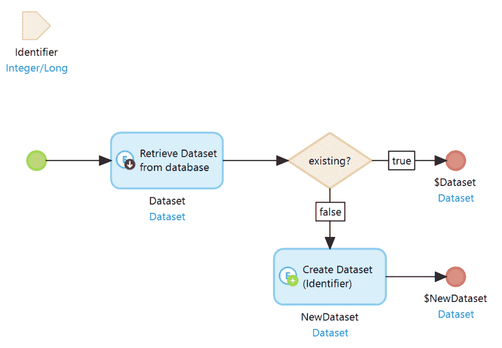
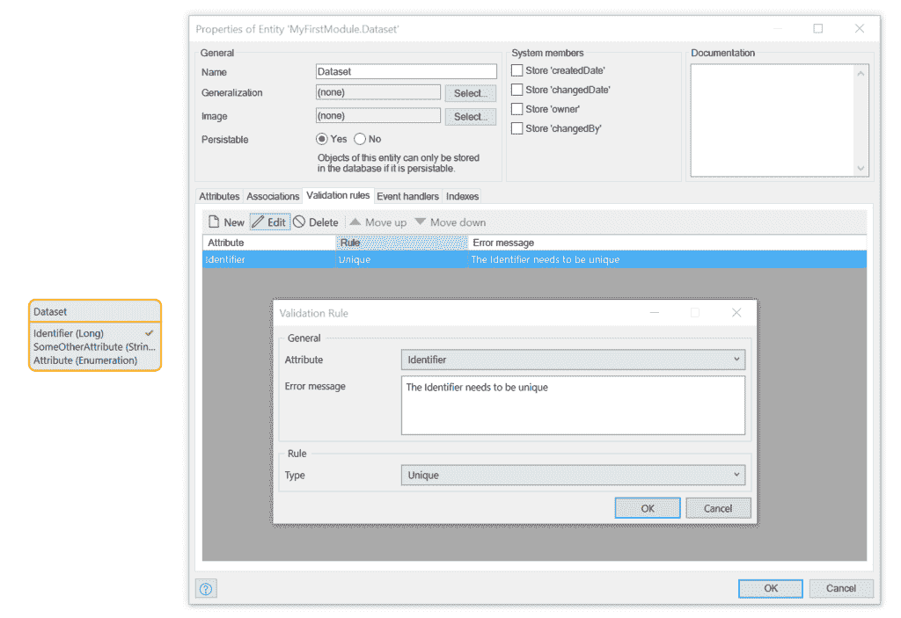
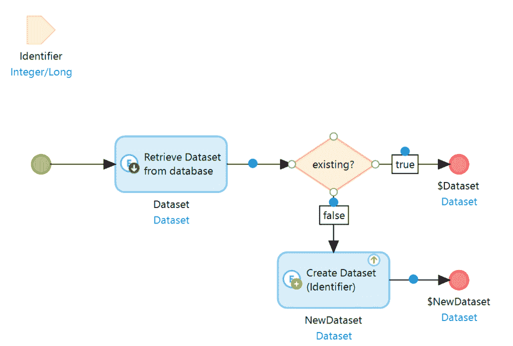
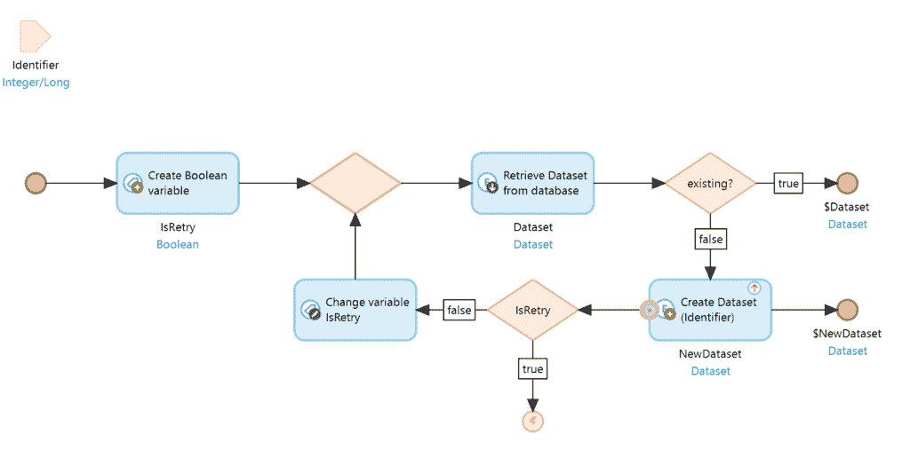

# 唯一外键和并发性:Mendix 和我

> 原文：<https://medium.com/mendix/unique-foreign-keys-and-concurrency-mendix-and-me-3f30c10b7898?source=collection_archive---------1----------------------->

# 尽管 Mendix 通过域模型管理关系，并且您通常不会接触到键和外键，但很可能您会到达需要它们的时候。典型的例子是避免跨模块关联，或者避免从第三方系统接收数据并希望在本地缓存。

在许多情况下，一个密钥只需要存在一次。例如，如果从外部系统同步记录，您希望避免多次存储同一记录。一种简单而有效的方法是使用 CreateOrRetrieveIfExisting 模式。

让我们来看看下面的数据集:

标识符属性是唯一键。如果需要具有某个键的记录，可以对现有记录使用 CreateOrRetrieveIfExisting 微流，或者，如果没有这样的记录，则创建一个新记录。这用于事件驱动系统，其中另一个系统中的事件创建或更改必须保持同步的记录。相应的微流现在看起来如下:

对于给定的标识符，系统现在从数据库中搜索数据记录，并在必要时创建它。这样，您可以确保总是获得一条记录，并且一条记录只存在一次。

[https://bit.ly/MXW21](https://bit.ly/MXW21)

# 问题是:并发性

这种模式运行良好，但是有一个问题:它不能处理并发性。尤其是(但不仅仅是)使用事件驱动的架构，短时间内可能会有几个事件都引用同一个记录。如果记录已经存在，这不是问题。然而，如果它在这个时间点不存在，那么正在运行的几个进程对彼此一无所知。这些进程都无法在数据库中找到该对象，因为此时其他进程的事务尚未完成。如果流程运行时间很长，这尤其危险。结果是这些过程中的每一个都重新创建记录，结果是该记录在数据库中存在多次。

# 解决方案:数据库级验证和重试机制

首先，我们需要在数据库中创建一个惟一的约束。幸运的是，使用 Mendix 域模型可以很容易地做到这一点。为此，我们为标识符创建一个验证规则，如下所示:

数据库现在不允许相同的值存在多次。如果您尝试提交一个已经使用了标识符的对象，就会引发异常。

当然，我们不希望我们的进程因异常而终止。理想情况下，我们希望在产生问题时就已经知道了。为此，CreateOrRetrieveIfExisting 微流可以被修改如下:

对象现在在创建时直接保存。这导致了一个事实，即存在一个数据库锁，如果有必要，其他进程必须等待第一个进程结束。如果结果是第一个进程已经创建了对象，那么 create 操作会抛出一个异常。

现在，我们一发现问题就知道有问题了。然而，如果我们的进程能够成功地继续，而不是因为一个异常而终止，那就更方便了。如果我们将错误处理与重试机制相结合来扩展微流，我们就可以实现这种舒适。

IsRetry 变量是一个布尔值，它用“false”初始化，并在出错时更改为“true”。这确保重试仅尝试一次。这个问题就更没必要了。

如果第一个进程现在结束了它的事务，那么在其他进程的创建操作中就会抛出一个异常。这是通过从头开始再次启动微流来处理的。由于第一个流程的事务已经完成，现在可以在数据库中找到数据集，并且可以使用了。如果并行创建不同的数据集，并行性仍然存在。如果它涉及相同的数据记录，那么对于第一个创建进程(如果必要的话),等待第一个进程被锁定的事实。因此，这些查询被串行处理，而在进一步的过程中，并行性再次给出。

希望这篇文章有帮助。一如既往，我很高兴听到任何反馈。

*2021 年 3 月 31 日于*[*https://mendixamme . de*](https://mendixandme.de/index.php/2021/03/31/eindeutige-fremdschluessel-und-parallelitaet/)*原文为德文。*

*来自发布者-*

*如果你喜欢这篇文章，你可以在我们的* [*媒体页面*](https://medium.com/mendix) *或我们自己的* [*社区博客网站*](https://developers.mendix.com/community-blog/) *找到更多类似的内容。*

*希望入门的创客，可以注册一个* [*免费账号*](https://signup.mendix.com/link/signup/?source=direct) *，通过我们的* [*学苑*](https://academy.mendix.com/link/home) *获得即时学习权限。*

有兴趣加入我们的社区吗？你可以加入我们的 [*Slack 社区频道*](https://join.slack.com/t/mendixcommunity/shared_invite/zt-hwhwkcxu-~59ywyjqHlUHXmrw5heqpQ) *或者想更多参与的人，看看加入我们的*[*Meet ups*](https://developers.mendix.com/meetups/#meetupsNearYou)*。*