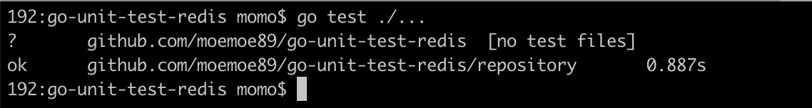

# Golang 的单元测试(Redis)

> 原文：<https://medium.easyread.co/unit-test-redis-in-golang-c22b5589ea37?source=collection_archive---------0----------------------->

## 如何用 Golang 模拟我们的 Redis 代码进行单元测试


[Research Vectors by Vecteezy](https://www.vecteezy.com/free-vector/research)

大家好！和我一起，一次又一次地，分享一些关于软件工程领域技术相关的经验、想法或观点。在这一部分中，我想分享如何在 Golang 中模拟我们的 Redis 代码以进行单元测试。

老实说，我对如何为 Redis 制作有点困惑。因为没有像 DATA-DOG 的 go-sqlmock 这样受欢迎的库。直到我发现了这篇很棒的文章，《Go 中的[*嘲讽单元测试中的雷迪斯》。*](https://medium.com/@elliotchance/mocking-redis-in-unit-tests-in-go-28aff285b98)

不错，很有帮助！但是，我应该修改我现有的代码，以便在测试和实际实现中都能很好地工作。所以，我们开始做一个简单的例子测试吧！我们将需要 3 个库来运行测试。

*   **对于假冒的 Redis 服务器:**[https://github.com/alicebob/miniredis](https://github.com/alicebob/miniredis)
*   **与 Redis 互动:**s[https://github.com/elliotchance/redismock](https://github.com/elliotchance/redismock)
*   **对于 Redis 客户端:**[https://github.com/go-redis/redis](https://github.com/go-redis/redis)

首先，像这样创建项目结构:

```
*+ your_gopath/
|
+--+ src/github.com/moemoe89
|  |
|  +--+ go-unit-test-redis/
|     |
|     +--+ main.go
|        + repository/
|        |
|        +--+ repository.go
|           + repository_test.go
|
+--+ bin/
|  |
|  +-- ... executable file
|
+--+ pkg/
   |
   +-- ... all dependency_library required*
```

之后，我们需要在`**repository**`目录下创建两个文件:`**repository.go**`和`**repository_test.go**`。

首先，`**repository.go**`文件将有`**Repository**`接口的实现，该接口有两个简单的函数用于设置和获取数据。如果您已经熟悉了干净架构的概念和依赖注入，那么代码对您来说就很容易了。如果你不熟悉的话，我给你推荐这篇 [***在 Golang***](https://hackernoon.com/golang-clean-archithecture-efd6d7c43047) 上尝试干净的架构由 [Iman Tumorang](https://medium.com/u/ef42567fbbae?source=post_page-----c22b5589ea37--------------------------------) 。这是一篇伟大的文章，也存在于印度尼西亚语中， [**Mencoba 干净的建筑 pada Golang**](https://medium.com/golangid/mencoba-golang-clean-architecture-c2462f355f41) 。感谢伊曼的分享。

最后，测试文件`**repository_test.go**`将使用模拟数据测试存储库代码。为了更好地理解，我将对这一部分进行更多的解释。

这个测试的主要代码，我们需要从 miniredis 使用 run 函数运行假 Redis 服务器。

```
mr, err := miniredis.Run()
**if** err != nil {
   log.Fatalf(**"an error '%s' was not expected when opening a stub database connection"**, err)
}
```

然后，使用来自 miniredis address 的地址从 go-redis 库中创建客户机连接。

```
client = redis.NewClient(&redis.Options{
   Addr: mr.Addr(),
})
```

接下来，我们可以使用来自 **elliotchance** 的 **redismock 库**创建模拟函数。在下面的代码中，它是来自我们的 Set 和 Get 函数的模拟数据的例子。

```
mock := redismock.NewNiceMock(client)
mock.On(**"Set"**, key, val, exp).Return(redis.NewStatusResult(**""**, nil))mock := redismock.NewNiceMock(client)
mock.On(**"Get"**, key).Return(redis.NewStringResult(val, nil))
```

如果你已经在使用 DATA-DOG 的 go-sqlmock，是不是也差不多？

好吧！是时候进行测试了。使用`**go test ./...**`执行测试用例。



Unit Test Result

还有…酷，我们通过测试了！！起作用了！！

如果您想查看这个测试的完整示例项目，您可以访问我在 GitHub 上的这个项目的存储库，[**moe moe 89/go-unit-test-redis**](https://github.com/moemoe89/go-unit-test-redis)。

[](https://github.com/moemoe89/go-unit-test-redis) [## moemoe89/go-unit-test-redis

### 📈Golang 中 Redis 的模拟单元测试，用于我的中等故事材料- moemoe89/go-unit-test-redis

github.com](https://github.com/moemoe89/go-unit-test-redis) 

希望你喜欢它，我很高兴如果这篇文章对你有用！测试愉快！

谢谢大家！