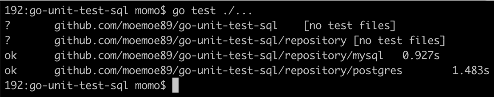

# Golang 中的单元测试(SQL)

> 原文：<https://medium.easyread.co/unit-test-sql-in-golang-5af19075e68e?source=collection_archive---------0----------------------->


Photo by [pixabay.com](https://pixabay.com/photos/macbook-mac-apple-ipad-iphone-577758/)

大家好！和我一起，一次又一次地，分享一些关于软件工程领域技术相关的经验、想法或观点。如果昨天我分享了关于单元测试模仿 Redis(你可以通过下面的链接访问)，今天我想分享如何在 SQL 代码中模仿。

[](https://medium.com/easyread/unit-test-redis-in-golang-c22b5589ea37) [## Golang 的单元测试(Redis)

### 如何在 Golang 中模拟 Redis 进行单元测试

medium.com](https://medium.com/easyread/unit-test-redis-in-golang-c22b5589ea37) 

在 Golang 中模仿 sql 代码非常容易，因为我们可以使用 DATA-DOG 中流行的 SQL 模仿库。详情请访问下面的存储库链接。

[](https://github.com/DATA-DOG/go-sqlmock) [## 数据狗/go-sqlmock

### sqlmock 是一个实现 sql/driver 的模拟库。它只有一个目的——模拟任何 sql 驱动程序的行为…

github.com](https://github.com/DATA-DOG/go-sqlmock) 

实际上，这个单元测试的材料将与我在这个中型故事中使用的相同，只是在迁移部分有一点不同。

[](https://medium.com/easyread/integration-test-database-in-golang-using-dockertest-59ed3b35240e) [## 使用 Dockertest 在 Golang 中进行集成测试(数据库)

### 用 Dockertest 进行 Golang 集成测试的另一种方法

medium.com](https://medium.com/easyread/integration-test-database-in-golang-using-dockertest-59ed3b35240e) 

首先，像这样创建项目结构:

```
*+ your_gopath/
|
+--+ src/github.com/moemoe89
|  |
|  +--+ go-unit-test-sql/
|     |
|     +--+ main.go
|        + repository/
|        |
|        +--+ repository.go
|        |
|        +--+ mysql
|        |  |
|        |  +--+ mysql.go
|        |     + mysql_test.go
|        |
|        +--+ postgres
|           |
|           +--+ postgres.go
|              + postgres_test.go
|
+--+ bin/
|  |
|  +-- ... executable file
|
+--+ pkg/
   |
   +-- ... all dependency_library required*
```

因为 MySQL 和 PosgteSQL 有相似的代码，我们将只关注 MySQL 部分。然后我们需要制作 3 个文件:`**repository**`目录下的`**repository.go**`和`**repository/mysql**`目录下的`**mysql.go**`和`**mysql_test.go**`。

`**repository.go**`只包含数据模型的实现和结构的接口。

接下来，`**mysql.go**`将有 CRUD 函数的`**repository**`接口的实现。如果您已经熟悉了干净架构的概念和依赖注入，那么代码对您来说就很容易了。

最后，测试文件`**mysql_test.go**`将使用模拟数据测试存储库代码。我将对这一部分进行更多的解释，因为我们将在这个实现中使用模拟代码。

```
**func** NewMock() (*sql.DB, sqlmock.Sqlmock) {
   db, mock, err := sqlmock.New()
   **if** err != nil {
      log.Fatalf(**"an error '%s' was not expected when opening a stub database connection"**, err)
   }

   **return** db, mock
}
```

NewMock 函数将生成假 sql。数据库服务器(记得我们使用 sql。DB 作为实际代码的连接)和 Sqlmock 接口。每个测试用例都需要这个，因为每个实现都需要刷新模拟。然后，让我们分解测试代码，我将用例子解释 1 read ( **FindByID** )和 1 write ( **Create** )测试部分。因为 **FindByID** 和 **Find** 相似，所以**创建**，**更新**和**删除**。

```
**func** TestFindByID(t *testing.T) {
   db, mock := NewMock()
   repo := &repository{db}
   **defer func**() {
      repo.Close()
   }()

   query := **"SELECT id, name, email, phone FROM users WHERE id = \\?"** rows := sqlmock.NewRows([]string{**"id"**, **"name"**, **"email"**, **"phone"**}).
      AddRow(u.ID, u.Name, u.Email, u.Phone)

   mock.ExpectQuery(query).WithArgs(u.ID).WillReturnRows(rows)

   user, err := repo.FindByID(u.ID)
   assert.NotNil(t, user)
   assert.NoError(t, err)
}
```

从上面的代码，我们做了一些部分，如:

*   调用模拟函数`NewMock()`
*   启动我们的回购`repo := &repository{db}`
*   准备模拟查询`SELECT id ....`，请注意像`?`这样的特殊字符，我们应该用双反斜杠`\\`对其进行转义
*   准备模拟结果数据`rows := sqlmock.NewRows( ... AddRow( ...`
*   模拟查询、参数和结果`mock.ExpectQuery(query).WithArgs(u.ID).WillReturnRows(rows)`

很好，下一步我们将运行我们的 **FindByID** ，结果应该不会出错。

```
**func** TestCreate(t *testing.T) {
   db, mock := NewMock()
   repo := &repository{db}
   **defer func**() {
      repo.Close()
   }()

   query := **"INSERT INTO users \\(id, name, email, phone\\) VALUES \\(\\?, \\?, \\?, \\?\\)"** prep := mock.ExpectPrepare(query)
   prep.ExpectExec().WithArgs(u.ID, u.Name, u.Email, u.Phone).WillReturnResult(sqlmock.NewResult(0, 1))

   err := repo.Create(u)
   assert.NoError(t, err)
}
```

对于创建测试代码，由于代码的执行使用了 prepare query，我们应该在测试代码中也遵循。

*   准备查询`prep := mock.ExpectPrepare(query)`
*   模拟查询、参数和结果`prep.ExpectExect().WithArgs(u.ID ...).WillReturnResult(...)`
*   因为我们用 UUID 作为主键。对于 lastInsertID 参数，NewResult 将设置为 0，对于 rowsAffected，new result 将设置为 1

酷，下一步我们将运行我们的**创建**，结果应该不会出错。

好吧！是时候进行测试了。使用`**go test ./...**`执行测试用例。



Picture Unit Test Passed

是啊…很好，我们通过了测试！！

我们可以使用 CircleCI 等 CI 服务在我们的云存储库上运行测试。在我的存储库中，您可以看到我正在使用 CircleCI 来执行测试！

这是`**.cirlceci**`目录中的示例`**config.yml**`文件。

如果您想查看这个测试的完整示例项目，您可以访问我在 GitHub 上的这个项目的存储库，[**moe moe 89/go-unit-test-SQL**。](https://github.com/moemoe89/go-unit-test-sql)

[](https://github.com/moemoe89/go-unit-test-sql) [## moemoe89/go-unit-test-sql

### 通过在 GitHub 上创建帐户，为 moemoe89/go-unit-test-sql 开发做出贡献。

github.com](https://github.com/moemoe89/go-unit-test-sql) 

希望你喜欢它，我很高兴如果这篇文章对你有用！测试愉快！

谢谢大家！