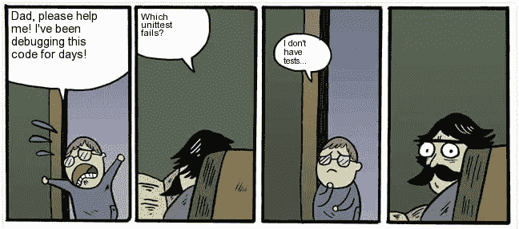
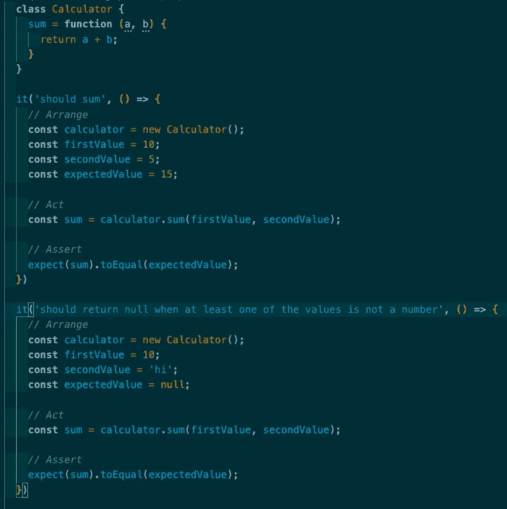
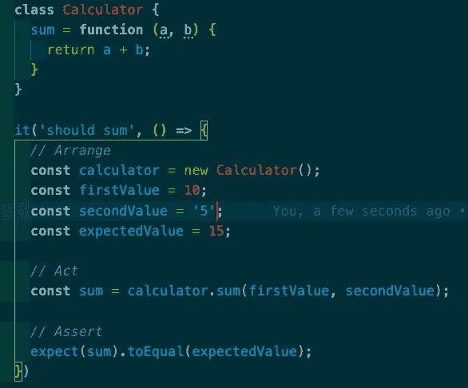
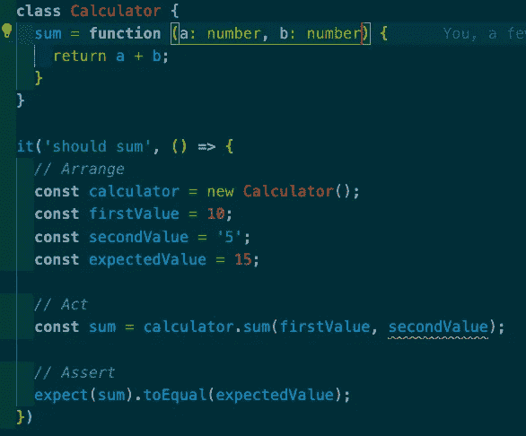
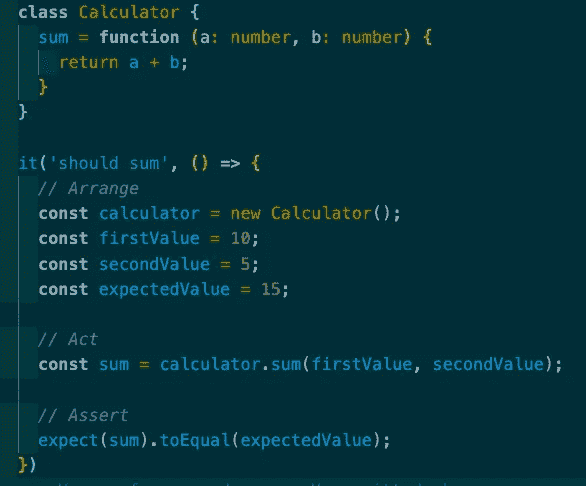
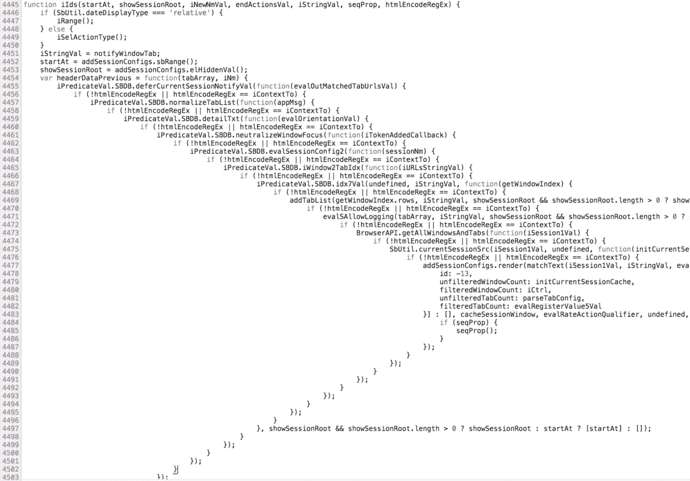

# 单元测试，必要之恶？

> 原文：<https://medium.com/globant/unit-testing-a-necessary-evil-9630322240e4?source=collection_archive---------7----------------------->

Oh boy

想象自己在自己的世界里快乐地编码，向团队发送拉式请求以供审查，这时技术领导**“我们需要进行单元测试”**说出了一句可怕的话。哦，痛苦、愤怒和恐惧，**“真的有必要吗？”你问，只是为了得到一个简单的“是”的回答。**

我想我们在职业生涯中都曾遇到过这种情况，被要求覆盖你刚刚做的代码，并在提交之前在本地测试几次，你很确定它是防弹的。我能听到我的问答朋友在我的后脑勺笑。

随着时间的推移，我已经学会喜欢和尊重编码的测试方面，随着时间的推移，我已经在自己的代码中看到了它的好处。我必须承认，我也讨厌它，一遍又一遍地通过一些愚蠢的测试，相信我，随着时间的推移，你至少也会学会尊重它们，或者不尊重，这是你的选择。

# **那么我们为什么要测试我们的代码呢？**

我要写代码来测试我刚写的代码？如果你问我，我觉得有点多余，对吗？是的，但不是。

你看，确保你的代码设计良好不仅给你一个保证，它实际上减少了 QA 团队因为一些 bug 发回你的用户故事的次数，对我来说这是一个大胜利；老实说，当你提交一个拉取请求后，主管告诉你“代码很棒”,这很酷。

设计良好的代码应该是标准的、错误管理的、强类型的等等。这些都是构建良好的单元测试可以帮助你实现的。

# 什么时候是进行单元测试的好时机？

理想情况下，在测试阶段之前，你可以在编码之前、编码时或者项目完成之后进行单元测试，最好是在投入生产之前。

# 让我们来一点技术，单元测试的结构是什么？

你会发现几个测试框架，它们都有一个共同点*(或者至少是我所知道的)*，它们都遵循 AAA 模式，不是那个 AAA，是 **A** rrange， **A** ct， **A** ssert 模式。

这个模式简单地说就是，每一步都导致下一步的输入， *assert(act(arrange()))。*

**安排**:为您正在测试的单元设置您需要的输入或配置。

**行为**:如其所言，执行单位。

断言:验证你得到的结果是你期望的。

Arrange, Act, Assert

# 应该测试哪些案例？

至少是快乐的路径，但要真正成为一个专业人士，你不仅应该测试，而且应该测试悲伤的路径，给你的函数发送一些疯狂的参数，看看会发生什么，它返回什么？返回的结果是您所期望的吗？失败了吗？为什么？在函数、承诺、观察、回调中有条件句吗？你正在测试你的函数的所有路径吗？

这不仅仅是覆盖率的问题，记住，你要确保你的代码是防弹的，并且，手指交叉，QAproof。

Something seems to be missing here

# 单元测试与代码设计有关

大多数时候，一个失败的测试或者一个变得很难测试的代码，都是代码设计很差，需要改进的迹象。

一个定义良好的函数不应该很难测试。在所有需要的配置都设置好之后，定义良好的参数应该可以帮助你发送正确的值。

If we’re not validating parameters types the function will fail and so the test

If we do, then we should be ‘forced’ to send the right values

Much better

这是一个非常简单的例子，但是想象一下必须测试一个回调地狱或者大量嵌套的条件句，现在不那么简单了吧？

No, thank you, nope.

# 那么，使用哪个框架呢？

正如他们所说的，视情况而定，现在有几种框架可以帮助你成功地进行测试，你应该使用哪一种呢？我不能为你确定一个。这完全取决于你的项目是如何构建的，你使用什么 UI 框架，什么语言，库，组件，架构等等，等等。

最受欢迎的可能是 Jest、Jasmine 和 Mocha。Jest 是一个非常完整的测试框架，通常在 React 和小型项目中实现，Jasmine 也有完整的内容，通常在 Angular 项目中找到，因为它已经安装了 Angular CLI，如果你有一个复杂的项目，Jasmine 可能是最适合你的；在测试 UI 的时候，Mocha with Chai 帮了你很多，比如说你有一个聚合物组件的项目，那就是你的人。

归根结底，这完全取决于您的项目和您的偏好，它们都有优点和缺点，但它们的共同点是，它们将帮助您测试，更容易地测试您的代码。

# 总之，你应该测试你的代码吗？

我的回答是肯定的，永远都是，即使很无聊，即使会花你更多的时间，但好处是值得考虑的。单元测试帮助你更好地编码，更好地设计，拥有更好的架构，并且你可以确信你的代码将会完成它应该完成的任务。

所以不要怕几个测试，如果发现有可以提高的地方，何乐而不为？改进一下就好。我们生活在这个世界上是为了学习和享受，记住*生活就是在你调试和试图解决你找不到的错误时发生的事情。*

大家编码快乐！下次再见。