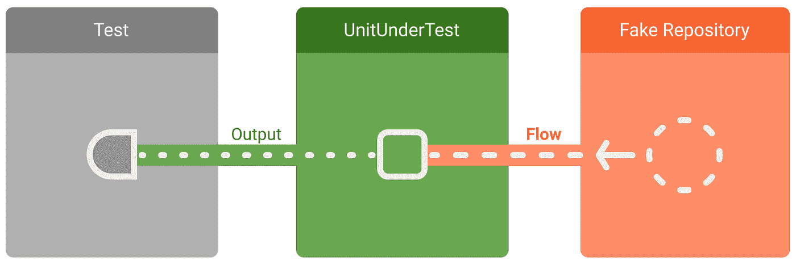

# 单元测试 Kotlin 流

> 原文：<https://medium.com/google-developer-experts/unit-testing-kotlin-flow-76ea5f4282c5?source=collection_archive---------0----------------------->

在为我的 Kotlin 流编写单元测试时,“这项工作尚未完成”是一个让我做噩梦的错误消息。这篇文章描述了我在过去测试反应流(`LiveData`和`RxJava`)的典型方式，以及我如何尝试将这些方法应用到流中，但收效甚微。它继续试验谷歌推荐的方法，最后，展示了我迄今为止发现的最好的解决方案:[涡轮机](https://github.com/cashapp/turbine)。如果你只是在寻找解决方案，滚动到文章的结尾。

我一直用于测试`LiveData`和`RxJava`流的方法类似于从汽车中抽取汽油:将一个容器连接到输出端，摆弄输入端，看看会有什么输出。

Source: [https://developer.android.com/kotlin/flow/test](https://developer.android.com/kotlin/flow/test?hl=uk)

下面是我已经用了很长时间的测试平台，它是为测试`LiveData`而设计的。容器是一个`LiveDataTestObserver`，桶是一个`MutableList`。设置一些模拟，戳测试结构(`ViewModel`、`Repository`、`Service`)，看看`observedValues`完成后是什么样子。

这个想法对于`RxJava`、`LiveData`和`Coroutines/Flow`都很管用。每一个都有一个全局调度器，你可以用一个`[TestRule](https://junit.org/junit4/javadoc/4.12/org/junit/rules/TestRule.html)`来配置它，以便在你运行单元测试的时候，让所有的东西都在一个线程上运行。`LiveData`见`[InstantTaskExecutorRule](https://developer.android.com/reference/android/arch/core/executor/testing/InstantTaskExecutorRule)`，这里是`RxJava`的类似实现:

协程和流配备了与`LiveData`和`RxJava`相同的调度机制，它们可以以相同的方式使用。它允许你拦截代码中的`delays()`和`timeouts()`，跳过它们或者提前时间来加速你的单元测试。确保您的代码使用`[TestDispatcher](https://kotlin.github.io/kotlinx.coroutines/kotlinx-coroutines-test/kotlinx.coroutines.test/-test-coroutine-dispatcher/)`的聪明方法是将`DispatcherProvider`注入到任何专门与`Dispatcher`交互的结构中。我从 Craig 的帖子中了解到如何做到这一点:

 [## 使用 TestCoroutineDispatcher 单元测试协程挂起函数

### Kotlin 协程提供了一种编写异步代码的优雅方式，但有时协程使它很难…

克雷格·罗素](https://craigrussell.io/2019/11/unit-testing-coroutine-suspend-functions-using-testcoroutinedispatcher/) 

这是一个简化的版本:

如果你开始在互联网上寻找“这项工作尚未完成”的解决方案，你最终会在 Kotlin-Coroutines 项目中遇到这个 Github 问题。当你滚动的时候，你会注意到使用上面的`TestCoroutineRule`和`TestDispatcher`对一些人来说解决了问题，但对另一些人来说却不是。为什么？

单元测试一个流是困难的，因为一个流不一定要完成。这是结构化并发的哲学核心特征。事实上，Flow 的一些实现(即。[热流](https://elizarov.medium.com/cold-flows-hot-channels-d74769805f9)被*设计为*永不完成。例如，如果你观察一个`MutableStateFlow`，这个想法就是即使没有东西观察它，它也保持它的值——所以它从来没有被设计完成。所以`TestCoroutineRule`对一些人有效而对另一些人无效的原因是因为每个人都以不同的方式实现他们的流程。

那么我们如何测试这些类型的流量呢？

Android 文档中有一些[指南](https://developer.android.com/kotlin/flow/test)关于如何进行与流程相关的单元测试。它提出了一个建议:

> 对于需要更复杂的项目集合或者不返回有限数量项目的数据流，您可以使用`Flow` API 来选择和转换项目。

它继续建议对这些更复杂的数据流使用某些操作符，如`first()`和`take()`，这在大多数情况下是可行的。我相信有更好的方法——但是官方的方法是一个好的开始，并且不涉及第三方依赖。下面我将演示如何使用官方的 Android 文档建议进行测试，然后使用我喜欢的方法重写测试进行比较。

让我们看一些例子，从冷流开始，这比较容易测试:

注意，中间的测试成功了，但是流程的实现已经“改变”了。在我看来，虽然代码本身工作正常，但测试未能检测到实现发生了变化。想象一下，比如说,“流动”代表着`isLoading`。如果它发出一个额外的值，这可能意味着加载指示器是可见的，而不是不可见的。不好。我们稍后将回到这一点。

让我们来看看测试一些热流:

在第一个测试中，测试本身挂起了…是时候进入 StackOverflow 了。

在第二个测试中，我们使用了`TestDispatcher` ——非常聪明——但是现在我们有了著名的“这个任务还没有完成”错误消息。

在第三次测试中，`first()`用官方 Android 文档的方式解决了我们的问题。或者看起来… `first()`起作用是因为它取消了流量的收集。`take()`没有，所以如果我们想做比`first()`更有趣的热流，我们又回到了起点…

进入[涡轮](https://github.com/cashapp/turbine)。

Turbine 是一个漂亮的小测试库，它不仅解决了上面这两个问题，还使我们的单元测试更加习惯。它有一个非常容易跟随的[自述](https://github.com/cashapp/turbine)，所以我不会在这里重复它的特性集。我要做的是从上面重构我们的冷流试验，以使用涡轮:

请注意，我们不仅有了更干净、更习惯的单元测试，而且我们现在正在捕捉我们以前错过的实现变化。不再有`isLoading` bug。

现在，让我们对热流做同样的处理:

请注意，我们没有显式地使用`TestDispatcher`，而是使用这些调用`cancelAndConsumeRemainingEvents()`或`cancelAndIgnoreRemainingEvents()`来明确测试应该如何结束。

总而言之，测试流程和协同程序需要从根本上改变您对反应式流程的思考方式。但是如果你来这里仅仅是为了寻找“作业未完成”错误消息的答案，那就是:使用[涡轮机](https://github.com/cashapp/turbine)对你的流程进行单元测试。

## 干杯和啤酒

感谢[恩里克·洛佩斯·马斯](https://medium.com/u/f08187f6a023?source=post_page-----76ea5f4282c5--------------------------------)和[曼努埃尔·维沃](https://medium.com/u/3b5622dd813c?source=post_page-----76ea5f4282c5--------------------------------)为我润色这篇文章。下次见面我请你喝啤酒。

## 资料来源和进一步阅读:

 [## 结构化并发

### TL；DR:“结构化并发”指的是一种构造异步计算的方法，这样可以保证子操作…

ericniebler.com](https://ericniebler.com/2020/11/08/structured-concurrency/)  [## runBlockingTest 失败，出现“此作业尚未完成”问题#1204 …

### 这个简单的块:runBlockingTest { suspendencelablecoroutine { cont-> thread { thread . sleep(1000)……

github.com](https://github.com/Kotlin/kotlinx.coroutines/issues/1204#issuecomment-668143287)  [## 结构化并发

### 今天标志着 kotlinx.coroutines 库 0.26.0 版本的发布和结构化并发的引入…

elizarov.medium.com](https://elizarov.medium.com/structured-concurrency-722d765aa952)  [## 使用 TestCoroutineDispatcher 单元测试协程挂起函数

### Kotlin 协程提供了一种编写异步代码的优雅方式，但有时协程使它很难…

克雷格·罗素](https://craigrussell.io/2019/11/unit-testing-coroutine-suspend-functions-using-testcoroutinedispatcher/)  [## 冷流，热通道

### Kotlin 协同程序缺少一个原语来表示冷异步数据流。不再是了。欢迎科特林…

elizarov.medium.com](https://elizarov.medium.com/cold-flows-hot-channels-d74769805f9)