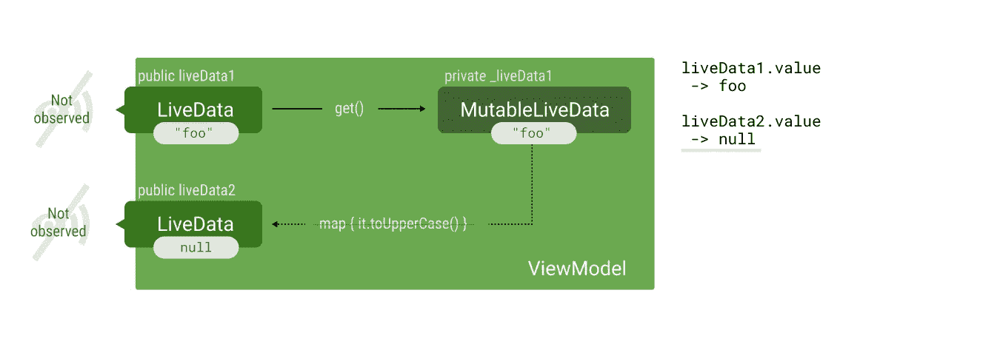
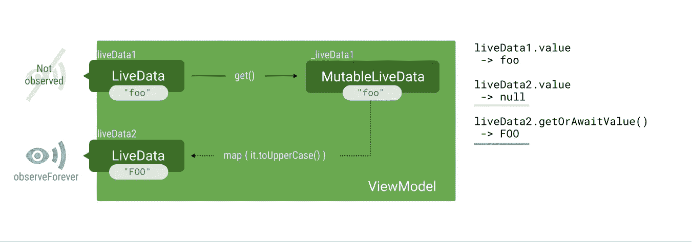
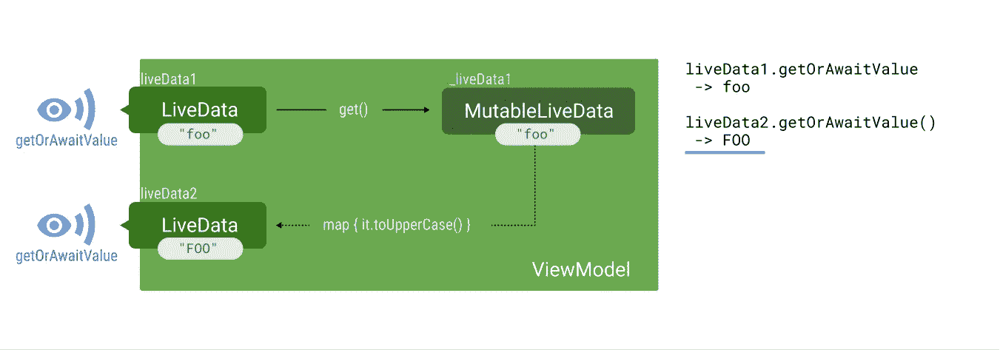

# 单元测试 LiveData 和其他常见的可观察性问题

> 原文：<https://medium.com/androiddevelopers/unit-testing-livedata-and-other-common-observability-problems-bb477262eb04?source=collection_archive---------0----------------------->

下一次当你挠头想知道为什么一个看起来无辜的用 LiveDatas 进行的单元测试失败了，或者盯着一个应该显示… *一些东西的空屏幕时，你应该记住**一个没有被观察到的 live data 不会发出更新**。在这篇文章中，你会学到一些避免这个问题的好方法。*

这在处理**转换**时尤其重要。如果 LiveData 被转换，**必须观察转换的结果**。否则转换将永远不会被评估。

*如果一个 LiveData 在森林里倒下了，没有人注意到它…它曾经被更新过吗？*

在本例中，每当初始值改变时，初始`_liveData1`的值就被转换(映射)为大写:

让我们为它编写一个简单的测试:

这个测试失败是因为 LiveData 没有做多余的工作。**阅读** `**liveData2.value**` **不会引发依赖转化链，因为它没有被观察到。只有通过`observe()`订阅才能做到这一点。**

The result of a Transformation is not computed if it’s not observed

请注意，`liveData1`的值是可以读取的，因为它是一个`MutableLiveData`，不需要评估任何转换。

解决这个问题的一个简单(但不太好)的方法是在我们需要读取的 LiveDatas 上调用`observeForever()`:

The result of a Transformation is not computed if it’s not observed

然而，如果我们需要观察多个 LiveDatas **,这可能会用不重要的语句快速填充我们的测试。**

为了解决这个问题，Jetpack 还没有提供测试助手*，但是我们可以自己制作:*

*Java 中也有[。](https://gist.github.com/JoseAlcerreca/1e9ee05dcdd6a6a6fa1cbfc125559bba)*

*该函数观察一个 LiveData，直到它接收到一个新值(通过`onChanged`)，然后它移除观察者。如果 LiveData 已经有一个值，它会立即返回。此外，如果从未设置该值，它将在 2 秒钟后(或您设置的任何时间)抛出异常。这可以防止出现问题时测试无法完成。*

> *或者，如果您需要在整个测试过程中一直观察 LiveData，因为它可能会接收到您想要检查的多个值，那么请看一下 LiveData 示例中的`[observeForTesting](https://github.com/googlesamples/android-architecture-components/blob/master/LiveDataSample/app/src/test/java/com/android/example/livedatabuilder/util/LiveDataTestUtil.kt#L61)` 。*

*现在测试可读性更强了:*

*注意:虽然您不需要*使用*来处理可变 LiveData，但是在读取*任何* LiveData 值时，最好使用`getOrAwaitValue`，以防将来实现细节发生变化:*

**

*You don’t need to observe MutableLiveDatas to get their value, but it’s a good practice.*

# *InstantTaskExecutorRule*

*需要注意的是，这种技术可能存在线程问题。大多数问题都可以通过在单元测试中添加 [InstantTaskExecutorRule](https://developer.android.com/reference/android/arch/core/executor/testing/InstantTaskExecutorRule) 来解决。然而，如果你从主线程调用`LiveData.postValue()`，那么[记录的优先级](https://developer.android.com/reference/android/arch/lifecycle/LiveData#postvalue)可能不会被保留。这种情况并不常见，但值得一提，因为它会产生不可避免的错误。*

*在 LiveData 示例的[测试中查看它的运行情况。](https://github.com/googlesamples/android-architecture-components/blob/master/LiveDataSample/app/src/test/java/com/android/example/livedatabuilder/LiveDataViewModelTest.kt)*

# *其他场景*

## *错误的视图模型*

*如果你在多个片段之间使用一个共享的视图模型，确保你在所有的屏幕中使用相同的实例。当将片段而不是活动作为生命周期所有者传递给 ViewModelProviders，或者在片段中使用`by ViewModels`而不是`by activityViewModels()`时，会发生这种情况。*

## *错误的房间数据库实例*

*为什么返回 LiveData 的查询不发出任何更新？*

*如果您确定正在观察 LiveData，那么您可能正在使用数据库的不同实例。检查你的创作模式或你的 DI 图。如果你知道你在做什么，你也可以在数据库构建器中启用[多实例失效](https://developer.android.com/reference/androidx/room/RoomDatabase.Builder.html#enableMultiInstanceInvalidation())，但是它有一些限制。*

*您可以在 [LiveDataSample](https://github.com/googlesamples/android-architecture-components/blob/master/LiveDataSample) 中看到 [LiveDataTestUtil](https://github.com/googlesamples/android-architecture-components/blob/master/LiveDataSample/app/src/test/java/com/android/example/livedatabuilder/util/LiveDataTestUtil.kt) 的运行。*

*你还发现了哪些场景？请在评论中告诉我们！*