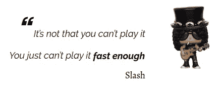
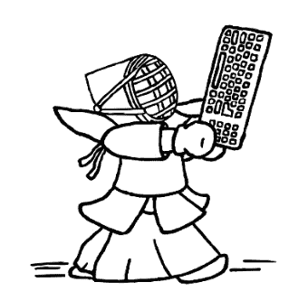

# 单元测试和重构:我应该烦恼吗？

> 原文：<https://medium.com/globant/unit-tests-refactoring-should-i-bother-e7b3e65e19c9?source=collection_archive---------1----------------------->

从前，一个顾问去参观一个开发项目。顾问查看了一些已经写好的代码；在这个系统的中心有一个等级制度。当他在层次结构中徘徊时，顾问发现它相当混乱。一个复杂的层级结构，从设计上就有几个缺陷。顾问向项目管理人员建议查看并清理代码，但项目管理人员似乎并不热心。代码似乎工作正常，而且有相当大的进度压力。经理们说他们会在晚些时候抽出时间来做这件事。这位顾问还向从事层级工作的程序员展示了正在发生的事情。所以程序员们花了一两天的时间清理这个层级。当他们完成时，程序员已经删除了层次结构中一半的代码，而没有减少它的功能。他们对结果很满意，并发现向层次结构中添加新类和在系统的其余部分使用这些类变得更快更容易。项目管理层不满意。时间表很紧，有很多工作要做。这两个程序员花了两天时间做的工作并没有增加系统必须在几个月内交付的许多功能。旧代码运行得很好。所有这些活动都致力于让代码看起来更好，而不是让它做任何它还没有做的事情。

六个月后，项目失败了，很大程度上是因为代码太复杂，无法调试或调整到可接受的性能。

听起来熟悉吗？好吧。也许不是“失败的项目”那部分，但我相信你在某些时候会有同感。随着时间的推移，软件项目往往会变得越来越复杂，这可能是由于业务的性质，也可能是由于在其整个生命周期中从事软件项目的几个人，每个人都有自己的观点和背景。但是所有“坏”软件项目的共同点是…等等…缺乏测试！

你会问，测试与好代码或坏代码有什么关系？鲍勃叔叔最好地表达了这一点:

通过测试，我们可以很容易地添加新的功能。通过测试，我们知道我们所做的任何改变是否会引入 bug。通过测试，我们可以表达我们代码的意图，并让它成为文档的一个附加部分！所有糟糕的代码都是糟糕的，因为它被误解了，测试帮助我们更好地理解它。

这就引出了一个问题:为什么我们不创建那些测试？大多数情况下，这是一种习惯。在确定工作规模时，我们习惯于紧张的截止日期和日程安排问题。我们花很少的时间考虑对我们的工作进行单元测试，因为我们看不到它的价值…直到我们不得不再次回到它，修复一个错误或添加更多的功能…

为了减轻这一点，我们需要改变我们的习惯。

# 习惯的力量

到底什么是习惯？这是一些我们默认的行为，它在压力下表现最好。我们被各种情况、截止日期、期望轰炸，这让我们自动回到我们要做的事情，让我们处理剩下的事情，这样我们就可以减少不确定性。这是一种安全机制。

但是，如果我们有一些不把我们引向丑陋的、不可维护的代码的习惯呢？如果我们的习惯导致人们真正喜欢使用的代码会怎么样？

Beck 通常以这种方式回应称赞，因为他想表达我们都可以成为优秀的程序员。这只是一个拥有正确习惯的问题。

你会问，如何培养习惯？问得好！就像我之前说的，习惯是无意识的反应，是我们无意识的行为。这些行为，我们在生活中的某个时候学到的。我们通过一遍又一遍地重复它们来学习它们，所以我们不再去想它们。所以要建立一个新习惯，我们只要不断重复它的行为，直到它铭刻在我们的脑海中！

# 将测试和重构作为一种习惯

说起来容易做起来难，对吧？那么，一个人如何去学习这个测试和重构的好习惯呢？很高兴你问了(你现在已经变得很好奇了)！开始学习这个新习惯的最简单的方法是做一些旧的 TDD(测试驱动设计)。

尽管在大多数项目中很难找到完整的 TDD 方法，但这并不意味着你不能自己去做！最终，TDD 行为的重复会一直伴随着你，你甚至不会考虑不测试你的新的闪亮的软件。但是我们不要想太多。要开始 TDD 之路，要走的路是用简单的东西试一试，并尽可能经常地练习。

# 练习，练习，练习

当我们开始学习新事物的冒险时，掌握它的方法就是实践。从小处着手，然后逐步积累。稍微伸展一下，这样我们就可以继续做更难的事情了。我们可以把它分成主要的练习类型:偶然的和有意的。

通过*附带练习*，我们只是一遍又一遍地重复我们已经知道的东西。这有助于我们把正在重复的活动变成一个无意识的过程，从而成为一种习惯！

*刻意练习*完全是一种不同的动物。有了它，我们实际上可以学到一些新的东西。它让我们把新技能分解成不同的小活动，反过来，我们可以把这些小活动变成附带的练习。我们将未知分解成易于管理的部分，这样我们可以更好地理解和执行。它帮助我们带着更多的信心去探索未知，继续学习。

但是这些概念和 TDD 有什么关系呢？简单。我们可以学习和练习我们的 TDD 技能，这叫做代码式。

# 代码卡塔斯

在空手道中，形是一种练习。一套反复重复的动作和姿势，所以在某些时候成为第二天性。一个[代码形](https://kata-log.rocks)遵循相同的模式。这是一个相对简单的问题，可以通过有限的步骤序列来解决，我们可以开始重复这些步骤，使它们成为我们编码技能的一部分(展示给我看！).

当我们用 TDD 解决代码表时，我们发展了将我们面前的问题分成小块的技巧，用最少的资源解决每个问题，然后进行重构，以消除重复。所有这些都是在遵循 TDD 咒语红绿重构的同时进行的。

但是代码形不仅仅意味着学习 TDD。还有一些可以帮助你发展触摸打字的技能(例如，我可以闭着眼睛打字)，IDE 键盘快捷键(例如，用鼠标按 ctrl/cmd+shift+O…ff！)，扎实的原则，还有很多！

# 简单地说，TDD

就像我上面说的，TDD 咒语变成了红绿重构。但是如何开始呢？从一开始！我们传统的工作方式是从开发一些类开始，放入一些代码，连接东西，删除那些讨厌的红色曲线，启动程序并希望它能工作…然后我们开始考虑测试它。也许…如果我不把那个类放在这里，那个依赖项放在那里…哦，好吧。如果有时间的话，我会在下一个版本中修复它。

TDD 需要不同的方法。我们从思考案例开始(如果？)涵盖了预期的功能…甚至没有开发它！

# 红绿重构

让我们想一想我们能为新功能想出的最基本的用例。创建测试，就好像所有必要的组件(类、方法和属性)都已经凭空存在了。这里是我们的第一个红色:这甚至不编译！所以，让我们来解决它。红色是我们的朋友，所以让我们听听它要说什么。未定义的类？创造它。未定义的方法或属性？创建为空，根据具体情况返回 null 或未初始化。现在可以编译了！我们启动测试…嘣！回到红色。

现在变成绿色。*做最简单的修改，让测试通过。*这一开始让每个人都感到困惑，因为我们倾向于**过度设计**。我们试图一次覆盖很多领域，但是对于 TDD 来说，这是违反直觉的。尽管如此，还是忍住冲动，吻下去(简单点，笨蛋)。通常这个简单的修改意味着返回一些测试期望的固定值。因此，我们再次运行测试，并且…绿色！

我们现在进入了重构领域，但是假设你的类/功能是全新的，那么就没有那么多可以复制的代码了。所以这次你不用重构了！

酷！现在我们来看下一个我们的代码应该管理的有趣案例。再次，编写测试代码。如果没有红色曲线，运行它。回到红色！请注意，如果我们在这一点上没有得到红色，我们对这应该如何工作的假设可能是错误的(谢谢你，TDD！)我们需要另一个更有趣的测试用例，因为这个已经被讨论过了。

我们做了另一个简单的修改，使测试再次通过。一个很好的假设，也许？但是请记住，我们已经进行过的前一个测试仍然必须通过！

所以我们做了改变，测试通过了。继续[重构](https://refactoring.com) …我们的代码可能仍然没有足够多的行来删除重复的代码…但是我们的测试可能会！也许可以重构测试主题的创建，让它成为一个实例字段，并在 setup 方法中初始化它。现在我们在产品代码和测试中保持整洁。还要确保我们只写**我们需要的**代码，不写其他的！我们编写代码是为了满足测试用例条件(反映需求甚至其他边缘情况)，而不是为了测试我们 ***希望*** 符合需求的代码。

我们重复这个循环几次。多少？嗯，这完全取决于你想要达到的要求。一旦你用完了测试用例，你的特性就可以使用了！还有这个。如果你曾经错过了一个测试用例(也就是一个丑陋的 Bug)，你所要做的就是带着这个新的测试用例回到这个循环中去！此外，您还可以确定，无论您需要对用例进行什么样的更改，都不会破坏现有的任何功能，因为您的测试会支持您！

# 结论

有了面向测试的心态，我们可以交付更好的代码，这有更多的意义。通过重构，我们可以创建看起来不痛苦的代码。更好的结构、非冗余和量身定制的适合 it 需要解决的问题。通过发展这些技能，我们不仅可以成为更好的程序员，还可以成为 ***有爱心的*** 程序员。关心他们正在编写的代码的专业人员，以及在我们离开后将到来的人(是的…我们不会永远在那个项目中！).这是一条漫长的路，但完全值得一走。