# 使用 Mendix 进行单元测试

> 原文：<https://medium.com/mendix/unittesting-with-mendix-63d2a1ba01f5?source=collection_archive---------1----------------------->

通过 [Newspark B.V.](https://www.newspark.nl) ，我一直作为 [ANWB](https://www.anwb.nl) 的测试自动化顾问工作，这意味着我负责创建和执行测试计划，编写 Postman 脚本和套件，设置应用程序监控，等等。去年 10 月，我成长为 ANWB 一个新项目的 Mendix 开发人员。

自从我们开始新项目以来，Mendix 已经发布了一个官方支持的模块，我们可以用它来编写和执行“单元测试”。我将单词 unittests 放在引号中，因为在引擎盖下，Mendix 使用 Java，我们不能/不会在那个级别上测试它。单元测试意味着测试最小可能的微流。通过这个博客，我想和大家分享我使用单元测试模块的经验，希望你能从中学习。

**先决条件:**

对门德克斯的一些理解

Mendix Studio Pro 8.x (8.6.1 用于创建此示例)

CommunityCommons v8.2.0

对象处理 3.0.1 版

单元测试 v8.0

CommunityCommons、ObjectHandling 和 UnitTesting 模块可以在 Mendix 应用商店中找到。

**本博客的目的:**

我创建了一个简单的项目来提供对单元测试模块的一些见解。我没有在我的例子中使用这个模块的所有方面，而是创建了一个简单的、可理解的测试。所以请记住，这不是我在 Mendix 开发中最好的作品，但这个项目纯粹是作为一个例子，并激励其他人使用这个模块。

**领域模型**

这是我的领域模型的样子:

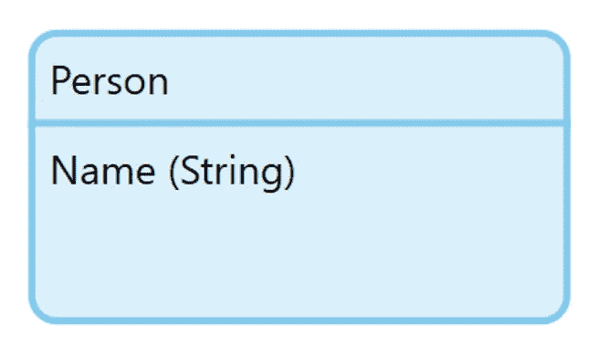

A single persistable database entity with a Name attribute (string value).

**图形用户界面**

我的主页由一个数据网格组成，它链接到 Person 对象:

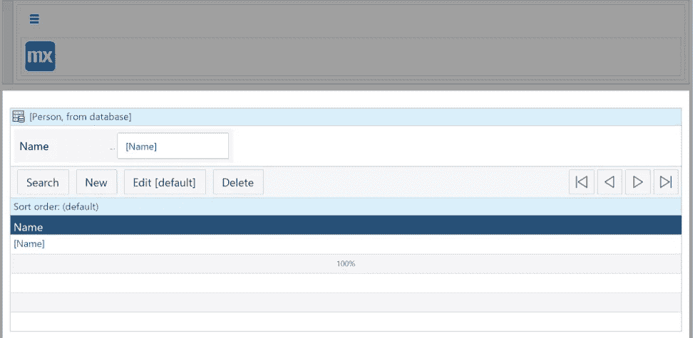

我的 NewEdit 页面(需要在数据库中创建一个新的“Person ”,或者编辑一个)也很简单，由 Mendix:

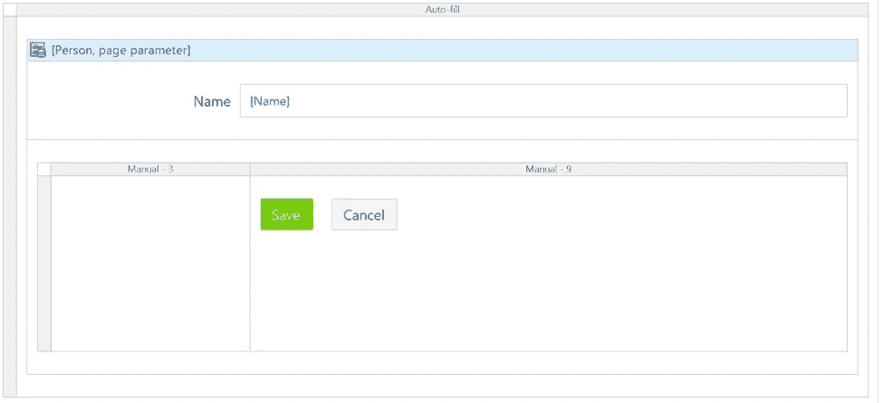

“真实”页面(当通过“本地运行”运行代码时)如下所示:

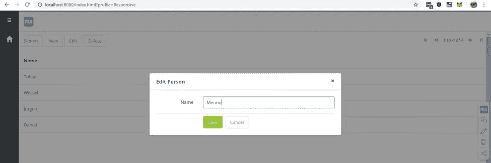

**微流量**

然而，在“保存”按钮的背后，有一个微流。默认情况下，当生成新的编辑页面时，按“保存”按钮会导致保存任何更改而不进行检查。在这种情况下，我在一个微流中做了一个简单的验证，检查“Name”属性是空的还是空字符串。

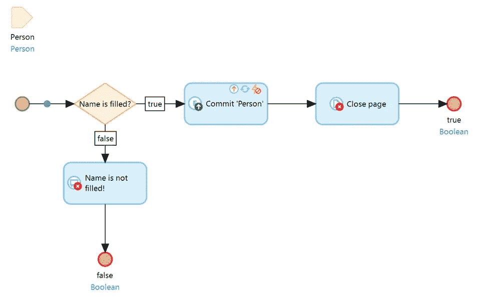

如果没有填写“Name”属性，流程会停止，弹出一个错误消息，并且不会提交(保存)任何内容。如果“Name”属性被填充，则流程继续向右，提交(保存)更改并关闭弹出窗口。

为了使这个例子尽可能简单和基本，我选择不添加任何进一步的验证，比如检查数据库中的重复项。

**单元测试**

现在我们有了一个数据库，一个用于在数据库中添加和更改名称的 GUI，以及一个检查添加/更改的名称是否为空的验证流。让我们做一个单元测试！

**应用商店模块**

为了使用 UnitTesting 模块，我们需要三个 Mendix 应用商店模块。**平视！**在写这个例子时，我遇到了一种情况，这种情况可能会在将来得到解决。安装 UnitTesting 模块后，我们的错误屏幕中会显示一个错误，因为模块找不到它期望的图标。双击错误信息就可以很容易地解决这个问题。您将在缺少图标的元素处结束，并且您可以从列表中选择一个随机存在的图标来使事情再次工作！

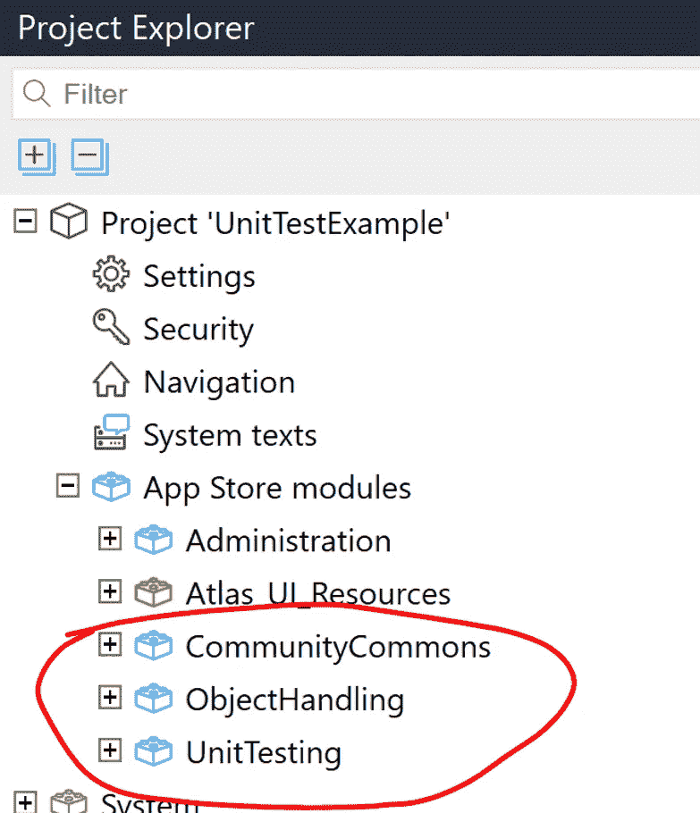

**运行时设置**

除了添加这些模块，我们需要对我们的项目做一个小的改变，这样工具就知道我们写了哪些测试。通过在应用程序开始时调用这个微流，UnitTesting 模块将搜索以 Test_ 或 UT_ 开头的文件:

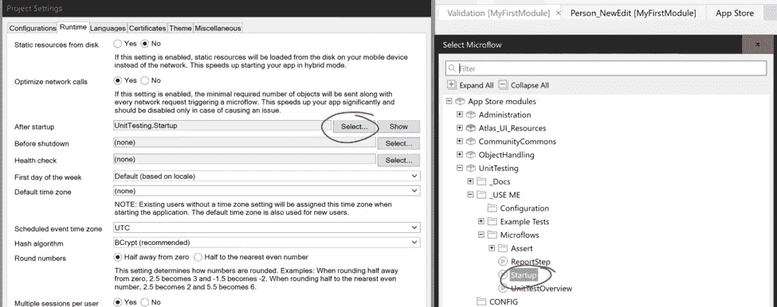

**单元测试概述**

此外，我们希望在主屏幕上查看我们的单元测试，这样我们就可以通过自己的 GUI 运行它们。我已经通过向我的页面添加一个容器并将“UnitTestOverview”片段拖动到该容器中实现了这一点。片段是页面的一部分，您可以在其他页面上重复使用。非常方便，因为通过将这个片段添加到我的 GUI 中，我不需要为了查看和运行测试而更改或做任何其他事情！

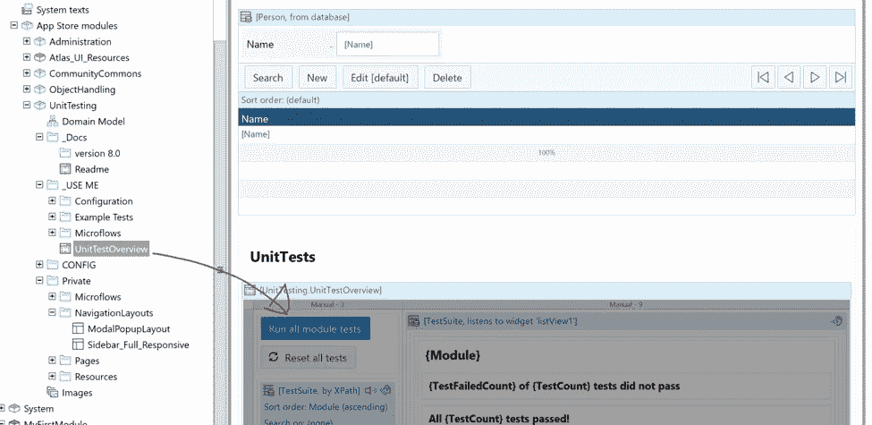

当我们再次运行我们的代码(本地运行)时，我们应该在已经有过的 Datagrid 下面看到单元测试:

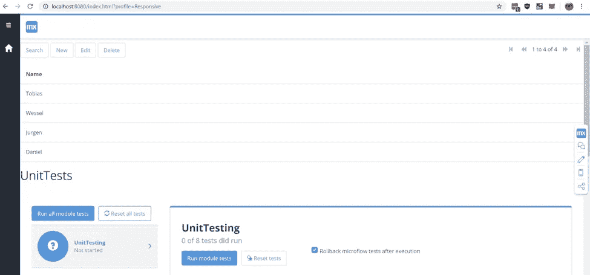

如果您不能直接看到任何单元测试，但是您确实看到了“运行所有模块测试”和“重置所有测试”按钮，那么请按“重置所有测试”按钮。这将使工具寻找新的测试，并将使工具找到 UnitTesting 模块附带的测试(该模块附带了一组示例测试)。如果你愿意，你可以点击“运行所有模块测试”按钮。一眨眼，你就会看到你的报告出现。

**编写单元测试**

因此，编写我们的第一个单元测试。我们的应用程序只包含一个带逻辑的微流；验证流程。这个流程检查属性“Name”是否被填充。我们可以为此编写一个测试。

**单元测试微流**

在第一个测试中，我们会写，我们称之为“Test_Validation_No_Name”。我们可能会在命名约定上全力以赴，但还是让它保持简单。这里最重要的部分是 UnitTesting 工具检查以“Test_”或“UT_”开头的微流。因此，请确保您的测试微流名称以其中之一开头。

**测试数据**

当编写单元测试时，我们想要控制我们使用的数据，所以在我们的流程中，我们创建了一个新的“Person”对象，没有“Name”属性。通常，对象是在我们填充 GUI 上的字段时创建的，但是我们可以通过在代码中创建一个对象来解决这个问题:

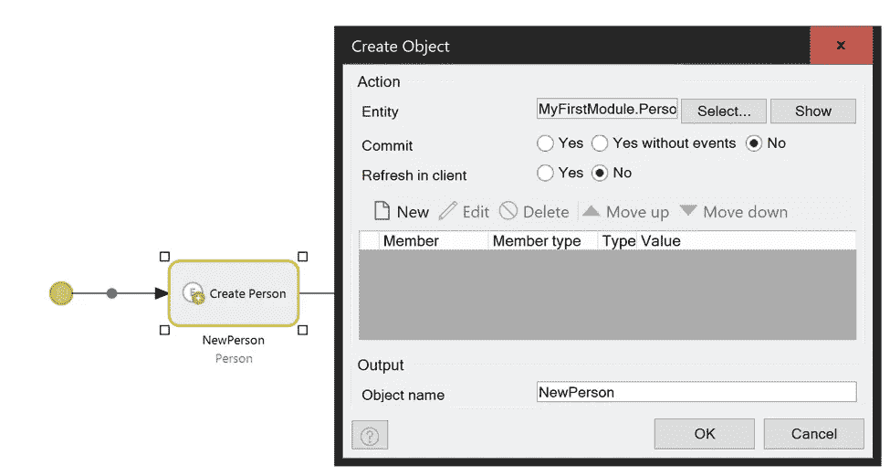

**被测逻辑的子微流**

下一步是将我们的验证微流拖到我们的测试微流中。这个微流成为我们的测试流中的一个块，这使得它成为我们的单元测试的子微流:

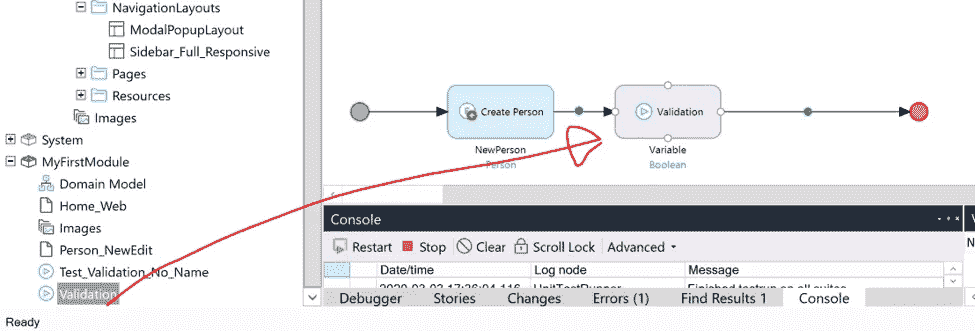

我们不应该忘记将我们新创建的“Person”对象传递给“Validation”微流。否则，该流将没有输入参数。我们通过双击验证流并双击配置屏幕中的参数来实现这一点。这里我们将值设置为$NewPerson，我们的新对象！

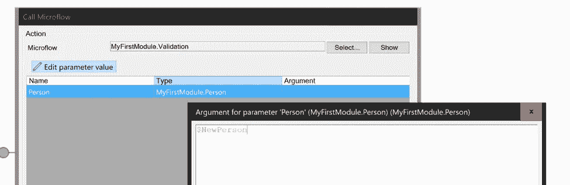

**验证**

在“验证”流的下面(我在我的流中把它变成了紫色，这样我们就可以很容易地识别它)，我们看到一个叫做“变量”的东西，它下面的“布尔”是蓝色的。这是我在验证流程中准备的东西。我们可以在子微流中使用返回值，它可以返回从字符串或整数到对象或对象列表的任何内容。在这种情况下，我准备了我们的验证流，当“Name”属性被填充并且一切按计划进行时，返回一个布尔值“true”。当没有填写“Name”属性时，流程返回“false ”,我们向用户返回一条错误消息。我们可以在测试中将这个返回值用于断言:

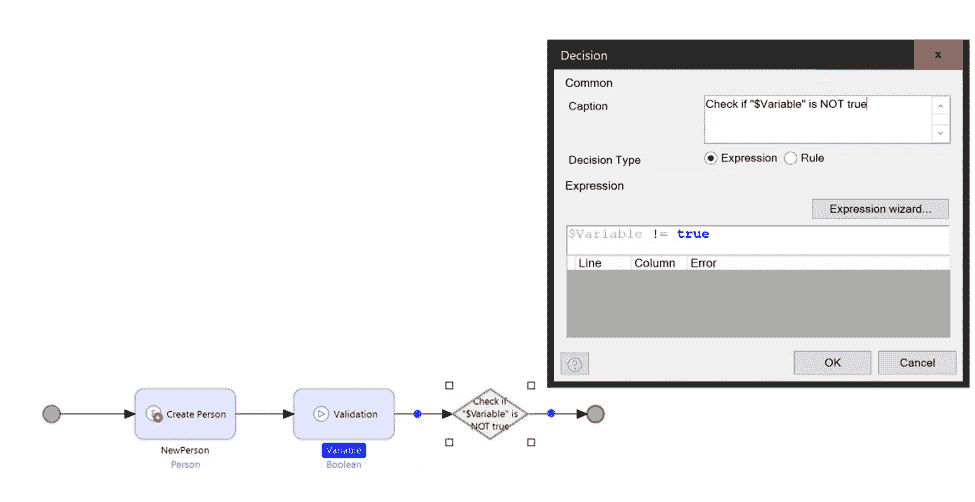

好了，我们已经完成了一个“创建对象”动作来创建一个没有“名字”属性的“人”对象。然后我们进入紫色块，即“验证”流程。正如我们在上面的图片中看到的，当“Name”属性不存在时，验证流出错(进入错误场景)。因此，我们期望从验证流返回的$变量是“false”！

我们将在测试中检查这一点:

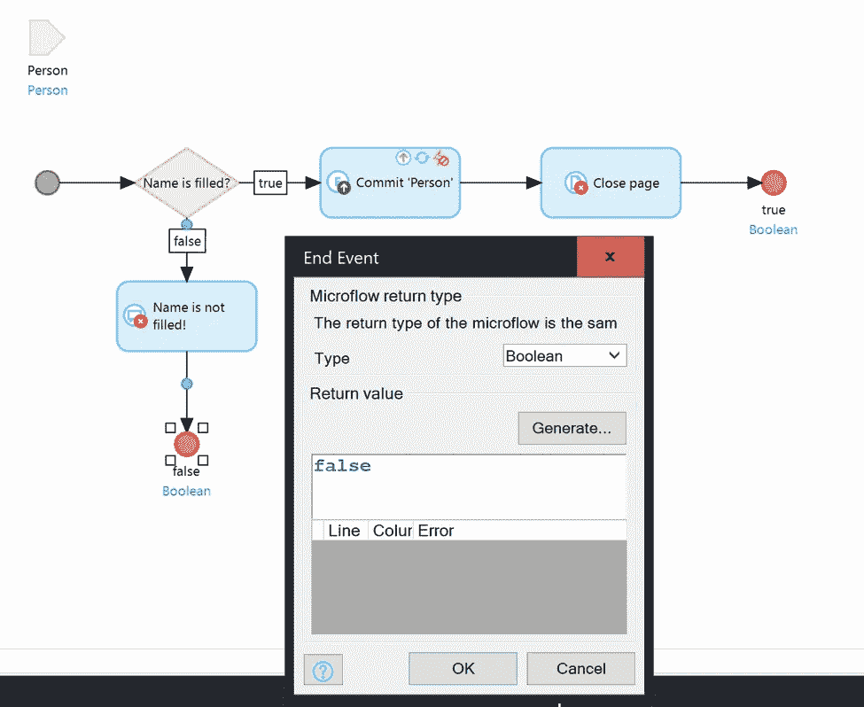

**测试正常/不正常**

接下来，我为单元测试的结束标记(红点)提供“真”或“假”，以便工具知道它应该将我的测试结果标记为绿色还是红色(OK/NOK):

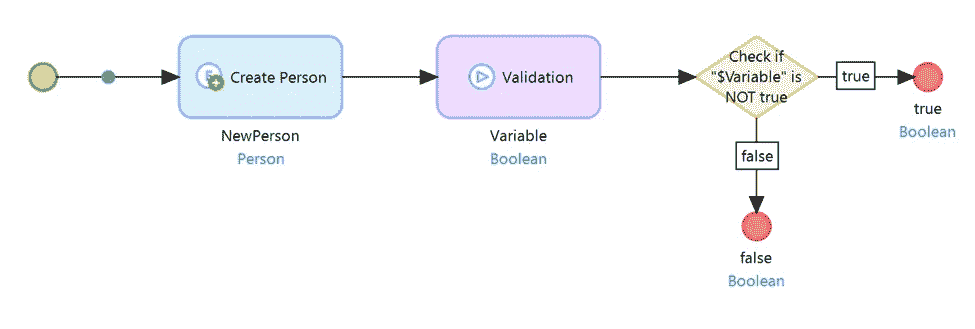

**我们自己的单元测试概述**

当我们再次运行代码(本地运行)，并再次点击“Reset all tests”按钮时，我们应该在概览中看到一个额外的单元测试…我们刚刚创建的单元测试！

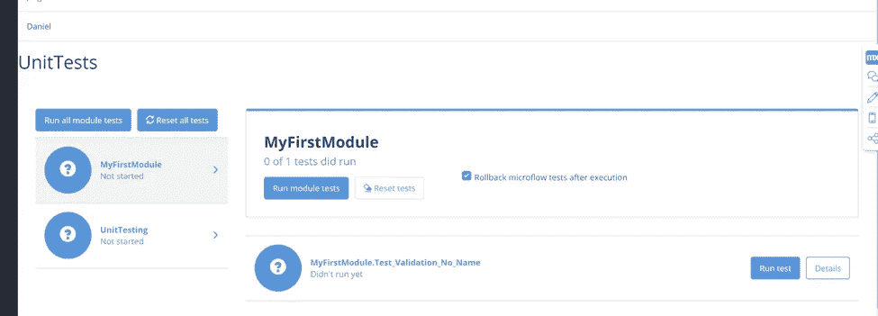

**结果**

当我们点击右下角的“运行测试”时…

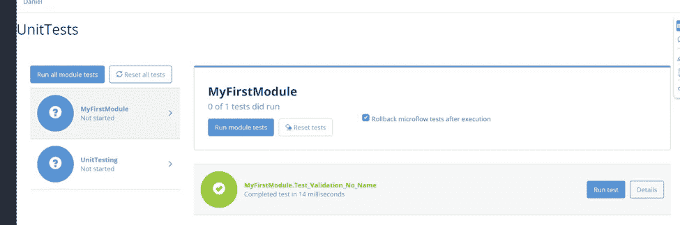

Test passed!

**结论**

这是 Mendix 现在提供的单元测试工具的第一印象。正如我在这篇博客开始时所说的，有许多方法可以使用单元测试模块。我现在保持它的简单，让它对广大公众来说是可读和可理解的，我选择对来自我的验证微流的“真”或“假”返回值做我自己的断言。UnitTesting 模块有两种不同的断言微流，我也可以用它们来进行断言。除此之外，我还没有使用过 UnitTesting 模块提供的“ReportStep”微流。这个报告步骤有助于调试，因为“细节”屏幕(“运行测试”按钮的右边)将显示测试失败前最后一个通过的步骤。

但是我可能会在我的下一篇博客中谈论这些。

> 您想了解更多关于使用 Mendix 进行低代码开发和/或测试您的 Mendix 应用程序的信息吗？不要犹豫，给我发电子邮件，邮箱: [wb@newspark.nl](mailto:wb@newspark.nl)

# 关于我

我叫韦塞尔·布拉克曼。我从 2012 年开始从事测试自动化工作，从 2016 年开始在专业公司[new park b . v .](https://www.newspark.nl)工作。在我目前的任务中，我有机会作为后端开发人员开始与 Mendix 一起工作，我真的很喜欢自己。我的目标是与他人分享知识，并让其他人对这一低代码运动感到兴奋。希望在 Mendix world 见到大家，或者通过[电子邮件](mailto:wb@newspark.nl)或 [LinkedIn](http://linkedin.com/in/wesselbraakman) 联系我！