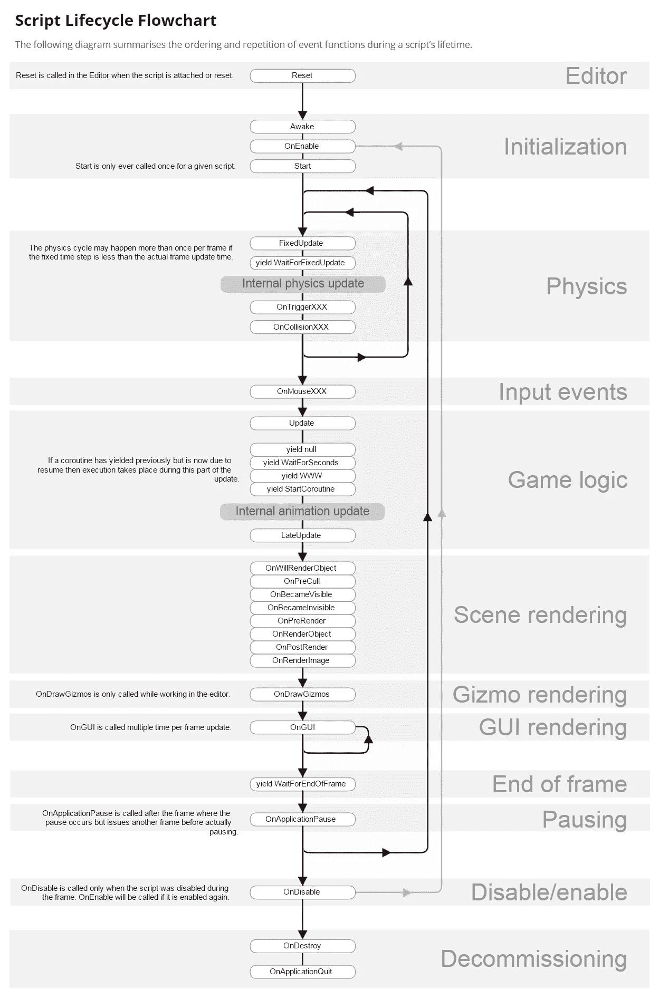

# Unity Coroutine Vs Thread

> 原文：<https://medium.easyread.co/unity-coroutine-vs-thread-fa5a6dc168a7?source=collection_archive---------0----------------------->

Beberapa waktu yang lalu, saya melakukan diskusi dengan teman-teman *developer* game mengenai optimasi aplikasi game untuk meningkatkan ***Frame Per Second* ( *FPS* )** . Dalam bahasan tersebut kami membahas tentang bagaimana jika kita mempunyai *task* atau proses kalkulasi yang berat atau lama seperti *Fog of War* , *PathFinding* , dan lain-lain, namun tetap menjaga *FPS* dari game kita. Dalam pembahasan tersebut, ada yang menyarankan untuk menggunakan ***Coroutine*** . Dari situ saya menangkap terdapat beberapa kesalahpahaman tentang *Coroutine* yang akan kita bahas kali ini.

## **Unity Main Thread**

*Unity core game loop* berjalan pada sebuah *thread* yang sering disebut dengan ***Unity MainThread*** . Pada *thread* ini semua proses `**onCollisionXX(), update(), LateUpdate(), FixedUpdate()**` dan lain-lain berjalan (lihat [Unity Execution Order](https://docs.unity3d.com/Manual/ExecutionOrder.html) ). *Nah* , FPS dari aplikasi kita bergantung pada berapa lama waktu yang dibutuhkan *MainThread* ini untuk melakukan semua operasi dalam satu game *loop* atau satu frame. Jika *MainThread* ini membutuhkan waktu sekitar 33ms untuk melakukan seluruh proses *logic* -nya, maka aplikasi kita akan berjalan dengan 30 FPS (1000ms/30ms = 30.3…FPS). Oleh karena itu, jika kita ingin meningkatkan FPS kita, maka hal yang harus kita perhatikan adalah **Bagaimana Meminimalisir Operasi Yang Dilakukan MainThread.**

Unity Script Lifecycle

## Unity Coroutine

*Unity Coroutine* adalah fitur *asynchronous* yang dimiliki Unity untuk mengeksekusi *task* yang membutuhkan pengeksekusian dalam beberapa frame secara bertahap. Jika teman-teman perhatikan pada gambar di atas, *Unity Coroutine* berjalan pada *MainThread* , yang berarti *coroutine* tetap dibebankan pada *MainThread* dan tetap berpengaruh menurunkan FPS. Jika kita menempatkan *task* yang berat pada coroutine, maka task tersebut tetap akan mempengaruhi FPS.

Lalu teman-teman bertanya, apa arti *asynchronous* yang disebut di atas? *Asynchronous* yang disebutkan di atas **proses** **yang membutuhkan pengeksekusian dalam beberapa frame secara bertahap** . Contohnya adalah :

1.  ***Fade Animation*** , untuk membuat *fade animation* , teman-teman akan mengurai transparansi sebuah *image* secara perlahan pada setiap frame.
2.  *WaitForSeconds* / *EndOfFrame* / *SomeFrame* , untuk menunggu beberapa detik atau *end of frame* atau menunggu beberapa frame terbentuk, lalu mengeksekusi sesuatu.

## C# Thread

Solusi sebenarnya untuk menangani task yang berat adalah **memisahkan task tersebut untuk tidak dieksekusi di *MainThread*** **dengan** **membuat Thread baru** . *Thread* adalah fitur *asynchronous* yang memungkinkan pengeksekusian *task* secara paralel bergantung pada jumlah *core* dari *processor* .

Jika teman-teman mencoba membayangkannya, misalnya aplikasi teman-teman berjalan pada perangkat yang memiliki 4 *core* , maka akan ada kemungkinan terbentuknya 4 *thread* yang akan dieksekusi secara bersamaan. Jika *MainThead* dieksekusi pada *core* 1 (20 ms), dan *pathfinding* di eksekusi pada *core* 2 (13 ms), maka FPS akan meningkat secara drastis karena beban *MainThread* terbagi menjadi 1000ms/20ms = 50 FPS.

Jadi solusi yang tepat untuk *task* yang berat adalah ***MultiThreading*** . Namun ada beberapa catatan khusus bahwa *Unity* API tidak *Thread-Safe* , oleh karena itu, kita membutuhkan cara khusus untuk mengunakan *thread* pada unity.

Saya tidak akan membahas jauh tentang *thread* , karena *thread* cukup kompleks untuk dibahas. Saya hanya ingin menjadikan artikel ini sebagai pointer buat teman-teman untuk mengeksplorasi tentang *performance* . Dan saya sarankan teman-teman eksplorasi tentang [Svelto.Tasks](https://github.com/sebas77/Svelto.Tasks) , sebuah *library* yang bisa membantu teman-teman saat berurusan dengan *MultiThreading* di Unity.

Demikian sedikit tulisan saya, jika ada pertanyaan atau saran, boleh menambahkan komentar dibawah 😄

*Artikel ini di tulis oleh* [*Leo Pripos Marbun*](https://medium.com/u/ea9a874c360d?source=post_page-----fa5a6dc168a7--------------------------------) *, beliau adalah Co-Founder dan CEO dari* [*Ned Studio*](http://nedstudio.net/) *sebuah Startup Game Development di Yogyakarta.*

*Jika anda merasa artikel ini menarik dan bermanfaat, bagikan ke lingkaran pertemanan anda, agar mereka dapat membaca artikel ini.*