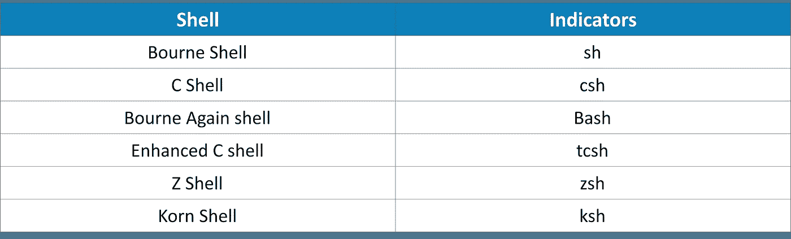
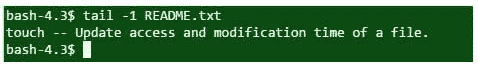
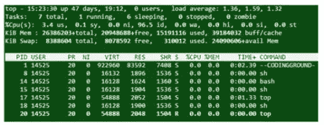
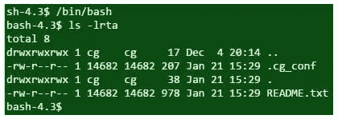
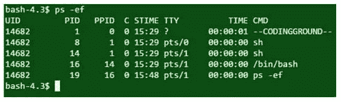
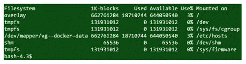
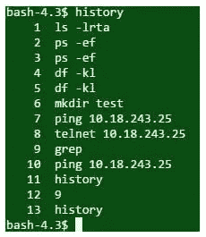
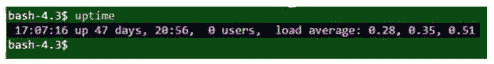
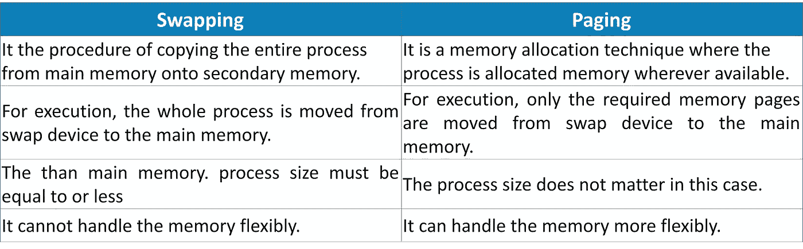

# 你需要知道的 75 个以上 Unix 面试问题和答案

> 原文：<https://medium.com/edureka/unix-interview-questions-dba26b8a13bc?source=collection_archive---------3----------------------->

UNIX Interview Questions — Edureka

***Unix*** 在过去的几年中已经开始迅速扩展其市场，并且是十大 IT 工作需求之一。因此，我们想通过制作一套最常见的 ***Unix 面试问题*** 来让你的工作变得更容易，这将让你为你希望出现的任何工作面试做好准备。

那么，我们开始吧。

## Q1。登记带有指示器的公共外壳。

下表列出了最常见的 shells 及其指示器:

## Q2。定义单用户系统。

拥有一个在给定时间只能由一个用户操作的操作系统的个人计算机被称为单用户系统。由于低成本的硬件和执行不同任务的各种软件的可用性，单用户系统变得更加流行。

## Q3。列出 UNIX 的几个重要特性？

以下是 UNIX 的一些特性:

*   独立于机颇
*   轻便
*   多用户操作
*   Unix Shells
*   分层文件系统
*   管道和过滤器
*   后台处理器
*   公用事业
*   开发工具

## Q4。壳牌是什么？

作为用户和系统之间接口的程序称为外壳。它是理解和执行用户输入的命令的编程层。在一些系统中，它也被称为命令解释程序。

## Q5。一个壳的基本职责是什么？

以下是 shell 的职责:

*   程序执行
*   输入/输出重定向
*   文件名和变量替换
*   管道连接
*   环境控制
*   集成编程语言

## Q6。UNIX 命令语法的一般格式是什么？

通常，UNIX shell 命令遵循以下模式

*命令(-自变量) (-自变量)(-自变量)(文件名)*

## Q7。描述一下 UNIX 中命令 rm -r *的用法和功能？

命令 ***rm -r **** 清除一个目录及其子目录中的所有文件。

*   **rm** 用于删除文件
*   **-r** 删除包含文件的目录和子目录
*   ***** 表示所有条目

## Q8。描述一下目录这个术语？

UNIX 中的目录是一种特殊形式的文件，它维护着其中包含的所有文件的列表。

## Q9。区分绝对路径和相关路径？

绝对路径是指从根目录定义的精确路径，而相关路径是指与当前位置相关的路径。

## Q10。哪个 UNIX 命令按字母顺序列出文件/文件夹？

***ls -l*** 命令用于按字母顺序列出文件和文件夹，按修改时间排序。

## Q11。描述 UNIX 中的一个链接。

另外一个文件名是 ***链接*** 。它用于为一个文件指定一个以上的名称，为一个目录指定一个以上的名称或链接不同计算机上的文件名是无效的。

**通用命令'- ln 文件名 1 文件名 2 '**

一个 ***符号链接*** 是一个文件，用来只包含其他文件的名字。指向它所指向的文件的是符号链接的操作。

**通用命令'- ln -s 文件名 1 文件名 2 '**

## Q12。什么是先进先出？

FIFO 或先进先出也称为命名管道，它是一个用于数据瞬态的特殊文件。该数据在写入顺序中是只读的，用于进程间通信。这里，数据在管道的一端写入，从另一端读取。

## Q13。什么是 fork()系统调用？

用于从现有流程创建新流程的命令称为 fork()。主进程称为父进程，新进程称为子进程。父进程得到子进程返回，子进程得到 0。返回值用于检查哪个代码执行了哪个进程。

返回值用于检查执行了哪个进程。

## Q14。解释以下陈述，“使用 root 作为默认登录是不可取的。”

给定语句的含义如下:

root 帐户非常重要，滥用它很容易导致系统损坏。通常适用于用户帐户的证券不适用于根帐户。因此，应该避免使用 root 作为默认登录。

## Q15。术语超级用户是什么意思？

超级用户是可以访问系统中所有文件和命令的用户。一般来说，超级用户登录是以 root 用户身份登录，并且使用 root 用户密码保护登录。

## Q16。定义一个过程组。

一个或多个进程的集合称为一个进程组。每个进程组都有一个唯一的进程 id。函数 ***getpgrp*** 返回调用进程的进程组 ID。

## Q17。说出 UNIX 中可用的不同文件类型。

在 UNIX 中遵循不同的文件类型:

*   常规文件
*   目录文件
*   字符特殊文件
*   阻止特殊文件
*   先进先出。比较 LIFO
*   符号链接
*   (电源)插座

## Q18。cmp 和 diff 命令之间的行为差异是什么？

尽管这两个命令都是用于文件比较的，但两者之间仍然存在着根本的区别。

**Cmp** 逐字节比较两个给定文件，显示第一个不匹配的文件。

**Diff** 显示为了使两个文件相同而需要进行的更改。

## Q19。chmod、chown、chgrp 命令有什么作用？

以下是给定 UNIX 命令的用途；

*   **chmod** 更改文件的权限集。
*   **chown** 改变文件的所有权。
*   **chgrp** 改变文件的组。

## 问题 20。给出查找当前日期的命令。

命令“date”用于检索当前日期。

## 问题 21。这个命令做什么，`"$more README.txt`"？

该命令显示文件名 ***README.txt*** 的第一部分，它正好适合一个屏幕。

## 问题 22。使用 gzip 描述 zip/unzip 命令。

gzip 命令使用相同目录中给定的文件名创建一个 zip 文件。

gunzip 命令解压文件。

## 问题 23。你能解释一下改变文件访问权限的方法吗？

创建/更改文件访问权限时，需要考虑三个部分。

*   文件所有者的用户 ID
*   文件所有者的组 ID
*   要定义的文件访问模式

这三部分安排如下。

(用户权限)——(组权限)——(其他权限)

可以定义三种类型的权限。

*   **r** —读取权限
*   **w** —写权限
*   **x** —执行许可

## 问题 24。你如何显示文件的最后一行？

使用“tail”或“sed”命令显示文件的最后一行。

在上面的示例代码中，显示了 README.txt 的最后一行。

## 问题 25。UNIX 进程中的各种 id 是什么？

进程 ID 是一个惟一的整数，UNIX 用它来标识某个进程。

执行以启动其他进程的进程被称为父进程，其 ID 被定义为 PPID(父进程 ID)。

*   **getppid()** 检索 ***父进程 ID***

每个进程都与一个特定的用户相关联，该用户被称为进程的所有者。所有者拥有整个过程的所有特权。所有者也是执行流程的用户。

用户的标识是用户 ID。该过程还与有效的用户 ID 相关联，该用户 ID 确定了对诸如文件之类的资源的访问权限。

*   **getpid()** 检索出 ***进程 ID***
*   **getuid()** 检索 ***用户 ID***
*   **geteuid()** 检索 ***有效用户 ID***

## 问题 26。如何在 UNIX 中终止一个进程？

Kill 命令接受进程 ID (PID)作为参数中的。这仅适用于命令执行者拥有的进程。

**语法** *—杀死 PID*

## Q27。在后台执行进程有什么好处？

在后台执行进程的主要优点是可以执行其他进程，而无需等待前一个进程完成。进程末尾的符号“&”告诉 shell 在后台执行给定的命令。

## 问题 28。在服务器上查找最大内存占用进程的命令是什么？

top 命令显示 CPU 使用率、进程 id 和其他详细信息。

**输出**

## 问题 29。在当前目录中查找隐藏文件的命令是什么？

您使用 ***ls -lrta*** 是为了显示当前目录下隐藏的文件。

**输出**

## Q30。您可以使用哪个命令来查找 Unix 服务器中当前正在运行的进程？

***ps -ef*** 是用于查找当前运行进程的命令。同样，使用带有管道的 ***grep*** 可以找到具体的进程。

**输出**

## Q31。应该使用哪个命令来查找 UNIX 服务器中的剩余磁盘空间？

命令 ***df -kl*** 用于获得磁盘空间使用情况的详细描述。

**输出**

## Q32。哪个 UNIX 命令创建一个新目录？

命令***mkdir directory _ name***用于创建一个新的目录。

## Q33。确认远程主机是否活动的 UNIX 命令是什么？

您可以使用 ***ping*** 或 ***telnet*** 到确认远程主机是否存活。

## Q34。你如何能看到命令行历史？

***历史*** 命令显示当前会话中之前使用的所有命令。

**输出**

## Q35。区分交换和分页？

**交换:**在这种情况下，整个进程被移动到主存储器中执行。为了满足内存需求，进程大小必须小于可用的主存容量。实现很容易，但是对系统来说是一个开销。交换系统的内存处理并不更加灵活。

**分页:**在这种情况下，只有需要的内存页面被移动到主内存中执行。进程的大小与执行无关，它不需要小于可用内存的大小。允许多个进程同时加载到主存中。

## Q36。哪个命令用于确定系统是 32 位还是 64 位？

***arch*** 或 ***uname -a*** 可用于所需工艺。

## Q37。UNIX 中的“nohup”是什么？

要在后台运行一个进程，***【nohup】***是一个特殊的命令。即使用户从系统注销，使用此命令启动的进程也不会终止。

## Q38。命名 UNIX 命令以查找服务器已经运行了多少天。

***正常运行时间*** 命令返回服务器已经运行的天数。

## Q39。哪种模式执行故障处理程序？

内核模式。

## Q40。“echo”命令有什么作用？

***echo*** 命令输出作为参数传递的字符串。

## Q41。保护故障的解释是什么？

当进程访问没有访问权限的页面时，称为保护故障。此外，当一个进程试图在 fork()系统调用期间设置了“写入时复制”位的页面上写入时，会导致保护故障。

## Q42。如何在不打开 UNIX 的情况下编辑一个大文件？

此过程可使用 ***sed*** 命令。在下面的示例中，代码将 README.txt 文件中的***a***s 替换为***AAA****s .*

## Q43。描述“区域”的概念。

区域是进程地址空间(文本、数据和堆栈)的连续区域。区域可在进程间共享。

## Q44。u-area 是什么意思？

该区域包含特定于进程的信息，并且仅由内核操作。它包含分配给 u-area 的进程独有的私有数据。

## Q45。解释管道。

***管道(|)*** 用于将两个或多个命令组合在一起，其中第一个命令的输出作为第二个命令的输入，依此类推。

## Q46。如何计算文件中的字符数和行数？

***wc — c filename*** 命令可以检索文件中的字符数，而 ***wc -l filename*** 命令可以检索文件中的行数。

## Q47。你所理解的 UNIX shell 是什么？

UNIX shell 充当运行命令、程序和 shell 脚本的环境。除此之外，它还充当用户和 Unix 操作系统之间的接口。Shell 发出 ***$*** 作为命令提示符，它读取输入并确定要执行的命令。

**例如:***$日期*

上面的命令将显示当前日期和时间。

## Q48。解释术语过滤器。

*过滤器*被描述为一个程序，它从标准输入中获取输入，并通过对其执行一些动作将结果显示到标准输出中。

标准输入可以在键盘上键入，从其他文件输入或作为输入的其他文件的输出。标准输出是显示屏的默认设置。

最流行的 Unix 过滤器 id grep 命令的例子。这个程序在一个文件或文件列表中寻找一个给定的模式，只有那些行显示在包含给定模式的输出屏幕上。

## Q49。你能写一个命令来删除当前目录中的所有文件吗？

***rm -r**** 是用于擦除当前目录下所有文件的命令，包括所有子目录。

*   **rm:** 该命令用于删除文件。
*   **-r:** 该选项将删除目录和子目录中的所有文件。
*   ***:** 这代表所有条目。

## Q50。你能解释一下内核是做什么的吗？

内核是操作系统的心脏。它不直接与用户打交道，而是作为登录用户的一个独立的交互程序。

它负责以下功能:

*   与硬件的交互
*   内存管理
*   文件管理
*   任务调度。
*   计算机资源
*   将资源分配给不同的任务和用户。

## Q51。说出 Bourne shell 的主要特性。

Bourne shell 的主要功能包括但不限于以下内容:

*   输入/输出重定向。
*   文件名缩写使用元字符。
*   为定制环境使用 shell 变量。
*   使用内置命令集创建程序。

## Q52。说出 Korn Shell 的主要特性。

Korn shell 的主要特性包括但不限于以下内容:

*   执行命令行编辑。
*   维护命令历史，以便用户可以在需要时检查最后执行的命令。
*   额外的流量控制结构。
*   调试原语帮助程序员调试他们的代码。
*   支持数组和算术表达式。
*   能够使用别名，别名被定义为命令的简写名称。

## Q53。关于 shell 变量你能知道什么？

变量就像一个名字。它被定义为被赋值的字符串，其中的值可以是数字、文本、文件名等。shell 维护内部变量集，并允许删除、分配和创建变量。

因此，shell 变量是由 shell 设置的特殊变量，并且是 shell 正确运行所必需的。这些变量中的一些是环境变量，而另一些是局部变量。

因此，shell 变量是 shell 中存在的标识符和赋值的组合。这些变量对于定义它们的 shell 来说是局部的，并且它们以特定的方式工作。它们可能有默认值，或者可以使用适当赋值命令手动赋值。

*   *定义一个外壳变量，使用* ***设置*** *命令。*
*   *要删除一个外壳变量，使用* ***取消设置*** *命令。*

## Q54。简要描述壳牌公司的职责。

虽然最常见的是分析输入行以及启动用户输入的程序的执行，但是 Shell 还有各种其他的职责。下面给你一个简单的描述；

*   外壳通过分析行并确定要执行的步骤来负责所有程序的执行，然后启动所选程序的执行。
*   shell 允许您在命令行上指定变量时为变量赋值。它还执行文件名替换。
*   外壳负责输入和输出重定向。
*   shell 通过将“|”前面命令的标准输出连接到“|”后面命令的标准输入来执行管道连接。
*   外壳提供某些命令来定制和控制环境。
*   shell 有自己内置的集成编程语言，通常更容易调试和修改。

## Q55。解释 UNIX 中的文件系统。

Unix 中的所有数据都被组织成文件。Unix 中的文件系统被称为一个功能单元或文件的逻辑集合，其中的磁盘用于存储文件和 inode 条目。这些目录被组织成一个称为文件系统的树状结构。Unix 系统中的文件被组织成称为目录树的多级层次结构。在文件系统的最顶端是一个名为“root”的目录，通常用/ *表示。*

总结之前所说的，文件系统是文件和目录的集合，具有下面提到的一些重要特性；

*   文件系统的最顶层被定义为一个名为“root”的目录，它包含其他文件和目录，用一个省略号(/)表示。
*   这些文件系统是独立的，不依赖于其他文件系统。
*   每个文件和目录都由以下内容唯一标识:

1.  名字
2.  它所在的目录
3.  唯一的标识符

*   所有文件都被组织到一个称为“目录树”的多级分层目录中。

## Q56。定义信息节点。

当在目录中创建文件时，它访问两个属性，即文件名和 inode 号。文件名首先用索引节点号映射并存储在表中，然后这个索引节点号用作访问索引节点的媒介。因此，可以将 inode 定义为在文件系统的磁盘部分上创建和保留的条目。*它*作为一个数据结构，几乎存储了一个文件需要知道的每一个信息。

这些信息通常包括以下细节:

*   磁盘上的文件位置
*   文件的大小
*   设备 Id 和组 Id
*   文件模式信息
*   文件保护标志
*   所有者、组的访问权限。
*   文件创建、修改

## Q57。区分交换和分页。

下表显示了交换和分页之间的区别:

## Q58。你将如何向一个非技术人员解释一个内核？

内核是操作系统的心脏。它是操作系统的最低层，负责将命令翻译成计算机可以理解的东西。将资源分配给不同的用户和由该部分处理的任务。内核与用户没有任何直接的通信，因此，当每个用户登录到系统时，它为每个用户启动一个单独的交互程序，称为 shell。

## Q59。能列举一些常用的网络命令吗？

下面列出了 Unix 中一些常用的网络命令:

*   **telnet:** 该命令用于远程登录以及与另一个主机名的通信。
*   **ping:** 该命令被定义为检查网络连通性的回应请求。
*   su: 该命令是作为用户切换命令导出的。
*   **主机名:**该命令确定 Ip 地址和域名。
*   **nslookup:** 这个命令执行 DNS 查询。
*   **xtraceroute:** 该命令用于确定到达网络主机所需的环数和响应时间。
*   **netstat:** 该命令提供大量信息，如本地系统和端口上正在进行的网络连接、路由表、接口统计等。

## Q60。超级用户的意义是什么？

Unix 操作系统中基本上有三种类型的帐户:

*   根帐户
*   系统帐户
*   用户帐户

在上述帐户中，Root 帐户通常被称为超级用户。该用户对系统上的所有文件和命令拥有完全开放的访问权限。这个超级用户帐户也可以被假定为系统管理员，因此能够不受任何限制地运行任何命令。它受 root 密码保护。

## Q61。管道(|)是做什么的？

当需要同时使用两个或更多命令并连续运行时，您可以使用一个称为**管道(|)** 的操作符。它所做的是以这样一种方式连接两个命令，一个程序的输出作为另一个程序的输入。

下面列出了一些使用管道运算符的命令:

*   **grep 命令:**在文件中搜索某些匹配模式。
*   **排序命令:**按字母或数字顺序排列文本行。

## Q62。解释 UNIX 中的一个路径。

在任何操作系统的文件系统中，都存在目录的层次结构,“路径”被定义为访问文件/目录的唯一位置。

## Q63。解释 UNIX 中使用的不同类型的路径名。

Unix 中使用的路径名基本上有两种类型。这些可以定义如下:

*   **绝对路径名:**它定义了一个完整的路径，从实际文件系统的最开始，即从根目录(/)指定文件/目录的位置。绝对路径名寻址不改变位置的系统配置文件。它定义了一个完整的路径，从实际文件系统的最开始，即从根目录(/)指定文件/目录的位置。绝对路径名寻址不改变位置的系统配置文件。
*   **相对路径名:**定义了用户所在的当前工作目录的路径，即当前工作目录(pwd)。相对路径名表示当前目录、父目录，也指不可能或不方便访问的文件。它定义了用户所在的当前工作目录的路径，即当前工作目录(PWD)。相对路径名表示当前目录、父目录，也指不可能或不方便访问的文件。

## Q64。解释 UNIX 中的超级块。

超级块本质上是一个包含特定文件系统记录的程序。

诸如块大小、空块和已填充块及其各自的计数、inode 表的大小和位置、磁盘块图和使用信息以及块组的大小等特征在超级块中可用。

基本上有以下两种类型的超级块:

*   **默认超级块:**它总是以从系统磁盘分区开始的固定偏移量存在。
*   **冗余超级块:**当默认超级块受到系统崩溃或某些错误的影响时被引用。

## Q65。在 UNIX 中列出一些文件名操作命令。

下表列出了一些文件名操作命令及其描述；

## Q66。解释链接和符号链接。

链接被称为第二个名称，用于为一个文件指定多个名称。尽管链接被称为指向另一个文件的指针，但它不能用于链接不同计算机上的文件名。

符号链接也称为软链接，它是一种特殊类型的文件，包含以绝对或相对路径形式指向另一个文件或目录的链接或引用。它不包含目标文件中的实际数据，而是指向文件系统中另一个条目的指针。符号链接也可以用来创建文件系统。

以下命令用于创建符号链接:

*   **Ln–s 目标链接名称**
*   **在这里，路径是‘目标’**
*   **链接的名称由 link_name 表示。**

## Q67。什么是别名机制？解释一下。

为了避免键入长命令或提高效率，alias 命令用于为命令指定另一个名称。基本上，它充当了可以键入并运行的更大命令的快捷方式。

要在 Unix 中创建别名，使用以下命令格式:

别名= '您要运行的命令'

在这里，用快捷命令替换“名称”,用要为其创建别名的更大的命令替换“要运行的命令”。

例如:

***别名 dir ' Is–sFC '***

这里，在上面的例子中， ***dir*** 是命令 ***Is-sFC*** 的另一个名称。因此，用户现在只需记住并使用指定的别名，该命令将执行与长命令相同的任务。

## Q68。能给我讲讲通配符解释吗？

通配符是一些特殊类型的字符，代表一个或多个其他字符。*通配符解释*出现在命令行包含这些字符的时候。在这种情况下，当模式与输入命令匹配时，这些字符将被一个文件的排序列表替换。

*星号* (*)和*问号*(？)通常用作通配符，以便在处理时建立文件列表。

## Q69。解释与 UNIX 命令相关的术语“系统调用”和“库函数”?

**系统调用:**顾名思义，系统调用被定义为一个基本上在内核本身使用的接口。虽然它们可能不是完全可移植的，但是这些调用要求操作系统代表用户程序执行任务。

系统调用显示为普通的 C 函数。每当在操作系统中调用系统调用时，应用程序执行从用户空间到内核空间的上下文切换。

**库函数:**不是内核的一部分，但被应用程序使用的一组公共函数被称为“库函数”。与系统调用相比，库函数是可移植的，只能在“内核模式”下执行某些任务。此外，与执行系统调用相比，它的执行时间更短。

## Q70。解释 PID。

PID 用于表示唯一的进程 ID。它基本上标识了在 Unix 系统上运行的所有进程。进程是在前台运行还是在后台运行并不重要。

## Q71。kill()系统调用可能的返回值是什么？

**Kill()系统**调用用于向任何进程发送信号。

此方法返回以下返回值；

*   **返回 0:** 表示给定 PID 的进程存在，系统允许向其发送信号。
*   **Return -1 and errno==ESRCH:** 表示不存在指定 PID 的进程。也可能存在一些拒绝 PID 存在的安全原因。
*   **Return -1 和 errno==EPERM:** 这意味着没有许可证可以终止该进程。该错误还会检测该进程是否存在。
*   **EINVAl :** 暗示无效信号。

## Q72。说出 UNIX 中用于用户信息的各种命令。

用于在 Unix 中显示用户信息的各种命令如下:

*   **id:** 该命令显示带有登录和组的活动用户 id。
*   **last:** 该命令显示用户在系统中的最后一次登录。
*   **谁:**该命令决定谁登录到系统。
*   **组添加管理员:**该命令用于添加“管理员”组。
*   **usermod -a:** 该命令用于将现有用户添加到组中。

## Q73。你对 tee 命令及其用法了解多少？

*“三通”命令*基本上用于连接管道和过滤器。

这个命令主要执行两个任务:

a)从标准输入获取数据，并将其发送到标准输出。

b)将输入数据的副本重定向到指定文件。

## Q74。解释安装和卸载命令。

***Mount 命令:*** 顾名思义，Mount 命令将一个存储设备或文件系统挂载到一个现有的目录中，从而使其可供用户访问。

***Unmount 命令:*** 该命令通过安全分离来卸载已挂载的文件系统。该命令的任务还包括通知系统完成任何未完成的读写操作。

## Q75。什么是“chmod”命令？

*Chmod 命令*用于更改文件或目录访问权限，是 Unix 中最常用的命令。根据模式，chmod 命令更改每个给定文件的权限。

**chmod 命令的语法是:**

chmod[选项]模式文件名*。*

**在上面的格式中，选项可以是:**

*   -R:递归更改文件或目录的权限。
*   -v: verbose，即为每个处理的文件输出一个诊断信息。
*   -c:仅在进行更改时报告。

## Q76。你能解释一下命令替换吗？

命令替换是 shell 每次处理用反引号括起来的命令时都会执行的一种方法。此过程替换标准输出，并在命令行上显示它。

命令替换可以执行以下任务；

*   调用子外壳
*   导致单词拆分
*   删除尾随的新行
*   允许使用“重定向”和“cat”命令为文件内容设置变量
*   允许为循环输出设置变量

这些都是我们能想到的 UNIX 面试问题。这些 UNIX 面试问题将在尽可能短的时间内涵盖你参加的任何面试。如果你有任何有趣的问题，在你之前参加过的采访中被问到过，请随意在评论栏提出，我们会为你解答。你也可以参考这个视频，它深入解释了这些问题的解决方案。

如果你想查看更多关于人工智能、DevOps、道德黑客等市场最热门技术的文章，那么你可以参考 [Edureka 的官方网站。](https://www.edureka.co/blog/?utm_source=medium&utm_medium=content-link&utm_campaign=operating_systems)

请留意本系列中的其他文章，它们将解释操作系统的各个方面。

> *1。* [*Linux 命令*](/edureka/linux-commands-895d69fa4f07)
> 
> *2。*[*Linux Mint*](/edureka/linux-mint-904d4de15c58)
> 
> *3。*[*Unix vs Linux*](/edureka/unix-vs-linux-ee3298dd5e1a)

*原载于*[*https://www.edureka.co*](https://www.edureka.co/blog/interview-questions/unix-interview-questions/)*。*