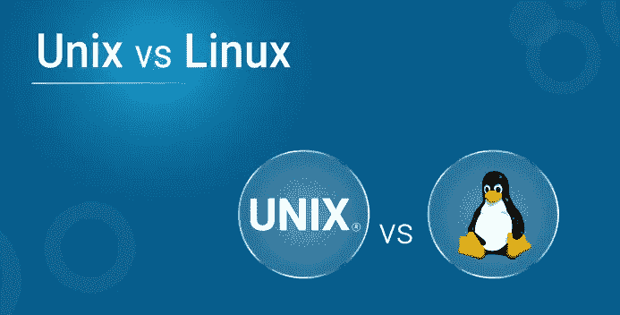
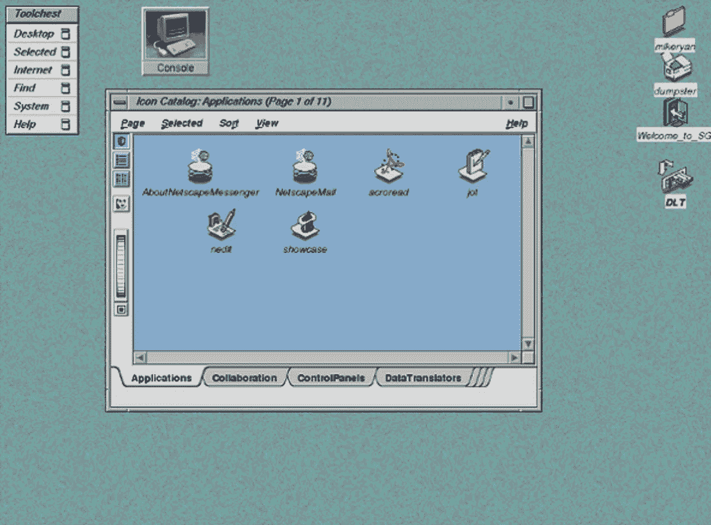
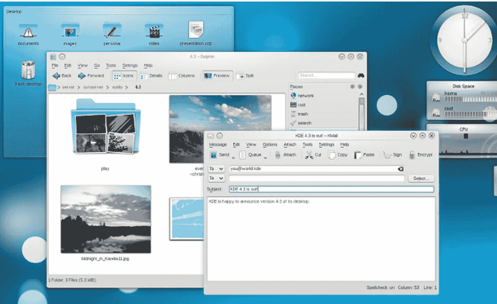
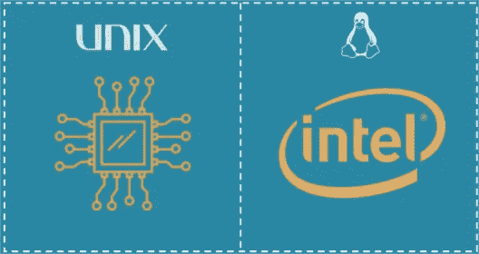
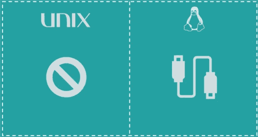

# Unix 与 Linux 的区别和比较

> 原文：<https://medium.com/edureka/unix-vs-linux-ee3298dd5e1a?source=collection_archive---------1----------------------->

Linux 是从零开始编写的 Unix 克隆。但这就是全部吗？在这篇***Unix vs Linux****的文章中，我们将揭示是什么让这两个操作系统如此相似又如此不同。*

*微小的复杂性使人们在这两者之间做出选择，虽然 Unix 在历史上一直主导着市场，但对 Linux 认证专业人员的需求在过去几年中一直在全速增长。*

*   ***什么是 Unix？***
*   ***什么是 Linux？***
*   ***Unix 和 Linux 的区别***
*   ***Unix 的局限性***
*   ***Linux 的局限性***

# *Unix vs Linux:什么是 Unix？*

*Unix 是一个专有的操作系统。这是一个稳定的多用户、多任务系统，适用于服务器、台式机和笔记本电脑。Unix 是一种在公司、大学、大企业等中流行的操作系统。*

*这种操作系统诞生于 20 世纪 60 年代末的美国电话电报公司·贝尔实验室，被称为 Unix。用 C 语言编写，它允许更快的修改、接受和移植。*

*这个由贝尔实验室的肯·汤普森领导的个人项目，后来成为了最广泛使用的操作系统之一。*

*Unix 操作系统最初在命令行界面上工作，但是最近，在 Unix 系统上有了 GUI 的发展。*

**

# *Unix vs Linux:什么是 Linux？*

***Linux** 是一个开源、免费使用的操作系统，广泛用于计算机软硬件、游戏开发、平板电脑、大型机等。*

*Linux 是由 Linus Torvalds 于 1991 年在赫尔辛基大学创建的，它的名字来源于 Linux 内核。*

*让它脱颖而出的是它可以安装在各种类型的电脑、手机、平板电脑、视频游戏机等上。*

*Linux 的发展是自由和开源软件合作最突出的例子之一。今天，许多公司和类似数量的个人已经发布了他们自己的基于 Linux 内核的操作系统版本，例如苹果的 iOS。*

**

# *Unix vs Linux*

## *使用*

**

*Unix 主要用在互联网服务器和工作站上，而 Linux 可以被任何人使用，从初学者到开发人员，再到纯粹的爱好者。*

## *开发和分销*

**

*Unix 发行版主要是由美国电话电报公司、各种商业供应商和非盈利组织开发的。另一方面，Linux 是由开源开发团队开发的，并且由不同的供应商发布。*

## *处理器*

**

*Unix 可以在支持 x86/x64、Sparc、Power、Itanium、PA-RISC、PowerPC 等处理器的 PA-RISC 和安腾机器上使用。*

*Linux 最初是为 Intel 的 x86 硬件开发的，它使用的处理器数量要多得多，端口可用于几种不同的 CPU 类型。*

## *文件系统支持*

*Unix 支持 jfs、gpfs、hfs、hfs+、ufs、xfs、zfs 格式，而 Linux 支持 Ext2、Ext3、Ext4、Jfs、ReiserFS、Xfs、Btrfs、FAT、NTFS 等等。*

## *外壳接口*

**

*最初，Bourne Shell 是 Unix 的默认设置。现在它可以兼容很多其他的 shell，包括 BASH、Korn & c。BASH(Bourne SHell)是 Linux 默认的 SHell。它可以支持多个命令解释器。*

## *图形用户界面*

*最初，Unix 是一个基于命令的操作系统，但是后来创建了一个 GUI，叫做**公共桌面环境**。大多数发行版现在都附带了 Gnome。*

*Linux 通常提供两种图形用户界面，KDE 和 Gnome。但是有 LXDE，Xfce，Unity，Mate 等几百万个备选。*

## *轻便*

**

*虽然 Unix 是不可移植的，但 Linux 是可移植的，也可以用 u 盘引导。*

## *安全和威胁检测*

**

*由于原始 Unix 的专有性质，用户必须等待一段时间，才能获得正确的错误修复补丁。但这些并不常见。迄今为止，Unix 中已报告了 80 到 120 种病毒。*

*威胁检测和解决非常快，因为 Linux 主要是社区驱动的，每当任何 Linux 用户发布任何类型的威胁，几个开发人员就从世界不同的地方开始工作。到目前为止，Linux 已经列出了大约 60-100 种病毒，这些病毒目前还没有传播。*

## *源代码*

*虽然 Unix 树的发行版是开源的，如 NetBSD、OpenBSD 和 FreeBSD，但 Unix 是由不同的供应商开发的，如 IBM、HP 等。满足他们的业务需求。他们不会向公众发布源代码。所以，Linux 被开发出来了，源代码也在 GNU 许可下发布给了公众。*

## *许可证*

**

*根据各自的供应商，不同风格的 Unix 有不同的成本结构。*

*Linux 是免费分发的，通过杂志、书籍、网站等下载。也有付费版本，但老实说，除了支持合同，付费和免费发行版之间几乎没有区别。*

# *Unix 的局限性*

*   *至少可以说，Unix 的界面不友好、简洁、不一致且不容易记忆。*
*   *Unix 操作系统并不是为快速性能而设计的。*
*   *Shell 界面可能很危险，因为输入错误可能会破坏文件。*
*   *Unix 的版本缺乏整体的一致性，因为它因机器而异。*
*   *Unix 不提供任何有保证的硬件中断响应时间，所以它不支持实时响应系统。*

# *Linux 的局限性*

*   *没有任何标准版本的 Linux 可用*
*   *Linux 对驱动程序的支持不完整，这可能会导致整个系统出现故障。*
*   *许多 Windows 独有的程序只有在复杂的模拟器的帮助下才能在 Linux 上运行。比如说。微软 Office。*

*如果你想查看更多关于人工智能、DevOps、道德黑客等市场最热门技术的文章，你可以参考 Edureka 的官方网站。*

*请留意本系列中的其他文章，它们将解释操作系统的各个方面。*

> **1。* [*Linux 命令*](/edureka/linux-commands-895d69fa4f07)*
> 
> **2。* [*Top 75+ Unix 面试问答*](/edureka/unix-interview-questions-dba26b8a13bc)*
> 
> **3。*[*Linux Mint*](/edureka/linux-mint-904d4de15c58)*

**原载于 2019 年 4 月 12 日 https://www.edureka.co**的* [*。*](https://www.edureka.co/blog/unix-vs-linux/)*