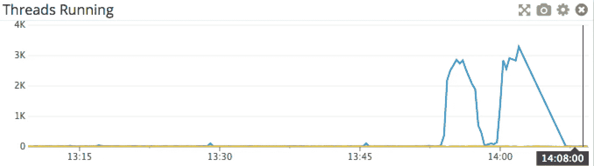
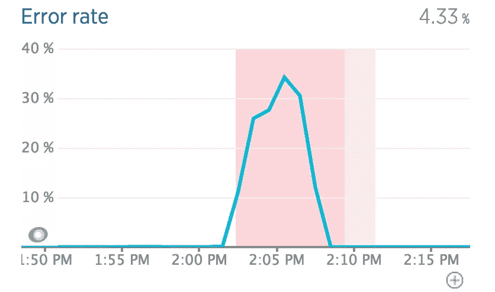
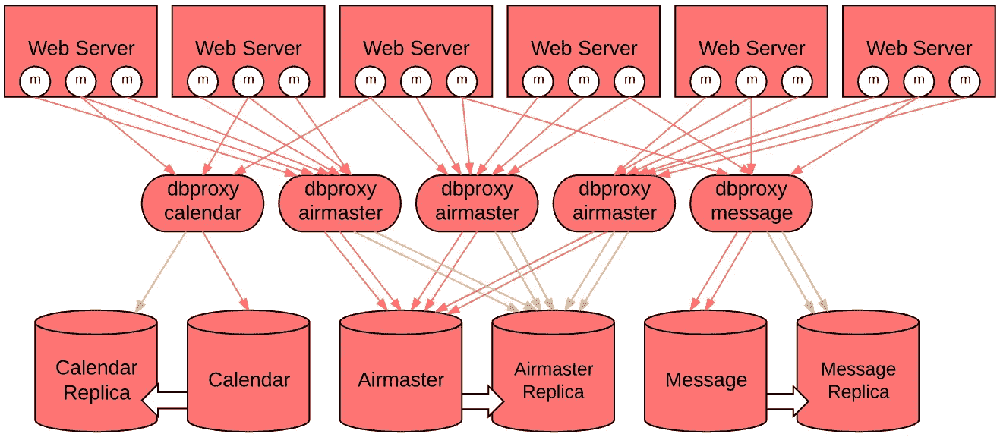
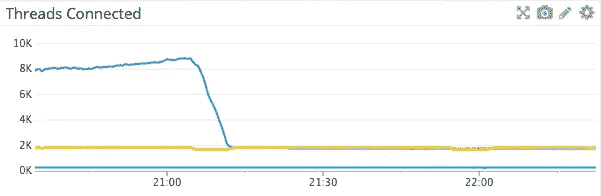
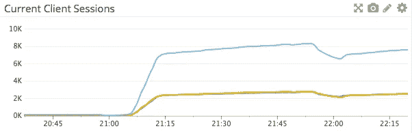

# 在我们的 Web 服务层中释放水平可伸缩性

> 原文：<https://medium.com/airbnb-engineering/unlocking-horizontal-scalability-in-our-web-serving-tier-d907449cdbcf?source=collection_archive---------0----------------------->

由[郭亮](https://www.linkedin.com/in/liang-guo-04189a)

Airbnb 的网络应用由 Ruby on Rails 和 Java 提供支持。面向 web 的应用程序是一个单片 Rails 应用程序，它运行在许多 web 服务器上。Web 请求由 Rails 应用程序处理，它与几个不同的 Java 服务对话，例如搜索服务或列表定价服务。在 Airbnb 的技术栈中，MySQL 数据库扮演着存储核心商业数据的关键角色。我们按应用程序对数据库进行分区，以便于容量规划。例如，用户的消息线程和列表日历管理与核心预订流程是分开的，它们应该在自己的数据库中进行管理。2015 年，我们本着按功能划分核心数据库的精神，做了几项数据库操作(参见这篇[工程博客文章](/airbnb-engineering/how-we-partitioned-airbnb-s-main-database-in-two-weeks-55f7e006ff21#.squ902fhn)了解我们是如何做的)。随着站点流量每年以惊人的速度增长，基础架构团队通过横向扩展应用程序服务器层以获得计算容量，以及纵向分区数据库以获得数据库扩展空间来做出响应。在 2015 年夏季旺季，这种双层架构一直运行得非常好。然而，MySQL 数据库的一个值得注意的资源问题是来自应用服务器的数据库连接数不断增加。

# 问题

我们使用 AWS 的关系数据库服务(RDS)来运行 MySQL 实例。RDS 使用 MySQL server 的 community edition，它采用一个连接一个线程的连接管理模型。MySQL 服务器中的线程模型很可能会遇到著名的 [C10K 问题](http://www.kegel.com/c10k.html)。C10K 问题是，在不显著增加运行线程数量的情况下，MySQL 服务器可以接受和服务的连接数有一个上限，这将严重降低 MySQL 服务器的性能。在 MySQL 中， *Threads_running* 计数器测量并发执行的查询数量。然而，由于 InnoDB 存储引擎线程并发性有限，这一指标的峰值实际上意味着 MySQL 数据库中的客户端查询堆积如山。当这种情况发生时，MySQL 查询延迟增加，请求在整个堆栈中排队，错误率激增。

在生产中，我们遇到了几起严重的数据库事件，表现为正在运行的 MySQL 服务器线程数量激增。上图显示了 *Threads_running* 峰值和同时出现的应用程序错误率峰值。虽然根本原因可能是由于编写不当的查询或底层存储系统中断，但 MySQL 数据库服务器通常需要很长时间才能恢复。通常，工程师不得不求助于手动终止连接作为稳定手段。

尽管运行 spike 的线程很糟糕，但最紧迫的问题甚至不是消防数据库事件，因为它们会导致站点停机。这是数据库连接的限制。运行面向 web 的应用程序的应用服务器直接连接到核心 RDS 数据库。MySQL 服务器为每个客户端连接分配线程堆栈和其他资源。尽管可以调整线程堆栈的大小以允许处理更多的客户端连接，但这是一种有限的资源。大量线程也会导致调度和上下文切换问题。当 RDS MySQL 服务器达到资源限制时，客户端将无法创建连接。数据库连接限制限制了应用服务器处理不断增长的流量的能力。在 2015 年夏末，由于预见到 2016 年夏季流量的扩展瓶颈，基础设施可扩展性团队的工程师开始寻找可行的解决方案。

# Airbnb MaxScale 数据库代理

公平地说，MySQL 有一个动态线程池特性，然而，它只在 MySQL 企业版中可用。MySQL 的 Percona 服务器和 MariaDB 也有类似的服务。由于 Airbnb 使用 AWS MySQL RDS，我们无法访问 MySQL 线程池功能。我们不得不寻找一个外部代理来解决连接限制。我们调查了几种不同的开源技术，我们选择了 MariaDB MaxScale。MariaDB MaxScale 是一个 MySQL 数据库代理，支持客户端应用程序和一组后端 MySQL 服务器之间的智能查询路由。然而，MaxScale 没有解决连接限制问题，因为它需要为每个客户端连接建立一个后端 MySQL 服务器连接。因为我们寻找的是连接池，所以我们决定派生 MariaDB MaxScale 并自己实现它。

## **连接池**

在 Airbnb MaxScale 中，连接池是通过将 N 个客户端连接复用到 M 个后端 MySQL 服务器连接上来实现的。在客户端连接请求完成与后端 MySQL 服务器的成功认证之后，代理切断后端连接和客户端连接之间的链接，并将其驻留在后端服务器的连接池中。服务器连接池的大小是可配置的，通常是一个很小的数字。因为我们分叉了 MariaDB MaxScale 1.3 开发人员分支，所以我们能够利用持久连接特性来实现服务器连接池。当收到客户端连接的查询时，MaxScale 在池中挑选一个后端连接，将其与客户端连接链接，并将查询转发到后端 MySQL 服务器。MaxScale 了解客户端会话的事务上下文，因此它知道在事务提交之前保持链接的后端连接。该链接必须被保留并用于将查询结果转发回客户端。

这个连接池实现中的一个挑战是知道何时解除后端连接到池的链接，以及何时将后端连接返回到池。一个查询响应由一个或多个 MySQL 包组成。因为 MaxScale 在客户端连接和后端连接之间保持一对一的链接，所以它只是在响应包到达时转发它们。在连接池模式下，过早地断开后端连接会导致客户端无限期地等待完整的 MySQL 数据包。为了正确转发 MySQL 查询响应，我们通过遵循 COM_QUERY_RESPONSE 的 MySQL 客户端服务器协议来实现 MySQL 数据包。这样，Airbnb MaxScale 在看到查询响应的完整 MySQL 包之前，不会取消后端连接的链接。除了转发响应之外，它还允许我们测量查询响应大小以进行监控。

## **请求节流**

在生产中，典型的服务器连接池大小被配置为 10。对于 Airbnb MaxScale 代理服务器的许多实例，MySQL 服务器上的数据库连接数是数百个。在正常情况下，只有一小部分连接在使用中。当发生底层存储中断或高成本查询时，查询执行会变得很慢，并且每个 MaxScale 代理服务器实例上的服务器连接池会明显耗尽。我们将该症状视为后端 MySQL 服务器可能遇到并发线程运行峰值问题的信号，并通过终止客户端连接来主动抑制客户端请求。在生产中，请求限制已被证明非常有助于防止由于存储系统暂时停机而导致的数据库事故。

## **查询黑名单**

MaxScale 使用嵌入式 MySQL 解析器进行查询路由。它实际上在其查询分类器模块中为每个 MySQL 查询构建了一个解析树。我们利用 Airbnb MaxScale 中的查询解析树查找错误查询块列表。这个特性的动机是保护我们免受 Ruby VM 堆内存损坏。内存损坏会导致 Rails ActiveRecord 生成的 MySQL 查询语句被损坏，从而导致其条件谓词被完全删除。这篇[博文](http://webuild.envato.com/blog/tracking-down-ruby-heap-corruption/)详细解释了令人讨厌的 Ruby 堆损坏问题。

MySQL 解析树使得检查 MySQL 查询的谓词列表变得容易。查询块列表功能利用 MySQL 解析树来查找 update 和 delete 语句中是否存在格式错误的谓词条件，并拒绝此类语句。为了提供更多的保护，我们还屏蔽了没有任何谓词条件的 MySQL 更新和删除语句。我们部署了具有查询阻止列表功能的 Airbnb MaxScale，它保护我们免受至少一个可怕的损坏查询实例的影响，该实例可能会对我们的一个核心数据库表造成损坏。

## **数据库代理即服务**

MariaDB MaxScale 支持多工作线程模型。出于实际原因，我们选择在 Airbnb MaxScale 代理服务器中使用单个工作线程，并且我们部署了许多实例来实现并发。在 Airbnb，我们使用[智能堆栈](http://nerds.airbnb.com/smartstack-service-discovery-cloud/)进行服务发现。我们部署了一个 Airbnb MaxScale 服务器集群，作为每个核心生产 MySQL 数据库的数据库代理服务。应用程序发现并连接到数据库代理服务，而不是 MySQL 数据库。通过应用服务器和 MySQL 服务器之间的 Airbnb MaxScale 数据库代理服务，web 应用层可以根据容量需求进行水平扩展。作为核心架构中的一个新层，数据库代理服务也可以通过启动新的 Airbnb MaxScale 代理服务器实例进行水平扩展。

该图展示了三层架构，其中不同的数据库代理服务部署在不同的核心 MySQL 数据库前面。

## **延迟影响**

Airbnb MaxScale 数据库代理引入了一个额外的网络跃点。MaxScale 代理中的计算是轻量级的，因为它只请求路由和响应转发。我们在 Airbnb MaxScale 中添加的连接池特性非常简单，不会增加开销。由于担心额外的网络跳可能会产生延迟影响，我们在 SmartStack 中实施了可用性区域感知请求路由。SmartStack 用于将请求路由到随机可用性区域(AZ)中的后端服务器。AZ 感知路由允许应用程序服务器向同一可用性区域中的数据库代理服务器发送请求。我们使用数据库工作负载重放框架进行了广泛的压力测试，发现延迟问题非常小，甚至可以忽略不计。当我们准备推出时，我们对 Airbnb MaxScale 有很高的信心。

# 结果

2016 年早些时候，我们将 Airbnb MaxScale 部署到生产中。在一次平稳的操作中，我们将 monolithic Rails 应用程序连接从直接连接到 MySQL 服务器切换到数据库代理服务层。MaxScale 符合 MySQL 协议。将连接切换到 Airbnb MaxScale 不需要任何客户端应用程序更改。下图显示了当我们执行操作时，一个核心数据库上的数据库连接数急剧下降。

相应地，应用程序的连接转移到了新的 Airbnb MaxScale 数据库代理服务。当我们部署新的数据库代理时，我们的一些 MySQL 数据库处于数据库连接限制的边缘。因此，它在关键时刻投入了生产。

借助连接池数据库代理，我们能够通过添加更多服务器来扩展应用服务器层，而无需增加 MySQL 服务器线程。我们带着平静的心态进入了 2016 年夏季，我们将拥有在夏季高峰期处理另一项创纪录流量所需的服务能力。

今天，我们有超过 15 个 Airbnb MaxScale 数据库代理服务在生产中，每个都用于不同的核心 MySQL 数据库，并具有不同的配置容量。数百个 MaxScale 服务器实例在 web 应用服务器和 MySQL 数据库之间处理请求。自动请求节流已经有效地作为一种背压机制工作，并且它本质上取代了工程师手动终止连接。它一直运行可靠，在生产中没有出现过一例死机的情况。

在 Airbnb engineering，我们坚信开源。到目前为止，我们在 Airbnb MaxScale 上的生产体验非常好。我们希望与社区分享它，因此我们宣布我们已经开源 Airbnb MaxScale。完整的源代码和文档可以在 [github](https://github.com/airbnb/MaxScale) 上找到。请尝试一下，并随时与我们分享您的评论和请求。如果你觉得解决这类问题很有趣，我们正在招聘有才华的基础设施工程师，请和我们一起工作。

## 在 [airbnb.io](http://airbnb.io) 查看我们所有的开源项目，并在 Twitter 上关注我们:[@ Airbnb eng](https://twitter.com/AirbnbEng)+[@ Airbnb data](https://twitter.com/AirbnbData)