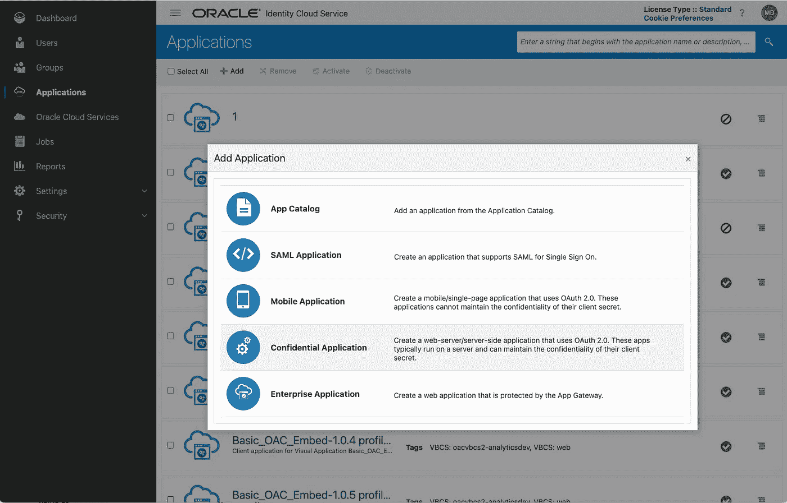
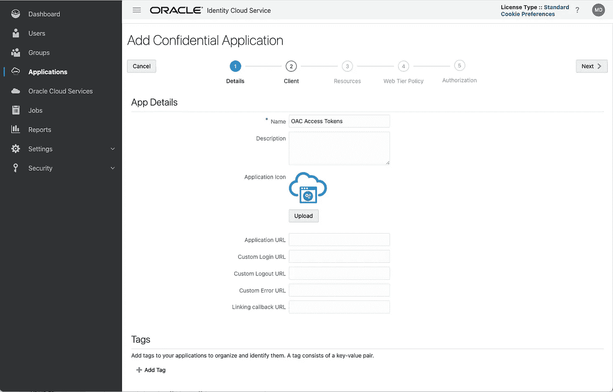
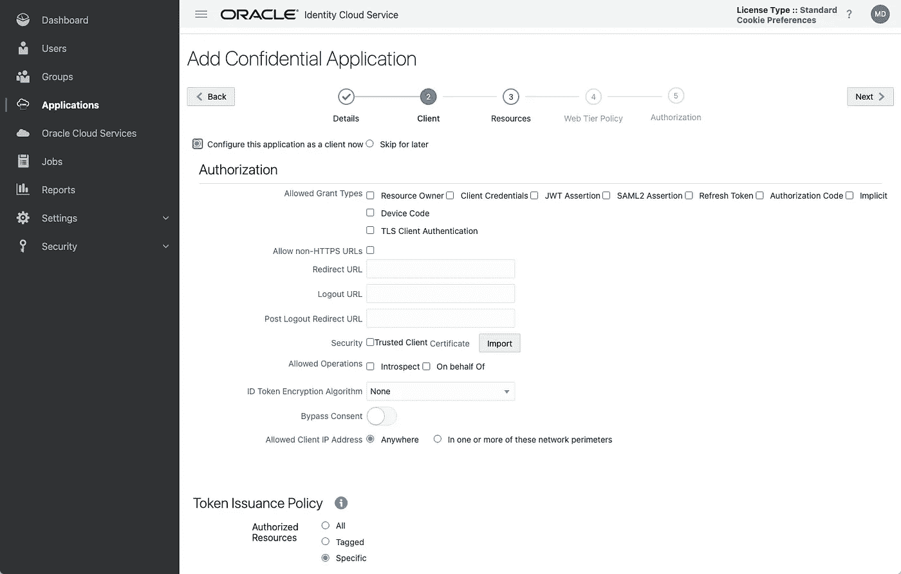
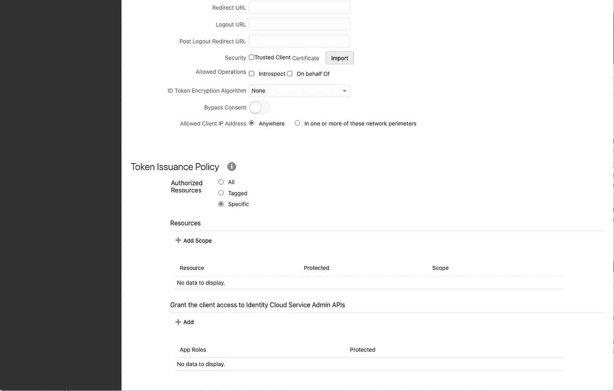
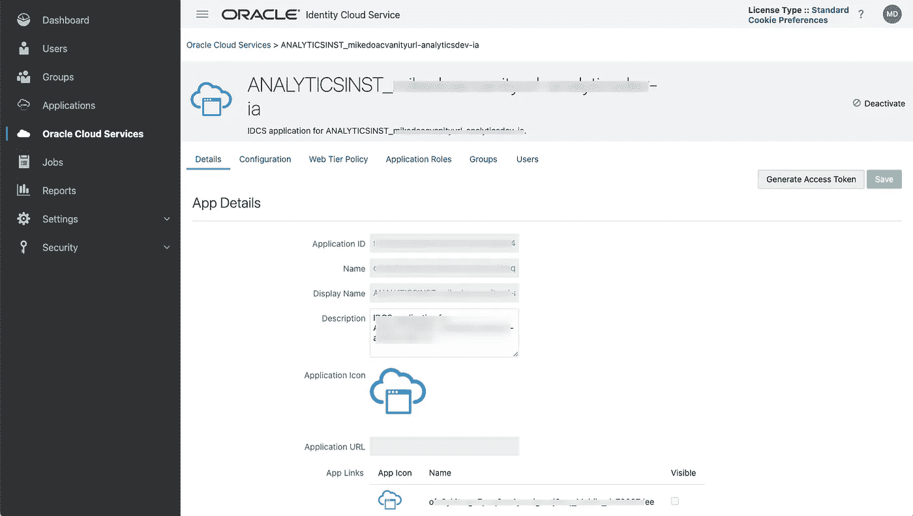

# 利用 OAuth 2.0 开启 Oracle 分析云

> 原文：<https://medium.com/oracledevs/unlocking-oracle-analytics-cloud-with-oauth-2-0-e62218efb277?source=collection_archive---------0----------------------->


在过去几年中，我们看到 Oracle 分析云(OAC)越来越多地使用 [OAuth 2.0](https://oauth.net/2/) 访问令牌。从我自己的经验来看，获得和使用访问令牌需要一个学习过程，我希望这篇博客对开始使用 OAC 这方面的人有用。这并不是 OAuth 2.0 的权威指南，而是 OAC 用户理解和使用访问令牌的一种方式。

网上有很多介绍 OAuth 2.0 的资源。https://oauth.net/2/[的站点](https://oauth.net/2/)是一个很好的起点。您还可以在该网站上找到相关 RFC 参考资料的详细信息。这个 [RFC](https://www.rfc-editor.org/rfc/rfc6749) 很好地介绍了 OAuth 2.0 授权框架以及它所要解决的问题。

# 术语

让我们先来描述一下本博客中使用的一些术语:

**访问令牌** [访问令牌](https://www.oauth.com/oauth2-servers/access-tokens/)用于访问 Oracle 分析云。这可能是一个[嵌入](https://insight2action.medium.com/oracle-analytics-cloud-oac-embedding-public-user-access-part-1-5fb0f513508a)用例，或者使用 OAC [API](https://blogs.oracle.com/analytics/post/announcing-oracle-analytics-cloud-apis) s，或者其他一些原因。OAuth 2.0 RFC 将访问令牌描述为“表示特定范围、生存期和其他访问属性的字符串”访问令牌可以采用各种格式。我喜欢[这种](https://developer.okta.com/blog/2019/06/05/seven-ways-an-oauth-access-token-is-like-a-hotel-key-card)用酒店房间钥匙卡来类比访问令牌的描述。

**承载令牌**
承载令牌是一种接入令牌。Oracle 分析云使用的令牌类型是不记名令牌。它被描述为一个不透明的字符串，对使用它的客户来说没有任何意义。Oracle Analytics 使用的令牌是结构化令牌，采用 JSON Web 令牌或 jwt 的形式。

**JSON Web Token (JWT)** 引用[维基百科](https://en.wikipedia.org/wiki/JSON_Web_Token)，‘一个 JWT(发音为‘jot’)是一个提议的互联网标准，用于创建带有可选签名和/或可选加密的数据，其有效负载包含断言一些声明的 JSON。使用私有秘密或公共/私有密钥对令牌进行签名。当我们在本博客后面讨论 JWT 断言时，这将变得更加相关。我还在下面加入了一些参考资料，它们更详细地介绍了 jwt。如果需要进行故障排除，这个[站点](https://jwt.io/)是“解码”jwt 的有用资源。

**刷新令牌
刷新令牌可用于获得使用不同于用于获得原始访问令牌的 API 有效负载的访问令牌。如上所述，访问令牌具有与其相关联的特定(可配置的)寿命，并且刷新令牌提供了获得新的访问令牌的机制。刷新令牌通常比访问令牌具有更长的寿命。若要获取刷新令牌，请在调用 IDCS/oauth 2/v1/令牌端点时将“offline_access”添加到 scope 参数中。**

**令牌到期** 当您获得一个访问令牌时，它将在一段可配置的时间后到期。对于 Oracle Analytics，默认情况下为 100 秒。这可以通过编辑 OAC 实例的 IDCS 应用程序(不是本博客下一节创建的机密应用程序)来更改。注意，刷新令牌通常具有长得多的到期时间。如果您希望使用 API 更改令牌到期时间，此处的[描述了该过程](https://insight2action.medium.com/oracle-analytics-cloud-embedding-changing-the-idcs-token-timeout-1da9323e1b94)。

**保密应用**
这个[术语](https://www.rfc-editor.org/rfc/rfc6749#section-2.1)指的是一个可以保证诸如“客户机密”等凭证安全的应用。对于 Oracle 分析云，在 Oracle [身份云服务](https://docs.oracle.com/en/cloud/paas/identity-cloud/uaids/add-confidential-application.html)或 Oracle [IAM](https://docs.oracle.com/en-us/iaas/Content/Identity/applications/overview.htm) 中创建机密应用。

**客户端 ID** 这是发给机密应用的标识符。

**客户端秘密** 这是与机密应用程序相关联的相应“秘密”。如果需要，可以更新。

**作用域** 正如我们将在本博客后面看到的，当您调用一个 API 来获取用于 Oracle Analytics Cloud 的访问令牌时，您需要提供一个作用域作为有效负载的一部分。[范围](https://docs.oracle.com/en/cloud/paas/identity-cloud/rest-api/Scopes.html)提供了一种方法来定义访问令牌允许使用的资源。在我们的 OAC 用例中，这通常是 IDCS 机密应用程序中映射的 OAC 实例。

# **创建机密应用程序**

您需要相关的权限才能在 Oracle IDCS / IAM 中创建应用产品。第一步是选择“添加”新的机密应用程序:



提供机密应用程序的名称:



单击“下一步”并选择“立即将此应用程序配置为客户端”:


如果使用 JWT 签名断言，除了上传公钥和定义别名之外，您还可以在这个屏幕上选择授权类型(稍后将详细介绍)。



如果您向下滚动，您将在参考资料部分看到“添加范围”选项。这是您映射要为其生成访问令牌的 Oracle Analytics 云实例的位置。



在剩余屏幕中单击“下一步”,直到您可以单击“完成”。此时，系统会提示您已经添加了应用程序，并提供了该应用程序的客户端 ID 和客户端密码。不要忘记“激活”应用程序。

# 获取 Oracle Analytics 云访问令牌的最简单方法

在 Oracle IDCS 控制台中，如果导航到左侧的“Oracle 云服务”选项，然后选择要获取令牌的 OAC 实例。您会注意到一个“生成访问令牌”按钮，选择该按钮后，您可以选择是否也包括刷新令牌，然后您可以下载访问令牌。



这可能是你所需要的一切！如果您使用以这种方式获得的初始访问令牌“引导”一个进程，然后使用刷新令牌获得后续访问令牌。这是一个使用刷新令牌获取新访问令牌的 curl 命令示例:

```
curl --location --request POST 'https://<IDCS INSTANCE>.identity.oraclecloud.com/oauth2/v1/token' \
--header 'Authorization: Basic <base64 encoded clientID and clientSecret>' \
--header 'Content-Type: application/x-www-form-urlencoded' \
--data-urlencode 'grant_type=refresh_token' \
--data-urlencode 'refresh_token=<REFRESH TOKEN OBTAINED FROM SECOND CURL COMMAND>' \
--data-urlencode 'scope=<SCOPE FROM IDCS CONFIDENTIAL APP>'
```

如果您的用例需要以编程方式获取访问令牌，那么您将需要使用下面描述的方法之一，该方法允许您使用 API 获取访问令牌(以及刷新令牌)。

# 授权类型

在本节中，我将描述授权类型的[示例](https://docs.oracle.com/en/cloud/get-started/subscriptions-cloud/csimg/securing-authorizations-oracle-cloud.html)，这些授权类型可用于获取与 Oracle Analytics Cloud 一起使用的访问令牌。

## 资源所有者密码凭据

这种[授权类型](https://docs.oracle.com/en/cloud/paas/identity-cloud/rest-api/ROPCGT.html)要求在 API 调用的有效负载中包含用户名和密码，因此它可能不适合所有用例。事实上， [OAuth 2.0 最佳实践](https://datatracker.ietf.org/doc/html/draft-ietf-oauth-security-topics#page-9)指南并不推荐使用这种授权类型。

此外， ***如果您将联合用户*** 与 Oracle 分析云实例一起使用，则此授权类型不起作用。只有在 Oracle IDCS 本身定义了您的用户时，它才有效。

这是一个使用这种授权类型获取访问令牌的 curl 命令示例。根据您自己的值需要替换的参数有<parameter>等。请注意，如果将“offline_access”添加到 scope 参数的末尾，则还会返回一个刷新令牌:</parameter>

```
curl --request POST '<IDCS INSTANCE>/oauth2/v1/token' \
--header 'Authorization: Basic <BASE64 ENCODED client ID:Client Secret> ' \
--header 'Content-Type: application/x-www-form-urlencoded' \
--data-urlencode 'grant_type=password' \
--data-urlencode 'username=<USERNAME>' \
--data-urlencode 'password=<PASSWORD>' \
--data-urlencode 'scope=<SCOPE FROM IDCS CONFIDENTIAL APP> offline_access'
```

## 设备码

正如我的[同事](https://blogs.oracle.com/authors/amit-chakraborty)在这篇[博客](https://www.ateam-oracle.com/post/securing-oracle-analytics-cloud-rest-api-with-oci-iam-oauth-20-device-authorization-grant)中所描述的那样，[设备代码](https://docs.oracle.com/en/cloud/paas/identity-cloud/rest-api/DCGT.html)授权是获得用于 Oracle 分析云的访问令牌的一个很好的选择。它与联合用户配合使用，并提供了一种机制，用户通过向 Oracle IDCS 进行身份验证来获取访问令牌，然后在现有令牌到期时使用刷新令牌来获取新的访问令牌。我将使用三个 curl 命令来说明这种授权类型的使用。

在第一个 curl 命令中，我们调用 IDCS API 来获取设备代码和用户代码，相应地替换参数<parameter>:</parameter>

```
curl --location --request POST 'https://<IDCS INSTANCE>.identity.oraclecloud.com/oauth2/v1/device' \
--header 'Content-Type: application/x-www-form-urlencoded; charset=utf-8' \
--data-urlencode 'response_type=device_code' \
--data-urlencode 'scope=<SCOPE FROM IDCS CONFIDENTIAL APP> offline_access' \
--data-urlencode 'client_id=<CLIENT ID FROM IDCS CONFIDENTIAL APP>'
```

这个 curl 命令的响应将与此类似。请注意验证 URI，您必须以您的用户 ID 登录并传递 user_code:

```
{"device_code":"12a42e616264123ccb913a86df39c1397","user_code":"QYWNNPSS","verification_uri":"[https://<IDCS INSTANCE .identity.oraclecloud.com/ui/v1/device](https://idcs-d7b03c1eccf64cd5a0f0ea75f283dfed.identity.oraclecloud.com/ui/v1/device)","expires_in":300}
```

一旦您将 user_code 传递给登录到提供的 IDCS URI 时出现的 UI，您将运行第二个 curl 命令，相应地替换<parameters>:</parameters>

```
curl --location --request POST 'https://<IDCS INSTANCE>.identity.oraclecloud.com/oauth2/v1/token' \
--header 'Content-Type: application/x-www-form-urlencoded' \
--data-urlencode 'grant_type=urn:ietf:params:oauth:grant-type:device_code' \
--data-urlencode 'client_id=<CLIENT ID FROM IDCS CONFIDENTIAL APP>' \
--data-urlencode 'client_secret=<CLIENT SECRET FROM IDCS CONFIDENTIAL APP>' \
--data-urlencode 'device_code=<DEVICE CODE RETURNED FROM FIRST CURL COMMAND>'
```

IDCS 正在等待您执行第二个 curl 命令(注意到期时间)，并将返回一个访问令牌(如果在 scope 参数中使用了“offline_access ”,还可以返回一个刷新令牌)。

如果您希望使用刷新令牌，在访问令牌到期时获取新的访问令牌，您可以使用以下 curl 命令:

```
curl --location --request POST 'https://<IDCS INSTANCE>.identity.oraclecloud.com/oauth2/v1/token' \
--header 'Authorization: Basic <base64 encoded clientID and clientSecret>' \
--header 'Content-Type: application/x-www-form-urlencoded' \
--data-urlencode 'grant_type=refresh_token' \
--data-urlencode 'refresh_token=<REFRESH TOKEN OBTAINED FROM SECOND CURL COMMAND>' \
--data-urlencode 'scope=<SCOPE FROM IDCS CONFIDENTIAL APP>'
```

## JWT 断言

这个[授权类型](https://docs.oracle.com/en/cloud/get-started/subscriptions-cloud/csimg/obtaining-access-token-using-self-signed-user-assertion-and-client-assertion.html)也可以用于联合用户，并且需要一些额外的步骤来为客户端和用户创建签名的 JWT 断言。这个[博客](https://redthunder.blog/2018/10/26/using-public-private-key-authentication-for-oracle-idcs/)提供了整个过程的极好概述，我建议在使用下面的脚本之前先看一下这个博客。

当您创建 IDCS 机密应用程序时，请确保选择“客户证书”和“JWT 声明”授权类型。此外，为“客户端类型”选项选择“可信”。

以下 Python 脚本将为客户端和用户生成签名断言。然后，它将调用 Oracle IDCS API 来获取访问和刷新令牌。Python 脚本依赖于可以使用 pip 安装的 [PyJWT](https://pyjwt.readthedocs.io/en/latest/) 和‘请求’包。

```
from datetime import datetime, timezone
import jwt
import requeststokenIssued = int(datetime.now(tz=timezone.utc).timestamp())
tokenExpiry = tokenIssued + 3600# These are the parameters you need to substitute for the values for 
# your OAC instance and IDCS instance and confidential app
# The scope also includes 'offline_access' in order to also return a # refresh tokenclientId = '<CLIENT ID FROM IDCS CONFIDENTIAL APP>'
certAlias = '<CERTIFICATE ALIAS FROM IDCS CONFIDENTIAL APP>'
userToAssert = '<USER TO ASSERT>'
OACscope = '<OAC SCOPE FROM IDCS CONFIDENTIAL APP> offline_access'
IDCS_url = 'https://<IDCS INSTANCE>.identity.oraclecloud.com/oauth2/v1/token'private_key = open('<path to private RSA key>', 'r').read()# The following details are used to create the JWTheader = {
    "alg": "RS256",
    "typ": "JWT",
    "kid":certAlias
}client_payload = {
    "sub":clientId,
    "iss":clientId,
    "aud": ["[https://identity.oraclecloud.com/](https://identity.oraclecloud.com/)"],
    "iat":tokenIssued,
    "exp":tokenExpiry
}user_payload = {
    "sub":userToAssert,
    "iss":clientId,
    "aud": ["[https://identity.oraclecloud.com/](https://identity.oraclecloud.com/)"],
    "iat":tokenIssued,
    "exp":tokenExpiry
}# Create the signed assertionsencoded_user_assertion = jwt.encode(
    payload = user_payload,
    headers=header,
    key=private_key,
    algorithm="RS256")encoded_client_assertion = jwt.encode(
    payload = client_payload,
    headers=header,
    key=private_key,
    algorithm="RS256")# Create the payload and headers for the call to the IDCS API to 
# obtain the access tokenpayload = {
'grant_type' : 'urn:ietf:params:oauth:grant-type:jwt-bearer',
'scope' : OACscope,
'client_id' : clientId,
'client_assertion_type' : 'urn:ietf:params:oauth:client-assertion-type:jwt-bearer',
'assertion' : encoded_user_assertion,
'client_assertion' : encoded_client_assertion
}headers = {
  'content-type': 'application/x-www-form-urlencoded'
}# Call the IDCS API and output the access tokenresponse = requests.request("POST", IDCS_url, headers=headers, data=payload)print(response.text)
```

# 参考

以下参考资料在本博客的创建过程中非常有用:
[OAuth 2.0](https://oauth.net/2/)
[如何在 Python 中处理 jwt](https://auth0.com/blog/how-to-handle-jwt-in-python/)。
红雷[博客](https://redthunder.blog/2017/06/08/jwts-jwks-kids-x5ts-oh-my/)描述 jwt 及相关物品。
Red Thunder [博客](https://redthunder.blog/2018/10/26/using-public-private-key-authentication-for-oracle-idcs/)关于 Oracle IDCS 使用公钥/私钥认证。
来自 [Auth0 网站](https://auth0.com/docs/get-started/applications/confidential-and-public-applications)的保密和公开申请说明。

# **鸣谢**

[Amit Chakraborty](https://blogs.oracle.com/authors/amit-chakraborty) 对设备代码授予类型的指导。
[Gabrielle Prichard](https://blogs.oracle.com/analytics/authors/gabrielle-prichard) 获得 python 脚本和审阅本博客草稿的指导。

想讨论这个或其他开发者话题吗？[加入我们的公共休闲频道](https://bit.ly/odevrel_slack)！