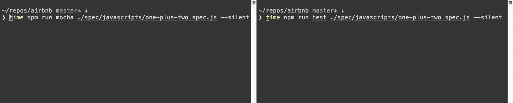

# 从摩卡迁移到 Jest

> 原文：<https://medium.com/airbnb-engineering/unlocking-test-performance-migrating-from-mocha-to-jest-2796c508ec50?source=collection_archive---------0----------------------->

## 用 Mocha 运行我们的测试套件花了 12 多分钟。与我们强大的构建机器相比，我们现在能够在 **4 分 30 秒内运行整个 Jest 套件。**

Come check out our new digs at 999 Brannan, our second office in San Francisco!

自 2013 年 9 月以来，我们一直在 Airbnb 使用[摩卡](https://mochajs.org/)，但由于成长的烦恼越来越多，我们最近从摩卡迁移到了 [Jest](https://facebook.github.io/jest/) 。事实证明，迁移只需要对我们的测试和基础设施进行最小的改动，并且提供了无数的好处。

Comparison of Mocha vs Jest, testing that 1 + 2 === 3

## 对测试的最小改动

我们付出了巨大的努力来确保我们的测试遵循最佳实践和相当严格的编码风格。这有助于我们减少碎片，并支持跨团队协作，因为测试在我们代码的不同部分看起来是一样的。我们的测试文件在迁移之前/之后看起来或多或少是一样的，这对我们来说非常重要。

大多数团队不需要改变他们测试文件的内容。事实上，在 Airbnb，下面的片段足以掩盖我们使用 Mocha 和 Jest 之间的差异。

这是可能的，因为 [Jest API](https://facebook.github.io/jest/docs/api.html) 和 [Mocha API](https://mochajs.org/#hooks) 是相似的，只是函数名略有不同。您需要控制哪些函数(或者在您的测试中进行更改),这在很大程度上取决于您正在使用哪些函数。我们也有一些`test`呼叫，它们可以用`it`1:1 替换，这是我们已经确定的标准。下面是一个简单的例子，展示了我们在移植到 Jest 之前和之后的测试情况。

## 简化的测试架构

我们最初在 2016 年 1 月使用伊斯坦布尔和 Mocha 推出了代码覆盖，但我们发现检测我们的源文件非常昂贵，并且给我们的测试增加了不合理的时间。

为了解决这个问题，我们编写了一些定制的逻辑来将我们的测试分成块，在单独的进程中运行它们，收集每个进程的覆盖率，然后在最后将覆盖率合并到一个报告中。

覆盖率是在与我们的测试套件不同的 CI 作业中收集(和执行)的。测试套件本身后来通过将测试套件的块分派到不同的工作机并在最后聚集结果而被并行化。

Jest 自动处理跨流程的分割测试，收集和聚合覆盖率。这对我们来说是一项重大的额外津贴。通过利用这一事实，我们能够在两个作业中删除我们的自定义逻辑，并完全依靠 Jest 来为我们智能地处理这一点。

## 改进的性能

对于有许多测试文件的项目，Jest 将使您开箱即可获得改进的性能。它能够通过几种机制做到这一点。

1.  并行化。这可能是 Jest 最受关注的地方，而且理由很充分。如果您还没有对 CPU 受限的工作进行并行化，那么这样做有望获得巨大的性能提升。
2.  如上所述，我们已经在 Airbnb 并行化我们的测试，但我们是通过获得所有测试文件的列表并将它们平均分配给我们的工作人员来实现的。这给工作人员留下了获得异常快或异常慢的测试队列的机会，并导致了 CPU 周期的浪费。Jest 采用循环法，首先运行最慢的测试，帮助你最大限度地利用你的处理能力。
3.  它有一个内置的巴别塔变换缓存。对代码应用转换是非常消耗 CPU 资源的。通过利用跨进程共享的缓存，您可以将 CPU 专用于运行代码，并减少大量运行时间。

使用 Mocha，我们的套件在本地运行需要大约 45 分钟，有时由于在单线程中运行整个套件的内存压力，它根本不会完成。当地时间缩短至 14.5 分钟。我们在我们的构建服务器上看到了类似的改进，Mocha 的计时时间为 12 分钟以上(在我们的跨机器并行化工作之后), Jest 在 4.5 分钟内完成。

## 减少片状剥落

当你有一个像我们这样大的测试套件(几千个测试文件)时，在单线程中运行你的测试将不可避免地导致剥落。当我们开始迁移工作时，由于 flake，大约 12%的构建需要重新运行，我们套件中的测试需要首先运行其他测试，否则它们不会通过。

隔离运行意味着测试不可能因为套件中其他测试文件的副作用而失败。这对于在测试完成后发生的`setTimeout`调用中抛出的错误尤其有用。现在，通过检查测试和源文件中的任何异步代码，我们可以更容易地调查不可靠的测试。

在迁移到 Jest 并修复了单独失败的测试后，我们能够将我们的剥落率降低到 1%左右。这为我们的开发人员节省了每个工作日的时间，因为他们不再需要等待构建失败，并重复运行测试套件直到它通过。此外，在罕见的情况下，鳞片确实发生，我们能够更准确地确定它来自哪里。更容易识别，因为文件在它自己的进程中运行，所以可以保证片状剥落来自该文件。对于 Mocha，文件 x 中的错误计时器可能会导致文件 y 中的测试失败。

如果你致力于减少片状剥落，你可以更进一步，通过终止测试中设置的计时器来减少测试中的片状剥落。

## 让性能更上一层楼

Jest 对我们来说开箱即用要快得多，但最初我们并没有看到我们预期的那种改进。在分析了几次运行之后，我们发现我们的全局`spec_helper.js`文件是罪魁祸首。这是我们用 Mocha 设置的一个文件，用来配置一些全局助手，使我们的测试编写起来更加方便。例如，我们使用[酶](https://github.com/airbnb/enzyme)来测试我们的 React 代码，为了使编写测试更容易，我们加入了 [chai-enzyme](https://github.com/producthunt/chai-enzyme) 。我们没有让所有开发人员在每个测试文件中手动连接这个库，而是在所有测试之前运行的`spec_helper.js`中连接它。

这被证明是一个非常有问题的笑话。因为每个测试文件都在一个干净的虚拟机中运行，Jest 为每个测试文件重新运行一次`spec_helper.js`文件。在上面的例子中，导入 chai-enzyme 启动了一个链，它导入所有的酶，然后导入所有的 React 和 ReactDOM。即使不包括 React 的测试也需要 480 毫秒。在我们的例子中，480 毫秒*几千个文件意味着我们花了一分多钟来设置这个库。使用 Mocha，我们不会感到这种痛苦，因为它不是并行的，并且只运行一次`spec_helper.js`文件。

为了解决这个问题，我们对 Jest 的嘲讽功能进行了一点创新。通过利用`jest.mock()`上的回调，我们能够拦截酶的输入，并且只为需要它的测试加载 chai-enzyme。

## 开发者情绪

我们这次迁移的最终目标是改善开发人员的体验，无论是在编写测试还是运行测试时。我们只是在 Jest 上呆了几个星期，但到目前为止我们只看到了积极的反馈:

> 只是想在这里给任何从事 Jest 实现的人一个大大的++奖励。它节省的开发时间是不可思议的。比如，以前需要 3 个小时才能写完的东西现在只需要 30 分钟。不开玩笑。

*我们一直在寻找有才华、有好奇心的人来* [*加入团队*](https://www.airbnb.com/careers/departments/engineering) *。或者，如果你只是想谈谈工作，可以随时在 twitter 上联系我*[*@ Gary borton*](https://twitter.com/garyborton)*。*