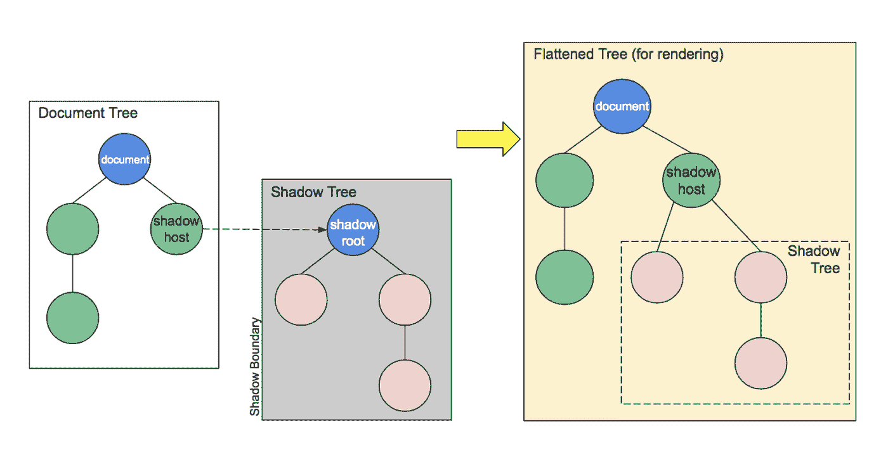
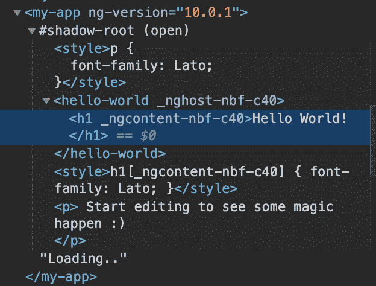
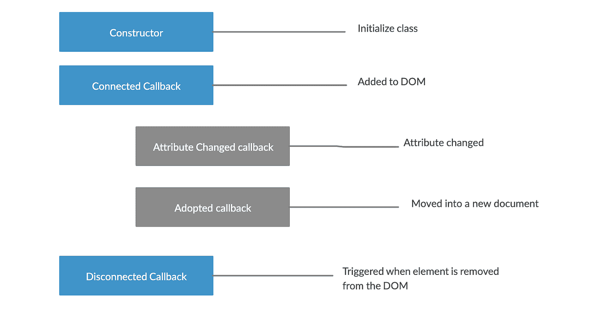

# 解开 Web 组件！

> 原文：<https://medium.com/globant/unraveling-the-web-components-5df1df4ec605?source=collection_archive---------2----------------------->


Photo by [Filiberto Santillán](https://unsplash.com/@filisantillan?utm_source=medium&utm_medium=referral) on [Unsplash](https://unsplash.com?utm_source=medium&utm_medium=referral)

***【代码重用】*** ，当你开始你的项目时，你决定坚持这个术语。后来，当你意识到我们正在为 Angular 重写组件，我们是从 Rails 移植过来的，并且可能会过渡到 React 时，它开始慢慢消失。今天，我们多次为每个平台重新构建相同的 UI。这当然会导致更多的技术和设计债务。还有，这是对我们时间的巨大浪费。

那么，Web 组件来拯救我们了！他们将你与技术革新隔离开来。它们帮助我们构建一个设计系统，以便在不同的项目/应用中重用实现，而不管它们是在什么框架中编写的。

听起来很棒，不是吗？让我们再深入一点。

# **什么是 web 组件？**

> Web 组件是可重用的 UI 构建块，封装了所有的 HTML、CSS 和 Javascript。它们可以跨现代浏览器工作，可以与任何支持 HTML 的 JavaScript 库或框架一起使用。

Web 组件与我们想要构建可重用的定制元素的用例相关。

设计系统可以包括 UI 组件、它们的文档和代码片段，以方便开发人员在项目中使用它们。

## 越来越有趣了！让我们检查一下 Web 组件的规范

Web 组件基于 4 种规范

*   自定义元素
*   阴影 DOM
*   ES 模块
*   HTML 模板

让我们深入探讨这些问题:

**自定义元素**

[自定义元素规范](https://w3c.github.io/webcomponents/spec/custom/)为设计和使用新型 DOM 元素奠定了基础。这些是一组 JavaScript APIs，帮助我们创建自己的 HTML 元素，并控制 DOM 及其行为。

**阴影 DOM**

该规范的目的是为组件创建一个私有范围。影子 DOM 的工作方式有点像 iframe，内容从文档的其余部分中分离出来；然而，当我们创建一个影子根时，我们仍然对页面的这一部分有完全的控制权，但是范围是在一个上下文中。这就是我们所说的**封装**。



Source: [MDN — Shadow DOM](https://developer.mozilla.org/en-US/docs/Web/Web_Components/Using_shadow_DOM)



**ES 模块**

ES 模块规范以基于标准、模块化、高性能的方式定义了 JS 文档的包含和重用。

**模板**

这个规范的目的是创建一个轻量级的 DOM 树。模板中定义的 HTML 标记本质上是惰性的。简而言之，模板内容在被激活之前不是 DOM 的一部分。定义模板的语法如下:

```
<template>
   <!-- HTML Markup goes here -->
</template>
```

# 自定义元素的生命周期挂钩

从一个自定义元素被创建到被销毁，中间会发生很多 ***【事情】*** :

*   元素被插入到 DOM 中
*   当一个 UI 事件被触发时，它被更新
*   可以从 DOM 中删除一个元素

以上所有的都被称为元素的生命周期，我们可以用一些回调函数来挂钩它生命周期中的关键事件。这些回调函数可以用来操作我们自己的定制元素的行为。



web 组件中有以下生命周期挂钩:

**connectedCallback**

当我们的自定义元素被添加到 DOM 时，这个函数将被调用。我们可以确定当这个方法被调用时，这个元素对 DOM 是可用的。

这意味着我们可以安全地设置属性、获取资源、运行设置代码或呈现模板。

**采用了回调**

当我们的自定义元素被移动到一个新文档中时，这个函数将被调用。它只发生在我们处理 iframes 的时候。

**属性改变回调**

如果我们的自定义元素的属性发生了变化，比如属性被更改、添加或删除，那么这个特定的函数将被调用。

**断开的回调**

当我们的定制元素从 DOM 断开连接时，将调用这个函数，它是添加清理逻辑(在元素被销毁之前需要执行的代码)和释放资源的理想位置

现在，让我们看看如何创建 web 组件。

# 是时候动手做一些代码了！

我们将构建一个简单的自定义组件**<hello-word></hello-world>**

目前，浏览器不理解 hello-world 标签。当浏览器发现像 hello-world 这样的未知 HTML 标记时，它会将其呈现为一个内联元素，并继续呈现下一个元素。使用自定义元素 API，我们可以告诉浏览器如何处理新的 HTML 标签。

自定义元素的功能是使用扩展 HTMLElement 的 ES2015 类定义的。扩展 HTMLElement 确保自定义元素继承整个 DOM API，并意味着您添加到该类的任何属性/方法都成为元素的 DOM 接口的一部分。本质上，使用类为您的标记创建一个公共 JavaScript API。

在这个例子中，我们正在创建一个 hello world 组件，它将添加

```
<div>Hello World</div>
```

我们添加了<hello-world>标签的内容。</hello-world>

Web 组件的基础是定制元素。 **customElements** API 为我们提供了一个定义自定义 HTML 标签的路径，这些标签可以在任何包含定义类的文档中使用。

本质上，自定义元素由两部分组成:一个标记名和一个扩展内置 HTMLElement 类的类。我们的自定义元素的最基本版本如下所示:

```
customElements.define('hello-world', HelloWorld)
```

现在，我们的定制元素(<hello-world>)被定义，浏览器被指示呈现包含在调用定制元素的 HTML 模板中的内容。</hello-world>

# **关闭思想！**

人生苦短，不能重写组件！

Web 组件看起来很容易理解和实现，但却非常强大。一定要试一试。我相信你会日复一日地使用它们。

你可以在这里找到我的另一篇用 Angular [编写 web 组件的文章](/globant/bringing-web-components-into-play-with-ng-d9b1042af267)。