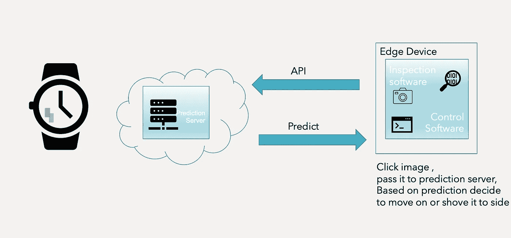
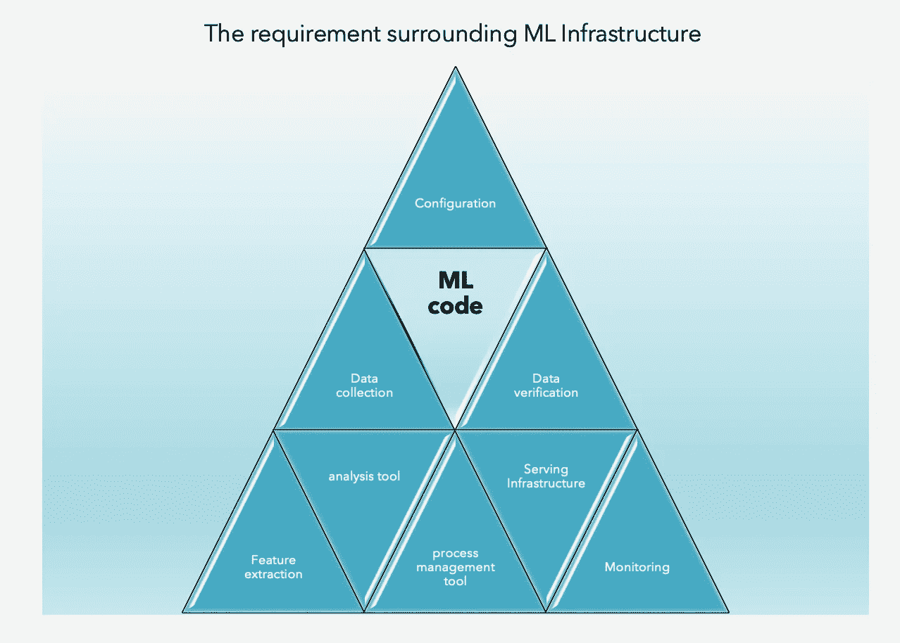
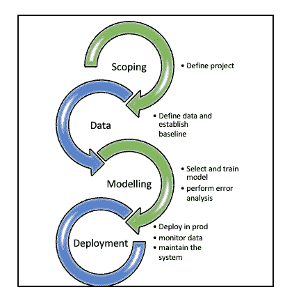
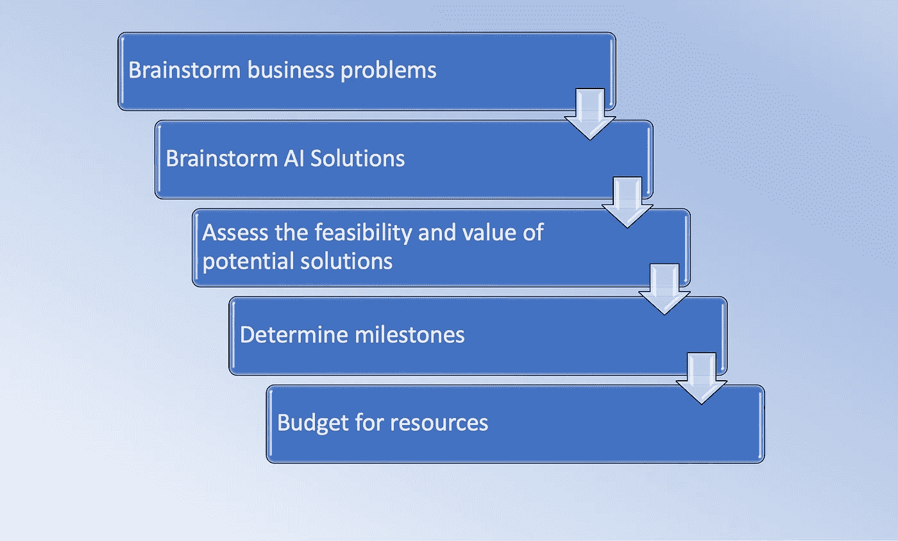
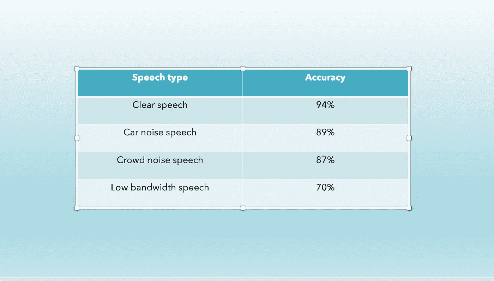
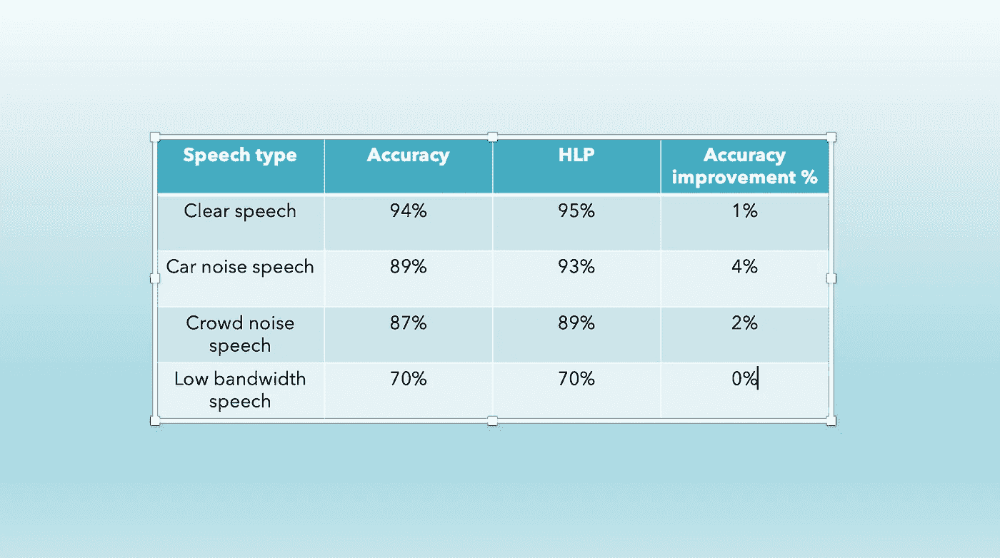
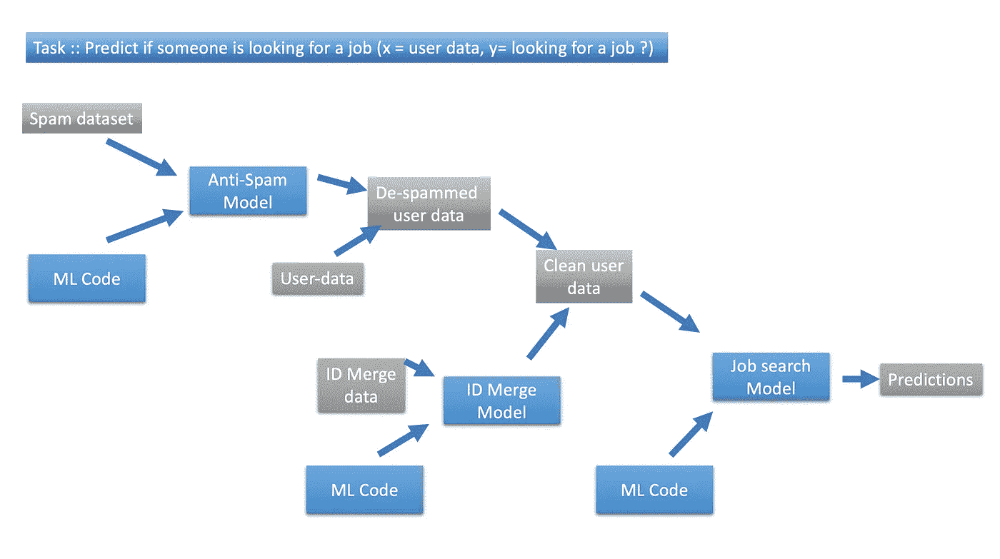
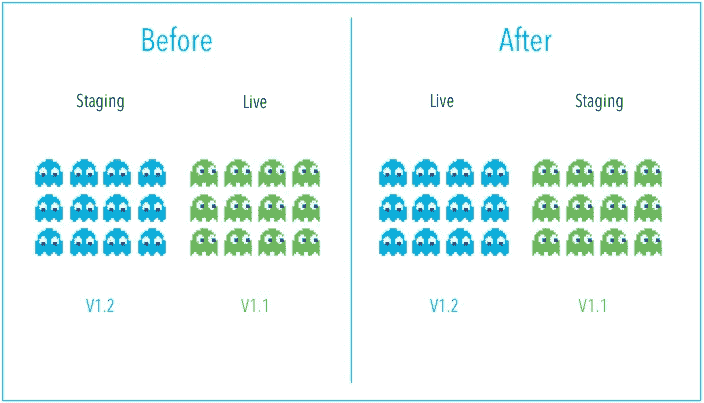

# 无名英雄传奇

> 原文：<https://medium.com/walmartglobaltech/unsung-saga-of-mlops-1b494f587638?source=collection_archive---------5----------------------->

面向生产的机器学习工程—第 1 章

***“我们来这里是为了在宇宙中留下一个凹痕，否则，我们为什么会在这里？”*** ~ *乔布斯*

作为人类，我们倾向于实现看似不可能的事情，在可怕的环境中取得胜利，瞄准太阳，定居火星。我们不断战斗，利用我们的知识和信念去改变，创造更美好的明天，从而不断让世界变得更美好。

世界每天都在发展，它的工作方式也是如此。我们每天产生的数据量是巨大的。今天，数据科学不是一个单一的实体，它在各个其他领域都有应用。随着世界的发展，数据科学家需要为庞大的人群构建解决方案，这对于使他们的解决方案具有可扩展性至关重要。

科学家和工程师受到启发，通过减少手动接触点和促进进化来创建智能设备的智能生态系统。自动驾驶汽车、制造机器人、智能助手、疾病测绘、自动化金融投资、无人驾驶飞行器(无人机)和其他类似的努力就是几个例子。

([Source](https://www.businessprocessincubator.com/wp-content/uploads/2020/02/miro.medium.com1YmwHmyvDdwKP0IwlT_2WFQ-cd31e30dc3cdd73dc20517564da5309dad19e57a.png))

我们是如何打开通往这个仙境的通道的？— **数据是关键**

当数据被分析时，它就转化为知识。学习到的知识导致预测，使机器能够识别模式并智能地运行。这被称为机器学习——换句话说，我们可以说 ML 允许用户向计算机算法输入大量数据，并让计算机仅根据输入数据进行分析并做出数据驱动的建议和决策。如果识别出任何修正，该算法可以结合该信息来改进其未来的决策。[1]

为了接触用户并实现其目标，管理信息必须与其他流程相联系(图二)。这个迭代过程包括范围界定、数据收集、建模、部署和监控。嵌入在这个迭代过程中的 ML 被称为**机器学习操作(MLOps)。** MLOps 是构建智能系统的整个过程，该系统可以在很少或没有人工干预的情况下执行任务。

> 通俗地说，MLOps 已经完全熟了，而 ML 只做了一半。

让我们来看一个机器学习算法部署的例子——用例是在生产中识别有划痕的手表，然后将其推广到客户端(图一)。

Figure I. Deployment Example

一个检测软件负责拍摄手表并将其传输到预测服务器，这意味着一个学习算法来检测手表是否有划痕。预测服务器基于该评估来确定是继续还是搁置观察。

## 主要挑战

在围绕核心 ML 模型设计外围点之后，可能会出现什么问题呢？

**数据漂移/概念漂移:**模型试图预测的目标变量的统计属性会随着时间以无法预见的方式发生变化。这引起了问题，因为预测变得不太准确久而久之[2]。例如，生产部署照片会显示较暗的图像，因为自收集训练集以来，工厂的照明条件已经发生了变化。

**概念验证到生产差距:**当 ML 项目在走向实际部署的过程中遇到重大瓶颈和挑战时[3]。除了最初的 ML 模型代码之外，我们还需要编写必要的辅助代码来准备模型生产。(图二)

Figure II: the requirement surrounding ML Infrastructure

# 机器学习系统——旅程

构建一个 ML 系统是一项全面而复杂的服务，但是如果遵循下面的流程，这个过程可以被简化(图三)

Figure III. ML Project lifecycle

1.  **范围界定阶段-** 确定要开展的工作
2.  **数据阶段-** 定义数据并创建基线
3.  **建模阶段-** 根据提供的数据选择并训练模型，然后分析误差。
4.  **部署阶段-** 在生产中部署，监控传入的数据，并维护系统(重复错误分析过程，重新训练模型，并使用新的预计值更新数据集)。

# 范围界定阶段

您到底希望您的 ML 系统实现什么？是回归问题还是分类问题？您的特征是什么，目标是什么？因此，在这个阶段，你定义你的目标和愿望。

为了实现上述目标，作为范围界定阶段的一部分，我们将执行以下步骤。

Figure IV. Steps in Scoping Phase

在现代 ML 生命周期和项目开发中，伦理考虑占据了关键位置。重要的是要问这样的问题

*   这个项目是否创造了净积极的社会价值？
*   这个项目是否相当公平，没有偏见？
*   是否公开表达和辩论了任何伦理问题？

# 数据阶段

## 定义数据并建立基线

基线建立——帮助确定工作的优先级。假设对于语音识别系统，测量的准确度类似于—

Figure V. Accuracy of speech recognition system

虽然低带宽语音的准确度最低，人们可能会急于下结论来改善这一点，但是，与基线进行比较将有助于识别实际的聚焦区域，因为在上述情况下，低带宽语音的 HLP(人水平性能)与所考虑的系统几乎相似。

Figure VI speech recognition system

如图六所示，低带宽语音改善了 0%，人类无法识别语音，因此我们可以跳过对它的研究，专注于改善汽车噪声语音，这将使模型的总精度提高 4%。因此，HLP 协助确定了工作重点的基线。

**建立基线的常用技术:**

1.  人类水平的性能(HLP)-主要针对非结构化数据
2.  调查可能性的文献搜索(课程、博客、开源项目、以前的研究)
3.  探索现有的或半生不熟的实现，以获得一个大概的概念
4.  如果存在早期的系统，请评估其性能。

## 标记和组织数据

由于 ML 生命周期是一个迭代过程，我们定期收集数据以改进模型。如果在提供更多数据后模型性能有显著差异，我们可以选择丢弃数据。因此，我们将知道所获得的数据集是否有效。

**标记数据时需要记住的点:**

1.  我们可以用三种方式标记数据——内部、外包、众包
2.  指定最大似然法来标记数据是昂贵的
3.  标签可以通过例如语音识别(任何流利的说话者)、医疗诊断/工厂检查(主题专家)、推荐系统(大多数难以标记)来识别
4.  数据一次增长不应超过 10 倍

## 数据管道

数据管道是一组工具和过程，用于自动化源系统和目标存储库之间的数据移动和转换。不仅需要维护核心数据，还需要维护完成数据故事的其他相关属性。维护这些属性在错误分析、发现意外影响和跟踪数据来源中起着至关重要的作用。

Figure VII. show Data pipeline example

**数据来源和谱系** —通过拥有大量文档或使用复杂的工具复制数据管道的其余部分，而不会带来太多不必要的复杂性，从而跟踪数据来源和谱系

**元数据** —及时存储元数据有助于产生关键的洞察力，就像在正确的时间对代码进行注释，这样如果出现问题，你需要重新查看代码文档，以了解代码到底做了什么。

从 POC 过渡到生产中的解决方案是关键的一步。在进行 POC 时，主要重点是获得可行的原型，因此数据预处理可以是手动的，但在生产阶段，该过程需要自动化，并需要使用 TensorFlow、Apache bean、Airflow 等工具。确保数据管道是可复制的。

# 建模阶段

模型开发是一个迭代过程(图四)。模型开发是机器学习模型生命周期的核心。这个阶段的核心角色是数据科学家和 ML 工程师。

该过程从选择基线架构开始。这应该是一个相对简单的模型，预计将有最少的努力坚实的结果。稍后可以将该模型与稍后训练的更复杂的模型进行比较。在培训步骤中，数据科学家将试验不同的架构以及特征工程和特征选择。这些模型然后在*训练集*上被训练，希望它们将学习期望的任务并推广到新的例子。最后，开发的模型库需要根据目标模型度量进行评估。

Figure IV. Show Modelling an iterative process

# **部署和监控阶段**

最初的部署刚刚完成一半，第二部分的工作只在第一次部署之后才开始。有多种部署模式:

> 影子模式部署—不考虑 ML 选择。

在阴影模式部署中，ML 算法并行地遮蔽人，并且在该阶段不考虑 ML 选择；目标是收集关于学习算法如何执行以及它如何与人类判断进行比较的数据。例如，识别手机上的划痕以前是由人类完成的，现在是由嵌入了学习算法的自动化机器完成的。

Canary Deployment([Source](https://harness.io/blog/continuous-verification/blue-green-canary-deployment-strategies/))

> 金丝雀部署——当 ML 算法已经学习到足够的知识并准备做出真正的决策时。

在 Canary 部署中，我们首先将 ML 系统部署到很小一部分流量(比如说 5%)，系统受到监控，流量逐渐增加。

Blue Green Deployment([Source](https://harness.io/blog/continuous-verification/blue-green-canary-deployment-strategies/))

> 蓝绿色部署—一种通过运行两个相同的生产环境(蓝色和绿色)来减少停机时间和风险的技术。

有一个在新旧算法或预测服务器实现之间切换的选项。例如，更新手机软件(新/绿色版本),如果新的更新不令人满意，则将其恢复为出厂设置(旧/蓝色版本)。

部署完成后，必须对系统进行监控，以防任何潜在的故障或意外。监控的行业标准指标是—

1.  软件指标—内存、计算、延迟、吞吐量、服务器负载
2.  输入指标—平均输入/输出长度。、平均 i/p 容量、缺失值的数量等。
3.  输出指标——例如，智能系统返回空值、错误值的频率，或者需要重做的次数，用户放弃智能系统的次数等。

# 摘要

# 推荐人和证明人:

 [## 什么是机器学习- ML -为什么它很重要？| NetApp

### 作为人工智能(AI)的一个子集，机器学习(ML)是计算科学的一个领域，专注于…

www.netapp.com](https://www.netapp.com/artificial-intelligence/what-is-machine-learning/)  [## 概念漂移-维基百科

### 在预测分析和机器学习中，概念漂移意味着目标的统计属性…

en.wikipedia.org](https://en.wikipedia.org/wiki/Concept_drift)  [## 弥合人工智能的概念验证与生产差距——来自吴恩达的见解

### 关于在现实世界中部署机器学习项目的挑战和解决方案的三个关键要点

towardsdatascience.com](https://towardsdatascience.com/bridging-ais-proof-of-concept-to-production-gap-insights-from-andrew-ng-f2ac119ee737)  [## 机器学习生命周期:前 3 个组件-深度检查

### 机器学习领域涉及许多不同的学科，从商业角色，到数据科学家和…

deepchecks.com](https://deepchecks.com/understanding-the-machine-learning-life-cycle/)