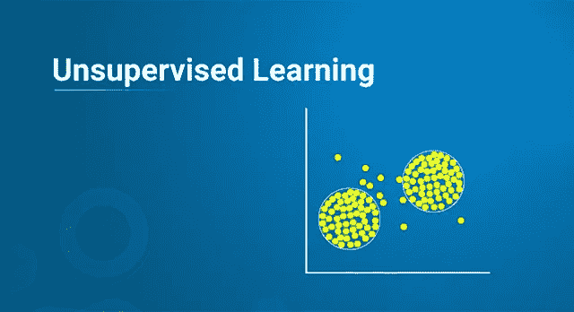
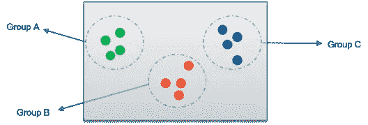
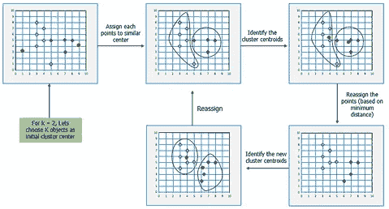
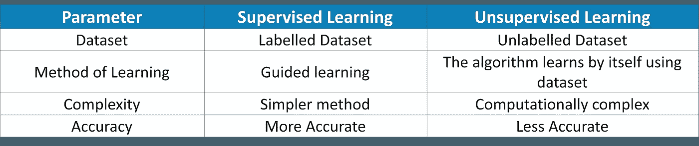

# 什么是无监督学习，它是如何工作的？

> 原文：<https://medium.com/edureka/unsupervised-learning-40a82b0bac64?source=collection_archive---------0----------------------->

Unsupervised Learning — Edureka

就在几十年前，教你的计算机并期望它给出聪明的答案似乎是我们所有人的梦想。但是现在，随着**机器学习**的兴起，一切都变了。我甚至可以说，机器已经变得比我们更聪明了。在本文中，我们将讨论以下主题:

*   机器学习概述
*   什么是无监督学习？
*   为什么重要？
*   无监督学习的类型
*   无监督学习的应用
*   监督学习与非监督学习
*   无监督学习的缺点

因此，深入研究一下，了解关于无监督机器学习的一切。我们开始吧！

# 机器学习概述

机器学习，用最简单的术语来说，就是**教你的机器一些东西**。你*收集并清理数据*、*创建算法*、*从数据中教授* [*算法*](https://www.edureka.co/blog/machine-learning-algorithms/) *基本模式*然后*期待算法给你一个有用的答案*。如果算法不辜负你的期望，你就成功教会了你的算法。如果没有，就废弃一切，从头开始。这就是这里的工作方式。如果你正在寻找一个正式的定义，机器学习是创建模型的过程，它可以执行某项任务，而不需要人类**显式编程**它做某事。

有 3 种基于算法创建方式的机器学习。它们是:

*   **监督学习—** 你监督学习过程，这意味着你在这里收集的数据被标记，因此你知道什么输入需要映射到什么输出。如果你的算法在给你答案时出错，这有助于你纠正它。
*   **无监督学习** —这里收集的数据没有标签，你不能确定输出。因此，您对算法进行建模，使其能够理解数据中的模式，并输出所需的答案。当算法学习时，你不干涉。
*   **强化学习** —这种学习没有数据，也不教算法什么。你给算法建模，让它与环境互动，如果算法做得好，你奖励它，否则惩罚它。随着不断的互动和学习，对于分配给它的问题，它会从不好变得最好。

现在我们知道了什么是机器学习和不同类型的机器学习，让我们深入讨论这里的实际主题，并回答什么是无监督学习？无监督学习用在哪里？无监督学习算法等等。

# 什么是无监督学习？

如前所述，无监督学习可以被认为是**自我学习**，其中算法可以在没有任何标签的数据集中找到以前的**未知模式**。它有助于建模概率密度函数，发现数据中的异常，等等。举个简单的例子，想象一个学生有课本和所有需要学习的材料，但是没有老师指导。最终，学生将不得不自学才能通过考试。这种自我学习是我们对机器的无监督学习。

让我给你一个现实生活中的例子，无监督学习可能被用来学习一些东西。

# **无监督学习的例子**

假设你一生中从未看过板球比赛，你被你的朋友邀请去他们家看印度和澳大利亚的比赛。你不知道板球是什么，但只是为了你的朋友，你说好，和他们一起去。比赛开始了，你只是坐在那里，一片空白。您的朋友正在享受 Virat Kohli 的游戏方式，并希望加入其中。这是你开始了解这个游戏的时候。你分析屏幕并得出一些结论，你可以用这些结论来更好地理解游戏。

*   有两个队穿着蓝色和黄色的球衣。因为 Virat Kohli 属于印度，你在屏幕上看到印度的得分，你得出结论印度有蓝色球衣，这使得澳大利亚有黄色球衣。
*   球场上有不同类型的球员。2 属于印度的人手中拿着球棒，表示他们正在击球。有人跑上去投球，使他成为投球手。大约有 9 名球员在球场周围试图阻止球到达球场的边界。有人在三柱门后和 2 名裁判员管理比赛。
*   如果球击中了三柱门，或者球被外野手接住，击球手出局，必须走回来。
*   Virat Kohli 的球衣背面有 18 号和他的名字，如果这个球员得了 4 分或 6 分，你需要欢呼。

你一个接一个地观察，现在知道当三柱门倒下时，什么时候该欢呼，什么时候该嘘。从一无所知到知道板球的基本知识，你现在可以和你的朋友一起享受比赛了。

这里发生了什么？你有学习板球基础知识所需的所有材料。电视，你的朋友何时为谁加油。这让你在没有任何人指导你的情况下自己学习板球。这是无监督学习遵循的原则。因此，理解了什么是无监督学习之后，让我们转而理解是什么让它在机器学习领域如此重要。

# 为什么重要？

那么无监督学习帮助我们获得了什么呢？让我告诉你关于它的一切。

*   无监督学习算法在未标记的数据集上工作，并发现我们以前不知道的模式。
*   如果我们需要对元素进行分类或找到它们之间的关联，获得的这些模式是很有帮助的。
*   他们还可以帮助我们发现数据中的异常和缺陷。

最后，也是最重要的，我们收集的数据通常是未标记的，这使得我们在使用这些算法时更容易工作。

现在我们知道了重要性，让我们继续前进，理解不同类型的无监督学习。

# 无监督学习的类型

无监督学习主要分为两种类型:

*   **聚类**
*   **协会**

聚类是一种无监督学习，在这种学习中，您可以在正在处理的数据中找到模式。可能是形状、大小、颜色等等。可用于对数据项分组或创建聚类。下面讨论了一些流行的聚类算法:

*   **层次聚类** —该算法基于数据集中不同数据点之间的相似性来构建聚类。它检查数据点的各种特征，并寻找它们之间的相似性。如果发现数据点相似，则将它们分组在一起。这一直持续到数据集被分组，这为这些聚类中的每一个创建了一个层次结构。
*   **K-Means 聚类** —这种算法一步一步地工作，其主要目标是实现具有标签来识别它们的聚类。该算法通过计算聚类的质心并确保该质心和新数据点之间的距离尽可能小，来创建尽可能同质的不同数据点的聚类。数据点和质心之间的最小距离决定了它属于哪个聚类，同时确保这些聚类不会相互交错。质心就像星团的心脏。这最终为我们提供了可以根据需要进行标记的集群。

*   **K-NN 聚类—** 这可能是最简单的机器学习算法，因为该算法并不真正学习，而是根据它存储的数据集对新数据点进行分类。这种算法也被称为懒惰学习器，因为它只在给定算法一个新的数据点时才学习。它适用于较小的数据集，因为大型数据集需要时间来学习。

关联是一种无监督的学习，在这种学习中，你可以找到一个数据项与另一个数据项之间的依赖关系，并对它们进行映射，从而帮助你更好地获利。下面讨论关联规则挖掘中的一些流行算法:

*   **Apriori 算法—**Apriori 算法是一种基于广度优先搜索的算法，用于计算项目之间的支持度。这种支持基本上映射了一个数据项与另一个数据项的依赖关系，这可以帮助我们理解什么数据项影响另一个数据项发生某些事情的可能性。例如，面包影响购买者购买牛奶和鸡蛋。因此，地图有助于增加商店的利润。这种映射可以使用这种算法来学习，这种算法产生关于其输出的规则。
*   **FP-Growth 算法—** 频率模式(FP)算法找到重复出现的模式的计数，将其添加到一个表格中，然后找到最可能的项目，并将其设置为树的根。然后将其他数据项添加到树中，并计算支持度。如果该特定分支未能满足支持度的阈值，则将其修剪掉。一旦所有的迭代都完成了，将创建一个带有该项目的根的树，然后使用它来制定关联规则。该算法比 Apriori 算法更快，因为支持度是随着迭代次数的增加而计算和检查的，而不是创建规则并从数据集中检查支持度。

既然你对这两种无监督学习有了清楚的了解，现在让我们了解一下无监督学习的一些应用。

# 无监督学习的应用

无监督学习以多种方式提供帮助，可用于解决各种现实世界的问题。

*   它们有助于我们理解可用于根据各种特征对数据点进行聚类的模式。
*   理解数据集中我们最初无法检测到的各种缺陷。
*   它们有助于根据彼此的依赖关系来映射各种项目。
*   通过移除机器学习并不真正需要的特征来清理数据集。

这最终导致对我们有用的应用。下面讨论了使用无监督学习算法的某些例子:

*   AirBnB —这是一个很棒的应用程序，可以帮助主人住宿和体验，将世界各地的人联系在一起。该应用程序使用无监督学习，用户查询他或她的需求，Airbnb 学习这些模式，并推荐属于同一组或群的住宿和体验。
*   **亚马逊** —亚马逊也使用无监督学习来学习顾客的购买，并一起推荐最常购买的产品，这是关联规则挖掘的一个例子。
*   **信用卡欺诈检测** —无监督学习算法学习用户的各种模式以及他们对信用卡的使用。如果卡被用在与行为不符的地方，就会发出警报，可能被标记为欺诈，并会打电话给你，以确认是否是你在使用该卡。

这些是无监督学习算法大放异彩并展示其勇气的一些应用。既然我们已经完成了非监督学习的应用，让我们继续讨论监督学习和非监督学习的区别。

# 监督学习与非监督学习

# 无监督学习的缺点

即使无监督学习在许多众所周知的应用中使用，并且工作出色，它仍然有许多缺点。

*   由于数据集是未标记的，因此无法获得数据排序的方式或方法。
*   它们可能不太准确，因为输入数据是未知的，也没有被让机器做输入数据的人标记。
*   由算法获得的信息可能不总是对应于我们需要的输出类。
*   用户必须理解并用相应的标签映射所获得的输出。

这些基本上是你在使用无监督学习算法时可能面临的主要缺点。现在，让我们继续，总结你在文章中学到的一切。

我们概述了什么是机器学习及其各种类型。然后我们深入了解了无监督学习是什么，为什么它如此重要。后来，我们经历了各种类型的无监督学习，即聚类和关联挖掘。之后，我们讨论了各种算法、无监督学习的应用、监督学习和无监督学习之间的差异以及使用无监督学习算法时可能面临的不利因素。

这就把我们带到了文章的结尾。我希望它已经帮助你以一种清晰而精确的方式理解了什么是无监督学习。下次再见，学习愉快！

如果你想查看更多关于 Python、DevOps、Ethical Hacking 等市场最热门技术的文章，你可以参考 Edureka 的官方网站。

请留意本系列中的其他文章，它们将解释数据科学的各个方面。

> *1。* [*数据科学教程*](/edureka/data-science-tutorial-484da1ff952b)
> 
> *2。* [*数据科学的数学与统计*](/edureka/math-and-statistics-for-data-science-1152e30cee73)
> 
> *3。*[*R 中的线性回归*](/edureka/linear-regression-in-r-da3e42f16dd3)
> 
> *4。* [*机器学习算法*](/edureka/machine-learning-algorithms-29eea8b69a54)
> 
> *5。*[*R 中的逻辑回归*](/edureka/logistic-regression-in-r-2d08ac51cd4f)
> 
> *6。* [*分类算法*](/edureka/classification-algorithms-ba27044f28f1)
> 
> *7。* [*随机森林中的 R*](/edureka/random-forest-classifier-92123fd2b5f9)
> 
> *8。* [*决策树中的 R*](/edureka/a-complete-guide-on-decision-tree-algorithm-3245e269ece)
> 
> *9。* [*机器学习入门*](/edureka/introduction-to-machine-learning-97973c43e776)
> 
> *10。* [*朴素贝叶斯在 R*](/edureka/naive-bayes-in-r-37ca73f3e85c)
> 
> *11。* [*统计与概率*](/edureka/statistics-and-probability-cf736d703703)
> 
> *12。* [*如何创建一个完美的决策树？*](/edureka/decision-trees-b00348e0ac89)
> 
> *13。* [*关于数据科学家角色的 10 大误区*](/edureka/data-scientists-myths-14acade1f6f7)
> 
> *14。* [*顶级数据科学项目*](/edureka/data-science-projects-b32f1328eed8)
> 
> *15。* [*数据分析师 vs 数据工程师 vs 数据科学家*](/edureka/data-analyst-vs-data-engineer-vs-data-scientist-27aacdcaffa5)
> 
> 16。 [*人工智能类型*](/edureka/types-of-artificial-intelligence-4c40a35f784)
> 
> 17。 [*R vs Python*](/edureka/r-vs-python-48eb86b7b40f)
> 
> 18。 [*人工智能 vs 机器学习 vs 深度学习*](/edureka/ai-vs-machine-learning-vs-deep-learning-1725e8b30b2e)
> 
> *19。* [*机器学习项目*](/edureka/machine-learning-projects-cb0130d0606f)
> 
> 20。 [*数据分析师面试问答*](/edureka/data-analyst-interview-questions-867756f37e3d)
> 
> *21。* [*面向非程序员的数据科学和机器学习工具*](/edureka/data-science-and-machine-learning-for-non-programmers-c9366f4ac3fb)
> 
> *二十二。* [*十大机器学习框架*](/edureka/top-10-machine-learning-frameworks-72459e902ebb)
> 
> *23。* [*用于机器学习的统计*](/edureka/statistics-for-machine-learning-c8bc158bb3c8)
> 
> *24。* [*随机森林中的 R*](/edureka/random-forest-classifier-92123fd2b5f9)
> 
> *25。* [*广度优先搜索算法*](/edureka/breadth-first-search-algorithm-17d2c72f0eaa)
> 
> *26。*[*R 中的线性判别分析*](/edureka/linear-discriminant-analysis-88fa8ad59d0f)
> 
> *27。* [*机器学习的先决条件*](/edureka/prerequisites-for-machine-learning-68430f467427)
> 
> *28。* [*互动 WebApps 使用 R 闪亮*](/edureka/r-shiny-tutorial-47b050927bd2)
> 
> *29。* [*机器学习十大书籍*](/edureka/top-10-machine-learning-books-541f011d824e)
> 
> 三十。 [*监督学习*](/edureka/supervised-learning-5a72987484d0)
> 
> *31。* [*10 本最好的数据科学书籍*](/edureka/10-best-books-data-science-9161f8e82aca)
> 
> *32。* [*机器学习使用 R*](/edureka/machine-learning-with-r-c7d3edf1f7b)

*原载于 2019 年 11 月 20 日*[*【https://www.edureka.co】*](https://www.edureka.co/blog/unsupervised-learning/)*。*