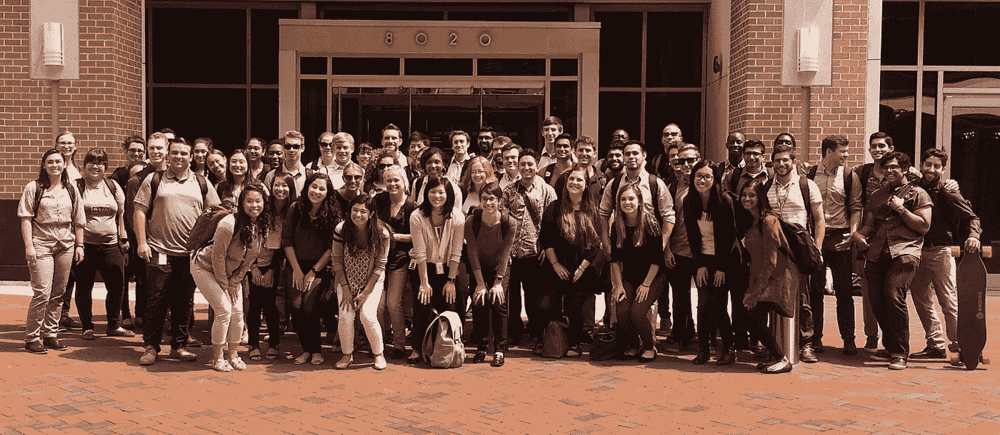

# 未开发的技术人才:为什么值得超越计算机专业

> 原文：<https://medium.com/capital-one-tech/untapped-tech-talent-why-its-worth-looking-beyond-cs-majors-6e242e672cf3?source=collection_archive---------2----------------------->

*Capital One 技术副总裁 Devin Lipawsky*

在我们的成年生活中，我们经常用一些通用的特征来定义自己:我们住在哪里，我们来自哪里，我们以什么为生，以及我们在学校学了什么。尽管这些高层次的描述可能会有所帮助，但它们并没有准确地捕捉到我们是谁以及我们作为人和专业人士能够做什么。在我们每个人身上，你都会发现潜伏的激情、未开发的潜力和隐藏的才能，只是没有机会在我们的日常生活中展现出来。

作为一家技术领先的公司，我们一直在寻找顶级的技术人才，当然我们并不孤单。对编程技能的需求从未如此之大，所以最优秀、最聪明的计算机科学毕业生面临大量选择和机会也就不足为奇了。为了跟上步伐，科技公司——以及所有引领数字优先未来的公司——必须开始创造性地思考如何寻找最优秀的校园科技人才。为了满足这一需求，我们推出了首都一号开发人员学院(CODA ),旨在透过表面现象寻找合适的候选人，更专注于那些有能力、灵活性和学习热情的人。

通过 CODA，我们的校园招聘团队从各种分析专业(数学、物理、工程等)中挑选出对技术充满热情的尖子生，让他们参加为期 6 个月的沉浸式培训体验，这将使他们走上成为软件工程师的道路。我们发掘出像 CODA 毕业生 Reagan Henke 这样的人才，她主修心理学，在大学里选修了编程入门并热爱它，但在她的专业里已经太晚了，无法继续学习计算机科学。CODA 给了她所需要的“in ”,完成 CODA 后，她具备了在整个公司进行技术轮换所需的知识和技能。

当你为在职培训创造一条可行的道路时，你可以释放(或利用)“非传统”候选人的激情和潜力，而不是感觉只局限于那些手握计算机科学学位的求职者。

我们相信 CODA 通过帮助我们建立更加多样化的团队，强化了我们的主要组织优势之一。一次又一次，我们看到了汇集不同观点为我们的客户创造真正有影响力的产品和服务的力量，最近是在我们新的移动聊天平台 Eno 的开发中。依靠广泛的观点、背景、专业和经验，我们能够以全新的方式应对最大的挑战。

我们的首批 60 人 CODA 团队参与了实践学习体验，并沉浸在我们技术转型的关键构建模块中，包括敏捷、AWS、DevOps、全栈开发等。自始至终，他们都被一个由技术和开发顾问、项目经理和助理“伙伴”组成的专用网络所包围。无论是回答常见的后勤问题、提供急需的职业建议，还是在挑战出现时倾听，强有力的导师对于帮助新同事驾驭工作场所至关重要。工作场所正越来越多地尽自己的职责来建立这些联系，这有助于确保各个职能部门的员工取得长期成功。

作为一个年轻的成年人进入“现实世界”可能会令人生畏。没有多年的专业经验，求职者通常会觉得自己的平均绩点和专业没什么区别，尤其是在大公司的眼里。像 CODA 这样的项目帮助求职者确信他们不仅仅是他们的证书。这些新员工拥有激情、专注和学习能力，能够挖掘未被发掘的才能，同时打造有助于改变消费者生活的产品和服务。

## 给希望超越计算机专业的组织的建议

根据激情、兴趣和学习能力招聘:当你经历招聘过程时，专注于招聘那些对你的文化有贡献的人，帮助你推进你的使命，并有成长心态的人。

**通过混合学习方法进行培训:**CODA 课程由注重技术和软技能培训的实践学习经验组成。这是一个深思熟虑的学习和实际应用的结合，包括一个为期六周的迷你实习，旨在吸引许多不同的学习风格。

**在各个层面提供支持和指导:**提供支持对于确保任何招聘的成功都至关重要——尤其是那些刚刚进入职场的人。指导对于 CODA 项目至关重要，合作伙伴由一名发展顾问、一名技术顾问、一名项目经理和一名伙伴提供支持。

了解更多关于 CODA 和我们校园项目的信息:[https://campus.capitalone.com/](https://campus.capitalone.com/)

*以上观点为作者个人观点。除非本帖中另有说明，否则 Capital One 不属于所提及的任何公司，也不被其认可。使用或展示的所有商标和其他知识产权都是其各自所有者的所有权。本文为 2017 首都一。*